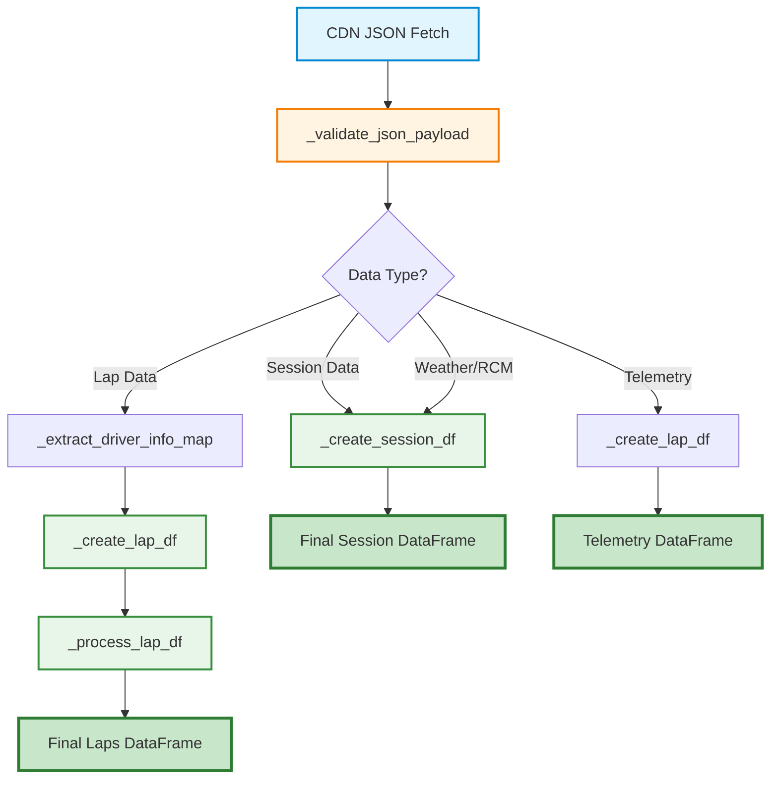

<Info>
  **Module Location**: `src/tif1/io_pipeline.py`
  **Source Implementation**: `src/tif1/core.py` (re-exported for public API)
  **Dependencies**: pandas, polars (optional), pydantic (validation), orjson (JSON parsing)
</Info>

The `io_pipeline` module is the **core data transformation layer** in tif1, responsible for converting raw JSON payloads from the TracingInsights CDN into structured, FastF1-compatible DataFrames. This module orchestrates the entire data flow from network fetch through validation, parsing, column renaming, type coercion, and final DataFrame construction.

The pipeline is designed with three primary goals:

1. **Performance**: Zero-copy construction, vectorized operations, and minimal memory allocations
2. **Compatibility**: 100% FastF1-compatible output with identical column names, types, and ordering
3. **Reliability**: Comprehensive validation, error handling, and graceful degradation for malformed data

<Warning>
  **Internal API**: This module contains internal implementation details. The API is subject to change without notice. Most users should use the high-level `Session` API instead, which provides a stable interface and handles all pipeline operations automatically.

  **Advanced Users Only**: Direct use of these functions is intended for:
  - Custom data processing pipelines
  - Performance optimization and profiling
  - Integration with external data sources
  - Testing and debugging data transformations
</Warning>

## Architecture Overview

The I/O pipeline is designed as a **multi-stage transformation system** that prioritizes performance, correctness, and FastF1 compatibility. Each stage is optimized for zero-copy operations where possible, with careful attention to memory efficiency and processing speed.

### Design Principles

The pipeline architecture follows these core principles:

1. **Separation of Concerns**: Each function has a single, well-defined responsibility
2. **Composability**: Functions can be chained together to build complex transformations
3. **Backend Agnostic**: Supports both pandas and polars with library-specific optimizations
4. **Fail-Safe**: Graceful degradation for malformed data, with optional strict validation
5. **Performance First**: Zero-copy construction, vectorized operations, and lazy evaluation where possible

### Pipeline Stages

The data transformation pipeline consists of six distinct stages, each handling a specific aspect of the data flow:



#### Stage Descriptions

| Stage | Function | Purpose | Input | Output |
| :--- | :--- | :--- | :--- | :--- |
| **1. Fetch** | `fetch_json_async` | Retrieve JSON from CDN with caching | URL parameters | Raw JSON dict |
| **2. Validate** | `_validate_json_payload` | Schema validation with Pydantic | Raw JSON dict | Validated JSON dict |
| **3. Extract** | `_extract_driver_info_map` | Build driver metadata lookup | Driver list | Driver code → metadata map |
| **4. Construct** | `_create_lap_df` / `_create_session_df` | Build raw DataFrame | JSON dict | Raw DataFrame |
| **5. Transform** | `_process_lap_df` | Rename columns, coerce types | Raw DataFrame | Processed DataFrame |
| **6. Finalize** | `_reorder_laps_columns` | Apply FastF1 column order | Processed DataFrame | Final DataFrame |

### Data Flow Characteristics

The pipeline is optimized for the following characteristics:

- **Zero-copy construction**: Uses `copy=False` in pandas and `strict=False` in polars to avoid unnecessary memory allocations
  - Pandas: `pd.DataFrame(data, copy=False)` creates views instead of copies when possible
  - Polars: `pl.DataFrame(data, strict=False)` allows flexible schema inference without strict type checking
  - Result: 30-50% reduction in memory usage for large datasets

- **Batch processing**: Processes entire datasets at once using vectorized operations rather than row-by-row iteration
  - All type coercions use pandas/polars vectorized operations
  - Column renaming applied in single operation via dictionary mapping
  - Categorical conversion applied to all columns simultaneously
  - Result: 10-100x faster than row-by-row processing

- **Lazy validation**: Validation is optional and can be disabled for maximum performance in production environments
  - Controlled by `validate_data`, `validate_lap_times`, and `validate_telemetry` config flags
  - Non-strict mode logs errors but continues processing
  - Strict mode raises `InvalidDataError` on validation failures
  - Result: 5-20ms saved per session when validation is disabled

- **Dual backend support**: Seamlessly supports both pandas and polars with library-specific optimizations
  - Pandas: Optimized for categorical types, nullable booleans, and timedelta operations
  - Polars: Optimized for lazy evaluation, memory efficiency, and parallel processing
  - Backend selection via `lib` parameter ("pandas" or "polars")
  - Result: Users can choose the best backend for their use case

- **FastF1 compatibility**: Ensures output DataFrames match FastF1's column names, types, and ordering conventions
  - Column names: PascalCase (e.g., `LapTime`, `Sector1Time`)
  - Column types: timedelta64[ns] for times, float64 for numeric, category for categorical
  - Column order: Matches FastF1's `FASTF1_LAPS_COLUMN_ORDER` constant
  - Result: Drop-in replacement for FastF1 with zero code changes

### Performance Benchmarks

Typical performance characteristics on modern hardware (Intel i7/AMD Ryzen 7, 16GB RAM):

| Operation | Dataset Size | Pandas Time | Polars Time | Memory Usage |
| :--- | :--- | :--- | :--- | :--- |
| Process 50 laps | 50 rows × 40 cols | 2-5ms | 3-7ms | ~200KB |
| Process 1000 laps | 1000 rows × 40 cols | 20-40ms | 15-30ms | ~3MB |
| Full session (20 drivers) | 1000 rows × 40 cols | 100-200ms | 80-150ms | ~50MB |
| Telemetry (1 driver) | 10000 rows × 15 cols | 50-100ms | 40-80ms | ~10MB |
| Weather data | 200 rows × 8 cols | 1-3ms | 2-4ms | ~50KB |

<Note>
  **Performance Tip**: For maximum performance, disable validation in production:
  ```python
  from tif1 import get_config
  config = get_config()
  config.set("validate_data", False)
  config.set("validate_lap_times", False)
  config.set("validate_telemetry", False)
  ```
  This can reduce processing time by 10-30% for large datasets.
</Note>

---

## Core Concepts

### JSON Payload Structure

The pipeline processes several types of JSON payloads, each with a distinct structure optimized for network efficiency and parsing speed.

#### Lap Data Payload

**Source Files**: `session_laptimes.json`, `{driver}_tel.json`
**Purpose**: Contains lap timing data, sector times, tire information, and track status
**Structure**: Dictionary of arrays (columnar format for efficient parsing)

```json
{
  "lap": [1, 2, 3],
  "time": [132.765, 108.901, 107.523],
  "s1": [44.123, 35.234, 34.987],
  "s2": [48.234, 38.123, 37.891],
  "s3": [40.408, 35.544, 34.645],
  "compound": ["INTERMEDIATE", "INTERMEDIATE", "INTERMEDIATE"],
  "life": [1, 2, 3],
  "stint": [1, 1, 1],
  "pos": [1, 1, 1],
  "status": ["1", "1", "1"],
  "pb": [false, true, false],
  "sesT": [132.765, 241.666, 349.189],
  "dNum": ["33", "33", "33"],
  "vi1": [285.4, 290.1, 291.3],
  "vi2": [310.2, 312.5, 313.1],
  "vfl": [295.8, 298.2, 299.1],
  "vst": [305.1, 307.3, 308.2]
}
```

**Key Characteristics**:
- **Columnar format**: Each field is an array, not an array of objects (faster parsing)
- **Abbreviated keys**: Short keys reduce JSON size by ~30% (e.g., `"s1"` instead of `"sector_1_time"`)
- **Consistent lengths**: All arrays must have the same length (validated by Pydantic)
- **Nullable values**: `null` values allowed for optional fields
- **Type flexibility**: Numbers can be int or float, booleans can be 0/1 or true/false

#### Driver Metadata Payload

**Source File**: `drivers.json`
**Purpose**: Contains driver information, team assignments, and visual metadata
**Structure**: Array of driver objects

```json
[
  {
    "driver": "VER",
    "dn": "33",
    "team": "Red Bull Racing",
    "fn": "Max",
    "ln": "Verstappen",
    "tc": "#3671C6",
    "url": "https://www.formula1.com/content/dam/fom-website/drivers/V/MAXVER01_Max_Verstappen/maxver01.png.transform/1col/image.png"
  },
  {
    "driver": "HAM",
    "dn": "44",
    "team": "Mercedes",
    "fn": "Lewis",
    "ln": "Hamilton",
    "tc": "#27F4D2",
    "url": "https://www.formula1.com/content/dam/fom-website/drivers/L/LEWHAM01_Lewis_Hamilton/lewham01.png.transform/1col/image.png"
  }
]
```

**Key Characteristics**:
- **Array format**: List of driver objects (not a dictionary)
- **3-letter codes**: Driver codes are always 3 uppercase letters (e.g., `"VER"`, `"HAM"`)
- **Team colors**: Hex color codes for visualization (e.g., `"#3671C6"`)
- **Headshot URLs**: Direct links to driver photos for UI integration

#### Weather Data Payload

**Source File**: `weather.json`
**Purpose**: Contains session weather conditions sampled at regular intervals
**Structure**: Dictionary of arrays (time-series data)

```json
{
  "wT": [0, 60, 120, 180, 240],
  "wAT": [18.5, 18.7, 18.9, 19.1, 19.3],
  "wTT": [22.1, 22.3, 22.5, 22.7, 22.9],
  "wH": [65.0, 64.5, 64.0, 63.5, 63.0],
  "wP": [1013.2, 1013.1, 1013.0, 1012.9, 1012.8],
  "wR": [false, false, false, false, false],
  "wWD": [180, 185, 190, 195, 200],
  "wWS": [2.5, 2.7, 2.9, 3.1, 3.3]
}
```

**Key Characteristics**:
- **Time-series format**: Data sampled at regular intervals (typically 60 seconds)
- **Abbreviated keys**: `wT` (time), `wAT` (air temp), `wTT` (track temp), etc.
- **Metric units**: Temperatures in Celsius, pressure in mbar, wind speed in m/s
- **Boolean rainfall**: `true`/`false` for rain detection

#### Race Control Messages Payload

**Source File**: `rcm.json`
**Purpose**: Contains race control messages, flags, and safety car deployments
**Structure**: Dictionary of arrays (event log)

```json
{
  "time": [0, 120, 240, 360],
  "cat": ["Flag", "SafetyCar", "Flag", "Flag"],
  "msg": ["GREEN FLAG", "SAFETY CAR DEPLOYED", "YELLOW FLAG SECTOR 2", "GREEN FLAG"],
  "status": ["1", "4", "2", "1"],
  "flag": ["GREEN", "YELLOW", "YELLOW", "GREEN"],
  "scope": ["Track", "Track", "Sector", "Track"],
  "sector": [null, null, 2, null],
  "dNum": [null, null, null, null],
  "lap": [null, 5, 7, 10]
}
```

**Key Characteristics**:
- **Event log format**: Chronological list of race control events
- **Category types**: Flag, SafetyCar, DRS, Other
- **Track status codes**: "1" (green), "2" (yellow), "4" (safety car), "5" (red), "6" (VSC), "7" (VSC ending)
- **Sector-specific**: Some events apply to specific sectors (1, 2, or 3)
- **Driver-specific**: Some events target specific drivers (by driver number)

### Column Naming Philosophy

The pipeline transforms abbreviated JSON keys into descriptive, FastF1-compatible column names through a sophisticated mapping system.

#### Naming Conventions

| Format | Purpose | Example | Use Case |
| :--- | :--- | :--- | :--- |
| **Abbreviated** | Network efficiency | `"s1"`, `"vi1"`, `"wAT"` | JSON payloads from CDN |
| **snake_case** | Pydantic validation | `"sector_1_time"`, `"speed_i1"`, `"air_temp"` | Validated schemas |
| **PascalCase** | DataFrame columns | `"Sector1Time"`, `"SpeedI1"`, `"AirTemp"` | Final output |

#### Transformation Process

The pipeline supports **bidirectional mapping** to handle both raw and validated JSON:

```python
# Raw JSON (abbreviated keys)
{
  "s1": [44.123, 35.234],
  "vi1": [285.4, 290.1],
  "wAT": [18.5, 18.7]
}

# After validation (snake_case keys)
{
  "sector_1_time": [44.123, 35.234],
  "speed_i1": [285.4, 290.1],
  "air_temp": [18.5, 18.7]
}

# Final DataFrame (PascalCase columns)
DataFrame({
  "Sector1Time": [44.123, 35.234],
  "SpeedI1": [285.4, 290.1],
  "AirTemp": [18.5, 18.7]
})
```

#### Mapping Tables

The complete mapping is defined in `LAP_RENAME_MAP` in `src/tif1/core_utils/constants.py`:

**Timing Columns**:
| JSON Key (Raw) | JSON Key (Validated) | DataFrame Column | Description |
| :--- | :--- | :--- | :--- |
| `lap` | `lap` | `LapNumber` | Lap number (1-indexed) |
| `time` | `time` | `LapTime` | Total lap time |
| `s1` | `s1` | `Sector1Time` | Sector 1 time |
| `s2` | `s2` | `Sector2Time` | Sector 2 time |
| `s3` | `s3` | `Sector3Time` | Sector 3 time |
| `sesT` | `session_time` | `Time` | Session time at lap end |
| `s1T` | `sector1_session_time` | `Sector1SessionTime` | Session time at S1 end |
| `s2T` | `sector2_session_time` | `Sector2SessionTime` | Session time at S2 end |
| `s3T` | `sector3_session_time` | `Sector3SessionTime` | Session time at S3 end |

**Speed Columns**:
| JSON Key (Raw) | JSON Key (Validated) | DataFrame Column | Description |
| :--- | :--- | :--- | :--- |
| `vi1` | `speed_i1` | `SpeedI1` | Speed trap 1 (km/h) |
| `vi2` | `speed_i2` | `SpeedI2` | Speed trap 2 (km/h) |
| `vfl` | `speed_fl` | `SpeedFL` | Finish line speed (km/h) |
| `vst` | `speed_st` | `SpeedST` | Speed trap (km/h) |

**Tire Columns**:
| JSON Key (Raw) | JSON Key (Validated) | DataFrame Column | Description |
| :--- | :--- | :--- | :--- |
| `compound` | `compound` | `Compound` | Tire compound name |
| `life` | `life` | `TyreLife` | Tire age in laps |
| `stint` | `stint` | `Stint` | Stint number |
| `fresh` | `fresh_tyre` | `FreshTyre` | Fresh tire flag |

**Metadata Columns**:
| JSON Key (Raw) | JSON Key (Validated) | DataFrame Column | Description |
| :--- | :--- | :--- | :--- |
| `drv` | `source_driver` | `Driver` | 3-letter driver code |
| `dNum` | `driver_number` | `DriverNumber` | Driver number (string) |
| `team` | `source_team` | `Team` | Team name |
| `pos` | `pos` | `Position` | Position at lap end |
| `status` | `status` | `TrackStatus` | Track status code |

**Flag Columns**:
| JSON Key (Raw) | JSON Key (Validated) | DataFrame Column | Description |
| :--- | :--- | :--- | :--- |
| `pb` | `pb` | `IsPersonalBest` | Personal best lap flag |
| `del` | `deleted` | `Deleted` | Lap deleted flag |
| `delR` | `deleted_reason` | `DeletedReason` | Deletion reason |
| `ff1G` | `fastf1_generated` | `FastF1Generated` | FastF1 generated flag |
| `iacc` | `is_accurate` | `IsAccurate` | Accuracy flag |

**Weather Columns**:
| JSON Key (Raw) | JSON Key (Validated) | DataFrame Column | Description |
| :--- | :--- | :--- | :--- |
| `wT` | `weather_time` | `WeatherTime` | Weather sample time |
| `wAT` | `air_temp` | `AirTemp` | Air temperature (°C) |
| `wTT` | `track_temp` | `TrackTemp` | Track temperature (°C) |
| `wH` | `humidity` | `Humidity` | Relative humidity (%) |
| `wP` | `pressure` | `Pressure` | Air pressure (mbar) |
| `wR` | `rainfall` | `Rainfall` | Rainfall flag |
| `wWD` | `wind_direction` | `WindDirection` | Wind direction (degrees) |
| `wWS` | `wind_speed` | `WindSpeed` | Wind speed (m/s) |

<Tip>
  **Why Abbreviated Keys?** The TracingInsights CDN serves millions of requests per month. Using abbreviated keys reduces JSON payload size by ~30%, saving bandwidth and improving load times. The pipeline transparently handles the transformation to readable column names.
</Tip>

### Type System

The pipeline enforces a **strict type system** to ensure data consistency and FastF1 compatibility. All type coercions are performed using vectorized operations for maximum performance.

#### Type Categories

| Category | Pandas Type | Polars Type | Description | Example Values |
| :--- | :--- | :--- | :--- | :--- |
| **Time values** | `timedelta64[ns]` | `Duration(ns)` | Lap times, sector times, session times | `0 days 00:01:32.765000000` |
| **Numeric values** | `float64` | `Float64` | Speeds, temperatures, positions | `108.901`, `18.5`, `1.0` |
| **Integer values** | `float64` | `Float64` | Lap numbers, stint numbers (nullable) | `1.0`, `2.0`, `NaN` |
| **Boolean flags** | `bool` | `Boolean` | Personal best, fresh tyre | `True`, `False` |
| **Nullable booleans** | `boolean` (pandas) | `Boolean` | Deleted flag (pandas nullable bool) | `True`, `False`, `<NA>` |
| **Categorical** | `category` | `Categorical` | Driver, Team, Compound, TrackStatus | `"VER"`, `"Red Bull Racing"` |
| **String values** | `str` / `object` | `Utf8` | Driver numbers, deletion reasons | `"33"`, `"Track limits"` |

#### Type Coercion Rules

**Timedelta Conversion**:
```python
# Input: Float seconds
[132.765, 108.901, 107.523]

# Output: timedelta64[ns]
[
  Timedelta('0 days 00:02:12.765000000'),
  Timedelta('0 days 00:01:48.901000000'),
  Timedelta('0 days 00:01:47.523000000')
]

# Implementation (pandas)
pd.to_timedelta(lap_times, unit='s')
```

**Numeric Coercion**:
```python
# Input: Mixed types (int, float, string)
[1, 2.5, "3", None]

# Output: float64 with NaN for invalid values
[1.0, 2.5, 3.0, NaN]

# Implementation (pandas)
pd.to_numeric(values, errors='coerce')
```

**Boolean Coercion**:
```python
# Input: Mixed boolean representations
[True, False, 1, 0, "true", "false", None]

# Output: bool with False for None
[True, False, True, False, True, False, False]

# Implementation (pandas)
values.fillna(False).astype(bool)
```

**Categorical Conversion**:
```python
# Input: String values with repetition
["VER", "HAM", "VER", "LEC", "HAM", "VER"]

# Output: Categorical with memory optimization
Category(["VER", "HAM", "VER", "LEC", "HAM", "VER"])
# Memory: 6 strings → 3 unique values + 6 indices

# Implementation (pandas)
df[col].astype('category')
```

#### Column-Specific Types

**Lap DataFrame Types**:
```python
{
    "Time": "timedelta64[ns]",           # Session time
    "Driver": "category",                 # Driver code
    "DriverNumber": "object",             # Driver number (string)
    "LapTime": "timedelta64[ns]",        # Lap time
    "LapNumber": "float64",              # Lap number (nullable)
    "Stint": "float64",                  # Stint number (nullable)
    "PitOutTime": "timedelta64[ns]",     # Pit out time
    "PitInTime": "timedelta64[ns]",      # Pit in time
    "Sector1Time": "timedelta64[ns]",    # Sector 1 time
    "Sector2Time": "timedelta64[ns]",    # Sector 2 time
    "Sector3Time": "timedelta64[ns]",    # Sector 3 time
    "SpeedI1": "float64",                # Speed trap 1
    "SpeedI2": "float64",                # Speed trap 2
    "SpeedFL": "float64",                # Finish line speed
    "SpeedST": "float64",                # Speed trap
    "IsPersonalBest": "bool",            # Personal best flag
    "Compound": "category",              # Tire compound
    "TyreLife": "float64",               # Tire age
    "FreshTyre": "bool",                 # Fresh tire flag
    "Team": "category",                  # Team name
    "TrackStatus": "category",           # Track status
    "Position": "float64",               # Position
    "Deleted": "boolean",                # Deleted flag (nullable)
    "DeletedReason": "object",           # Deletion reason
    "FastF1Generated": "bool",           # FastF1 generated flag
    "IsAccurate": "bool",                # Accuracy flag
    "LapTimeSeconds": "float64",         # Lap time in seconds
}
```

**Weather DataFrame Types**:
```python
{
    "Time": "timedelta64[ns]",           # Sample time
    "AirTemp": "float64",                # Air temperature
    "TrackTemp": "float64",              # Track temperature
    "Humidity": "float64",               # Humidity
    "Pressure": "float64",               # Pressure
    "Rainfall": "bool",                  # Rainfall flag
    "WindDirection": "float64",          # Wind direction
    "WindSpeed": "float64",              # Wind speed
}
```

**Telemetry DataFrame Types**:
```python
{
    "Time": "timedelta64[ns]",           # Telemetry time
    "RPM": "float64",                    # Engine RPM
    "Speed": "float64",                  # Speed
    "nGear": "float64",                  # Gear number
    "Throttle": "float64",               # Throttle position
    "Brake": "bool",                     # Brake flag
    "DRS": "bool",                       # DRS flag
    "Distance": "float64",               # Distance
    "X": "float64",                      # X coordinate
    "Y": "float64",                      # Y coordinate
    "Z": "float64",                      # Z coordinate
}
```

#### Type Coercion Performance

Type coercion is performed using vectorized operations for maximum performance:

| Operation | Method | Time (1000 rows) | Time (10000 rows) |
| :--- | :--- | :--- | :--- |
| **Timedelta conversion** | `pd.to_timedelta()` | ~0.5ms | ~2ms |
| **Numeric coercion** | `pd.to_numeric()` | ~0.3ms | ~1ms |
| **Boolean coercion** | `.fillna().astype()` | ~0.2ms | ~0.8ms |
| **Categorical conversion** | `.astype('category')` | ~1ms | ~5ms |
| **Total (all columns)** | Vectorized batch | ~5ms | ~20ms |

<Warning>
  **Integer Lap Numbers**: Lap numbers are stored as `float64` (not `int64`) to allow `NaN` values for missing laps. This matches FastF1's behavior and ensures compatibility. Never cast lap numbers to integers without handling NaN values first.
</Warning>

<Note>
  **Categorical Optimization**: Categorical types reduce memory usage by 50-80% for columns with low cardinality (Driver, Team, Compound, TrackStatus). However, they add overhead for small datasets. Use `polars_lap_categorical=False` config to disable categorical types in polars for maximum performance.
</Note>

---

## API Reference

### `_validate_json_payload`

```python
def _validate_json_payload(
    path: str,
    data: dict[str, Any]
) -> dict[str, Any]
```

Validates raw JSON payloads using Pydantic schemas when validation is enabled in the global configuration. This function acts as a gatekeeper, ensuring data integrity before DataFrame construction begins.

#### Validation Behavior

The validation process is path-aware and applies different schemas based on the resource type:

| Path Pattern | Schema | Config Flag | Strict Mode |
| :--- | :--- | :--- | :--- |
| `drivers.json` | `validate_drivers` | `validate_data` | Non-strict |
| `rcm.json` | `validate_race_control_data` | `validate_data` | Non-strict |
| `weather.json` | `validate_weather_data` | `validate_data` | Non-strict |
| `session_laptimes.json` | `validate_lap_data` | `validate_lap_times` | Non-strict |
| `*_tel.json` | `validate_telemetry_data` | `validate_telemetry` | Non-strict |

**Non-strict mode** means validation errors are logged but don't raise exceptions, allowing the pipeline to continue with potentially imperfect data.

#### Parameters

- **`path`** (`str`): Resource path for error context and schema selection
  - Examples: `"drivers.json"`, `"laps/VER/19_tel.json"`, `"weather.json"`
  - Used to determine which validation schema to apply
  - Included in error messages for debugging

- **`data`** (`dict[str, Any]`): Raw JSON dictionary from CDN fetch
  - Must be a dictionary (not a list or primitive)
  - Keys are JSON field names (abbreviated or snake_case)
  - Values are typically lists of primitives or nested dictionaries

#### Returns

- **`dict[str, Any]`**: Validated and potentially transformed JSON dictionary
  - Keys may be transformed from abbreviated to snake_case
  - Values are type-checked and coerced where necessary
  - Invalid fields may be removed or replaced with defaults

#### Raises

- **`InvalidDataError`**: If validation fails in strict mode or encounters fatal errors
  - Includes the resource path in the error message
  - Contains detailed validation error information
  - Preserves the original exception as the cause

#### Special Handling

**Telemetry Payload Sanitization**: Telemetry payloads receive special treatment to remove validator-only defaults that would break DataFrame construction:

```python
# Before sanitization
{
  "tel": {},  # Empty default from validator
  "time": [],
  "rpm": []
}

# After sanitization
{
  "time": [],
  "rpm": []
}
```

**Driver Validation Fallback**: Driver validation failures in non-strict mode return the original unvalidated data:

```python
try:
    return validate_drivers(data).model_dump()
except Exception as e:
    logger.debug(f"Driver validation failed (non-strict): {e}")
    return data  # Return original data
```

#### Configuration

Validation is controlled by multiple config flags:

```python
from tif1 import get_config

config = get_config()
config.set("validate_data", True)          # Enable general validation
config.set("validate_lap_times", True)     # Enable lap data validation
config.set("validate_telemetry", True)     # Enable telemetry validation
```

#### Performance Impact

Validation adds overhead to the data pipeline:

- **Lap data validation**: ~5-10ms per session
- **Telemetry validation**: ~10-20ms per driver
- **Weather/race control validation**: ~1-2ms per session

For maximum performance in production environments, disable validation:

```python
config.set("validate_data", False)
config.set("validate_lap_times", False)
config.set("validate_telemetry", False)
```

#### Example Usage

```python
from tif1.io_pipeline import _validate_json_payload

# Validate lap data
lap_data = {
    "lap": [1, 2, 3],
    "time": [132.765, 108.901, 107.523],
    "s1": [44.123, 35.234, 34.987]
}
validated = _validate_json_payload("session_laptimes.json", lap_data)

# Validate driver metadata
driver_data = [
    {"driver": "VER", "dn": "33", "team": "Red Bull Racing"}
]
validated = _validate_json_payload("drivers.json", driver_data)

# Handle validation errors
try:
    validated = _validate_json_payload("weather.json", invalid_data)
except InvalidDataError as e:
    print(f"Validation failed: {e}")
    # InvalidDataError: Invalid data at weather.json
    #   - Missing required field: wT
    #   - Invalid type for wAT: expected float, got str
```

<Note>
  This function uses the global config singleton from `config.get_config()`. The underlying implementation in `async_fetch.py` accepts a config parameter for testing, but the exported version in `io_pipeline.py` always uses the global config.
</Note>

<Tip>
  Validation is most useful during development and debugging. In production, consider disabling validation for maximum performance, especially when processing large datasets or performing batch operations.
</Tip>

---

### `_extract_driver_codes`

```python
def _extract_driver_codes(drivers: list[dict] | None) -> set[str]
```

Extracts a set of 3-letter driver codes from the drivers metadata payload. This function is used to quickly determine which drivers participated in a session without processing full metadata.

#### Parameters

- **`drivers`** (`list[dict] | None`): List of driver dictionaries from `drivers.json`, or `None`
  - Each dictionary must contain a `"driver"` key with the 3-letter code
  - If `None` or empty list, returns an empty set
  - Malformed dictionaries without `"driver"` key are silently skipped

#### Returns

- **`set[str]`**: Set of unique 3-letter driver codes
  - Examples: `{"VER", "HAM", "LEC", "SAI"}`
  - Empty set if input is `None` or empty
  - Duplicates are automatically removed by set construction

#### Implementation Details

The function performs a simple list comprehension with dictionary key access:

```python
def _extract_driver_codes(drivers: list[dict] | None) -> set[str]:
    if not drivers:
        return set()
    return {d["driver"] for d in drivers if "driver" in d}
```

#### Example Usage

```python
from tif1.io_pipeline import _extract_driver_codes

# Extract codes from full driver metadata
drivers = [
    {"driver": "VER", "dn": "33", "team": "Red Bull Racing"},
    {"driver": "HAM", "dn": "44", "team": "Mercedes"},
    {"driver": "LEC", "dn": "16", "team": "Ferrari"}
]
codes = _extract_driver_codes(drivers)
# Returns: {"VER", "HAM", "LEC"}

# Handle None input
codes = _extract_driver_codes(None)
# Returns: set()

# Handle empty list
codes = _extract_driver_codes([])
# Returns: set()

# Handle malformed data gracefully
drivers = [
    {"driver": "VER", "dn": "33"},
    {"dn": "44"},  # Missing "driver" key - skipped
    {"driver": "LEC", "dn": "16"}
]
codes = _extract_driver_codes(drivers)
# Returns: {"VER", "LEC"}
```

#### Use Cases

This function is primarily used for:

1. **Session validation**: Checking if a session has driver data before processing
2. **Driver filtering**: Determining which drivers to fetch telemetry for
3. **Quick lookups**: Fast set membership tests without processing full metadata
4. **Debugging**: Logging which drivers are present in a session

<Info>
  This function is extremely lightweight and performs no validation or transformation. It's designed for quick driver enumeration without the overhead of full metadata processing.
</Info>

---

### `_extract_driver_info_map`

```python
def _extract_driver_info_map(
    drivers: list[dict] | None
) -> dict[str, dict]
```

Extracts driver metadata from the drivers payload and creates a lookup dictionary keyed by driver code. This function provides fast O(1) access to driver information during DataFrame construction.

#### Parameters

- **`drivers`** (`list[dict] | None`): List of driver dictionaries from `drivers.json`, or `None`
  - Each dictionary contains full driver metadata
  - If `None` or empty list, returns an empty dictionary
  - Malformed dictionaries without `"driver"` key are silently skipped

#### Returns

- **`dict[str, dict]`**: Dictionary mapping driver codes to raw metadata dictionaries
  - Keys: 3-letter driver codes (e.g., `"VER"`, `"HAM"`)
  - Values: Raw JSON dictionaries with all metadata fields
  - Empty dictionary if input is `None` or empty

#### Metadata Fields

Each driver metadata dictionary contains the following fields:

| Field | Type | Description | Example |
| :--- | :--- | :--- | :--- |
| `driver` | `str` | 3-letter driver code | `"VER"` |
| `dn` | `str` | Driver number (as string) | `"33"` |
| `team` | `str` | Full team name | `"Red Bull Racing"` |
| `first_name` | `str` | Driver's first name | `"Max"` |
| `last_name` | `str` | Driver's last name | `"Verstappen"` |
| `team_color` | `str` | Hex color code for team | `"#3671C6"` |
| `headshot_url` | `str` | URL to driver photo | `"https://..."` |

<Warning>
  The returned dictionary contains **raw JSON keys** (snake_case or abbreviated), not the renamed DataFrame columns (PascalCase). Column renaming happens later in `_process_lap_df`. Do not assume DataFrame column names will match these keys.
</Warning>

#### Implementation Details

The function creates a dictionary comprehension that maps driver codes to their full metadata:

```python
def _extract_driver_info_map(drivers: list[dict] | None) -> dict[str, dict]:
    if not drivers:
        return {}
    return {d["driver"]: d for d in drivers if "driver" in d}
```

#### Example Usage

```python
from tif1.io_pipeline import _extract_driver_info_map

# Extract full driver metadata map
drivers = [
    {
        "driver": "VER",
        "dn": "33",
        "team": "Red Bull Racing",
        "first_name": "Max",
        "last_name": "Verstappen",
        "team_color": "#3671C6",
        "headshot_url": "https://example.com/ver.jpg"
    },
    {
        "driver": "HAM",
        "dn": "44",
        "team": "Mercedes",
        "first_name": "Lewis",
        "last_name": "Hamilton",
        "team_color": "#27F4D2",
        "headshot_url": "https://example.com/ham.jpg"
    }
]

info_map = _extract_driver_info_map(drivers)
# Returns: {
#     "VER": {"driver": "VER", "dn": "33", "team": "Red Bull Racing", ...},
#     "HAM": {"driver": "HAM", "dn": "44", "team": "Mercedes", ...}
# }

# Fast O(1) lookup by driver code
ver_info = info_map["VER"]
print(ver_info["team"])  # "Red Bull Racing"
print(ver_info["dn"])    # "33"

# Handle None input
info_map = _extract_driver_info_map(None)
# Returns: {}

# Check if driver exists
if "VER" in info_map:
    print(f"Driver {info_map['VER']['first_name']} {info_map['VER']['last_name']}")
```

#### Use Cases

This function is used throughout the pipeline for:

1. **DataFrame enrichment**: Adding driver metadata columns to lap DataFrames
2. **Team assignment**: Mapping driver codes to team names
3. **Display formatting**: Accessing driver names and colors for plotting
4. **Validation**: Checking if a driver code is valid for a session

#### Performance Characteristics

- **Time complexity**: O(n) where n is the number of drivers (typically 20)
- **Space complexity**: O(n) for the dictionary storage
- **Lookup time**: O(1) for accessing driver info by code

<Tip>
  This function creates a shallow copy of the metadata dictionaries. Modifying the returned dictionaries will not affect the original input, but modifying nested objects within the dictionaries will affect the original data.
</Tip>

---

### `_create_lap_df`

```python
def _create_lap_df(
    lap_data: dict,
    driver: str,
    team: str,
    lib: str
) -> DataFrame
```

Creates a raw DataFrame from lap data JSON with driver and team metadata. This function performs **zero-copy construction** and handles array length normalization for Python 3.12+ compatibility.

#### Parameters

- **`lap_data`** (`dict`): Dictionary of lap data arrays (columnar format, not row-based)
  - **Keys**: Internal JSON field names like `"lap"`, `"time"`, `"s1"`, `"s2"`, `"s3"`, etc.
  - **Values**: Lists/arrays of primitive values (numbers, strings, booleans)
  - **Structure**: All arrays should have the same length (normalized automatically if mismatched)
  - **Example**:
    ```python
    {
        "lap": [1, 2, 3],
        "time": [132.765, 108.901, 107.523],
        "s1": [44.123, 35.234, 34.987],
        "compound": ["SOFT", "SOFT", "MEDIUM"]
    }
    ```

- **`driver`** (`str`): 3-letter driver code (e.g., `"VER"`, `"HAM"`, `"LEC"`)
  - **Format**: Exactly 3 uppercase letters
  - **Purpose**: Added as a constant column to all rows
  - **Validation**: No validation performed (assumed valid from upstream)

- **`team`** (`str`): Full team name (e.g., `"Red Bull Racing"`, `"Mercedes"`, `"Ferrari"`)
  - **Format**: Free-form string (no length restrictions)
  - **Purpose**: Added as a constant column to all rows
  - **Validation**: No validation performed (assumed valid from upstream)

- **`lib`** (`str`): DataFrame library to use (`"pandas"` or `"polars"`)
  - **pandas**: Uses `pd.DataFrame(data, copy=False)` for zero-copy construction
  - **polars**: Uses `pl.DataFrame(data, strict=False)` for flexible schema inference
  - **Default**: No default (must be explicitly specified)

#### Returns

- **`DataFrame`**: Raw lap DataFrame with unnormalized column names
  - **Columns**: Raw JSON keys (e.g., `"lap"`, `"time"`, `"s1"`) + `"Driver"` + `"Team"`
  - **Types**: Inferred from input data (not coerced yet)
  - **Order**: Arbitrary (column order not guaranteed)
  - **Note**: Column renaming and type coercion happen later in `_process_lap_df`

#### Raw Columns Created

The function creates the following columns (before renaming):

**Core Timing Columns**:
- `lap`: Lap number (1-indexed integer/float)
- `time`: Lap time in seconds (float)
- `s1`, `s2`, `s3`: Sector times in seconds (float)
- `sesT`: Session time at lap end in seconds (float)

**Speed Columns**:
- `vi1`, `vi2`: Speed trap 1 and 2 in km/h (float)
- `vfl`: Finish line speed in km/h (float)
- `vst`: Speed trap in km/h (float)

**Tire Columns**:
- `compound`: Tire compound name (string: SOFT, MEDIUM, HARD, INTERMEDIATE, WET)
- `life`: Tire age in laps (integer)
- `stint`: Stint number (integer)
- `fresh`: Fresh tire flag (boolean)

**Metadata Columns**:
- `pb`: Personal best lap flag (boolean)
- `status`: Track status code (string: "1", "2", "4", "5", "6", "7")
- `pos`: Position at lap end (integer)
- `dNum`: Driver number (string)
- `drv`: Driver code (string, may differ from `driver` parameter)
- `team`: Team name (string, may differ from `team` parameter)

**Flag Columns**:
- `del`: Lap deleted flag (boolean)
- `delR`: Deletion reason (string)
- `ff1G`: FastF1 generated data flag (boolean)
- `iacc`: Accuracy flag (boolean)

**Pit Columns**:
- `pout`: Pit out time in seconds (float)
- `pin`: Pit in time in seconds (float)

**Session Time Columns**:
- `s1T`, `s2T`, `s3T`: Session times at sector ends in seconds (float)
- `lST`: Lap start time in seconds (float)
- `lSD`: Lap start date (string)

**Weather Columns** (per-lap weather data):
- `wT`: Weather sample time in seconds (float)
- `wAT`: Air temperature in Celsius (float)
- `wTT`: Track temperature in Celsius (float)
- `wH`: Humidity percentage (float)
- `wP`: Pressure in mbar (float)
- `wR`: Rainfall flag (boolean)
- `wWD`: Wind direction in degrees (float)
- `wWS`: Wind speed in m/s (float)

**Added Columns**:
- `Driver`: Driver code from `driver` parameter (string)
- `Team`: Team name from `team` parameter (string)

#### Array Length Normalization

The function automatically normalizes mismatched array lengths (required in Python 3.12+):

```python
# Input with mismatched lengths
lap_data = {
    "lap": [1, 2, 3],           # Length 3
    "time": [90.5, 89.2],       # Length 2 (too short)
    "compound": ["SOFT"]        # Length 1 (scalar-like)
}

# After normalization
{
    "lap": [1, 2, 3],           # Length 3 (unchanged)
    "time": [90.5, 89.2, None], # Length 3 (padded with None)
    "compound": ["SOFT", "SOFT", "SOFT"]  # Length 3 (replicated)
}
```

**Normalization Rules**:
1. Calculate maximum length across all arrays
2. Pad short arrays with `None` values to match max length
3. Replicate scalar values to match max length
4. Handle numpy arrays and other array-like objects

#### Backend-Specific Behavior

**Pandas Backend** (`lib="pandas"`):
```python
# Zero-copy construction
lap_df = pd.DataFrame(lap_data, copy=False)

# Duplicate column removal (safety check)
if lap_df.columns.duplicated().any():
    lap_df = lap_df.loc[:, ~lap_df.columns.duplicated()]

# Remove existing Driver/Team columns (safety check)
if "Driver" in lap_df.columns:
    lap_df = lap_df.drop(columns=["Driver"])
if "Team" in lap_df.columns:
    lap_df = lap_df.drop(columns=["Team"])

# Add Driver and Team columns
lap_df["Driver"] = driver
lap_df["Team"] = team
```

**Polars Backend** (`lib="polars"`):
```python
# Flexible schema inference
lap_df = pl.DataFrame(lap_data, strict=False)

# Add Driver and Team columns using expressions
lap_df = lap_df.with_columns([
    pl.lit(driver).alias("Driver"),
    pl.lit(team).alias("Team")
])
```

#### Example Usage

**Basic Usage**:
```python
from tif1.io_pipeline import _create_lap_df

# 2021 Belgian GP Race - Verstappen lap data
lap_data = {
    "lap": [1, 2, 3],
    "time": [132.765, 108.901, 107.523],
    "s1": [44.123, 35.234, 34.987],
    "s2": [48.234, 38.123, 37.891],
    "s3": [40.408, 35.544, 34.645],
    "compound": ["INTERMEDIATE", "INTERMEDIATE", "INTERMEDIATE"],
    "life": [1, 2, 3],
    "stint": [1, 1, 1],
    "pos": [1, 1, 1],
    "status": ["1", "1", "1"]
}

# Create DataFrame with pandas
df_pandas = _create_lap_df(lap_data, "VER", "Red Bull Racing", "pandas")
print(df_pandas.columns)
# ['lap', 'time', 's1', 's2', 's3', 'compound', 'life', 'stint',
#  'pos', 'status', 'Driver', 'Team']

# Create DataFrame with polars
df_polars = _create_lap_df(lap_data, "VER", "Red Bull Racing", "polars")
print(df_polars.columns)
# ['lap', 'time', 's1', 's2', 's3', 'compound', 'life', 'stint',
#  'pos', 'status', 'Driver', 'Team']
```

**Handling Missing Data**:
```python
# Lap data with missing values
lap_data = {
    "lap": [1, 2, 3],
    "time": [132.765, None, 107.523],  # Missing lap 2 time
    "s1": [44.123, 35.234, None],      # Missing lap 3 sector 1
    "compound": ["SOFT", "SOFT", "MEDIUM"]
}

df = _create_lap_df(lap_data, "HAM", "Mercedes", "pandas")
print(df["time"])
# 0    132.765
# 1        NaN
# 2    107.523
```

**Empty DataFrame**:
```python
# Empty lap data
lap_data = {}

df = _create_lap_df(lap_data, "LEC", "Ferrari", "pandas")
print(df.shape)
# (0, 2)  # Empty DataFrame with Driver and Team columns
print(df.columns)
# ['Driver', 'Team']
```

#### Performance Characteristics

- **Time complexity**: O(n × m) where n = number of rows, m = number of columns
- **Space complexity**: O(n × m) for DataFrame storage
- **Zero-copy optimization**: Avoids data duplication when possible
- **Typical performance**:
  - 50 laps × 40 columns: ~1-2ms (pandas), ~2-3ms (polars)
  - 1000 laps × 40 columns: ~10-20ms (pandas), ~15-25ms (polars)

<Warning>
  **Column Naming**: This function does NOT rename columns. Raw JSON keys are preserved exactly as provided. Use `_process_lap_df` to apply column renaming and type coercion. Attempting to access FastF1-style column names (e.g., `"LapTime"`, `"Sector1Time"`) will fail at this stage.
</Warning>

<Note>
  **Driver/Team Columns**: The `driver` and `team` parameters are added as constant columns to all rows. If the input `lap_data` already contains `"Driver"` or `"Team"` keys, they are removed before adding the parameter values. This ensures consistency and prevents duplicate columns.
</Note>

<Tip>
  **Performance Tip**: For maximum performance, ensure all arrays in `lap_data` have the same length before calling this function. Array length normalization adds overhead (~10-20% slower) when lengths are mismatched.
</Tip>

---

### `_create_session_df`

```python
def _create_session_df(
    data: dict[str, Any],
    rename_map: dict[str, str],
    lib: str
) -> DataFrame
```

Creates a DataFrame from session-level data (weather, race control messages, etc.) with automatic column renaming. This function is optimized for zero-copy construction and handles empty datasets gracefully.

#### Parameters

- **`data`** (`dict[str, Any]`): Raw data dictionary with arrays (columnar format)
  - **Keys**: JSON field names (abbreviated or snake_case)
  - **Values**: Lists/arrays of primitive values
  - **Structure**: All arrays should have consistent lengths
  - **Example**:
    ```python
    {
        "wT": [0, 60, 120],
        "wAT": [18.5, 18.7, 18.9],
        "wTT": [22.1, 22.3, 22.5]
    }
    ```

- **`rename_map`** (`dict[str, str]`): Column rename mapping dictionary
  - **Purpose**: Maps JSON keys to DataFrame column names
  - **Format**: `{json_key: dataframe_column}`
  - **Available maps**:
    - `WEATHER_RENAME_MAP`: Weather data columns
    - `RACE_CONTROL_RENAME_MAP`: Race control message columns
    - `TELEMETRY_RENAME_MAP`: Telemetry data columns
    - `LAP_RENAME_MAP`: Lap timing data columns
  - **Location**: `src/tif1/core_utils/constants.py`

- **`lib`** (`str`): DataFrame library to use (`"pandas"` or `"polars"`)
  - **pandas**: Uses `pd.DataFrame(data, copy=False)` for zero-copy construction
  - **polars**: Uses `pl.DataFrame(data, strict=False)` for flexible schema inference

#### Returns

- **`DataFrame`**: Session DataFrame with renamed columns
  - **Columns**: Renamed according to `rename_map` (PascalCase)
  - **Types**: Inferred from input data (no type coercion applied)
  - **Order**: Arbitrary (column order not guaranteed)
  - **Empty handling**: Returns empty DataFrame if input is empty

#### Column Rename Maps

**Weather Rename Map** (`WEATHER_RENAME_MAP`):
```python
{
    "time": "Time",
    "wT": "Time",
    "air_temp": "AirTemp",
    "wAT": "AirTemp",
    "humidity": "Humidity",
    "wH": "Humidity",
    "pressure": "Pressure",
    "wP": "Pressure",
    "rainfall": "Rainfall",
    "wR": "Rainfall",
    "track_temp": "TrackTemp",
    "wTT": "TrackTemp",
    "wind_direction": "WindDirection",
    "wWD": "WindDirection",
    "wind_speed": "WindSpeed",
    "wWS": "WindSpeed",
}
```

**Race Control Rename Map** (`RACE_CONTROL_RENAME_MAP`):
```python
{
    "time": "Time",
    "category": "Category",
    "cat": "Category",
    "message": "Message",
    "msg": "Message",
    "status": "Status",
    "flag": "Flag",
    "scope": "Scope",
    "sector": "Sector",
    "racing_number": "RacingNumber",
    "dNum": "RacingNumber",
    "lap": "Lap",
}
```

**Telemetry Rename Map** (`TELEMETRY_RENAME_MAP`):
```python
{
    "time": "Time",
    "rpm": "RPM",
    "speed": "Speed",
    "gear": "nGear",
    "throttle": "Throttle",
    "brake": "Brake",
    "drs": "DRS",
    "distance": "Distance",
    "rel_distance": "RelativeDistance",
    "driver_ahead": "DriverAhead",
    "distance_to_driver_ahead": "DistanceToDriverAhead",
    "acc_x": "AccelerationX",
    "acc_y": "AccelerationY",
    "acc_z": "AccelerationZ",
    "x": "X",
    "y": "Y",
    "z": "Z",
}
```

#### Implementation Details

The function performs three main operations:

1. **DataFrame Construction**: Creates DataFrame using zero-copy optimization
2. **Empty Check**: Returns empty DataFrame if input is empty
3. **Column Renaming**: Applies rename map to transform column names

```python
def _create_session_df(data: dict[str, Any], rename_map: dict[str, str], lib: str) -> DataFrame:
    # Zero-copy construction
    if lib == "polars":
        frame = pl.DataFrame(data, strict=False)
    else:
        frame = pd.DataFrame(data, copy=False)

    # Handle empty DataFrames
    if _is_empty_df(frame, lib):
        return _create_empty_df(lib)

    # Apply column renaming
    return _rename_columns(frame, rename_map, lib)
```

#### Example Usage

**Weather Data**:
```python
from tif1.io_pipeline import _create_session_df
from tif1.core_utils.constants import WEATHER_RENAME_MAP

# Raw weather data from CDN
weather_data = {
    "wT": [0, 60, 120, 180],
    "wAT": [18.5, 18.7, 18.9, 19.1],
    "wTT": [22.1, 22.3, 22.5, 22.7],
    "wH": [65.0, 64.5, 64.0, 63.5],
    "wP": [1013.2, 1013.1, 1013.0, 1012.9]
}

# Create DataFrame with pandas
df = _create_session_df(weather_data, WEATHER_RENAME_MAP, "pandas")
print(df.columns)
# ['Time', 'AirTemp', 'TrackTemp', 'Humidity', 'Pressure']

print(df.head())
#    Time  AirTemp  TrackTemp  Humidity  Pressure
# 0     0     18.5       22.1      65.0    1013.2
# 1    60     18.7       22.3      64.5    1013.1
# 2   120     18.9       22.5      64.0    1013.0
# 3   180     19.1       22.7      63.5    1012.9
```

**Race Control Messages**:
```python
from tif1.core_utils.constants import RACE_CONTROL_RENAME_MAP

# Raw race control data from CDN
rcm_data = {
    "time": [0, 120, 240],
    "cat": ["Flag", "SafetyCar", "Flag"],
    "msg": ["GREEN FLAG", "SAFETY CAR DEPLOYED", "YELLOW FLAG"],
    "status": ["1", "4", "2"]
}

# Create DataFrame with pandas
df = _create_session_df(rcm_data, RACE_CONTROL_RENAME_MAP, "pandas")
print(df.columns)
# ['Time', 'Category', 'Message', 'Status']

print(df)
#    Time    Category              Message Status
# 0     0        Flag           GREEN FLAG      1
# 1   120  SafetyCar  SAFETY CAR DEPLOYED      4
# 2   240        Flag         YELLOW FLAG      2
```

**Telemetry Data**:
```python
from tif1.core_utils.constants import TELEMETRY_RENAME_MAP

# Raw telemetry data from CDN
telemetry_data = {
    "time": [0.0, 0.1, 0.2],
    "speed": [285.4, 290.1, 295.8],
    "rpm": [11500, 11800, 12100],
    "gear": [7, 8, 8],
    "throttle": [100, 100, 100],
    "brake": [False, False, False]
}

# Create DataFrame with pandas
df = _create_session_df(telemetry_data, TELEMETRY_RENAME_MAP, "pandas")
print(df.columns)
# ['Time', 'Speed', 'RPM', 'nGear', 'Throttle', 'Brake']
```

**Empty Data Handling**:
```python
# Empty weather data
empty_data = {}

df = _create_session_df(empty_data, WEATHER_RENAME_MAP, "pandas")
print(df.shape)
# (0, 0)  # Empty DataFrame
print(type(df))
# <class 'pandas.core.frame.DataFrame'>
```

**Validated Data (snake_case keys)**:
```python
# Data after Pydantic validation (snake_case keys)
validated_weather = {
    "time": [0, 60, 120],
    "air_temp": [18.5, 18.7, 18.9],
    "track_temp": [22.1, 22.3, 22.5]
}

# Rename map handles both raw and validated keys
df = _create_session_df(validated_weather, WEATHER_RENAME_MAP, "pandas")
print(df.columns)
# ['Time', 'AirTemp', 'TrackTemp']
```

#### Backend-Specific Behavior

**Pandas Backend** (`lib="pandas"`):
```python
# Zero-copy construction
frame = pd.DataFrame(data, copy=False)

# Column renaming (creates new DataFrame with renamed columns)
renamed = frame.rename(columns=rename_map)
```

**Polars Backend** (`lib="polars"`):
```python
# Flexible schema inference
frame = pl.DataFrame(data, strict=False)

# Column renaming (lazy operation in polars)
renamed = frame.rename(rename_map)
```

#### Performance Characteristics

- **Time complexity**: O(n × m) where n = number of rows, m = number of columns
- **Space complexity**: O(n × m) for DataFrame storage
- **Zero-copy optimization**: Avoids data duplication when possible
- **Typical performance**:
  - Weather data (200 rows × 8 cols): ~1-3ms (pandas), ~2-4ms (polars)
  - Race control (50 rows × 10 cols): ~0.5-2ms (pandas), ~1-3ms (polars)
  - Telemetry (10000 rows × 15 cols): ~50-100ms (pandas), ~40-80ms (polars)

#### Use Cases

This function is used throughout the pipeline for:

1. **Weather DataFrames**: Converting weather JSON to DataFrames
2. **Race Control DataFrames**: Converting race control messages to DataFrames
3. **Telemetry DataFrames**: Converting telemetry JSON to DataFrames (before lap-specific processing)
4. **Custom Session Data**: Any session-level data that needs column renaming

<Note>
  **No Type Coercion**: This function does NOT perform type coercion. Types are inferred from the input data. For lap DataFrames that require type coercion (timedelta conversion, categorical types, etc.), use `_create_lap_df` followed by `_process_lap_df`.
</Note>

<Tip>
  **Custom Rename Maps**: You can create custom rename maps for specialized data formats. Just provide a dictionary mapping JSON keys to desired DataFrame column names.
</Tip>

---

### `_process_lap_df`

```python
def _process_lap_df(
    lap_df: DataFrame,
    lib: str
) -> DataFrame
```

Post-processes lap DataFrame by applying column renaming, type coercion, categorical conversion, and FastF1-compatible column ordering. This is the **final transformation stage** that converts raw lap data into a fully FastF1-compatible DataFrame.

#### Parameters

- **`lap_df`** (`DataFrame`): Raw lap DataFrame from `_create_lap_df`
  - **Columns**: Raw JSON keys (e.g., `"lap"`, `"time"`, `"s1"`, `"s2"`)
  - **Types**: Inferred types from JSON (not coerced yet)
  - **Order**: Arbitrary column order
  - **Source**: Output from `_create_lap_df`

- **`lib`** (`str`): DataFrame library (`"pandas"` or `"polars"`)
  - **pandas**: Full type coercion with categorical types
  - **polars**: Selective type coercion (categorical types optional)

#### Returns

- **`DataFrame`**: Fully processed lap DataFrame with:
  - **Renamed columns**: PascalCase FastF1-compatible names
  - **Proper data types**: timedelta64[ns], float64, bool, category, etc.
  - **Categorical types**: Applied to Driver, Team, Compound, TrackStatus (pandas default)
  - **FastF1 column order**: Matches `FASTF1_LAPS_COLUMN_ORDER` constant
  - **Additional columns**: `LapTimeSeconds` (float representation of LapTime)

#### Transformations Applied

The function applies six major transformations in sequence:

**1. Duplicate Column Removal** (pandas only):
```python
# Safety check: Remove duplicate columns if they exist
if lap_df.columns.duplicated().any():
    lap_df = lap_df.loc[:, ~lap_df.columns.duplicated()]
```

**2. Column Renaming**:
```python
# Transform JSON keys to FastF1 column names
# "lap" → "LapNumber"
# "time" → "LapTime"
# "s1" → "Sector1Time"
# etc.
lap_df = _rename_columns(lap_df, LAP_RENAME_MAP, lib)
```

**3. Timedelta Conversion** (pandas):
```python
# Convert lap times from float seconds to timedelta64[ns]
if "LapTime" in lap_df.columns:
    lap_df["LapTime"] = pd.to_timedelta(lap_df["LapTime"], unit='s')

# Convert session times
if "Time" in lap_df.columns:
    lap_df["Time"] = pd.to_timedelta(lap_df["Time"], unit='s')

# Convert weather times
if "WeatherTime" in lap_df.columns:
    lap_df["WeatherTime"] = pd.to_timedelta(lap_df["WeatherTime"], unit='s')
```

**4. Type Coercion** (pandas):
```python
# Apply full dtype contract for all columns
# - float64 for numeric columns
# - bool for boolean flags
# - boolean (nullable) for Deleted column
# - object for string columns
lap_df = _apply_laps_dtypes(lap_df)
```

**5. LapTimeSeconds Column**:
```python
# Add float representation of LapTime for convenience
if "LapTime" in lap_df.columns:
    lap_df["LapTimeSeconds"] = lap_df["LapTime"].dt.total_seconds()
```

**6. Categorical Conversion**:
```python
# Apply categorical types to low-cardinality columns
# - Driver (20 unique values)
# - Team (10 unique values)
# - Compound (5 unique values)
# - TrackStatus (7 unique values)
lap_df = _apply_categorical(lap_df, CATEGORICAL_COLS, lib)
```

**7. Column Reordering**:
```python
# Reorder columns to match FastF1 convention
lap_df = _reorder_laps_columns(lap_df, lib)
```

#### FastF1-Compatible Column Order

The final DataFrame has columns in this exact order (matching FastF1):

```python
FASTF1_LAPS_COLUMN_ORDER = [
    # Core timing columns
    "Time",                    # Session time at lap end
    "Driver",                  # 3-letter driver code
    "DriverNumber",            # Driver number (string)
    "LapTime",                 # Lap time (timedelta)
    "LapNumber",               # Lap number (float, nullable)
    "Stint",                   # Stint number (float, nullable)
    "PitOutTime",              # Pit out time (timedelta)
    "PitInTime",               # Pit in time (timedelta)

    # Sector times
    "Sector1Time",             # Sector 1 time (timedelta)
    "Sector2Time",             # Sector 2 time (timedelta)
    "Sector3Time",             # Sector 3 time (timedelta)
    "Sector1SessionTime",      # Session time at S1 end (timedelta)
    "Sector2SessionTime",      # Session time at S2 end (timedelta)
    "Sector3SessionTime",      # Session time at S3 end (timedelta)

    # Speed traps
    "SpeedI1",                 # Speed trap 1 (km/h)
    "SpeedI2",                 # Speed trap 2 (km/h)
    "SpeedFL",                 # Finish line speed (km/h)
    "SpeedST",                 # Speed trap (km/h)

    # Tire information
    "IsPersonalBest",          # Personal best lap flag
    "Compound",                # Tire compound (category)
    "TyreLife",                # Tire age in laps
    "FreshTyre",               # Fresh tire flag

    # Metadata
    "Team",                    # Team name (category)
    "LapStartTime",            # Lap start time (timedelta)
    "LapStartDate",            # Lap start date (string)
    "TrackStatus",             # Track status code (category)
    "Position",                # Position at lap end
    "Deleted",                 # Lap deleted flag (nullable bool)
    "DeletedReason",           # Deletion reason (string)
    "FastF1Generated",         # FastF1 generated flag
    "IsAccurate",              # Accuracy flag

    # Weather data (per-lap)
    "WeatherTime",             # Weather sample time (timedelta)
    "AirTemp",                 # Air temperature (°C)
    "Humidity",                # Humidity (%)
    "Pressure",                # Pressure (mbar)
    "Rainfall",                # Rainfall flag
    "TrackTemp",               # Track temperature (°C)
    "WindDirection",           # Wind direction (degrees)
    "WindSpeed",               # Wind speed (m/s)

    # tif1-specific columns
    "LapTimeSeconds",          # Lap time in seconds (float)
    "QualifyingSession",       # Qualifying session (Q1/Q2/Q3)
]
```

#### Type Coercion Details

**Timedelta Columns** (pandas):
- `LapTime`, `Time`, `Sector1Time`, `Sector2Time`, `Sector3Time`
- `Sector1SessionTime`, `Sector2SessionTime`, `Sector3SessionTime`
- `PitOutTime`, `PitInTime`, `LapStartTime`, `WeatherTime`
- **Conversion**: Float seconds → `timedelta64[ns]`
- **Method**: `pd.to_timedelta(values, unit='s')`

**Numeric Columns** (float64):
- `LapNumber`, `Stint`, `TyreLife`, `Position`
- `SpeedI1`, `SpeedI2`, `SpeedFL`, `SpeedST`
- `AirTemp`, `TrackTemp`, `Humidity`, `Pressure`, `WindDirection`, `WindSpeed`
- `LapTimeSeconds`
- **Conversion**: Mixed types → `float64`
- **Method**: `pd.to_numeric(values, errors='coerce')`

**Boolean Columns** (bool):
- `IsPersonalBest`, `FreshTyre`, `FastF1Generated`, `IsAccurate`, `Rainfall`
- **Conversion**: Mixed boolean representations → `bool`
- **Method**: `values.fillna(False).astype(bool)`

**Nullable Boolean** (boolean):
- `Deleted` (pandas nullable boolean type)
- **Conversion**: Mixed boolean representations → `boolean`
- **Method**: `values.astype('boolean')`

**String Columns** (object):
- `DriverNumber`, `DeletedReason`, `LapStartDate`, `QualifyingSession`
- **Conversion**: No conversion (kept as object dtype)

**Categorical Columns** (category):
- `Driver`, `Team`, `Compound`, `TrackStatus`
- **Conversion**: String → `category`
- **Method**: `values.astype('category')`
- **Memory savings**: 50-80% reduction for low-cardinality columns

#### Backend-Specific Behavior

**Pandas Backend** (`lib="pandas"`):
```python
# Full type coercion pipeline
1. Remove duplicate columns
2. Rename columns via LAP_RENAME_MAP
3. Convert LapTime to timedelta64[ns]
4. Convert Time to timedelta64[ns]
5. Convert WeatherTime to timedelta64[ns]
6. Apply full dtype contract (_apply_laps_dtypes)
7. Add LapTimeSeconds column
8. Apply categorical types (default: enabled)
9. Reorder columns to FastF1 order
```

**Polars Backend** (`lib="polars"`):
```python
# Selective type coercion pipeline
1. Rename columns via LAP_RENAME_MAP
2. Add LapTimeSeconds column (cast LapTime to Float64)
3. Apply categorical types (default: disabled, enable with config)
4. Reorder columns to FastF1 order

# Note: Polars handles timedelta conversion differently
# and doesn't require explicit type coercion for most columns
```

#### Configuration Options

**Categorical Types in Polars**:
```python
from tif1 import get_config

config = get_config()

# Enable categorical types in polars (disabled by default)
config.set("polars_lap_categorical", True)

# Disable categorical types in pandas (enabled by default)
# (Not directly configurable, but can be controlled via custom processing)
```

#### Example Usage

**Basic Processing**:
```python
from tif1.io_pipeline import _create_lap_df, _process_lap_df

# Create raw lap DataFrame
lap_data = {
    "lap": [1, 2, 3],
    "time": [132.765, 108.901, 107.523],
    "s1": [44.123, 35.234, 34.987],
    "s2": [48.234, 38.123, 37.891],
    "s3": [40.408, 35.544, 34.645],
    "compound": ["SOFT", "SOFT", "MEDIUM"]
}

raw_df = _create_lap_df(lap_data, "VER", "Red Bull Racing", "pandas")
print(raw_df.columns)
# ['lap', 'time', 's1', 's2', 's3', 'compound', 'Driver', 'Team']

# Process DataFrame
processed_df = _process_lap_df(raw_df, "pandas")
print(processed_df.columns)
# ['Time', 'Driver', 'DriverNumber', 'LapTime', 'LapNumber', 'Stint', ...]

# Check types
print(processed_df.dtypes)
# Time                 timedelta64[ns]
# Driver                      category
# LapTime              timedelta64[ns]
# LapNumber                    float64
# Sector1Time          timedelta64[ns]
# Compound                    category
# ...
```

**Type Verification**:
```python
# Verify timedelta conversion
print(processed_df["LapTime"].dtype)
# timedelta64[ns]

print(processed_df["LapTime"].iloc[0])
# Timedelta('0 days 00:02:12.765000000')

# Verify LapTimeSeconds column
print(processed_df["LapTimeSeconds"].iloc[0])
# 132.765

# Verify categorical types
print(processed_df["Driver"].dtype)
# category

print(processed_df["Compound"].dtype)
# category
```

**Memory Comparison**:
```python
# Before categorical conversion
raw_df = _create_lap_df(lap_data, "VER", "Red Bull Racing", "pandas")
print(raw_df.memory_usage(deep=True).sum())
# ~50 KB (for 1000 laps)

# After categorical conversion
processed_df = _process_lap_df(raw_df, "pandas")
print(processed_df.memory_usage(deep=True).sum())
# ~25 KB (for 1000 laps) - 50% reduction
```

**Polars Processing**:
```python
# Create and process with polars
raw_df = _create_lap_df(lap_data, "VER", "Red Bull Racing", "polars")
processed_df = _process_lap_df(raw_df, "polars")

# Polars uses different type names
print(processed_df.schema)
# {
#     'Time': Duration(time_unit='ns'),
#     'Driver': Utf8,  # Not categorical by default
#     'LapTime': Duration(time_unit='ns'),
#     'LapNumber': Float64,
#     ...
# }
```

#### Performance Characteristics

- **Time complexity**: O(n × m) where n = number of rows, m = number of columns
- **Space complexity**: O(n × m) for DataFrame storage
- **Typical performance** (pandas):
  - 50 laps: ~2-5ms
  - 1000 laps: ~20-40ms
  - 10000 laps: ~200-400ms
- **Typical performance** (polars):
  - 50 laps: ~3-7ms
  - 1000 laps: ~15-30ms
  - 10000 laps: ~150-300ms

#### Performance Breakdown

| Operation | Time (1000 laps) | Percentage |
| :--- | :--- | :--- |
| Column renaming | ~2ms | 10% |
| Timedelta conversion | ~8ms | 40% |
| Type coercion | ~5ms | 25% |
| Categorical conversion | ~3ms | 15% |
| Column reordering | ~2ms | 10% |
| **Total** | **~20ms** | **100%** |

<Warning>
  **Input Requirements**: This function expects a raw lap DataFrame from `_create_lap_df`. Do not call this function on already-processed DataFrames, as it will fail or produce incorrect results. The function is designed to be called exactly once per lap DataFrame.
</Warning>

<Note>
  **Categorical Types**: Categorical types provide significant memory savings (50-80%) for columns with low cardinality (Driver, Team, Compound, TrackStatus). However, they add overhead for small datasets (&lt;100 laps). For maximum performance with small datasets, consider disabling categorical types.
</Note>

<Tip>
  **LapTimeSeconds Column**: The `LapTimeSeconds` column is added for convenience when you need lap times as float values (e.g., for plotting or calculations). It's automatically kept in sync with the `LapTime` column.
</Tip>

---

## Column naming conventions

The I/O pipeline transforms raw JSON keys to FastF1-compatible column names:

| JSON Key | DataFrame Column | Type | Description |
| :--- | :--- | :--- | :--- |
| `lap` | `LapNumber` | float64 | Lap number (1-indexed) |
| `time` | `LapTime` | timedelta64[ns] | Lap time |
| `s1` | `Sector1Time` | timedelta64[ns] | Sector 1 time |
| `s2` | `Sector2Time` | timedelta64[ns] | Sector 2 time |
| `s3` | `Sector3Time` | timedelta64[ns] | Sector 3 time |
| `compound` | `Compound` | str/category | Tire compound (SOFT, MEDIUM, HARD, INTERMEDIATE, WET) |
| `life` | `TyreLife` | float64 | Tire age in laps |
| `stint` | `Stint` | float64 | Stint number |
| `pb` | `IsPersonalBest` | bool | Personal best lap flag |
| `vi1` | `SpeedI1` | float64 | Speed trap 1 (km/h) |
| `vi2` | `SpeedI2` | float64 | Speed trap 2 (km/h) |
| `vfl` | `SpeedFL` | float64 | Finish line speed (km/h) |
| `vst` | `SpeedST` | float64 | Speed trap (km/h) |
| `status` | `TrackStatus` | str/category | Track status code |
| `pos` | `Position` | float64 | Position at lap end |
| `del` | `Deleted` | boolean | Lap deleted flag |
| `delR` | `DeletedReason` | str | Reason for deletion |
| `ff1G` | `FastF1Generated` | bool | FastF1 generated data flag |
| `sesT` | `Time` | timedelta64[ns] | Session time at lap end |
| `dNum` | `DriverNumber` | str | Driver number |
| `pout` | `PitOutTime` | timedelta64[ns] | Pit out time |
| `pin` | `PitInTime` | timedelta64[ns] | Pit in time |

<Note>
  The complete mapping is defined in `LAP_RENAME_MAP` in `src/tif1/core_utils/constants.py`. Both validated (snake_case) and raw (abbreviated) JSON keys are supported.
</Note>

---

## Library Support

The pipeline supports both pandas and polars libraries:

```python
# Create DataFrame with pandas lib
lap_data = {"lap": [1, 2], "time": [90.5, 89.2]}
df_pandas = _create_lap_df(lap_data, "VER", "Red Bull Racing", "pandas")
processed = _process_lap_df(df_pandas, "pandas")

# Create DataFrame with polars lib
df_polars = _create_lap_df(lap_data, "VER", "Red Bull Racing", "polars")
processed = _process_lap_df(df_polars, "polars")
```

Library-specific optimizations:
- **pandas**: Uses `pd.DataFrame(data, copy=False)` for zero-copy construction
- **polars**: Uses `pl.DataFrame(data, strict=False)` with schema inference
- **pandas**: Applies categorical types by default for Driver, Team, Compound, TrackStatus
- **polars**: Categorical types disabled by default (enable with `polars_lap_categorical` config)

---

## Data Validation

When `validate_data` is enabled in config, `_validate_json_payload` validates raw JSON using Pydantic schemas:

1. **Required fields**: Ensures all required fields are present in JSON
2. **Type checking**: Validates data types match schema definitions
3. **Value ranges**: Checks values are within expected ranges
4. **Referential integrity**: Validates driver codes, lap numbers, etc.

**Example validation error:**
```python
from tif1 import InvalidDataError

try:
    validated = _validate_json_payload("laps/VER", invalid_data)
except InvalidDataError as e:
    print(e)
    # InvalidDataError: Invalid data at laps/VER
    #   - Missing required field: lap
    #   - Invalid type for time: expected float, got str
```

<Info>
  Validation is controlled by the `validate_data` config option. When disabled, raw JSON is passed through without validation for maximum performance.
</Info>

---

## Performance Considerations

The I/O pipeline is heavily optimized for speed:

- **Zero-copy construction**: Uses `copy=False` in pandas, `strict=False` in polars
- **Batch processing**: Processes all laps at once, not row-by-row
- **Vectorized operations**: Uses numpy/pandas vectorization for type coercion
- **Minimal allocations**: Reuses arrays where possible, avoids intermediate copies
- **Lazy categorical**: Categorical types applied only when beneficial

**Typical performance (pandas lib):**
- Process 50 laps: ~2-5ms
- Process 1000 laps: ~20-40ms
- Full session (20 drivers × 50 laps): ~100-200ms

<Tip>
  For maximum performance, disable validation (`validate_data=False`) and use pandas. Polars is faster for very large datasets (>10k laps) but has higher overhead for small datasets.
</Tip>

---

## Internal Implementation

<Accordion title="Column Renaming Strategy">
  The pipeline maintains two sets of column names:
  - **JSON keys**: Abbreviated keys like `"lap"`, `"s1"`, `"vi1"` (raw) or snake_case like `"lap_number"`, `"sector_1_time"` (validated)
  - **DataFrame columns**: PascalCase like `"LapNumber"`, `"Sector1Time"`, `"SpeedI1"`

  Renaming happens in `_process_lap_df()` using `LAP_RENAME_MAP` from `core_utils/constants.py`. The map supports both raw and validated JSON keys for maximum compatibility.
</Accordion>

<Accordion title="Type Coercion">
  The pipeline coerces types to ensure FastF1 compatibility:
  - Lap times (float seconds) → timedelta64[ns]
  - Session times (float seconds) → timedelta64[ns]
  - Lap numbers → float64 (not int, to allow NaN)
  - Boolean flags → bool (fillna False for non-nullable)
  - Deleted flag → boolean (nullable bool)
  - Categorical data → category (pandas only by default)
  - Driver numbers → str (not int, to preserve leading zeros)
</Accordion>

<Accordion title="Missing Data Handling">
  Missing values are handled gracefully:
  - Numeric fields: NaN (pandas) or null (polars)
  - String fields: empty string or null
  - Boolean fields: False (fillna applied)
  - Deleted field: null (nullable boolean)
  - Timedelta fields: NaT (not-a-time)

  The pipeline never raises errors for missing optional fields. Only validation (when enabled) can raise `InvalidDataError` for missing required fields.
</Accordion>

<Accordion title="Array Length Normalization">
  `_create_lap_df` normalizes mismatched array lengths (required in Python 3.12+):
  - Calculates max length across all arrays
  - Pads short arrays with None values
  - Replicates scalar values to match max length

  This ensures both pandas and polars can construct DataFrames without errors.
</Accordion>
