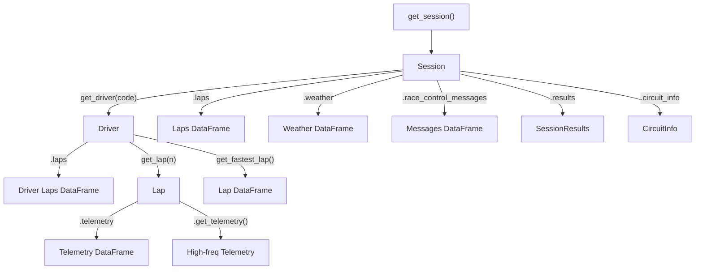

# API Overview

The `tif1` API is a high-performance, modern Python library meticulously designed for Formula 1 data analysis, telemetry processing, and motorsport analytics. Built from the ground up with performance as the absolute primary focus, `tif1` provides a clean, intuitive, and powerful interface that maintains full compatibility with the popular `fastf1` library while delivering significant speed improvements—often 5-10x faster—through advanced async operations, intelligent multi-layer caching, parallel HTTP fetching, and optional Polars backend support.

Whether you're a data scientist analyzing race strategies, a motorsport engineer studying telemetry patterns, a developer building F1 applications, or an enthusiast exploring racing data, `tif1` provides the tools and performance you need to work efficiently with Formula 1 data at scale.

## What Makes tif1 Different

`tif1` stands apart from other F1 data libraries through several key innovations:

- **Uncompromising Performance**: Every single component, from HTTP fetching to DataFrame construction, has been optimized for maximum speed. Async operations run in parallel, caching happens at multiple layers (memory + SQLite), and the optional Polars backend provides memory-efficient processing for large datasets.

- **Production-Ready Architecture**: Unlike research-focused libraries, `tif1` is built for production use with circuit breakers, retry logic, connection pooling, DNS-over-HTTPS support, comprehensive error handling, and graceful degradation when CDN sources fail.

- **Developer Experience**: Comprehensive type hints throughout the codebase enable excellent IDE autocomplete and type checking. Clear error messages with structured context help you debug issues quickly. Consistent naming conventions make the API predictable and easy to learn.

- **Flexible Data Access**: Load exactly what you need—skip telemetry for faster lap time analysis, or load everything for comprehensive session exploration. The API adapts to your use case rather than forcing a one-size-fits-all approach.

- **Modern Python Practices**: Built for Python 3.10+, leveraging modern language features like structural pattern matching, improved type hints, and async/await patterns. The codebase follows strict linting rules (Ruff) and maintains high test coverage.

## Design Philosophy

The `tif1` API is built on a foundation of carefully considered design principles that guide every architectural decision and implementation detail:

### Performance First

Performance isn't just a feature—it's the core reason `tif1` exists. Every component has been profiled, optimized, and benchmarked:

- **Async Operations**: All network I/O uses async/await patterns with `niquests` (a modern fork of `requests`) to enable parallel fetching of multiple data sources simultaneously. Loading a full race session with 20 drivers can fetch all data in parallel rather than sequentially.

- **Intelligent Caching**: Multi-layer caching strategy with in-memory LRU cache for hot data and SQLite-backed persistent cache for all fetched data. Cache hits return data in microseconds rather than seconds. The cache is content-addressed and validates data integrity.

- **Parallel Fetching**: When loading session data, `tif1` fetches lap data, telemetry, weather, and race control messages in parallel using asyncio task groups. This reduces total load time from ~10-15 seconds to ~2-3 seconds for uncached sessions.

- **Optional Polars Backend**: For users working with large datasets (multiple seasons, comparative analysis), the Polars backend provides 2-5x better memory efficiency and faster DataFrame operations compared to pandas. The backend is lazy-loaded and can be switched at runtime.

- **Optimized JSON Parsing**: Uses `orjson` (written in Rust) instead of Python's stdlib `json` for 2-3x faster JSON parsing. This matters when processing megabytes of telemetry data.

- **Connection Pooling**: HTTP sessions use connection pooling to reuse TCP connections across requests, reducing connection overhead by ~50-100ms per request.

### Simplicity and Ergonomics

Complex operations should feel simple. The API hides complexity behind intuitive interfaces:

- **Minimal Entry Points**: Most users only need `get_session()` to start working with F1 data. Everything else is discoverable through the returned `Session` object via IDE autocomplete.

- **Sensible Defaults**: All optional parameters have sensible defaults. `get_session()` loads all available data by default, but you can selectively disable data sources for faster loading when you don't need them.

- **Fuzzy Matching**: Event names support fuzzy matching—"spa", "belgium", "Belgian Grand Prix", and "Spa-Francorchamps" all work. Session types accept both full names ("Qualifying") and short codes ("Q"). This reduces friction and makes the API more forgiving.

- **Progressive Disclosure**: Basic usage is simple, but advanced features are available when needed. Start with `session.laps` for quick analysis, then dive into `driver.get_lap(n).get_telemetry()` for detailed telemetry work.

- **Method Chaining**: Where appropriate, methods return objects that support further operations, enabling natural workflows like `session.get_driver("VER").get_fastest_lap().get_telemetry()`.

### Predictability and Consistency

The API should be easy to learn and remember:

- **Consistent Naming**: All methods follow clear patterns—`get_*` for retrieval operations, `load_*` for data loading, `clear_*` for cache operations. Attributes use snake_case, classes use PascalCase.

- **Clear Data Hierarchies**: The object model mirrors F1's structure: `Session` contains `Driver` objects, which contain `Lap` objects, which contain `Telemetry` data. This mental model matches how you think about F1 data.

- **Comprehensive Type Hints**: Every public function and method includes complete type hints. Your IDE can show you exactly what parameters are expected and what will be returned, reducing the need to consult documentation.

- **Structured Errors**: Exceptions include structured context (not just error messages) so you can programmatically handle errors. A `DataNotFoundError` includes the year, event, and session that weren't found.

### Compatibility

Existing `fastf1` users should be able to migrate with minimal friction:

- **Drop-in Replacement**: The core API (`get_session()`, `Session.laps`, `Driver` objects) matches `fastf1`'s interface. Most `fastf1` code works with `tif1` by just changing the import.

- **Compatibility Layer**: The `tif1.fastf1_compat` module provides shims for `fastf1`-specific functions like `set_log_level()` and `Cache.enable_cache()`.

- **DataFrame Compatibility**: DataFrames returned by `tif1` have the same column names and structure as `fastf1`, ensuring your analysis code doesn't need changes.

- **Migration Path**: You can use both libraries side-by-side during migration, gradually moving code to `tif1` as you validate behavior.

### Extensibility and Customization

Advanced users should be able to customize behavior:

- **Configuration System**: Global configuration via `get_config()` allows you to tune performance parameters (max workers, cache TTL, validation), switch backends (pandas/polars), and control behavior (ultra cold start mode, DNS-over-HTTPS).

- **Modular Architecture**: The library is split into focused modules (`http_session`, `async_fetch`, `cache`, `cdn`) that can be used independently or replaced with custom implementations.

- **Backend Abstraction**: The DataFrame backend is abstracted behind a common interface, making it possible to add new backends (DuckDB, Arrow) without changing user-facing code.

- **Cache Management**: Full control over cache behavior—clear specific sessions, clear by date range, inspect cache size, vacuum the database, or disable caching entirely for testing.

- **Retry and Circuit Breaker**: Configurable retry logic with exponential backoff and circuit breaker patterns to handle transient network failures gracefully.

## Quick Start

Get started with `tif1` in seconds. The library handles all the complexity of data fetching, parsing, caching, and DataFrame construction behind a simple, intuitive interface:

```python
import tif1

# Load a complete race session with all available data
# This single line fetches laps, telemetry, weather, and race control messages
session = tif1.get_session(2021, "Belgian Grand Prix", "Race")

# Access all laps from all drivers as a unified DataFrame
# Each row represents one lap with timing, tire, and position data
laps = session.laps
print(f"Total laps: {len(laps)}")  # e.g., 1247 laps across all drivers
print(f"Drivers: {laps['Driver'].nunique()}")  # e.g., 20 drivers
print(f"Columns: {list(laps.columns)}")
# ['Driver', 'LapNumber', 'LapTime', 'Sector1Time', 'Sector2Time', 
#  'Sector3Time', 'Compound', 'TyreLife', 'IsPersonalBest', 'Position', ...]

# Get specific driver data using three-letter driver code
driver = session.get_driver("VER")
print(f"Driver: {driver.name}")  # Max Verstappen
print(f"Number: {driver.number}")  # 33
print(f"Team: {driver.team}")    # Red Bull Racing
print(f"Laps completed: {len(driver.laps)}")  # e.g., 44 laps

# Get fastest lap telemetry with high-frequency data (~10-20 Hz sampling)
# Telemetry includes speed, RPM, throttle, brake, gear, DRS, and position
telemetry = driver.get_fastest_lap_tel()
print(f"Max speed: {telemetry['Speed'].max():.1f} km/h")  # e.g., 332.5 km/h
print(f"Max RPM: {telemetry['RPM'].max():.0f}")  # e.g., 12500 RPM
print(f"Data points: {len(telemetry)}")  # ~300-500 samples per lap
print(f"Sampling rate: {len(telemetry) / driver.get_fastest_lap()['LapTime'].iloc[0]:.1f} Hz")

# Analyze tire strategy across the race
for stint_num, stint in enumerate(driver.get_stint_data(), 1):
    print(f"Stint {stint_num}: {stint['Compound']} - {stint['LapCount']} laps")
    print(f"  Average lap time: {stint['AvgLapTime']:.3f}s")
    print(f"  Tire degradation: {stint['Degradation']:.3f}s per lap")

# Compare fastest laps between drivers
ver_fastest = session.get_driver("VER").get_fastest_lap()
ham_fastest = session.get_driver("HAM").get_fastest_lap()
delta = ver_fastest['LapTime'].iloc[0] - ham_fastest['LapTime'].iloc[0]
print(f"Fastest lap delta: {delta:.3f}s")

# Access weather data throughout the session
weather = session.weather
print(f"Weather samples: {len(weather)}")
print(f"Temperature range: {weather['AirTemp'].min():.1f}°C - {weather['AirTemp'].max():.1f}°C")
print(f"Track temp range: {weather['TrackTemp'].min():.1f}°C - {weather['TrackTemp'].max():.1f}°C")
print(f"Rainfall: {weather['Rainfall'].any()}")

# Access race control messages (flags, penalties, safety cars)
messages = session.race_control_messages
safety_cars = messages[messages['Message'].str.contains('SAFETY CAR', case=False, na=False)]
print(f"Safety car periods: {len(safety_cars)}")

# Get session results and final classification
results = session.results
print(f"Winner: {results.iloc[0]['DriverName']} ({results.iloc[0]['Team']})")
print(f"Winning time: {results.iloc[0]['Time']}")
print(f"Fastest lap: {results['FastestLap'].min():.3f}s by {results.loc[results['FastestLap'].idxmin(), 'DriverName']}")
```

### What Happens Behind the Scenes

When you call `get_session()`, `tif1` orchestrates a complex series of operations to deliver data quickly and reliably:

1. **Input Validation and Normalization**
   - Validates the year is within supported range (2018-2026)
   - Performs fuzzy matching on event name against the schedule database
   - Normalizes session type (accepts "Race", "R", "race", "RACE", etc.)
   - Raises `DataNotFoundError` with helpful context if validation fails

2. **Schedule Lookup**
   - Queries the embedded schedule database (JSON files in `src/tif1/data/schedules/`)
   - Retrieves event metadata: official name, location, date, session times
   - Determines available sessions for the event (standard vs sprint weekend format)
   - Validates the requested session exists for this event

3. **Cache Check (SQLite)**
   - Computes content-addressed cache key from (year, event, session, data types)
   - Queries SQLite cache database (`~/.tif1/cache.db` by default)
   - Checks cache TTL (time-to-live) to determine if cached data is still fresh
   - If cache hit and data is fresh, deserializes DataFrames and returns immediately (microseconds)
   - If cache miss or stale data, proceeds to fetch from CDN

4. **CDN URL Construction**
   - Builds URLs for all requested data sources (laps, telemetry, weather, messages)
   - Uses jsdelivr CDN pointing to TracingInsights GitHub data repositories
   - Constructs fallback URLs in case primary CDN fails
   - Includes cache-busting parameters when needed

5. **Parallel Async Fetching**
   - Creates async tasks for each data source using `asyncio.TaskGroup`
   - Fetches all data sources in parallel (not sequential) using `niquests`
   - Uses connection pooling to reuse TCP connections
   - Implements retry logic with exponential backoff for transient failures
   - Falls back to alternative CDN sources if primary fails
   - Typical fetch time: 2-3 seconds for all data sources in parallel

6. **JSON Parsing**
   - Parses JSON responses using `orjson` (Rust-based, 2-3x faster than stdlib)
   - Validates JSON structure against expected schema
   - Raises `InvalidDataError` if data is corrupted or malformed
   - Extracts nested data structures (lap arrays, telemetry points, etc.)

7. **DataFrame Construction**
   - Converts parsed JSON into pandas or Polars DataFrames based on config
   - Applies column renaming to match `fastf1` conventions
   - Sets appropriate data types (float64 for times, int64 for lap numbers, category for compounds)
   - Reorders columns to standard layout
   - Adds computed columns (IsPersonalBest, TyreLife, etc.)
   - Handles missing data gracefully (NaN for missing telemetry, empty DataFrames for missing sessions)

8. **Data Validation (Optional)**
   - If `validate_data` config is enabled, runs Pydantic validation on data structures
   - Checks for logical consistency (lap times > 0, sector times sum to lap time, etc.)
   - Validates driver codes against known driver list
   - Can be disabled for 10-15% performance improvement in production

9. **Cache Storage**
   - Serializes DataFrames to efficient binary format (pickle or parquet)
   - Stores in SQLite database with metadata (timestamp, data types, size)
   - Compresses data to reduce storage (typical compression ratio: 3-5x)
   - Updates cache statistics (hit rate, total size, entry count)

10. **Object Construction**
    - Creates `Session` object with all loaded data
    - Initializes `Driver` objects for each driver in the session
    - Sets up lazy-loading for telemetry data (loaded on first access)
    - Establishes relationships between objects (Session → Driver → Lap → Telemetry)
    - Returns fully-initialized `Session` object ready for analysis

All of this happens transparently in milliseconds for cached data, or a few seconds for fresh downloads with parallel async fetching. The user sees only a simple function call that returns a ready-to-use `Session` object.

### Performance Characteristics

Understanding the performance profile helps you optimize your workflows:

- **Cache Hit (Warm)**: 1-5 milliseconds
  - Data loaded from SQLite cache
  - DataFrame deserialization from binary format
  - No network I/O

- **Cache Miss (Cold)**: 2-5 seconds
  - Parallel async fetching of all data sources
  - JSON parsing and DataFrame construction
  - Cache storage for future use
  - Dominated by network latency, not CPU

- **Partial Cache Hit**: 500ms - 2 seconds
  - Some data sources cached, others fetched
  - Only missing data sources are fetched
  - Faster than full cold start

- **Ultra Cold Start Mode**: 100-300 milliseconds
  - Optimized for single-query scenarios
  - Skips some cache checks and optimizations
  - Trades repeated-query performance for first-query speed
  - Enable with `config.set("ultra_cold_start", True)`

- **Polars Backend**: 30-50% faster for large datasets
  - Better memory efficiency (2-5x less RAM)
  - Faster filtering and aggregation operations
  - Lazy evaluation for complex queries
  - Enable with `config.set("lib", "polars")`

---

## Entry Points

The `tif1` API exposes five primary entry points that serve as the foundation for all data access, configuration, and cache management. These functions are designed to be the only imports you need for most use cases:

| Function | Purpose | Return Type | Typical Use Case | Documentation |
| :--- | :--- | :--- | :--- | :--- |
| `get_session()` | Load data for a specific GP session (Practice, Qualifying, Sprint, Race) | `Session` | Primary data access for analysis | [Core API](/api-reference/core#get_session) |
| `get_events()` | List all available Grand Prix events for a given year with metadata | `pd.DataFrame` | Event discovery and schedule planning | [Events API](/api-reference/events#get_events) |
| `get_sessions()` | List all available sessions for a specific event (FP1, FP2, FP3, Q, S, R) | `list[str]` | Session discovery for event | [Events API](/api-reference/events#get_sessions) |
| `get_config()` | Access and modify global configuration (backend, cache, performance) | `Config` | Performance tuning and customization | [Config API](/api-reference/config#get_config) |
| `get_cache()` | Access cache management for clearing, inspecting, and optimizing storage | `Cache` | Cache maintenance and debugging | [Cache API](/api-reference/cache#get_cache) |

### Detailed Entry Point Usage

#### `get_session(year, event, session_type, **kwargs)`

The primary and most important entry point for loading Formula 1 session data. This function is designed to be flexible, forgiving, and powerful—accepting multiple input formats while providing fine-grained control over what data gets loaded.

**Function Signature:**
```python
def get_session(
    year: int,
    event: str,
    session_type: str,
    *,
    laps: bool = True,
    telemetry: bool = True,
    weather: bool = True,
    messages: bool = True,
    backend: Literal["pandas", "polars"] | None = None,
    force_reload: bool = False,
) -> Session:
    """
    Load a Formula 1 session with specified data sources.
    
    Args:
        year: Championship year (2018-2026 supported)
        event: Event name (supports fuzzy matching)
        session_type: Session type (Practice 1/2/3, Qualifying, Sprint, Race)
        laps: Load lap timing data (default: True)
        telemetry: Load high-frequency telemetry data (default: True)
        weather: Load weather conditions (default: True)
        messages: Load race control messages (default: True)
        backend: Override global backend setting ("pandas" or "polars")
        force_reload: Bypass cache and fetch fresh data (default: False)
    
    Returns:
        Session object with requested data loaded
    
    Raises:
        DataNotFoundError: Event or session doesn't exist for the given year
        NetworkError: All CDN sources failed
        InvalidDataError: Data corruption detected
        ValueError: Invalid parameter values
    """
```

**Basic Usage Examples:**

```python
import tif1

# Standard usage with full names
session = tif1.get_session(2021, "Belgian Grand Prix", "Race")

# Fuzzy matching for event names (case-insensitive, partial matches)
session = tif1.get_session(2021, "belgium", "race")  # Works!
session = tif1.get_session(2021, "spa", "R")  # Short codes work too
session = tif1.get_session(2021, "BELGIAN", "RACE")  # Case insensitive
session = tif1.get_session(2021, "Spa-Francorchamps", "Race")  # Circuit name works

# Session type flexibility - all of these are equivalent:
session = tif1.get_session(2021, "Monaco", "Qualifying")
session = tif1.get_session(2021, "Monaco", "Q")
session = tif1.get_session(2021, "Monaco", "qualifying")
session = tif1.get_session(2021, "Monaco", "QUALIFYING")

# Practice sessions
session = tif1.get_session(2024, "Bahrain", "Practice 1")  # or "FP1"
session = tif1.get_session(2024, "Bahrain", "Practice 2")  # or "FP2"
session = tif1.get_session(2024, "Bahrain", "Practice 3")  # or "FP3"

# Sprint weekends have different session structure
session = tif1.get_session(2024, "Austria", "Sprint Qualifying")  # or "SQ"
session = tif1.get_session(2024, "Austria", "Sprint")  # or "S"
```

**Selective Data Loading:**

Control exactly what data gets loaded to optimize performance for your specific use case:

```python
# Load everything (default behavior)
session = tif1.get_session(
    2021, "Belgian Grand Prix", "Race",
    laps=True,        # Lap timing data
    telemetry=True,   # High-frequency telemetry
    weather=True,     # Weather conditions
    messages=True     # Race control messages
)

# Load only lap times for quick analysis (fastest)
# Useful for: lap time analysis, strategy analysis, position tracking
# Typical load time: 500ms - 1s (cold), <5ms (warm)
session = tif1.get_session(
    2021, "Belgian Grand Prix", "Race",
    laps=True,
    telemetry=False,  # Skip telemetry (saves ~2-3 seconds)
    weather=False,    # Skip weather (saves ~200ms)
    messages=False    # Skip messages (saves ~100ms)
)

# Load only telemetry for detailed analysis
# Useful for: corner analysis, speed traces, driving style comparison
session = tif1.get_session(
    2021, "Belgian Grand Prix", "Qualifying",
    laps=True,        # Need laps to identify which lap to analyze
    telemetry=True,   # High-frequency data
    weather=False,    # Don't need weather for telemetry work
    messages=False    # Don't need race control for quali
)

# Load everything except telemetry for strategy analysis
# Useful for: tire strategy, pit stop analysis, race pace
session = tif1.get_session(
    2021, "Belgian Grand Prix", "Race",
    laps=True,
    telemetry=False,  # Telemetry not needed for strategy
    weather=True,     # Weather affects tire choice
    messages=True     # Safety cars affect strategy
)
```

**Advanced Usage:**

```python
# Force reload from CDN (bypass cache)
# Useful for: getting latest data, debugging cache issues
session = tif1.get_session(
    2024, "Monaco", "Race",
    force_reload=True  # Ignores cache, always fetches fresh
)

# Override backend for specific session
# Useful for: testing backends, optimizing specific workflows
session = tif1.get_session(
    2021, "Belgian Grand Prix", "Race",
    backend="polars"  # Use Polars even if global config is pandas
)

# Combine options for optimal performance
session = tif1.get_session(
    2024, "Bahrain", "Race",
    laps=True,
    telemetry=False,
    weather=False,
    messages=False,
    backend="polars",
    force_reload=False
)
```

**Parameters Deep Dive:**

- **`year` (int)**: Championship year from 2018 to 2026
  - 2018-2024: Complete historical data
  - 2025-2026: Partial data (as events occur)
  - Earlier years: Not supported (data format changed)
  - Future years: Will be supported as data becomes available

- **`event` (str)**: Event name with flexible matching
  - Official names: "Monaco Grand Prix", "British Grand Prix"
  - Circuit names: "Silverstone", "Spa-Francorchamps"
  - Location names: "Monaco", "Belgium", "Great Britain"
  - Partial matches: "monaco", "silver", "spa"
  - Case insensitive: "MONACO", "Monaco", "monaco" all work
  - Fuzzy matching uses Levenshtein distance with threshold of 0.7

- **`session_type` (str)**: Session type with multiple formats
  - Full names: "Practice 1", "Practice 2", "Practice 3", "Qualifying", "Sprint", "Race"
  - Short codes: "FP1", "FP2", "FP3", "Q", "S", "R"
  - Sprint weekends: "Sprint Qualifying" or "SQ"
  - Case insensitive: "race", "RACE", "Race" all work
  - Normalized internally to canonical form

- **`laps` (bool)**: Load lap timing data
  - Includes: lap times, sector times, tire compounds, tire life, positions, pit stops
  - Size: ~50-200 KB per session (compressed)
  - Load time: ~200-500ms (cold), <5ms (warm)
  - Required for: almost all analysis workflows

- **`telemetry` (bool)**: Load high-frequency telemetry
  - Includes: speed, RPM, throttle, brake, gear, DRS, position (X/Y/Z)
  - Sampling rate: ~10-20 Hz (10-20 samples per second)
  - Size: ~5-20 MB per session (compressed)
  - Load time: ~1-3 seconds (cold), ~10-50ms (warm)
  - Required for: detailed lap analysis, corner analysis, driving style comparison
  - Optional for: lap time analysis, strategy analysis

- **`weather` (bool)**: Load weather conditions
  - Includes: air temp, track temp, humidity, pressure, wind speed/direction, rainfall
  - Sampling rate: ~1 sample per minute
  - Size: ~5-10 KB per session
  - Load time: ~100-200ms (cold), <5ms (warm)
  - Required for: understanding tire performance, strategy decisions
  - Optional for: pure lap time analysis

- **`messages` (bool)**: Load race control messages
  - Includes: flags (yellow, red, green), safety cars, penalties, DRS status
  - Size: ~10-50 KB per session
  - Load time: ~100-200ms (cold), <5ms (warm)
  - Required for: understanding race incidents, strategy impacts
  - Optional for: qualifying analysis, practice analysis

- **`backend` (Literal["pandas", "polars"] | None)**: DataFrame backend
  - `None`: Use global config setting (default)
  - `"pandas"`: Use pandas DataFrames (more compatible, more features)
  - `"polars"`: Use Polars DataFrames (faster, more memory efficient)
  - Can be changed per-session without affecting global config
  - Polars requires `polars` package installed

- **`force_reload` (bool)**: Bypass cache
  - `False`: Use cache if available (default, recommended)
  - `True`: Always fetch from CDN, ignore cache
  - Useful for: debugging, getting latest data, cache corruption
  - Slower: adds 2-5 seconds to load time

**Return Value:**

Returns a `Session` object with the following key attributes and methods:

```python
session = tif1.get_session(2021, "Belgian Grand Prix", "Race")

# Attributes
session.laps                    # DataFrame: All laps from all drivers
session.weather                 # DataFrame: Weather conditions
session.race_control_messages   # DataFrame: Race control messages
session.results                 # SessionResults: Final classification
session.circuit_info            # CircuitInfo: Circuit metadata
session.drivers                 # list[str]: Driver codes ['VER', 'HAM', ...]
session.session_info            # dict: Session metadata (date, time, type)
session.event_info              # dict: Event metadata (name, location, country)

# Methods
session.get_driver(code)                    # Get Driver object
session.get_fastest_laps(by_driver=False)   # Get fastest lap(s)
session.get_laps_by_driver(code)            # Get all laps for driver
session.load()                              # Explicitly load data
session.to_dict()                           # Export to dictionary
session.to_json()                           # Export to JSON
```

**Exception Handling:**

```python
from tif1.exceptions import DataNotFoundError, NetworkError, InvalidDataError

try:
    session = tif1.get_session(2021, "Belgian Grand Prix", "Race")
    
except DataNotFoundError as e:
    # Event or session doesn't exist
    print(f"Data not found: {e.message}")
    print(f"Year: {e.context['year']}")
    print(f"Event: {e.context['event']}")
    print(f"Session: {e.context['session_type']}")
    # Suggestion: Check available events with get_events(year)
    
except NetworkError as e:
    # All CDN sources failed
    print(f"Network error: {e.message}")
    print(f"URL: {e.context.get('url')}")
    print(f"Status code: {e.context.get('status_code')}")
    # Suggestion: Check internet connection, try again later
    
except InvalidDataError as e:
    # Data corruption detected
    print(f"Invalid data: {e.message}")
    print(f"Source: {e.context.get('source')}")
    # Suggestion: Try force_reload=True to fetch fresh data
    
except ValueError as e:
    # Invalid parameter values
    print(f"Invalid parameter: {e}")
    # Suggestion: Check parameter types and values
```

**Performance Tips:**

1. **Load only what you need**: Disable unused data sources
   ```python
   # 3-5x faster than loading everything
   session = tif1.get_session(2021, "Monaco", "Race", telemetry=False, weather=False, messages=False)
   ```

2. **Use cache effectively**: Don't use `force_reload` unless necessary
   ```python
   # Cache hit: <5ms, Cache miss: 2-5 seconds
   session = tif1.get_session(2021, "Monaco", "Race")  # Uses cache
   ```

3. **Consider Polars for large datasets**: 2-5x better memory efficiency
   ```python
   session = tif1.get_session(2021, "Monaco", "Race", backend="polars")
   ```

4. **Batch load sessions**: Use async methods for parallel loading
   ```python
   import asyncio
   
   async def load_multiple():
       sessions = await asyncio.gather(
           tif1.get_session_async(2021, "Monaco", "Race"),
           tif1.get_session_async(2021, "Silverstone", "Race"),
           tif1.get_session_async(2021, "Spa", "Race"),
       )
       return sessions
   ```

#### `get_events(year, **kwargs)`

Retrieve the complete event schedule for a championship year, including all Grand Prix events with their metadata, dates, locations, and session structures.

**Function Signature:**
```python
def get_events(
    year: int,
    *,
    backend: Literal["pandas", "polars"] | None = None,
) -> pd.DataFrame | pl.DataFrame:
    """
    Get all Formula 1 events for a specific championship year.
    
    Args:
        year: Championship year (2018-2026 supported)
        backend: Override global backend setting
    
    Returns:
        DataFrame with event schedule and metadata
    
    Raises:
        ValueError: Invalid year
        DataNotFoundError: No schedule data for year
    """
```

**Basic Usage:**

```python
import tif1

# Get all events for 2024 season
events = tif1.get_events(2024)

# Inspect the structure
print(f"Events in 2024: {len(events)}")
print(f"Columns: {list(events.columns)}")
# ['RoundNumber', 'EventName', 'OfficialEventName', 'Location', 'Country', 
#  'EventDate', 'EventFormat', 'Session1', 'Session1Date', 'Session1DateUtc',
#  'Session2', 'Session2Date', 'Session2DateUtc', 'Session3', 'Session3Date',
#  'Session3DateUtc', 'Session4', 'Session4Date', 'Session4DateUtc',
#  'Session5', 'Session5Date', 'Session5DateUtc', 'F1ApiSupport']

# View first few events
print(events[['RoundNumber', 'EventName', 'Location', 'EventDate']].head())
#    RoundNumber              EventName        Location   EventDate
# 0            1  Bahrain Grand Prix         Sakhir    2024-03-02
# 1            2  Saudi Arabian Grand Prix  Jeddah    2024-03-09
# 2            3  Australian Grand Prix     Melbourne 2024-03-24
# 3            4  Japanese Grand Prix       Suzuka    2024-04-07
# 4            5  Chinese Grand Prix        Shanghai  2024-04-21
```

**Filtering and Analysis:**

```python
# Filter to specific events
monaco = events[events['EventName'] == 'Monaco Grand Prix']
print(f"Monaco date: {monaco['EventDate'].iloc[0]}")
print(f"Monaco location: {monaco['Location'].iloc[0]}")

# Find events by location
uk_events = events[events['Country'] == 'GB']
print(f"UK events: {uk_events['EventName'].tolist()}")

# Check event format (standard vs sprint weekend)
sprint_events = events[events['EventFormat'] == 'sprint']
print(f"Sprint weekends in 2024: {len(sprint_events)}")
print(sprint_events[['EventName', 'Location', 'EventDate']])

standard_events = events[events['EventFormat'] == 'standard']
print(f"Standard weekends in 2024: {len(standard_events)}")

# Find events by date range
import pandas as pd
events['EventDate'] = pd.to_datetime(events['EventDate'])
summer_events = events[
    (events['EventDate'] >= '2024-06-01') & 
    (events['EventDate'] <= '2024-08-31')
]
print(f"Summer events: {summer_events['EventName'].tolist()}")

# Get events in chronological order
events_sorted = events.sort_values('EventDate')
print("Season calendar:")
for _, event in events_sorted.iterrows():
    print(f"{event['EventDate'].strftime('%Y-%m-%d')}: {event['EventName']} ({event['Location']})")
```

**Session Structure Analysis:**

```python
# Examine session structure for standard weekend
standard = events[events['EventFormat'] == 'standard'].iloc[0]
print(f"Standard weekend: {standard['EventName']}")
print(f"  {standard['Session1']} - {standard['Session1Date']}")  # Practice 1
print(f"  {standard['Session2']} - {standard['Session2Date']}")  # Practice 2
print(f"  {standard['Session3']} - {standard['Session3Date']}")  # Practice 3
print(f"  {standard['Session4']} - {standard['Session4Date']}")  # Qualifying
print(f"  {standard['Session5']} - {standard['Session5Date']}")  # Race

# Examine session structure for sprint weekend
sprint = events[events['EventFormat'] == 'sprint'].iloc[0]
print(f"Sprint weekend: {sprint['EventName']}")
print(f"  {sprint['Session1']} - {sprint['Session1Date']}")  # Practice 1
print(f"  {sprint['Session2']} - {sprint['Session2Date']}")  # Sprint Qualifying
print(f"  {sprint['Session3']} - {sprint['Session3Date']}")  # Sprint
print(f"  {sprint['Session4']} - {sprint['Session4Date']}")  # Qualifying
print(f"  {sprint['Session5']} - {sprint['Session5Date']}")  # Race
```

**DataFrame Columns Explained:**

- `RoundNumber` (int): Sequential round number in championship (1-24)
- `EventName` (str): Short event name (e.g., "Monaco Grand Prix")
- `OfficialEventName` (str): Full official name (e.g., "Formula 1 Grand Prix de Monaco 2024")
- `Location` (str): Circuit location/city (e.g., "Monte Carlo")
- `Country` (str): ISO country code (e.g., "MC" for Monaco)
- `EventDate` (str/datetime): Date of main race
- `EventFormat` (str): "standard" or "sprint"
- `Session1-5` (str): Session names ("Practice 1", "Qualifying", "Race", etc.)
- `Session1-5Date` (str): Local date/time for each session
- `Session1-5DateUtc` (str): UTC date/time for each session
- `F1ApiSupport` (bool): Whether F1 official API supports this event

**Use Cases:**

```python
# Build a season calendar application
def print_season_calendar(year):
    events = tif1.get_events(year)
    print(f"\n{year} Formula 1 World Championship Calendar\n")
    print(f"{'Round':<6} {'Date':<12} {'Event':<30} {'Location':<20} {'Format':<10}")
    print("-" * 80)
    for _, event in events.iterrows():
        print(f"{event['RoundNumber']:<6} {event['EventDate']:<12} "
              f"{event['EventName']:<30} {event['Location']:<20} {event['EventFormat']:<10}")

print_season_calendar(2024)

# Find next upcoming event
from datetime import datetime
events = tif1.get_events(2024)
events['EventDate'] = pd.to_datetime(events['EventDate'])
now = datetime.now()
upcoming = events[events['EventDate'] >= now].sort_values('EventDate')
if len(upcoming) > 0:
    next_event = upcoming.iloc[0]
    print(f"Next event: {next_event['EventName']}")
    print(f"Location: {next_event['Location']}")
    print(f"Date: {next_event['EventDate'].strftime('%Y-%m-%d')}")
    days_until = (next_event['EventDate'] - now).days
    print(f"Days until: {days_until}")

# Compare season lengths across years
for year in range(2018, 2025):
    events = tif1.get_events(year)
    sprint_count = len(events[events['EventFormat'] == 'sprint'])
    print(f"{year}: {len(events)} events ({sprint_count} sprint weekends)")
```

**Performance Notes:**

- Schedule data is embedded in the package (no network I/O)
- Load time: <1ms (reading from JSON files)
- Data size: ~10-20 KB per year
- No caching needed (always instant)

See [Events API](/api-reference/events) for complete documentation.

#### `get_sessions(year, event)`

List all available sessions for a specific event, accounting for standard vs sprint weekend formats.

**Function Signature:**
```python
def get_sessions(
    year: int,
    event: str,
) -> list[str]:
    """
    Get list of available sessions for a specific event.
    
    Args:
        year: Championship year
        event: Event name (supports fuzzy matching)
    
    Returns:
        List of session names
    
    Raises:
        DataNotFoundError: Event doesn't exist for year
    """
```

**Usage Examples:**

```python
import tif1

# Get all sessions for a standard weekend
sessions = tif1.get_sessions(2024, "Monaco Grand Prix")
print(sessions)
# ['Practice 1', 'Practice 2', 'Practice 3', 'Qualifying', 'Race']

# Sprint weekend has different structure
sessions = tif1.get_sessions(2024, "Austrian Grand Prix")
print(sessions)
# ['Practice 1', 'Sprint Qualifying', 'Sprint', 'Qualifying', 'Race']

# Fuzzy matching works here too
sessions = tif1.get_sessions(2024, "monaco")  # Works
sessions = tif1.get_sessions(2024, "austria")  # Works

# Iterate through all sessions
for session_name in sessions:
    print(f"Loading {session_name}...")
    session = tif1.get_session(2024, "Monaco", session_name)
    print(f"  Drivers: {len(session.drivers)}")
    print(f"  Laps: {len(session.laps)}")

# Check if specific session exists
event_name = "Monaco Grand Prix"
sessions = tif1.get_sessions(2024, event_name)
if "Practice 3" in sessions:
    print("Practice 3 available")
    session = tif1.get_session(2024, event_name, "Practice 3")
else:
    print("No Practice 3 (might be sprint weekend)")

# Load all sessions for an event
def load_all_sessions(year, event):
    sessions_data = {}
    for session_name in tif1.get_sessions(year, event):
        print(f"Loading {session_name}...")
        sessions_data[session_name] = tif1.get_session(year, event, session_name)
    return sessions_data

weekend_data = load_all_sessions(2024, "Monaco")
print(f"Loaded {len(weekend_data)} sessions")
```

**Use Cases:**

- Validate session existence before loading
- Build UI dropdowns for session selection
- Iterate through all sessions in an event
- Handle standard vs sprint weekend differences

See [Events API](/api-reference/events) for complete documentation.

#### `get_config()`

Access global configuration singleton:

```python
config = tif1.get_config()

# View current settings
print(config.lib)              # 'pandas' or 'polars'
print(config.cache_enabled)    # True/False
print(config.max_workers)      # Concurrent fetch limit

# Modify settings
config.set("lib", "polars")              # Switch to Polars backend
config.set("ultra_cold_start", True)     # Optimize for single queries
config.set("max_workers", 100)           # Increase parallelism
config.set("cache_ttl", 86400)           # Cache for 24 hours
config.set("validate_data", False)       # Skip validation for speed

# Persist configuration
config.save()  # Saves to ~/.tif1rc
```

See [Config API](/api-reference/config) for all available settings.

#### `get_cache()`

Manage the SQLite-backed cache:

```python
cache = tif1.get_cache()

# Inspect cache
print(f"Cache size: {cache.size_mb:.2f} MB")
print(f"Cached sessions: {cache.count()}")

# Clear specific data
cache.clear_session(2021, "Belgian Grand Prix", "Race")

# Clear old data
cache.clear_before_date("2023-01-01")

# Clear everything
cache.clear_all()

# Optimize database
cache.vacuum()  # Reclaim space and optimize queries
```

See [Cache API](/api-reference/cache) for complete cache management.

---

## Core Objects

The `tif1` API is built around a clear object hierarchy that mirrors the structure of Formula 1 data. Understanding this hierarchy is key to effective use of the library.



### Primary Objects

These are the main objects you'll interact with when using `tif1`:

#### Session

The `Session` object represents an entire Formula 1 session (Practice, Qualifying, Sprint, or Race) and serves as the primary container for all session data.

**Key Attributes:**
- `session.laps` - All lap timing data from all drivers as a DataFrame
- `session.weather` - Weather conditions throughout the session
- `session.race_control_messages` - Official race control messages and flags
- `session.results` - Final classification and session results
- `session.circuit_info` - Circuit metadata (length, corners, location)
- `session.drivers` - List of driver codes (e.g., ['VER', 'HAM', 'LEC'])
- `session.session_info` - Session metadata (date, time, type)

**Key Methods:**
- `get_driver(code)` - Get a Driver object for a specific driver
- `get_fastest_laps(by_driver=False)` - Get fastest lap(s) from the session
- `get_laps_by_driver(code)` - Get all laps for a specific driver
- `load()` - Explicitly load data (usually called automatically)

**Example:**
```python
session = tif1.get_session(2021, "Belgian Grand Prix", "Race")

# Access session-level data
print(f"Session: {session.session_info['SessionName']}")
print(f"Date: {session.session_info['SessionDate']}")
print(f"Circuit: {session.circuit_info.name}")
print(f"Length: {session.circuit_info.length_km:.3f} km")

# Get all laps
all_laps = session.laps
print(f"Total laps: {len(all_laps)}")
print(f"Columns: {list(all_laps.columns)}")
# ['Driver', 'LapNumber', 'LapTime', 'Sector1Time', 'Sector2Time', 
#  'Sector3Time', 'Compound', 'TyreLife', 'IsPersonalBest', ...]

# Get fastest laps per driver
fastest = session.get_fastest_laps(by_driver=True)
print(fastest[['Driver', 'LapTime', 'Compound']].head())
```

See [Session API](/api-reference/core#session) for complete documentation.

#### Driver

The `Driver` object represents a specific driver within a session and provides convenient access to driver-specific data and operations.

**Key Attributes:**
- `driver.code` - Three-letter driver code (e.g., 'VER')
- `driver.name` - Full driver name (e.g., 'Max Verstappen')
- `driver.team` - Team name (e.g., 'Red Bull Racing')
- `driver.number` - Racing number (e.g., 33)
- `driver.laps` - All laps completed by this driver as a DataFrame
- `driver.telemetry` - Telemetry data for all laps (if loaded)

**Key Methods:**
- `get_lap(lap_number)` - Get a specific lap by number
- `get_fastest_lap()` - Get the driver's fastest lap
- `get_fastest_lap_tel()` - Get telemetry for the fastest lap
- `get_lap_telemetry(lap_number)` - Get telemetry for a specific lap
- `get_stint_data()` - Analyze tire stint performance

**Example:**
```python
session = tif1.get_session(2021, "Belgian Grand Prix", "Race")
driver = session.get_driver("VER")

# Driver information
print(f"Driver: {driver.name}")
print(f"Number: {driver.number}")
print(f"Team: {driver.team}")

# Lap analysis
laps = driver.laps
print(f"Laps completed: {len(laps)}")
print(f"Average lap time: {laps['LapTime'].mean():.3f}s")

# Get fastest lap
fastest = driver.get_fastest_lap()
print(f"Fastest lap: {fastest['LapTime'].iloc[0]:.3f}s")
print(f"Lap number: {fastest['LapNumber'].iloc[0]}")
print(f"Tire compound: {fastest['Compound'].iloc[0]}")

# Telemetry analysis
tel = driver.get_fastest_lap_tel()
print(f"Max speed: {tel['Speed'].max():.1f} km/h")
print(f"Max RPM: {tel['RPM'].max():.0f}")
print(f"Telemetry samples: {len(tel)}")
```

See [Driver API](/api-reference/core#driver) for complete documentation.

#### Lap

The `Lap` object represents a single lap by a driver and provides access to high-frequency telemetry data for that specific lap.

**Key Attributes:**
- `lap.lap_number` - Lap number in the session
- `lap.lap_time` - Total lap time in seconds
- `lap.sector_times` - Individual sector times
- `lap.compound` - Tire compound used
- `lap.telemetry` - High-frequency telemetry DataFrame

**Key Methods:**
- `get_telemetry()` - Load telemetry data for this lap
- `get_speed_trace()` - Get speed data along the lap
- `get_throttle_trace()` - Get throttle application data
- `compare_to(other_lap)` - Compare telemetry with another lap

**Example:**
```python
session = tif1.get_session(2021, "Belgian Grand Prix", "Qualifying")
driver = session.get_driver("VER")
lap = driver.get_lap(5)

# Lap information
print(f"Lap {lap.lap_number}")
print(f"Time: {lap.lap_time:.3f}s")
print(f"S1: {lap.sector_times[0]:.3f}s")
print(f"S2: {lap.sector_times[1]:.3f}s")
print(f"S3: {lap.sector_times[2]:.3f}s")

# Telemetry analysis
tel = lap.get_telemetry()
print(f"Telemetry points: {len(tel)}")
print(f"Columns: {list(tel.columns)}")
# ['Distance', 'Speed', 'RPM', 'Throttle', 'Brake', 'DRS', 
#  'Gear', 'X', 'Y', 'Z']

# Speed analysis
print(f"Max speed: {tel['Speed'].max():.1f} km/h")
print(f"Min speed: {tel['Speed'].min():.1f} km/h")
print(f"Avg speed: {tel['Speed'].mean():.1f} km/h")

# Corner analysis (low speed sections)
corners = tel[tel['Speed'] < 100]
print(f"Corner count: {len(corners)}")
```

See [Lap API](/api-reference/core#lap) for complete documentation.

### Data Models

These objects represent structured data returned by the API:

#### Laps

A DataFrame containing lap timing data with rich filtering and analysis methods.

**Columns:**
- `Driver` - Driver code
- `LapNumber` - Sequential lap number
- `LapTime` - Total lap time (seconds)
- `Sector1Time`, `Sector2Time`, `Sector3Time` - Sector times
- `Compound` - Tire compound (SOFT, MEDIUM, HARD, INTERMEDIATE, WET)
- `TyreLife` - Age of tires in laps
- `IsPersonalBest` - Boolean flag for personal best lap
- `Position` - Track position at lap completion
- `PitInTime`, `PitOutTime` - Pit stop timing
- `TrackStatus` - Track condition flags

**Methods:**
- `pick_driver(code)` - Filter to specific driver
- `pick_fastest()` - Get fastest lap
- `pick_compound(compound)` - Filter by tire compound
- `pick_track_status(status)` - Filter by track status

See [Laps Model](/api-reference/models#laps) for complete documentation.

#### Telemetry

A DataFrame containing high-frequency telemetry data sampled at ~10-20 Hz.

**Columns:**
- `Distance` - Distance along track (meters)
- `Speed` - Speed (km/h)
- `RPM` - Engine RPM
- `Throttle` - Throttle position (0-100%)
- `Brake` - Brake pressure (boolean or 0-100%)
- `DRS` - DRS status (0=closed, 1=open)
- `Gear` - Current gear (1-8)
- `X`, `Y`, `Z` - 3D position coordinates

**Usage:**
```python
tel = driver.get_fastest_lap_tel()

# Speed analysis
max_speed = tel['Speed'].max()
speed_at_1km = tel[tel['Distance'] >= 1000]['Speed'].iloc[0]

# Throttle analysis
full_throttle_pct = (tel['Throttle'] == 100).sum() / len(tel) * 100
print(f"Full throttle: {full_throttle_pct:.1f}% of lap")

# DRS analysis
drs_zones = tel[tel['DRS'] == 1]
print(f"DRS active for {len(drs_zones)} samples")
```

See [Telemetry Model](/api-reference/models#telemetry) for complete documentation.

#### SessionResults

Final classification and results for the session.

**Attributes:**
- `position` - Final position
- `driver_code` - Driver code
- `driver_name` - Full name
- `team` - Team name
- `points` - Championship points awarded
- `status` - Finish status (Finished, DNF, DNS, etc.)
- `time` - Total race time or gap to leader
- `fastest_lap` - Fastest lap time
- `fastest_lap_number` - Lap number of fastest lap

See [SessionResults Model](/api-reference/models#sessionresults) for complete documentation.

#### CircuitInfo

Circuit metadata and track information.

**Attributes:**
- `name` - Circuit name
- `location` - City/region
- `country` - Country
- `length_km` - Track length in kilometers
- `corners` - Number of corners
- `drs_zones` - Number of DRS zones
- `lap_record` - Lap record time and holder

See [CircuitInfo Model](/api-reference/models#circuitinfo) for complete documentation.

---

## API Categories

### Core data access

Essential APIs for loading and working with F1 data:

- **[Core API](/api-reference/core)** - Session, Driver, Lap classes and data loading
- **[Models](/api-reference/models)** - Data model classes and structures
- **[Events](/api-reference/events)** - Event and session discovery
- **[Schedule](/api-reference/schedule)** - Schedule validation and schema

### Data Pipeline

Internal data transformation and fetching:

- **[I/O Pipeline](/api-reference/io-pipeline)** - DataFrame construction and transformation
- **[Async Fetch](/api-reference/async-fetch)** - Parallel HTTP fetching with niquests
- **[HTTP](/api-reference/http)** - HTTP session and networking
- **[HTTP Session](/api-reference/http-session)** - Connection pooling and DoH support
- **[CDN](/api-reference/cdn)** - Multi-source CDN management with fallback

### Configuration & Cache

Performance and reliability management:

- **[Config](/api-reference/config)** - Global configuration management
- **[Cache](/api-reference/cache)** - SQLite-backed caching system
- **[Retry](/api-reference/retry)** - Circuit breaker and retry logic

### Visualization & Tools

User-facing utilities:

- **[Plotting](/api-reference/plotting)** - F1-themed visualization utilities
- **[CLI](/api-reference/cli)** - Command-line interface
- **[Jupyter](/api-reference/jupyter)** - Notebook integration and rich displays

### Utilities & Helpers

Supporting functionality:

- **[Utils](/api-reference/utils)** - General utility functions
- **[Utilities](/api-reference/utilities)** - Helper functions for configuration and logging
- **[Core Utils](/api-reference/core-utils)** - Internal utilities for DataFrame operations
- **[Types](/api-reference/types)** - Type definitions and hints
- **[Validation](/api-reference/validation)** - Pydantic models and data validation
- **[Fuzzy](/api-reference/fuzzy)** - Fuzzy string matching for event/session names
- **[Lap Operations](/api-reference/lap-operations)** - Utilities for working with lap data

### Compatibility & Errors

Integration and error handling:

- **[FastF1 Compat](/api-reference/fastf1-compat)** - FastF1 compatibility layer
- **[Exceptions](/api-reference/exceptions)** - Exception hierarchy and error handling

---

## Common Workflows

### Load and explore session

```python
import tif1

# Load session
session = tif1.get_session(2021, "Belgian Grand Prix", "Race")

# Explore drivers
print(f"Drivers: {session.drivers}")

# Get all laps
laps = session.laps
print(f"Total laps: {len(laps)}")

# Get fastest laps per driver
fastest = session.get_fastest_laps(by_driver=True)
print(fastest[["Driver", "LapTime", "Compound"]].head())
```

### Analyze driver performance

```python
import tif1

session = tif1.get_session(2021, "Belgian Grand Prix", "Race")

# Get specific driver
ver = session.get_driver("VER")

# Get driver's laps
ver_laps = ver.laps
print(f"Laps completed: {len(ver_laps)}")

# Get fastest lap
fastest = ver.get_fastest_lap()
print(f"Fastest: {fastest['LapTime'].iloc[0]:.3f}s")

# Get telemetry
tel = ver.get_fastest_lap_tel()
print(f"Max speed: {tel['Speed'].max():.1f} km/h")
```

### Parallel data loading

```python
import asyncio
import tif1

async def load_session():
    session = tif1.get_session(2021, "Belgian Grand Prix", "Race")

    # Load laps in parallel
    laps = await session.laps_async()

    # Get telemetry for multiple drivers in parallel
    tels = await session.get_fastest_laps_tels_async(
        by_driver=True,
        drivers=["VER", "HAM", "RUS"]
    )

    for driver, tel in tels.items():
        print(f"{driver}: {tel['Speed'].max():.1f} km/h")

asyncio.run(load_session())
```

### Configuration and Optimization

```python
import tif1

# Get config
config = tif1.get_config()

# Use polars lib for better performance
config.set("lib", "polars")

# Enable ultra-cold start for minimal latency
config.set("ultra_cold_start", True)

# Increase concurrency
config.set("max_workers", 100)

# Save configuration
config.save()
```

---

## Error Handling

`tif1` uses a hierarchy of specific exceptions to help you handle common issues:

### Exception Hierarchy

```python
TIF1Error (base)
├── DataNotFoundError
│   ├── DriverNotFoundError
│   └── LapNotFoundError
├── NetworkError
├── InvalidDataError
├── CacheError
└── SessionNotLoadedError
```

### Common Exceptions

- **`DataNotFoundError`**: The requested GP, year, or session doesn't exist
- **`NetworkError`**: All CDN sources failed or timed out
- **`InvalidDataError`**: The data fetched from the CDN was corrupted
- **`DriverNotFoundError`**: The driver code provided is not in this session
- **`LapNotFoundError`**: The requested lap number does not exist for this driver
- **`CacheError`**: Cache operation failed
- **`SessionNotLoadedError`**: Attempted to access data before loading session

### Error handling example

```python
import tif1
from tif1.exceptions import DataNotFoundError, NetworkError, DriverNotFoundError

try:
    session = tif1.get_session(2021, "Belgian Grand Prix", "Race")
    driver = session.get_driver("VER")
    lap = driver.get_lap(1)

except DataNotFoundError as e:
    print(f"Data not found: {e.message}")
    print(f"Context: {e.context}")

except NetworkError as e:
    print(f"Network error: {e.message}")
    print(f"URL: {e.context.get('url')}")

except DriverNotFoundError as e:
    print(f"Driver not found: {e.message}")
    print(f"Available drivers: {session.drivers}")
```

See [Exceptions API](/api-reference/exceptions) for complete documentation.

---

## Performance Tips

1. **Use async methods for parallel loading**: 5-10x faster than sequential
   ```python
   laps = await session.laps_async()
   ```

2. **Enable ultra-cold start for single queries**: Minimal latency
   ```python
   config.set("ultra_cold_start", True)
   ```

3. **Use polars lib for large datasets**: Better memory efficiency
   ```python
   config.set("lib", "polars")
   ```

4. **Disable validation in production**: 10-15% performance boost
   ```python
   config.set("validate_data", False)
   ```

5. **Increase concurrency for bulk operations**: Faster parallel fetching
   ```python
   config.set("max_workers", 100)
   ```

See [Best Practices](/guides/best-practices) for more optimization tips.

---

## Type Hints

All public APIs include comprehensive type hints for better IDE support:

```python
from tif1 import Session, Driver
from tif1.core import Lap
import pandas as pd

session: Session = tif1.get_session(2021, "Belgian Grand Prix", "Race")
driver: Driver = session.get_driver("VER")
lap: Lap = driver.get_lap(1)
laps: pd.DataFrame = session.laps
telemetry: pd.DataFrame = lap.telemetry
```

See [Types API](/api-reference/types) for complete type definitions.

---

## Next Steps

- **[Core API](/api-reference/core)** - Start with Session, Driver, and Lap classes
- **[Tutorials](/tutorials/race-analysis)** - Learn through practical examples
- **[Best Practices](/guides/best-practices)** - Optimize your code
- **[FAQ](/reference/faq)** - Common questions and answers

---

## Related Pages

<CardGroup cols={2}>
  <Card title="Core API" href="/api-reference/core">
    Session, Driver, Lap
  </Card>
  <Card title="Models" href="/api-reference/models">
    Data models
  </Card>
  <Card title="Events" href="/api-reference/events">
    Event discovery
  </Card>
  <Card title="Examples" href="/examples">
    Code examples
  </Card>
</CardGroup>
