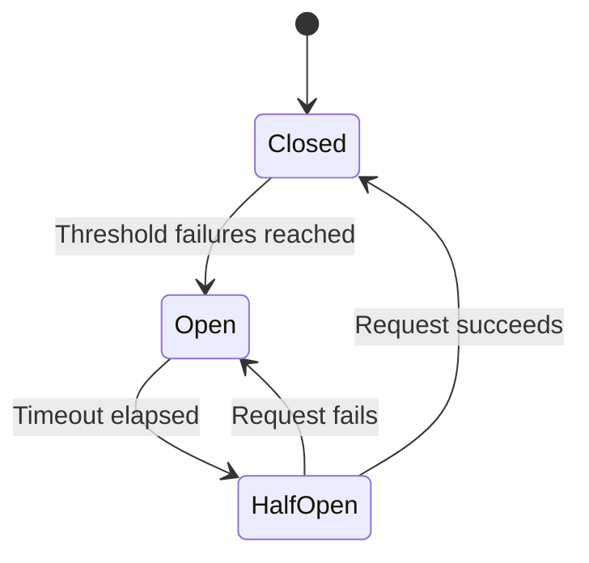

The retry module provides reliability patterns to handle transient network failures and prevent cascading errors.

## Circuit Breaker

The circuit breaker pattern prevents repeated attempts to access a failing service, giving it time to recover.

### States

The circuit breaker has three states:

- **Closed**: Normal operation, all requests allowed
- **Open**: Too many failures, requests blocked immediately
- **Half-Open**: Testing if service recovered, limited requests allowed



---

### `CircuitBreaker`

Thread-safe circuit breaker implementation with atomic state transitions.

```python
class CircuitBreaker:
    def __init__(
        self,
        threshold: int = 5,
        timeout: int = 60
    )
```

**Parameters:**
- `threshold`: Number of failures before opening (default: 5)
- `timeout`: Seconds to wait before testing recovery (default: 60)

**Properties:**
- `state`: Current state ("closed", "open", "half_open")
- `failures`: Current failure count
- `last_failure_time`: Timestamp of last failure

**Example:**
```python
from tif1.retry import CircuitBreaker

cb = CircuitBreaker(threshold=3, timeout=30)

def risky_operation():
    # Your code here
    pass

try:
    result = cb.call(risky_operation)
except Exception as e:
    print(f"Circuit breaker: {cb.state}")
    print(f"Failures: {cb.failures}")
```

---

### `get_circuit_breaker`

Get the global circuit breaker instance used by `tif1`.

```python
def get_circuit_breaker() -> CircuitBreaker
```

**Returns:**
- Global `CircuitBreaker` instance

**Example:**
```python
from tif1.retry import get_circuit_breaker

cb = get_circuit_breaker()
print(f"State: {cb.state}")
print(f"Failures: {cb.failures}")

if cb.last_failure_time:
    print(f"Last failure: {cb.last_failure_time}")
```

---

### `reset_circuit_breaker`

Reset the global circuit breaker to closed state with zero failures.

```python
def reset_circuit_breaker() -> None
```

**Example:**
```python
from tif1.retry import reset_circuit_breaker

# After fixing network issues
reset_circuit_breaker()
print("Circuit breaker reset")
```

---

## Circuit breaker methods

### `call(func, *args, **kwargs)`

Execute a function with circuit breaker protection.

```python
def call(
    func: Callable[..., T],
    *args,
    **kwargs
) -> T
```

**Parameters:**
- `func`: Function to execute
- `*args`: Positional arguments for func
- `**kwargs`: Keyword arguments for func

**Returns:**
- Result from func

**Raises:**
- `Exception`: If circuit breaker is open or func raises

**Example:**
```python
from tif1.retry import get_circuit_breaker

cb = get_circuit_breaker()

def fetch_data(url):
    # Network request
    return data

try:
    result = cb.call(fetch_data, "https://example.com/data.json")
except Exception as e:
    if cb.state == "open":
        print("Circuit breaker is open, service unavailable")
    else:
        print(f"Request failed: {e}")
```

---

### `record_success()`

Manually record a successful operation.

```python
def record_success() -> None
```

**Example:**
```python
cb = get_circuit_breaker()

try:
    # Your operation
    result = fetch_data()
    cb.record_success()
except Exception:
    cb.record_failure()
```

---

### `record_failure()`

Manually record a failed operation.

```python
def record_failure() -> None
```

**Example:**
```python
cb = get_circuit_breaker()

try:
    result = fetch_data()
    cb.record_success()
except NetworkError:
    cb.record_failure()
    raise
```

---

### `check_and_update_state()`

Check current state and update if timeout elapsed.

```python
def check_and_update_state() -> tuple[bool, str]
```

**Returns:**
- Tuple of (should_proceed, current_state)

**Example:**
```python
cb = get_circuit_breaker()

should_proceed, state = cb.check_and_update_state()
if should_proceed:
    # Make request
    pass
else:
    print(f"Circuit breaker is {state}, request blocked")
```

---

## Retry Decorator

### `retry_with_backoff`

Decorator for automatic retry with exponential backoff and jitter.

```python
def retry_with_backoff(
    max_retries: int = 3,
    backoff_factor: float = 2.0,
    jitter: bool = True,
    exceptions: tuple = (Exception,)
)
```

**Parameters:**
- `max_retries`: Maximum retry attempts (default: 3)
- `backoff_factor`: Exponential backoff multiplier (default: 2.0)
- `jitter`: Add random jitter to backoff (default: True)
- `exceptions`: Tuple of exceptions to catch (default: all exceptions)

**Backoff Formula:**
```python
wait_time = backoff_factor**attempt * (0.5 + random()) if jitter else backoff_factor**attempt
```

**Example:**
```python
from tif1.retry import retry_with_backoff
from tif1.exceptions import NetworkError

@retry_with_backoff(max_retries=5, backoff_factor=2.0)
def fetch_data(url):
    # Network request that might fail
    response = requests.get(url)
    response.raise_for_status()
    return response.json()

# Automatically retries up to 5 times with exponential backoff
data = fetch_data("https://example.com/data.json")
```

---

### Custom exception handling

```python
from tif1.retry import retry_with_backoff
from tif1.exceptions import NetworkError, DataNotFoundError

@retry_with_backoff(
    max_retries=3,
    exceptions=(NetworkError,)  # Only retry network errors
)
def fetch_data(url):
    try:
        return requests.get(url).json()
    except requests.ConnectionError as e:
        raise NetworkError(url=url) from e
    except requests.HTTPError as e:
        if e.response.status_code == 404:
            raise DataNotFoundError(url=url) from e
        raise NetworkError(url=url, status_code=e.response.status_code) from e

# Retries on NetworkError, fails immediately on DataNotFoundError
data = fetch_data("https://example.com/data.json")
```

---

## Configuration

Configure circuit breaker and retry behavior via global config:

```python
import tif1

config = tif1.get_config()

# Set circuit breaker threshold
config.set("circuit_breaker_threshold", 10)

# Set circuit breaker timeout
config.set("circuit_breaker_timeout", 120)

# Set retry backoff factor
config.set("retry_backoff_factor", 1.5)

# Enable/disable retry jitter
config.set("retry_jitter", True)

# Save configuration to file
config.save()
```

**Configuration Keys:**

| Key | Type | Default | Description |
| :--- | :--- | :--- | :--- |
| `circuit_breaker_threshold` | `int` | `5` | Failures before opening circuit |
| `circuit_breaker_timeout` | `int` | `60` | Seconds before testing recovery |
| `retry_backoff_factor` | `float` | `2.0` | Exponential backoff multiplier |
| `retry_jitter` | `bool` | `True` | Add random jitter to backoff |
| `max_retry_delay` | `float` | `60.0` | Maximum retry delay in seconds |

---

## Complete Examples

### Monitor circuit breaker

```python
import tif1
from tif1.retry import get_circuit_breaker
import time

def monitor_circuit_breaker():
    """Monitor circuit breaker state during operations."""
    cb = get_circuit_breaker()

    print(f"Initial state: {cb.state}")
    print(f"Failures: {cb.failures}")

    try:
        session = tif1.get_session(2021, "Belgian Grand Prix", "Race")
        laps = session.laps
        print(f"Success! State: {cb.state}")
    except Exception as e:
        print(f"Error: {e}")
        print(f"State: {cb.state}")
        print(f"Failures: {cb.failures}")

        if cb.state == "open":
            print(f"Circuit breaker opened, waiting {cb.timeout}s...")
            time.sleep(cb.timeout)
            print("Retrying...")

monitor_circuit_breaker()
```

---

### Custom retry logic

```python
from tif1.retry import retry_with_backoff, get_circuit_breaker
from tif1.exceptions import NetworkError
import logging

logging.basicConfig(level=logging.INFO)
logger = logging.getLogger(__name__)

@retry_with_backoff(
    max_retries=5,
    backoff_factor=1.5,
    jitter=True,
    exceptions=(NetworkError,)
)
def fetch_with_logging(url):
    """Fetch data with detailed logging."""
    cb = get_circuit_breaker()
    logger.info(f"Fetching {url} (CB state: {cb.state})")

    try:
        # Your fetch logic
        response = requests.get(url, timeout=30)
        response.raise_for_status()
        logger.info(f"Success! (CB failures: {cb.failures})")
        return response.json()
    except requests.RequestException as e:
        logger.warning(f"Request failed: {e}")
        raise NetworkError(url=url) from e

# Usage
data = fetch_with_logging("https://example.com/data.json")
```

---

### Graceful Degradation

```python
import tif1
from tif1.retry import get_circuit_breaker, reset_circuit_breaker
from tif1.exceptions import NetworkError
import time

def load_session_with_fallback(year, gp, session_name):
    """Load session with fallback to cached data."""
    cb = get_circuit_breaker()

    # Check circuit breaker state
    if cb.state == "open":
        print("Circuit breaker open, using cached data only")
        config = tif1.get_config()
        config.set("enable_cache", True)
        # Disable network requests
        return load_from_cache_only(year, gp, session_name)

    try:
        session = tif1.get_session(year, gp, session_name)
        return session
    except NetworkError as e:
        print(f"Network error: {e.message}")

        if cb.state == "open":
            print("Circuit breaker opened, falling back to cache")
            return load_from_cache_only(year, gp, session_name)

        raise

def load_from_cache_only(year, gp, session_name):
    """Load session from cache without network requests."""
    cache = tif1.get_cache()

    # Check if data exists in cache
    if not cache.has_session_data(year, gp, session_name):
        raise ValueError("No cached data available")

    # Load from cache
    session = tif1.get_session(year, gp, session_name)
    return session

# Usage
try:
    session = load_session_with_fallback(2021, "Belgian Grand Prix", "Race")
    print(f"Loaded session: {session.name}")
except Exception as e:
    print(f"Failed to load session: {e}")
```

---

### Retry with Progress

```python
from tif1.retry import retry_with_backoff
from tif1.exceptions import NetworkError
import time

class RetryProgress:
    """Track retry attempts with progress reporting."""

    def __init__(self, max_retries=3):
        self.max_retries = max_retries
        self.attempt = 0

    def __call__(self, func):
        @retry_with_backoff(
            max_retries=self.max_retries,
            exceptions=(NetworkError,)
        )
        def wrapper(*args, **kwargs):
            self.attempt += 1
            print(f"Attempt {self.attempt}/{self.max_retries}")
            try:
                result = func(*args, **kwargs)
                print(f"Success on attempt {self.attempt}")
                return result
            except Exception as e:
                if self.attempt < self.max_retries:
                    print(f"Failed, retrying...")
                else:
                    print(f"Failed after {self.max_retries} attempts")
                raise
        return wrapper

# Usage
@RetryProgress(max_retries=5)
def fetch_data(url):
    # Your fetch logic
    pass

data = fetch_data("https://example.com/data.json")
```

---

## Best Practices

1. **Monitor circuit breaker state**: Check before critical operations.

```python
cb = get_circuit_breaker()
if cb.state == "open":
    # Use fallback or wait
    pass
```

2. **Reset after fixing issues**: Don't wait for timeout if you know service is back.

```python
reset_circuit_breaker()
```

3. **Use appropriate thresholds**: Higher for transient errors, lower for persistent failures.

```python
config.set("circuit_breaker_threshold", 10)  # More tolerant
```python

4. **Add jitter to retries**: Prevents thundering herd problem.

```python
@retry_with_backoff(jitter=True)
def fetch_data():
    pass
```python

5. **Log retry attempts**: Helps diagnose network issues.

```python
import logging
logging.basicConfig(level=logging.WARNING)
```python

6. **Catch specific exceptions**: Don't retry on client errors (4xx).

```python
@retry_with_backoff(exceptions=(NetworkError,))
def fetch_data():
    pass
```python

7. **Implement fallbacks**: Use cached data when circuit breaker opens.

8. **Test circuit breaker behavior**: Verify it works as expected.

```python
def test_circuit_breaker():
    cb = CircuitBreaker(threshold=2, timeout=5)

    # Trigger failures
    for i in range(3):
        try:
            cb.call(lambda: 1/0)
        except:
            pass

    assert cb.state == "open"
    print("Circuit breaker test passed")
```

---

## Troubleshooting

### Circuit breaker stuck open

```python
from tif1.retry import get_circuit_breaker, reset_circuit_breaker

cb = get_circuit_breaker()
print(f"State: {cb.state}")
print(f"Failures: {cb.failures}")

if cb.state == "open":
    # Wait for timeout or reset manually
    reset_circuit_breaker()
```

### Too many retries

Adjust the `max_retries` parameter when using the `@retry_with_backoff` decorator:

```python
@retry_with_backoff(max_retries=2)  # Reduce from default of 3
def fetch_data():
    pass
```

### Slow retries

Reduce the backoff factor globally or per-function:

```python
# Global configuration
config = tif1.get_config()
config.set("retry_backoff_factor", 1.5)

# Or per-function
@retry_with_backoff(backoff_factor=1.5)  # Instead of 2.0
def fetch_data():
    pass
```

### Circuit breaker too sensitive

```python
# Increase threshold
config = tif1.get_config()
config.set("circuit_breaker_threshold", 10)
```
