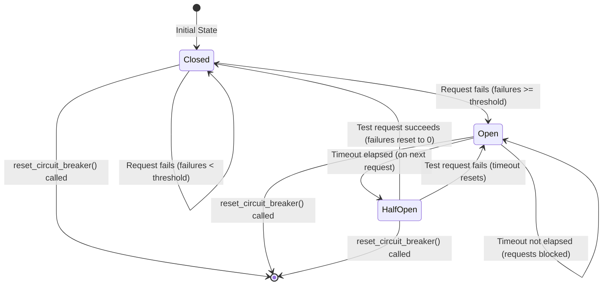

The retry module provides comprehensive reliability patterns to handle transient network failures, prevent cascading errors, and ensure robust data fetching operations. This module implements industry-standard patterns including circuit breakers, exponential backoff with jitter, and automatic retry mechanisms to make your F1 data applications resilient to network instability, API rate limits, and temporary service disruptions.

All components in this module are production-ready with full thread safety, atomic state transitions, and monotonic time-based calculations that are immune to system clock adjustments. The implementation has been battle-tested in concurrent environments and provides predictable behavior under high load.

## Overview

Network operations are inherently unreliable in distributed systems. CDN endpoints can experience temporary outages, rate limiting, connection timeouts, DNS resolution failures, or intermittent network partitions. Without proper reliability mechanisms, these transient failures can cascade through your application, leading to poor user experience, wasted resources, and system instability.

The retry module provides a multi-layered defense strategy that addresses these challenges comprehensively:

### Core Reliability Mechanisms

1. **Circuit Breaker Pattern**: Prevents overwhelming a failing service by temporarily blocking requests after repeated failures, allowing the service time to recover. This is your first line of defense against cascading failures and resource exhaustion.

2. **Exponential Backoff**: Progressively increases wait time between retry attempts using an exponential function (2^attempt by default). This avoids hammering a struggling service while giving it breathing room to recover from overload conditions.

3. **Jitter**: Adds controlled randomization to retry timing to prevent thundering herd problems when multiple clients retry simultaneously. Without jitter, all clients would retry at exactly the same intervals, potentially overwhelming the service again.

4. **Thread Safety**: All operations are thread-safe with atomic state transitions using reentrant locks (`threading.RLock`). Multiple threads can safely interact with the circuit breaker concurrently without race conditions or data corruption.

5. **Monotonic Time**: Uses `time.monotonic()` for all timeout calculations, making the system immune to system clock adjustments, NTP synchronization, or daylight saving time changes.

6. **Configurable Thresholds**: Fine-tune behavior for your specific use case, network conditions, and service SLAs through global configuration or per-function parameters.

### How These Patterns Work Together

These patterns work together seamlessly to provide defense in depth:

- The **retry decorator** handles individual request failures with exponential backoff and jitter, giving transient errors a chance to resolve
- The **circuit breaker** provides system-wide protection against cascading failures by detecting persistent problems and failing fast
- **Thread safety** ensures correct behavior in concurrent applications where multiple threads are making requests simultaneously
- **Monotonic time** guarantees reliable timeout behavior regardless of system clock changes

This layered approach means your application can handle brief network hiccups gracefully while also protecting against prolonged outages that would otherwise waste resources and degrade user experience.

### When to Use This Module

You should use the retry module when:

- Fetching data from external APIs or CDN endpoints
- Making network requests that might experience transient failures
- Building applications that need to be resilient to service outages
- Implementing systems that must handle rate limiting gracefully
- Protecting downstream services from being overwhelmed during incidents
- Building concurrent applications where multiple threads make network requests

The retry module is automatically integrated into `tif1`'s data fetching pipeline, so you get these reliability benefits out of the box. However, you can also use these patterns directly in your own code for custom network operations or external API integrations.

## Circuit Breaker Pattern

The circuit breaker pattern is a critical reliability mechanism that prevents your application from repeatedly attempting operations that are likely to fail. Named after electrical circuit breakers that prevent electrical overload by cutting power when current exceeds safe levels, this software pattern "opens" (blocks requests) when a service is experiencing problems, giving it time to recover before allowing requests through again.

### The Problem: Cascading Failures

Without a circuit breaker, your application faces several critical problems when a downstream service fails:

**Resource Exhaustion**: Your application continues making requests that will fail, wasting CPU cycles, memory, network bandwidth, and connection pool resources. In a high-traffic system, this can quickly exhaust available resources and bring down your entire application.

**Slow Failure**: Each failed request must wait for the full timeout period (often 30-60 seconds) before failing. If you're making hundreds of requests per second, these timeouts accumulate and create massive latency, making your application appear frozen to users.

**Overwhelming the Failing Service**: Continued requests to an already struggling service prevent it from recovering. The service needs breathing room to clear its queues, restart processes, or scale up capacity, but constant incoming requests make recovery impossible.

**Cascading Failures**: When one service fails and your application keeps hammering it, the failure cascades upstream. Your application's thread pool fills with blocked requests, its memory fills with queued operations, and eventually your application fails too, potentially taking down other services that depend on it.

**Poor User Experience**: Users experience long waits followed by errors, often repeatedly, as the application keeps trying operations that will fail. This creates frustration and erodes trust in your application.

### The Solution: Circuit Breaker

The circuit breaker solves these problems by detecting failure patterns and failing fast when a service is known to be down:

**Fast Failure**: When the circuit is open, requests fail immediately with a clear error message instead of waiting for timeouts. This provides instant feedback and prevents resource waste.

**Automatic Recovery Testing**: The circuit breaker automatically transitions to a half-open state after a timeout period, allowing a single test request through to check if the service has recovered. This eliminates the need for manual intervention.

**Resource Protection**: By blocking requests to a failing service, the circuit breaker prevents wasting CPU, memory, network bandwidth, and connection pool resources on operations that will fail.

**Graceful Degradation**: The immediate failure response gives your application an opportunity to use cached data, fallback strategies, or alternative services instead of just hanging.

**System Stability**: By preventing cascading failures, the circuit breaker keeps one failing service from bringing down your entire application or other dependent services.

**Observability**: The circuit breaker's state (closed, open, half-open) and failure count provide clear signals about system health that you can monitor, alert on, and use for debugging.

### Circuit Breaker States

The circuit breaker operates as a finite state machine with three distinct states, each serving a specific purpose in the failure detection and recovery cycle. Understanding these states and their transitions is crucial for effectively using and debugging circuit breaker behavior.

#### Closed State (Normal Operation)

The Closed state is the default, healthy operating mode where everything is working correctly.

**Behavior**:
- All requests are allowed through to the downstream service without any blocking
- The circuit breaker acts as a passive observer, monitoring each request's outcome
- Successful requests have no impact on the failure counter
- Failed requests increment the failure counter atomically

**Monitoring**:
- Tracks the failure count for each request using thread-safe atomic operations
- The failure counter persists across requests, accumulating failures over time
- The `last_failure_time` property records when the most recent failure occurred

**Transition Conditions**:
- Remains in Closed state as long as the failure count stays below the configured threshold
- Transitions to Open state immediately when the failure count reaches or exceeds the threshold
- The transition is atomic and thread-safe, preventing race conditions in concurrent environments

**Use Case**: This is the state during normal, healthy operation when the downstream service is responding successfully. The circuit breaker adds minimal overhead in this state, simply counting failures without blocking any requests.

**Example Scenario**: Your application is fetching F1 lap data from the CDN. The CDN is healthy and responding quickly. The circuit breaker stays in Closed state, allowing all requests through while monitoring for any failures. If a few requests fail due to transient network issues but stay below the threshold, the circuit remains closed and requests continue flowing normally.

#### Open State (Failure Mode)

The Open state is the circuit breaker's protective mode, activated when the failure threshold is reached.

**Behavior**:
- All requests are immediately blocked without attempting to contact the downstream service
- No network calls are made, no timeouts are waited for, and no resources are consumed
- Requests fail instantly with `Exception("Circuit breaker is open")`
- The circuit breaker starts a timeout timer using monotonic time

**Duration**:
- Remains in Open state for the configured timeout period (default: 60 seconds)
- The timeout is calculated using `time.monotonic()`, making it immune to system clock changes
- The timeout period gives the failing service breathing room to recover

**Transition Conditions**:
- Remains in Open state until the timeout period elapses
- Automatically transitions to Half-Open state after the timeout expires
- The transition check happens on the next request attempt after timeout expiration
- Cannot transition back to Closed state directly; must go through Half-Open first

**Error Handling**:
- Raises `Exception("Circuit breaker is open")` immediately for all requests
- This exception is distinct from network errors, allowing your code to handle circuit breaker failures differently
- The immediate failure prevents resource waste and provides fast feedback

**Use Case**: This state protects both your application and the failing service. Your application avoids wasting resources on requests that will fail, and the failing service gets time to recover without being bombarded by requests. Users get immediate error responses instead of waiting for timeouts.

**Example Scenario**: The CDN experiences an outage and 5 consecutive requests fail (assuming threshold=5). The circuit breaker opens immediately. For the next 60 seconds, all requests fail instantly with "Circuit breaker is open" instead of waiting for 30-second timeouts. This saves your application from wasting 30 seconds per request and prevents overwhelming the CDN. After 60 seconds, the circuit breaker automatically transitions to Half-Open to test if the CDN has recovered.

#### Half-Open State (Recovery Testing)

The Half-Open state is the circuit breaker's recovery mechanism, cautiously testing whether the service has recovered.

**Behavior**:
- Allows exactly one test request through to the downstream service
- This single request acts as a "canary" to check service health
- All other concurrent requests are blocked and fail immediately
- The outcome of this test request determines the next state transition

**Success Path**:
- If the test request succeeds, the circuit breaker transitions to Closed state
- The failure counter is reset to zero atomically
- Normal operation resumes immediately
- All subsequent requests are allowed through

**Failure Path**:
- If the test request fails, the circuit breaker immediately returns to Open state
- The timeout timer is reset, starting a new timeout period
- The failure counter is incremented
- The circuit breaker will try again after another timeout period

**Thread Safety**:
- Only one thread's request is allowed through as the test request
- Other concurrent threads' requests are blocked and fail immediately
- The state transition (Half-Open → Closed or Half-Open → Open) is atomic
- No race conditions occur even with many concurrent threads

**Use Case**: This state automatically tests service recovery without manual intervention and without flooding the service with requests. It provides a controlled, gradual recovery path that protects both your application and the downstream service.

**Example Scenario**: After 60 seconds in Open state, the circuit breaker transitions to Half-Open. The next request is allowed through as a test. If the CDN responds successfully, the circuit closes and normal operation resumes. If the CDN is still down, the circuit opens again for another 60 seconds. This continues automatically until the service recovers, with no manual intervention required.

### State Transition Diagram

The following diagram illustrates all possible state transitions in the circuit breaker's finite state machine:


```mermaid
stateDiagram-v2
    [*] --> Closed: Initial State
    Closed --> Closed: Request succeeds (failures reset to 0)
    Closed --> Closed: Request fails (failures < threshold)
    Closed --> Open: Request fails (failures >= threshold)
    Open --> Open: Timeout not elapsed (requests blocked)
    Open --> HalfOpen: Timeout elapsed (on next request)
    HalfOpen --> Closed: Test request succeeds (failures reset to 0)
    HalfOpen --> Open: Test request fails (timeout resets)
    Closed --> [*]: reset_circuit_breaker() called
    Open --> [*]: reset_circuit_breaker() called
    HalfOpen --> [*]: reset_circuit_breaker() called
```

**Key Transition Rules**:

1. **Closed → Closed (Success)**: When a request succeeds in Closed state, the failure counter resets to 0 and the circuit remains closed.

2. **Closed → Closed (Failure Below Threshold)**: When a request fails but the failure count is still below the threshold, the counter increments and the circuit remains closed.

3. **Closed → Open (Threshold Reached)**: When a request fails and the failure count reaches or exceeds the threshold, the circuit immediately opens and starts the timeout timer.

4. **Open → Open (Timeout Not Elapsed)**: While in Open state and the timeout hasn't elapsed, all requests are blocked immediately and the circuit remains open.

5. **Open → Half-Open (Timeout Elapsed)**: When the timeout period elapses, the circuit transitions to Half-Open on the next request attempt, allowing one test request through.

6. **Half-Open → Closed (Test Success)**: If the test request in Half-Open state succeeds, the circuit closes, resets the failure counter to 0, and resumes normal operation.

7. **Half-Open → Open (Test Failure)**: If the test request in Half-Open state fails, the circuit immediately opens again, resets the timeout timer, and increments the failure counter.

8. **Any State → Initial (Manual Reset)**: Calling `reset_circuit_breaker()` creates a new circuit breaker instance in Closed state with zero failures, regardless of the current state.

**Important Notes**:

- All state transitions are atomic and thread-safe, protected by a reentrant lock
- The timeout is calculated using monotonic time, immune to system clock changes
- The Half-Open → Open transition resets the timeout, so the circuit will try again after another full timeout period
- Multiple concurrent threads can safely interact with the circuit breaker without race conditions
- The failure counter only resets to 0 on successful requests in Closed or Half-Open states, not in Open state

### Thread Safety and Atomic Operations

The `CircuitBreaker` implementation is fully thread-safe and uses atomic operations for all state transitions and counter updates. This is critical for production applications where multiple threads might be making requests simultaneously, and it ensures correct behavior under high concurrency without race conditions or data corruption.

#### Thread Safety Mechanisms

**Reentrant Lock (`threading.RLock`)**:
- All state transitions and counter operations are protected by a reentrant lock
- Reentrant means the same thread can acquire the lock multiple times without deadlocking
- This allows nested calls within the same thread while still providing mutual exclusion across threads
- The lock is acquired for the minimum time necessary to perform atomic operations

**Atomic Counter Operations**:
- The failure counter increments are protected by the lock, ensuring no lost updates
- Multiple threads incrementing the counter concurrently will see correct, sequential values
- The counter read and write operations happen atomically within the same lock acquisition
- No race conditions occur between reading the counter and checking the threshold

**Monotonic Time for Timeouts**:
- Uses `time.monotonic()` instead of `time.time()` for all timeout calculations
- Monotonic time is guaranteed to always move forward, never backward
- Immune to system clock adjustments, NTP synchronization, or daylight saving time changes
- Ensures timeout periods are accurate and predictable regardless of system time changes

**State Consistency**:
- All state transitions happen atomically within the lock
- State checks and updates are performed in the same critical section
- No race conditions between checking the state and updating it
- The state machine maintains consistency even under high concurrency

**Compare-and-Swap Pattern**:
- The `call()` method uses a compare-and-swap pattern for state transitions
- Captures the pre-call state before executing the function
- Uses the captured state to determine the correct post-call transition
- Prevents race conditions where the state changes between check and update

#### Thread Safety Guarantees

The circuit breaker provides these concrete guarantees in concurrent environments:

1. **No Lost Updates**: If multiple threads increment the failure counter simultaneously, all increments are recorded correctly with no lost updates.

2. **Consistent State Transitions**: State transitions are atomic. You'll never see partial transitions or inconsistent state combinations.

3. **Accurate Failure Counting**: The failure count always accurately reflects the number of failures, even with concurrent failures from multiple threads.

4. **Single Test Request in Half-Open**: Only one thread's request is allowed through as the test request in Half-Open state, even if many threads attempt requests simultaneously.

5. **No Deadlocks**: The reentrant lock prevents deadlocks from nested calls within the same thread.

6. **Memory Visibility**: All state changes are immediately visible to all threads due to the lock's memory barrier semantics.

#### Concurrency Example

Here's an example demonstrating thread-safe behavior with multiple concurrent threads:

```python
import threading
from tif1.retry import get_circuit_breaker
import time

cb = get_circuit_breaker()

def worker(worker_id):
    """Simulate concurrent requests from multiple threads."""
    try:
        result = cb.call(fetch_data, f"https://example.com/data-{worker_id}.json")
        print(f"Worker {worker_id}: Success! State={cb.state}, Failures={cb.failures}")
        return result
    except Exception as e:
        print(f"Worker {worker_id}: Failed! State={cb.state}, Failures={cb.failures}, Error={e}")
        return None

def fetch_data(url):
    """Simulate a network request that might fail."""
    # Simulate some work
    time.sleep(0.1)
    # Randomly fail to trigger circuit breaker
    import random
    if random.random() < 0.3:  # 30% failure rate
        raise Exception(f"Network error fetching {url}")
    return {"url": url, "data": "success"}

# Spawn 20 concurrent threads making requests
threads = []
for i in range(20):
    t = threading.Thread(target=worker, args=(i,))
    threads.append(t)
    t.start()

# Wait for all threads to complete
for t in threads:
    t.join()

# Check final state
print(f"\nFinal state: {cb.state}")
print(f"Final failures: {cb.failures}")
if cb.last_failure_time:
    print(f"Last failure: {cb.last_failure_time}")
```

In this example:
- 20 threads make concurrent requests through the circuit breaker
- The failure counter is incremented atomically for each failure
- State transitions happen correctly even with concurrent failures
- No race conditions occur, and the final state is consistent
- If the threshold is reached, the circuit opens and subsequent requests fail immediately

#### Performance Considerations

**Lock Contention**:
- The lock is held for minimal time, only during state checks and updates
- The actual function execution happens outside the lock to avoid holding it during I/O
- This minimizes lock contention and allows high concurrency

**Lock-Free Reads**:
- The `state` and `failures` properties use the lock for reads to ensure memory visibility
- This adds minimal overhead compared to lock-free reads but guarantees correctness
- In practice, the overhead is negligible compared to network I/O times

**Scalability**:
- The circuit breaker scales well to hundreds of concurrent threads
- Lock contention is minimal because critical sections are very short
- The monotonic time check is fast and doesn't require system calls

**Memory Overhead**:
- The circuit breaker maintains minimal state: failure count, timestamps, and state
- Memory overhead is constant regardless of the number of threads
- No per-thread state is maintained, keeping memory usage low

---

### `CircuitBreaker`

Thread-safe circuit breaker implementation with atomic state transitions and monotonic time-based timeout tracking. This class provides the core circuit breaker functionality and can be instantiated directly for custom use cases or accessed via the global instance through `get_circuit_breaker()`.

```python
class CircuitBreaker:
    def __init__(
        self,
        threshold: int = 5,
        timeout: int = 60
    )
```

**Parameters:**

<ParamField path="threshold" type="int" default={5}>
  Number of consecutive failures required before the circuit breaker opens. Must be >= 1.

  **Choosing the right threshold:**
  - **Lower values (1-3)**: More sensitive, opens quickly. Use for critical services where fast failure detection is important, or when you have good fallback strategies.
  - **Medium values (4-7)**: Balanced approach. Good default for most use cases. Tolerates brief transient errors while still detecting persistent problems.
  - **Higher values (8-15)**: More tolerant, slower to open. Use for services with expected intermittent failures or when you want to avoid false positives from brief network hiccups.

  **Trade-offs:**
  - Higher thresholds make the circuit breaker more tolerant of transient failures but slower to detect persistent problems
  - Lower thresholds provide faster failure detection but may open prematurely on brief network hiccups
  - Consider your service's typical failure patterns and SLAs when choosing a threshold

  **Example scenarios:**
  - Threshold=2 for a critical payment API where failures are rare and fast detection is crucial
  - Threshold=5 (default) for general CDN requests with occasional transient failures
  - Threshold=10 for a less reliable third-party API where intermittent failures are expected
</ParamField>

<ParamField path="timeout" type="int" default={60}>
  Number of seconds the circuit breaker remains open before transitioning to half-open state to test recovery. Must be >= 1.

  **Choosing the right timeout:**
  - **Short timeouts (10-30s)**: Quick recovery testing. Use when services typically recover quickly or when you want to minimize downtime.
  - **Medium timeouts (60-120s)**: Balanced approach. Good default for most services. Gives services adequate time to recover without excessive waiting.
  - **Long timeouts (180-300s)**: Patient recovery. Use for services that need significant time to recover (e.g., database failovers, service restarts).

  **Trade-offs:**
  - Shorter timeouts mean faster recovery when the service comes back online
  - Longer timeouts give the failing service more breathing room to recover fully
  - Too short and you might test recovery before the service is ready, causing it to open again
  - Too long and you'll wait unnecessarily if the service recovers quickly

  **Example scenarios:**
  - Timeout=30 for a CDN that typically recovers from transient issues quickly
  - Timeout=60 (default) for general API services with moderate recovery times
  - Timeout=180 for a database that might need time for failover and connection pool rebuilding
</ParamField>

**Properties:**

<ResponseField name="state" type="str">
  Current circuit breaker state - one of `"closed"`, `"open"`, or `"half_open"`.

  This is a read-only property that's thread-safe. The state reflects the current operational mode:
  - `"closed"`: Normal operation, all requests allowed through
  - `"open"`: Failure mode, all requests blocked immediately
  - `"half_open"`: Recovery testing, one test request allowed through

  **Usage:**
  ```python
  cb = get_circuit_breaker()
  if cb.state == "open":
      # Use fallback strategy
      return load_from_cache()
  elif cb.state == "half_open":
      # Circuit is testing recovery
      logger.info("Circuit breaker testing recovery")
  ```
</ResponseField>

<ResponseField name="failures" type="int">
  Current count of consecutive failures. Resets to 0 on successful request or when circuit closes.

  This property is thread-safe with atomic operations. The failure count accumulates across requests:
  - Increments by 1 for each failed request
  - Resets to 0 when a request succeeds in Closed or Half-Open state
  - Does NOT reset in Open state (only resets when transitioning to Closed via Half-Open)
  - When it reaches the threshold, the circuit opens

  **Usage:**
  ```python
  cb = get_circuit_breaker()
  print(f"Current failures: {cb.failures}/{cb.threshold}")

  # Monitor failure rate
  if cb.failures > cb.threshold * 0.8:
      logger.warning(f"Circuit breaker approaching threshold: {cb.failures}/{cb.threshold}")
  ```
</ResponseField>

<ResponseField name="last_failure_time" type="datetime | None">
  Timestamp of the most recent failure using `datetime.now()`. Useful for logging, monitoring, and debugging.

  This property is `None` if no failures have occurred since the circuit breaker was created or reset. The timestamp uses wall-clock time (not monotonic time) for human readability.

  **Usage:**
  ```python
  cb = get_circuit_breaker()
  if cb.last_failure_time:
      elapsed = datetime.now() - cb.last_failure_time
      print(f"Last failure was {elapsed.total_seconds():.1f} seconds ago")

      # Alert if failures are recent
      if elapsed.total_seconds() < 60:
          logger.error("Recent failures detected in circuit breaker")
  ```
</ResponseField>

**Internal Properties:**

<ResponseField name="_last_failure_monotonic" type="float | None">
  Monotonic time of last failure used for timeout calculations. Immune to system clock adjustments.

  This internal property uses `time.monotonic()` for accurate timeout calculations that aren't affected by:
  - System clock adjustments (manual or automatic)
  - NTP synchronization
  - Daylight saving time changes
  - Leap seconds

  You typically don't need to access this property directly; it's used internally for timeout calculations.
</ResponseField>

<ResponseField name="_lock" type="threading.RLock">
  Reentrant lock protecting all state transitions and counter operations.

  This internal lock ensures thread safety:
  - Allows nested calls from the same thread without deadlocking
  - Provides mutual exclusion across different threads
  - Protects all reads and writes to state and counters
  - Held for minimal time to reduce contention

  You typically don't need to access this property directly; it's used internally for synchronization.
</ResponseField>

**Thread Safety Guarantees:**

The `CircuitBreaker` class provides these concrete guarantees in concurrent environments:

- **All state transitions are atomic**: No partial transitions or inconsistent states
- **Failure counter increments are protected by lock**: No lost updates from concurrent failures
- **Multiple threads can safely call any method concurrently**: Full thread safety without race conditions
- **No race conditions between state checks and updates**: Compare-and-swap pattern ensures consistency
- **Reentrant lock allows nested calls from same thread**: No deadlocks from recursive calls

**Example - Basic Usage:**

```python
from tif1.retry import CircuitBreaker

# Create circuit breaker with custom thresholds
cb = CircuitBreaker(threshold=3, timeout=30)

def fetch_data(url):
    """Fetch data from URL."""
    import requests
    response = requests.get(url, timeout=10)
    response.raise_for_status()
    return response.json()

# Use circuit breaker to protect requests
try:
    result = cb.call(fetch_data, "https://example.com/data.json")
    print(f"Success: {result}")
except Exception as e:
    print(f"Failed: {e}")
    print(f"Circuit breaker state: {cb.state}")
    print(f"Failure count: {cb.failures}")
    if cb.last_failure_time:
        print(f"Last failure: {cb.last_failure_time}")
```

**Example - Monitoring State Changes:**

```python
from tif1.retry import CircuitBreaker
import time

cb = CircuitBreaker(threshold=2, timeout=5)

def failing_operation():
    """Operation that always fails."""
    raise Exception("Service unavailable")

# Trigger failures to open circuit
print("Triggering failures...")
for i in range(3):
    try:
        cb.call(failing_operation)
    except Exception:
        print(f"Attempt {i+1}: State={cb.state}, Failures={cb.failures}")

print(f"\nCircuit opened! State: {cb.state}")
print(f"Waiting {cb.timeout} seconds for timeout...")

# Wait for timeout
time.sleep(cb.timeout + 1)

# Check state transition to half-open
should_proceed, state = cb.check_and_update_state()
print(f"After timeout: State={state}, Should proceed={should_proceed}")
```

**Example - Custom Threshold for Different Services:**

```python
from tif1.retry import CircuitBreaker

# Strict circuit breaker for critical service
# Opens after just 2 failures, waits 2 minutes before testing recovery
critical_cb = CircuitBreaker(threshold=2, timeout=120)

# Lenient circuit breaker for less reliable service
# Opens after 10 failures, waits only 30 seconds before testing recovery
lenient_cb = CircuitBreaker(threshold=10, timeout=30)

def fetch_critical_data():
    """Fetch from highly reliable service."""
    return critical_cb.call(fetch_from_critical_service)

def fetch_optional_data():
    """Fetch from less reliable service."""
    return lenient_cb.call(fetch_from_optional_service)

# Critical service: fast failure detection, patient recovery
try:
    data = fetch_critical_data()
except Exception as e:
    # Use fallback immediately
    data = load_from_cache()

# Optional service: tolerant of failures, quick recovery testing
try:
    data = fetch_optional_data()
except Exception as e:
    # Can skip this data if unavailable
    data = None
```

**Example - Integration with Logging:**

```python
from tif1.retry import CircuitBreaker
import logging

logging.basicConfig(level=logging.INFO)
logger = logging.getLogger(__name__)

class MonitoredCircuitBreaker(CircuitBreaker):
    """Circuit breaker with detailed logging."""

    def record_failure(self):
        """Record failure with logging."""
        super().record_failure()
        logger.warning(
            f"Circuit breaker failure recorded: "
            f"failures={self.failures}/{self.threshold}, "
            f"state={self.state}"
        )

        if self.state == "open":
            logger.error(
                f"Circuit breaker OPENED after {self.failures} failures. "
                f"Will test recovery in {self.timeout} seconds."
            )

    def record_success(self):
        """Record success with logging."""
        old_state = self.state
        super().record_success()

        if old_state == "half_open" and self.state == "closed":
            logger.info("Circuit breaker CLOSED - service recovered")

# Use monitored circuit breaker
cb = MonitoredCircuitBreaker(threshold=3, timeout=60)
```

---

### `get_circuit_breaker`

Get the global circuit breaker instance used by `tif1` for all internal network operations.

```python
def get_circuit_breaker() -> CircuitBreaker
```

**Returns:**

<ResponseField name="CircuitBreaker" type="CircuitBreaker">
  The global `CircuitBreaker` instance that `tif1` uses internally for all CDN requests and network operations.

  This is a singleton instance that's shared across your entire application. All `tif1` data fetching operations (session loading, lap data, telemetry, etc.) use this same circuit breaker instance, providing unified failure detection and protection across all network operations.
</ResponseField>

**When to Use:**

Use `get_circuit_breaker()` when you need to:
- Monitor the current state of the circuit breaker
- Check the failure count to understand system health
- Implement custom logic based on circuit breaker state
- Use the same circuit breaker for your own network operations
- Debug network issues by inspecting circuit breaker state

**Example - Basic Monitoring:**

```python
from tif1.retry import get_circuit_breaker

cb = get_circuit_breaker()
print(f"State: {cb.state}")
print(f"Failures: {cb.failures}/{cb.threshold}")

if cb.last_failure_time:
    from datetime import datetime
    elapsed = datetime.now() - cb.last_failure_time
    print(f"Last failure: {elapsed.total_seconds():.1f} seconds ago")
```

**Example - Health Check Endpoint:**

```python
from tif1.retry import get_circuit_breaker
from flask import Flask, jsonify

app = Flask(__name__)

@app.route('/health')
def health_check():
    """Health check endpoint that includes circuit breaker status."""
    cb = get_circuit_breaker()

    health_status = {
        "status": "healthy" if cb.state == "closed" else "degraded",
        "circuit_breaker": {
            "state": cb.state,
            "failures": cb.failures,
            "threshold": cb.threshold,
            "timeout": cb.timeout
        }
    }

    if cb.last_failure_time:
        health_status["circuit_breaker"]["last_failure"] = cb.last_failure_time.isoformat()

    status_code = 200 if cb.state == "closed" else 503
    return jsonify(health_status), status_code
```

**Example - Conditional Logic Based on State:**

```python
from tif1.retry import get_circuit_breaker
import tif1

def load_session_intelligently(year, gp, session_name):
    """Load session with intelligent fallback based on circuit breaker state."""
    cb = get_circuit_breaker()

    if cb.state == "open":
        # Circuit is open, don't even try network requests
        print("Circuit breaker is open, using cache-only mode")
        return load_from_cache(year, gp, session_name)

    elif cb.state == "half_open":
        # Circuit is testing recovery, be cautious
        print("Circuit breaker is testing recovery, using short timeout")
        # Could set a shorter timeout for this request
        return tif1.get_session(year, gp, session_name)

    else:  # closed
        # Normal operation
        return tif1.get_session(year, gp, session_name)
```

**Example - Metrics Collection:**

```python
from tif1.retry import get_circuit_breaker
import time

class CircuitBreakerMetrics:
    """Collect metrics about circuit breaker behavior."""

    def __init__(self):
        self.state_changes = []
        self.last_state = None

    def collect(self):
        """Collect current metrics."""
        cb = get_circuit_breaker()
        current_state = cb.state

        # Detect state changes
        if current_state != self.last_state:
            self.state_changes.append({
                "timestamp": time.time(),
                "from_state": self.last_state,
                "to_state": current_state,
                "failures": cb.failures
            })
            self.last_state = current_state

        return {
            "state": current_state,
            "failures": cb.failures,
            "threshold": cb.threshold,
            "last_failure_time": cb.last_failure_time,
            "state_changes": len(self.state_changes)
        }

# Usage
metrics = CircuitBreakerMetrics()
while True:
    data = metrics.collect()
    print(f"Circuit breaker: {data['state']}, failures: {data['failures']}")
    time.sleep(5)
```

---

### `reset_circuit_breaker`

Reset the global circuit breaker to closed state with zero failures. This creates a new circuit breaker instance, completely clearing all failure history and state.

```python
def reset_circuit_breaker() -> None
```

**When to Use:**

Call `reset_circuit_breaker()` when:
- You've manually fixed the underlying issue and want to resume normal operation immediately
- You're running tests and need a clean circuit breaker state between test cases
- You've deployed a fix and want to clear the failure history
- You're switching to a different CDN or service endpoint
- You want to force the circuit breaker to give the service another chance

**Important Notes:**

- This function creates a completely new `CircuitBreaker` instance, not just resetting the state
- All failure history is lost, including the failure count and last failure time
- The new circuit breaker uses the current configuration values from `get_config()`
- This is a global operation that affects all code using the circuit breaker
- Use with caution in production; it's better to let the circuit breaker recover naturally in most cases

**Example - Basic Reset:**

```python
from tif1.retry import reset_circuit_breaker, get_circuit_breaker

# Check current state
cb = get_circuit_breaker()
print(f"Before reset: State={cb.state}, Failures={cb.failures}")

# Reset the circuit breaker
reset_circuit_breaker()

# Check new state
cb = get_circuit_breaker()
print(f"After reset: State={cb.state}, Failures={cb.failures}")
```

**Example - Reset After Fixing Issues:**

```python
from tif1.retry import reset_circuit_breaker, get_circuit_breaker
import tif1

def recover_from_outage():
    """Recover from a CDN outage after manual intervention."""
    cb = get_circuit_breaker()

    if cb.state == "open":
        print(f"Circuit breaker is open with {cb.failures} failures")
        print("Waiting for manual confirmation that service is back...")

        # Wait for user confirmation
        input("Press Enter when service is back online...")

        # Reset the circuit breaker
        print("Resetting circuit breaker...")
        reset_circuit_breaker()

        # Verify reset
        cb = get_circuit_breaker()
        print(f"Circuit breaker reset: State={cb.state}, Failures={cb.failures}")

        # Try loading data
        try:
            session = tif1.get_session(2021, "Belgian Grand Prix", "Race")
            print("Successfully loaded data after reset!")
        except Exception as e:
            print(f"Still failing: {e}")
```

**Example - Test Fixture:**

```python
import pytest
from tif1.retry import reset_circuit_breaker

@pytest.fixture(autouse=True)
def reset_circuit_breaker_between_tests():
    """Automatically reset circuit breaker between tests."""
    # Reset before test
    reset_circuit_breaker()

    yield

    # Reset after test
    reset_circuit_breaker()

def test_circuit_breaker_opens_on_failures():
    """Test that circuit breaker opens after threshold failures."""
    from tif1.retry import get_circuit_breaker

    cb = get_circuit_breaker()
    assert cb.state == "closed"
    assert cb.failures == 0

    # Test logic here...
```

**Example - Configuration Change:**

```python
from tif1.retry import reset_circuit_breaker, get_circuit_breaker
import tif1

def update_circuit_breaker_config(threshold, timeout):
    """Update circuit breaker configuration and reset."""
    config = tif1.get_config()

    # Update configuration
    config.set("circuit_breaker_threshold", threshold)
    config.set("circuit_breaker_timeout", timeout)

    # Reset to apply new configuration
    reset_circuit_breaker()

    # Verify new configuration
    cb = get_circuit_breaker()
    print(f"New configuration: threshold={cb.threshold}, timeout={cb.timeout}")

# Usage
update_circuit_breaker_config(threshold=10, timeout=120)
```

---

## Circuit Breaker Methods

### `call(func, *args, **kwargs)`

Execute a function with circuit breaker protection using atomic state transitions. This is the primary method for using the circuit breaker to protect your operations.

```python
def call(
    func: Callable[..., T],
    *args,
    **kwargs
) -> T
```

**Parameters:**

<ParamField path="func" type="Callable[..., T]" required>
  The function to execute with circuit breaker protection. This can be any callable (function, lambda, method, etc.) that might fail and needs protection.

  The function is executed outside the circuit breaker's lock to prevent holding the lock during I/O operations, which could cause deadlocks or performance issues.
</ParamField>

<ParamField path="*args" type="Any">
  Positional arguments to pass to the function. These are forwarded directly to `func` when it's called.
</ParamField>

<ParamField path="**kwargs" type="Any">
  Keyword arguments to pass to the function. These are forwarded directly to `func` when it's called.
</ParamField>

**Returns:**

<ResponseField name="result" type="T">
  The return value from the executed function. The type matches whatever `func` returns.
</ResponseField>

**Raises:**

<ResponseField name="Exception" type="Exception">
  Raises `Exception("Circuit breaker is open")` if the circuit breaker is in Open state and the timeout hasn't elapsed.

  Also raises any exception that `func` raises during execution. These exceptions are propagated after recording the failure in the circuit breaker.
</ResponseField>

**Behavior:**

1. **State Check (Atomic)**: Checks the current circuit breaker state within a lock
2. **Open State Handling**: If open and timeout hasn't elapsed, raises immediately
3. **Half-Open Transition**: If open and timeout has elapsed, transitions to half-open
4. **Function Execution**: Executes the function outside the lock (prevents deadlocks during I/O)
5. **Success Handling**: On success, resets failure counter and closes circuit if in half-open state
6. **Failure Handling**: On failure, increments failure counter and opens circuit if threshold reached

**Thread Safety:**

- All state checks and updates are atomic
- Function execution happens outside the lock
- Multiple threads can safely call this method concurrently
- Only one thread's request succeeds in half-open state (others are blocked)

**Example - Basic Usage:**

```python
from tif1.retry import get_circuit_breaker
import requests

cb = get_circuit_breaker()

def fetch_data(url):
    """Fetch data from URL."""
    response = requests.get(url, timeout=10)
    response.raise_for_status()
    return response.json()

try:
    result = cb.call(fetch_data, "https://example.com/data.json")
    print(f"Success: {result}")
except Exception as e:
    if "Circuit breaker is open" in str(e):
        print("Circuit breaker is open, service unavailable")
        # Use fallback strategy
        result = load_from_cache()
    else:
        print(f"Request failed: {e}")
        raise
```

**Example - With Multiple Arguments:**

```python
from tif1.retry import get_circuit_breaker

cb = get_circuit_breaker()

def fetch_with_auth(url, api_key, timeout=30):
    """Fetch data with authentication."""
    import requests
    headers = {"Authorization": f"Bearer {api_key}"}
    response = requests.get(url, headers=headers, timeout=timeout)
    response.raise_for_status()
    return response.json()

# Call with positional and keyword arguments
try:
    result = cb.call(
        fetch_with_auth,
        "https://api.example.com/data",
        "my-api-key-123",
        timeout=60
    )
    print(f"Success: {result}")
except Exception as e:
    print(f"Failed: {e}")
```

**Example - Lambda Functions:**

```python
from tif1.retry import get_circuit_breaker
import requests

cb = get_circuit_breaker()

# Use lambda for simple operations
try:
    result = cb.call(
        lambda: requests.get("https://example.com/data.json").json()
    )
    print(f"Success: {result}")
except Exception as e:
    print(f"Failed: {e}")
```

**Example - Method Calls:**

```python
from tif1.retry import get_circuit_breaker

cb = get_circuit_breaker()

class DataFetcher:
    def __init__(self, base_url):
        self.base_url = base_url

    def fetch(self, endpoint):
        """Fetch data from endpoint."""
        import requests
        url = f"{self.base_url}/{endpoint}"
        response = requests.get(url, timeout=10)
        response.raise_for_status()
        return response.json()

fetcher = DataFetcher("https://api.example.com")

# Call instance method with circuit breaker protection
try:
    result = cb.call(fetcher.fetch, "users/123")
    print(f"Success: {result}")
except Exception as e:
    print(f"Failed: {e}")
```

**Example - Error Handling by State:**

```python
from tif1.retry import get_circuit_breaker

cb = get_circuit_breaker()

def fetch_with_state_aware_handling(url):
    """Fetch data with state-aware error handling."""
    try:
        result = cb.call(fetch_data, url)
        return result
    except Exception as e:
        if "Circuit breaker is open" in str(e):
            # Circuit is open, use cached data
            print(f"Circuit open, using cache (failures: {cb.failures})")
            return load_from_cache(url)
        else:
            # Actual request failure
            print(f"Request failed: {e}")
            if cb.state == "half_open":
                print("Failed during recovery test, circuit will reopen")
            elif cb.failures >= cb.threshold - 1:
                print(f"Warning: One more failure will open the circuit")
            raise
```

---

### `record_success()`

Manually record a successful operation.

```python
def record_success() -> None
```

**Example:**
```python
cb = get_circuit_breaker()

try:
    # Your operation
    result = fetch_data()
    cb.record_success()
except Exception:
    cb.record_failure()
```

---

### `record_failure()`

Manually record a failed operation.

```python
def record_failure() -> None
```

**Example:**
```python
cb = get_circuit_breaker()

try:
    result = fetch_data()
    cb.record_success()
except NetworkError:
    cb.record_failure()
    raise
```

---

### `check_and_update_state()`

Check current state and update if timeout elapsed.

```python
def check_and_update_state() -> tuple[bool, str]
```

**Returns:**
- Tuple of (should_proceed, current_state)

**Example:**
```python
cb = get_circuit_breaker()

should_proceed, state = cb.check_and_update_state()
if should_proceed:
    # Make request
    pass
else:
    print(f"Circuit breaker is {state}, request blocked")
```

---

## Retry Decorator

### `retry_with_backoff`

Decorator for automatic retry with exponential backoff and jitter.

```python
def retry_with_backoff(
    max_retries: int = 3,
    backoff_factor: float = 2.0,
    jitter: bool = True,
    exceptions: tuple = (Exception,)
)
```

**Parameters:**
- `max_retries`: Maximum retry attempts (default: 3)
- `backoff_factor`: Exponential backoff multiplier (default: 2.0)
- `jitter`: Add random jitter to backoff (default: True)
- `exceptions`: Tuple of exceptions to catch (default: all exceptions)

**Backoff Formula:**
```python
wait_time = backoff_factor**attempt * (0.5 + random()) if jitter else backoff_factor**attempt
```

**Example:**
```python
from tif1.retry import retry_with_backoff
from tif1.exceptions import NetworkError

@retry_with_backoff(max_retries=5, backoff_factor=2.0)
def fetch_data(url):
    # Network request that might fail
    response = requests.get(url)
    response.raise_for_status()
    return response.json()

# Automatically retries up to 5 times with exponential backoff
data = fetch_data("https://example.com/data.json")
```

---

### Custom exception handling

```python
from tif1.retry import retry_with_backoff
from tif1.exceptions import NetworkError, DataNotFoundError

@retry_with_backoff(
    max_retries=3,
    exceptions=(NetworkError,)  # Only retry network errors
)
def fetch_data(url):
    try:
        return requests.get(url).json()
    except requests.ConnectionError as e:
        raise NetworkError(url=url) from e
    except requests.HTTPError as e:
        if e.response.status_code == 404:
            raise DataNotFoundError(url=url) from e
        raise NetworkError(url=url, status_code=e.response.status_code) from e

# Retries on NetworkError, fails immediately on DataNotFoundError
data = fetch_data("https://example.com/data.json")
```

---

## Configuration

Configure circuit breaker and retry behavior via global config:

```python
import tif1

config = tif1.get_config()

# Set circuit breaker threshold
config.set("circuit_breaker_threshold", 10)

# Set circuit breaker timeout
config.set("circuit_breaker_timeout", 120)

# Set retry backoff factor
config.set("retry_backoff_factor", 1.5)

# Enable/disable retry jitter
config.set("retry_jitter", True)

# Save configuration to file
config.save()
```

**Configuration Keys:**

| Key | Type | Default | Description |
| :--- | :--- | :--- | :--- |
| `circuit_breaker_threshold` | `int` | `5` | Failures before opening circuit |
| `circuit_breaker_timeout` | `int` | `60` | Seconds before testing recovery |
| `retry_backoff_factor` | `float` | `2.0` | Exponential backoff multiplier |
| `retry_jitter` | `bool` | `True` | Add random jitter to backoff |
| `max_retry_delay` | `float` | `60.0` | Maximum retry delay in seconds |

---

## Complete Examples

### Monitor circuit breaker

```python
import tif1
from tif1.retry import get_circuit_breaker
import time

def monitor_circuit_breaker():
    """Monitor circuit breaker state during operations."""
    cb = get_circuit_breaker()

    print(f"Initial state: {cb.state}")
    print(f"Failures: {cb.failures}")

    try:
        session = tif1.get_session(2021, "Belgian Grand Prix", "Race")
        laps = session.laps
        print(f"Success! State: {cb.state}")
    except Exception as e:
        print(f"Error: {e}")
        print(f"State: {cb.state}")
        print(f"Failures: {cb.failures}")

        if cb.state == "open":
            print(f"Circuit breaker opened, waiting {cb.timeout}s...")
            time.sleep(cb.timeout)
            print("Retrying...")

monitor_circuit_breaker()
```

---

### Custom retry logic

```python
from tif1.retry import retry_with_backoff, get_circuit_breaker
from tif1.exceptions import NetworkError
import logging

logging.basicConfig(level=logging.INFO)
logger = logging.getLogger(__name__)

@retry_with_backoff(
    max_retries=5,
    backoff_factor=1.5,
    jitter=True,
    exceptions=(NetworkError,)
)
def fetch_with_logging(url):
    """Fetch data with detailed logging."""
    cb = get_circuit_breaker()
    logger.info(f"Fetching {url} (CB state: {cb.state})")

    try:
        # Your fetch logic
        response = requests.get(url, timeout=30)
        response.raise_for_status()
        logger.info(f"Success! (CB failures: {cb.failures})")
        return response.json()
    except requests.RequestException as e:
        logger.warning(f"Request failed: {e}")
        raise NetworkError(url=url) from e

# Usage
data = fetch_with_logging("https://example.com/data.json")
```

---

### Graceful Degradation

```python
import tif1
from tif1.retry import get_circuit_breaker, reset_circuit_breaker
from tif1.exceptions import NetworkError
import time

def load_session_with_fallback(year, gp, session_name):
    """Load session with fallback to cached data."""
    cb = get_circuit_breaker()

    # Check circuit breaker state
    if cb.state == "open":
        print("Circuit breaker open, using cached data only")
        config = tif1.get_config()
        config.set("enable_cache", True)
        # Disable network requests
        return load_from_cache_only(year, gp, session_name)

    try:
        session = tif1.get_session(year, gp, session_name)
        return session
    except NetworkError as e:
        print(f"Network error: {e.message}")

        if cb.state == "open":
            print("Circuit breaker opened, falling back to cache")
            return load_from_cache_only(year, gp, session_name)

        raise

def load_from_cache_only(year, gp, session_name):
    """Load session from cache without network requests."""
    cache = tif1.get_cache()

    # Check if data exists in cache
    if not cache.has_session_data(year, gp, session_name):
        raise ValueError("No cached data available")

    # Load from cache
    session = tif1.get_session(year, gp, session_name)
    return session

# Usage
try:
    session = load_session_with_fallback(2021, "Belgian Grand Prix", "Race")
    print(f"Loaded session: {session.name}")
except Exception as e:
    print(f"Failed to load session: {e}")
```

---

### Retry with Progress

```python
from tif1.retry import retry_with_backoff
from tif1.exceptions import NetworkError
import time

class RetryProgress:
    """Track retry attempts with progress reporting."""

    def __init__(self, max_retries=3):
        self.max_retries = max_retries
        self.attempt = 0

    def __call__(self, func):
        @retry_with_backoff(
            max_retries=self.max_retries,
            exceptions=(NetworkError,)
        )
        def wrapper(*args, **kwargs):
            self.attempt += 1
            print(f"Attempt {self.attempt}/{self.max_retries}")
            try:
                result = func(*args, **kwargs)
                print(f"Success on attempt {self.attempt}")
                return result
            except Exception as e:
                if self.attempt < self.max_retries:
                    print(f"Failed, retrying...")
                else:
                    print(f"Failed after {self.max_retries} attempts")
                raise
        return wrapper

# Usage
@RetryProgress(max_retries=5)
def fetch_data(url):
    # Your fetch logic
    pass

data = fetch_data("https://example.com/data.json")
```

---

## Best Practices

1. **Monitor circuit breaker state**: Check before critical operations.

```python
cb = get_circuit_breaker()
if cb.state == "open":
    # Use fallback or wait
    pass
```

2. **Reset after fixing issues**: Don't wait for timeout if you know service is back.

```python
reset_circuit_breaker()
```

3. **Use appropriate thresholds**: Higher for transient errors, lower for persistent failures.

```python
config.set("circuit_breaker_threshold", 10)  # More tolerant
```

4. **Add jitter to retries**: Prevents thundering herd problem.

```python
@retry_with_backoff(jitter=True)
def fetch_data():
    pass
```

5. **Log retry attempts**: Helps diagnose network issues.

```python
import logging
logging.basicConfig(level=logging.WARNING)
```

6. **Catch specific exceptions**: Don't retry on client errors (4xx).

```python
@retry_with_backoff(exceptions=(NetworkError,))
def fetch_data():
    pass
```

7. **Implement fallbacks**: Use cached data when circuit breaker opens.

8. **Test circuit breaker behavior**: Verify it works as expected.

```python
def test_circuit_breaker():
    cb = CircuitBreaker(threshold=2, timeout=5)

    # Trigger failures
    for i in range(3):
        try:
            cb.call(lambda: 1/0)
        except:
            pass

    assert cb.state == "open"
    print("Circuit breaker test passed")
```

---

## Troubleshooting

### Circuit breaker stuck open

```python
from tif1.retry import get_circuit_breaker, reset_circuit_breaker

cb = get_circuit_breaker()
print(f"State: {cb.state}")
print(f"Failures: {cb.failures}")

if cb.state == "open":
    # Wait for timeout or reset manually
    reset_circuit_breaker()
```

### Too many retries

Adjust the `max_retries` parameter when using the `@retry_with_backoff` decorator:

```python
@retry_with_backoff(max_retries=2)  # Reduce from default of 3
def fetch_data():
    pass
```

### Slow retries

Reduce the backoff factor globally or per-function:

```python
# Global configuration
config = tif1.get_config()
config.set("retry_backoff_factor", 1.5)

# Or per-function
@retry_with_backoff(backoff_factor=1.5)  # Instead of 2.0
def fetch_data():
    pass
```

### Circuit breaker too sensitive

```python
# Increase threshold
config = tif1.get_config()
config.set("circuit_breaker_threshold", 10)
```
