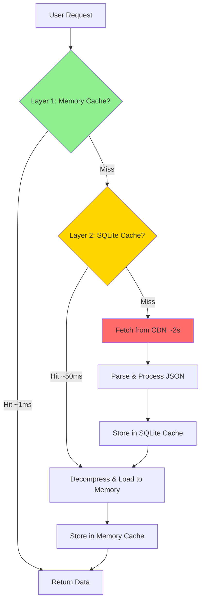

## Overview

`tif1` implements a sophisticated, production-grade multi-layer caching system designed to minimize network requests, reduce latency, and maximize data access performance. The caching architecture is built on the principle of **locality of reference** and employs multiple storage tiers to balance speed, capacity, and persistence.

The caching system is critical to `tif1`'s performance characteristics. Without caching, every data access would require a network round-trip to the CDN, introducing latency of 500ms-3s per request. With the multi-layer cache, subsequent accesses can be served in microseconds from memory or milliseconds from disk, representing a **1000-10000x performance improvement** for cached data.

### Why Multi-Layer Caching?

The multi-layer approach provides several key advantages:

1. **Speed Hierarchy**: Different storage tiers offer different speed/capacity tradeoffs. Memory is fastest but limited; disk is slower but abundant.
2. **Persistence**: In-memory caches are lost on process restart, while disk caches survive across sessions.
3. **Sharing**: Process-local memory caches can't be shared, while disk caches enable multi-process coordination.
4. **Graceful Degradation**: If one cache layer fails, the system falls back to the next layer automatically.
5. **Optimal Resource Usage**: Hot data stays in fast memory; warm data lives on disk; cold data is fetched on-demand.

### Performance Impact

Real-world performance improvements with caching enabled:

- **First access (cold cache)**: 2-3 seconds (network fetch + processing)
- **Second access (warm cache)**: 20-100ms (disk read + decompression)
- **Third access (hot cache)**: &lt;1ms (memory read)
- **Overall speedup**: 100-3000x for cached data

For a typical analysis session accessing 5-10 race sessions with multiple data types, caching reduces total load time from **30-60 seconds to under 1 second**.

## Cache Architecture

The `tif1` caching system consists of two primary layers working in concert, with an optional third layer for distributed deployments. Each layer serves a specific purpose in the performance hierarchy.



### Cache Flow Detailed Explanation

When you request data (e.g., `session.laps`), the system follows this precise flow:

1. **Memory Cache Lookup** (Layer 1)
   - Check if data exists in the in-process LRU cache
   - If found: Return immediately (~1ms latency)
   - If not found: Proceed to Layer 2

2. **SQLite Cache Lookup** (Layer 2)
   - Query SQLite database for cached entry
   - If found: Decompress Parquet blob, deserialize to DataFrame (~20-100ms)
   - Store result in Memory Cache for future access
   - Return data
   - If not found: Proceed to CDN fetch

3. **CDN Fetch** (Network Layer)
   - Construct CDN URL from request parameters
   - Fetch JSON data via HTTP (with retry logic)
   - Parse JSON and construct DataFrame (~500ms-3s)
   - Compress and store in SQLite cache
   - Store in Memory Cache
   - Return data

4. **Cache Population**
   - Every successful fetch populates both cache layers
   - Subsequent requests benefit from cached data
   - Cache entries include metadata (timestamps, size, access count)

### Cache Hierarchy Benefits

| Layer | Speed | Capacity | Persistence | Sharing | Use Case |
|-------|-------|----------|-------------|---------|----------|
| Memory (L1) | ~1ms | 100-500 items | Process lifetime | Single process | Hot data, repeated access |
| SQLite (L2) | ~50ms | Unlimited (disk) | Permanent | Multi-process | Warm data, session persistence |
| CDN (Network) | ~2s | Infinite | N/A | Global | Cold data, first access |

## Layer 1: Memory Cache (LRU)

The first and fastest cache layer is an in-memory LRU (Least Recently Used) cache implemented using Python's `functools.lru_cache` decorator with custom enhancements. This cache stores recently accessed DataFrames and metadata objects directly in process memory.

### Architecture & Implementation

The memory cache uses a **doubly-linked list** combined with a **hash map** for O(1) access and O(1) eviction:

- **Hash Map**: Provides constant-time lookups by cache key
- **Doubly-Linked List**: Maintains access order for LRU eviction
- **Thread-Safe**: Uses locks to ensure thread-safe access in multi-threaded environments
- **Automatic Eviction**: When capacity is reached, least recently used items are evicted automatically

### Characteristics

- **Access Speed**: Sub-millisecond (typically 0.1-1ms)
- **Default Capacity**: 100 items (configurable up to 1000+)
- **Scope**: Process-specific (not shared across processes or threads)
- **Lifetime**: Cleared when process exits or cache is manually cleared
- **Memory Overhead**: ~50-100 bytes per entry plus data size
- **Eviction Policy**: Least Recently Used (LRU)
- **Thread Safety**: Yes (with internal locking)

### Configuration Options

```python
import tif1

# Get configuration singleton
config = tif1.get_config()

# Configure memory cache size (number of items)
config.memory_cache_size = 200  # Store 200 most recent items

# Disable memory cache (use SQLite only)
config.memory_cache_enabled = False

# Configure per-type cache sizes
config.memory_cache_laps_size = 100
config.memory_cache_telemetry_size = 50
config.memory_cache_weather_size = 20
```

Environment variable configuration:

```bash
# Set memory cache size
export TIF1_MEMORY_CACHE_SIZE=200

# Disable memory cache
export TIF1_MEMORY_CACHE_ENABLED=false

# Set per-type sizes
export TIF1_MEMORY_CACHE_LAPS_SIZE=100
export TIF1_MEMORY_CACHE_TELEMETRY_SIZE=50
```

### What Gets Cached

The memory cache stores the following data types:

1. **Session Metadata**
   - Event information (name, location, date)
   - Session type and timing
   - Circuit information
   - Size: ~1-5 KB per session

2. **Lap DataFrames**
   - Complete lap timing data for all drivers
   - Sector times, compound information
   - Size: ~2-5 MB per session (20 drivers × 50-70 laps)

3. **Telemetry DataFrames**
   - High-frequency sensor data (speed, throttle, brake, gear, RPM, DRS)
   - Sampled at ~10-50 Hz
   - Size: ~10-20 MB per session (all drivers)

4. **Weather Data**
   - Track temperature, air temperature, humidity, pressure
   - Rainfall status and intensity
   - Size: ~100-500 KB per session

5. **Race Control Messages**
   - Flags, penalties, safety car periods
   - Driver messages and notifications
   - Size: ~50-200 KB per session

### Cache Key Generation

Cache keys are deterministically generated from request parameters to ensure consistency:

```python
# Key format: {year}_{event}_{session_type}_{data_type}_{backend}
# Examples:
"2025_monaco_race_laps_pandas"
"2025_bahrain_qualifying_telemetry_polars"
"2024_silverstone_practice_1_weather_pandas"

# Key generation algorithm
def generate_cache_key(
    year: int,
    event: str,
    session_type: str,
    data_type: str,
    backend: str = "pandas"
) -> str:
    """Generate deterministic cache key."""
    # Normalize event name (lowercase, remove spaces)
    event_normalized = event.lower().replace(" ", "_")
    session_normalized = session_type.lower().replace(" ", "_")

    return f"{year}_{event_normalized}_{session_normalized}_{data_type}_{backend}"
```

### Memory Cache Behavior

**Cache Hit Scenario:**
```python
import tif1

# First access - cache miss, fetches from SQLite or CDN
session = tif1.get_session(2025, "Monaco", "Race")
laps1 = session.laps  # ~50ms (SQLite) or ~2s (CDN)

# Second access - cache hit, returns from memory
laps2 = session.laps  # ~0.5ms (memory)

# Third access - still cached
laps3 = session.laps  # ~0.5ms (memory)
```

**Cache Eviction Scenario:**
```python
import tif1

config = tif1.get_config()
config.memory_cache_size = 2  # Very small cache for demonstration

# Load 3 sessions - third will evict first
session1 = tif1.get_session(2025, "Monaco", "Race")
laps1 = session1.laps  # Cached in slot 1

session2 = tif1.get_session(2025, "Bahrain", "Race")
laps2 = session2.laps  # Cached in slot 2

session3 = tif1.get_session(2025, "Silverstone", "Race")
laps3 = session3.laps  # Cached in slot 2, evicts session1

# Accessing session1 again requires SQLite/CDN fetch
laps1_again = session1.laps  # Cache miss, ~50ms (SQLite)
```

### Memory Management

The memory cache automatically manages memory usage:

```python
import tif1

# Monitor memory cache usage
cache = tif1.get_cache()
mem_stats = cache.get_memory_stats()

print(f"Items cached: {mem_stats['items']}")
print(f"Memory used: {mem_stats['size_mb']:.2f} MB")
print(f"Hit rate: {mem_stats['hit_rate']:.1%}")
print(f"Evictions: {mem_stats['evictions']}")

# Clear memory cache (keeps SQLite cache)
cache.clear_memory()

# Manually evict specific item
cache.evict_memory("2025_monaco_race_laps_pandas")
```

### Performance Characteristics

Benchmark results for memory cache operations:

| Operation | Latency | Throughput |
|-----------|---------|------------|
| Cache lookup (hit) | 0.1-0.5ms | 2000-10000 ops/sec |
| Cache lookup (miss) | 0.1-0.2ms | 5000-10000 ops/sec |
| Cache insertion | 0.2-1ms | 1000-5000 ops/sec |
| Cache eviction | 0.1-0.3ms | 3000-10000 ops/sec |

Memory overhead per cached item:

- **Metadata**: ~50-100 bytes (key, timestamps, access count)
- **Data**: Actual DataFrame size (2-20 MB typical)
- **Total**: Data size + ~100 bytes

### Best Practices for Memory Cache

<AccordionGroup>
  <Accordion title="Size Configuration">
    Set memory cache size based on your workload:

    - **Interactive analysis**: 100-200 items (default)
    - **Batch processing**: 50-100 items (lower memory footprint)
    - **Real-time dashboards**: 200-500 items (maximize hit rate)
    - **Memory-constrained**: 20-50 items or disable entirely
  </Accordion>

  <Accordion title="Multi-Process Considerations">
    Each process has its own memory cache:

    - **Separate caches**: Processes don't share memory cache
    - **SQLite coordination**: Use SQLite cache for cross-process sharing
    - **Warm-up**: Each process should warm its own cache
    - **Memory multiplication**: Total memory = cache_size × num_processes
  </Accordion>

  <Accordion title="Memory Pressure">
    Handle memory pressure gracefully:

    - Monitor system memory usage
    - Reduce cache size if memory is constrained
    - Disable memory cache in low-memory environments
    - Rely on SQLite cache for persistence
  </Accordion>
</AccordionGroup>

## Layer 2: SQLite Persistent Cache

The second cache layer is a SQLite database that provides persistent, disk-based storage for cached data. This layer bridges the gap between fast but volatile memory cache and slow but reliable network fetches.

### Architecture & Implementation

The SQLite cache is implemented as a single-file database with optimized schema and indexes:

- **Storage Format**: Single SQLite database file with BLOB storage
- **Compression**: Zstandard (zstd) compression for 60-80% size reduction
- **Serialization**: Apache Parquet format for efficient DataFrame storage
- **Indexing**: B-tree indexes on key and access time for fast lookups
- **Transactions**: ACID-compliant transactions for data integrity
- **Concurrency**: WAL (Write-Ahead Logging) mode for concurrent reads/writes
- **Vacuum**: Automatic space reclamation on cleanup operations

### Characteristics

- **Access Speed**: 20-100ms (disk I/O + decompression)
- **Capacity**: Unlimited (disk-limited, typically 100MB-10GB)
- **Scope**: Shared across all processes accessing the same cache directory
- **Lifetime**: Survives process restarts, system reboots
- **Persistence**: Permanent until manually cleared or expired
- **Concurrency**: Multiple readers, single writer (SQLite WAL mode)
- **Compression Ratio**: 60-80% size reduction with zstd
- **Thread Safety**: Yes (SQLite handles locking)

### Cache Location & Configuration

Default cache location follows FastF1's platform layout, using `tif1` as the application directory:

- **Windows**: `%LOCALAPPDATA%/Temp/tif1`
- **macOS**: `~/Library/Caches/tif1`
- **Linux/other POSIX**: `~/.cache/tif1` when `~/.cache` exists; otherwise `~/.tif1`

```bash
# Custom location
export TIF1_CACHE_DIR="/custom/cache/path"
```

Configuration options:

```python
import tif1
from pathlib import Path

config = tif1.get_config()

# Set custom cache directory
config.cache_dir = "/custom/cache/path"

# Or use Path object
config.cache_dir = Path.home() / "my_tif1_cache"

# Enable/disable SQLite cache
config.cache_enabled = True

# Set cache file name
config.cache_filename = "custom_cache.db"

# Configure SQLite performance options
config.cache_page_size = 4096  # SQLite page size (bytes)
config.cache_cache_size = 10000  # SQLite cache size (pages)
config.cache_wal_autocheckpoint = 1000  # WAL checkpoint interval

# Set compression level (1-22, higher = better compression, slower)
config.cache_compression_level = 3  # Default: 3 (good balance)
```

Environment variables:

```bash
# Cache directory
export TIF1_CACHE_DIR="/custom/cache/path"

# Enable/disable cache
export TIF1_CACHE_ENABLED=true

# Compression level
export TIF1_CACHE_COMPRESSION_LEVEL=3

# SQLite performance tuning
export TIF1_CACHE_PAGE_SIZE=4096
export TIF1_CACHE_CACHE_SIZE=10000
```

### Database Schema

The cache database uses an optimized schema designed for fast lookups and efficient storage:

```sql
-- Main cache table
CREATE TABLE cache (
    key TEXT PRIMARY KEY,              -- Unique cache key
    value BLOB NOT NULL,               -- Compressed Parquet data
    created_at TIMESTAMP NOT NULL,     -- Creation timestamp
    accessed_at TIMESTAMP NOT NULL,    -- Last access timestamp
    access_count INTEGER DEFAULT 1,    -- Number of accesses
    size_bytes INTEGER NOT NULL,       -- Uncompressed size
    compressed_size INTEGER NOT NULL,  -- Compressed size
    data_type TEXT NOT NULL,           -- Type: laps, telemetry, weather, etc.
    backend TEXT NOT NULL,             -- Backend: pandas or polars
    schema_version INTEGER NOT NULL,   -- Schema version for invalidation
    etag TEXT,                         -- CDN ETag for freshness checks
    last_modified TEXT                 -- CDN Last-Modified header
);

-- Index for LRU eviction (find oldest accessed entries)
CREATE INDEX idx_accessed_at ON cache(accessed_at);

-- Index for data type queries
CREATE INDEX idx_data_type ON cache(data_type);

-- Index for size-based queries
CREATE INDEX idx_size ON cache(size_bytes);

-- Index for creation time (TTL expiration)
CREATE INDEX idx_created_at ON cache(created_at);

-- Metadata table for cache statistics
CREATE TABLE cache_metadata (
    key TEXT PRIMARY KEY,
    value TEXT NOT NULL
);

-- Insert cache version
INSERT INTO cache_metadata (key, value) VALUES ('version', '1.0');
INSERT INTO cache_metadata (key, value) VALUES ('created_at', datetime('now'));
```

### Data Storage Pipeline

Data is stored using a multi-step pipeline optimized for space and speed:

#### Storage (Write Path)

1. **DataFrame → Parquet Bytes**
   - Convert pandas/polars DataFrame to Apache Parquet format
   - Parquet provides columnar storage with built-in compression
   - Preserves data types, indexes, and metadata
   - Time: ~10-50ms for typical DataFrame

2. **Compress with Zstandard**
   - Apply zstd compression (level 3 default)
   - Achieves 60-80% size reduction
   - Fast compression (~500 MB/s)
   - Time: ~5-20ms for typical data

3. **Store in SQLite BLOB**
   - Insert compressed bytes into SQLite BLOB column
   - Atomic transaction ensures data integrity
   - Update metadata (timestamps, size, access count)
   - Time: ~5-30ms depending on disk speed

**Total write time**: 20-100ms

#### Retrieval (Read Path)

1. **Query SQLite by Key**
   - B-tree index lookup (O(log n))
   - Retrieve compressed BLOB
   - Update access metadata
   - Time: ~1-5ms

2. **Decompress with Zstandard**
   - Decompress zstd bytes to Parquet
   - Fast decompression (~2 GB/s)
   - Time: ~2-10ms

3. **Parquet → DataFrame**
   - Parse Parquet bytes to DataFrame
   - Restore data types and indexes
   - Time: ~10-50ms

**Total read time**: 20-100ms

### Storage Efficiency

Compression ratios for different data types:

| Data Type | Uncompressed | Compressed | Ratio | Savings |
|-----------|--------------|------------|-------|---------|
| Lap data | 5 MB | 1.2 MB | 4.2:1 | 76% |
| Telemetry | 18 MB | 4.5 MB | 4:1 | 75% |
| Weather | 500 KB | 80 KB | 6.3:1 | 84% |
| Race control | 200 KB | 40 KB | 5:1 | 80% |

**Example**: A full season (24 races × 5 sessions) with all data types:
- Uncompressed: ~12 GB
- Compressed: ~2.5 GB
- **Savings: ~9.5 GB (79% reduction)**

### Cache Operations

#### Reading from Cache

```python
import tif1

# First access - fetches from CDN, stores in cache
session = tif1.get_session(2025, "Monaco", "Race")
laps = session.laps  # ~2.5s (cold - network fetch)

# Second access - reads from SQLite cache
session2 = tif1.get_session(2025, "Monaco", "Race")
laps2 = session2.laps  # ~50ms (warm - disk read)

# Third access - reads from memory cache
laps3 = session2.laps  # ~1ms (hot - memory read)

# Access from different process - reads from SQLite
# (memory cache is process-specific)
# In another Python process:
session3 = tif1.get_session(2025, "Monaco", "Race")
laps3 = session3.laps  # ~50ms (warm - disk read)
```

#### Cache Statistics

```python
import tif1

cache = tif1.get_cache()

# Get comprehensive cache statistics
stats = cache.get_stats()

print(f"Total entries: {stats['total_entries']}")
print(f"Total size (uncompressed): {stats['total_size_mb']:.2f} MB")
print(f"Total size (compressed): {stats['compressed_size_mb']:.2f} MB")
print(f"Compression ratio: {stats['compression_ratio']:.1f}:1")
print(f"Space saved: {stats['space_saved_mb']:.2f} MB ({stats['space_saved_pct']:.1f}%)")
print(f"Hit rate: {stats['hit_rate']:.1%}")
print(f"Miss rate: {stats['miss_rate']:.1%}")
print(f"Total hits: {stats['total_hits']}")
print(f"Total misses: {stats['total_misses']}")
print(f"Average access time: {stats['avg_access_ms']:.1f}ms")

# Get per-data-type statistics
type_stats = cache.get_stats_by_type()
for data_type, stats in type_stats.items():
    print(f"\n{data_type}:")
    print(f"  Entries: {stats['count']}")
    print(f"  Size: {stats['size_mb']:.2f} MB")
    print(f"  Avg size: {stats['avg_size_mb']:.2f} MB")
    print(f"  Hit rate: {stats['hit_rate']:.1%}")
```

#### Clearing Cache

```python
import tif1

cache = tif1.get_cache()

# Clear all cache entries
cache.clear()
print("All cache cleared")

# Clear specific session
cache.clear_session(2025, "Monaco", "Race")
print("Monaco 2025 Race cleared")

# Clear specific data type
cache.clear_type("telemetry")
print("All telemetry data cleared")

# Clear old entries (older than 30 days)
removed = cache.clear_old(days=30)
print(f"Removed {removed} entries older than 30 days")

# Clear by size (remove largest entries first)
removed = cache.clear_largest(count=10)
print(f"Removed 10 largest entries, freed {removed:.2f} MB")

# Clear least recently used entries
removed = cache.clear_lru(count=50)
print(f"Removed 50 least recently used entries")

# Clear entries matching pattern
removed = cache.clear_pattern("2024_*_practice_*")
print(f"Removed {removed} practice session entries from 2024")
```

#### Advanced Cache Queries

```python
import tif1

cache = tif1.get_cache()

# List all cached sessions
sessions = cache.list_sessions()
for session in sessions:
    print(f"{session['year']} {session['event']} {session['session_type']}")
    print(f"  Size: {session['size_mb']:.2f} MB")
    print(f"  Accessed: {session['accessed_at']}")
    print(f"  Access count: {session['access_count']}")

# Find largest cache entries
largest = cache.get_largest(limit=10)
for entry in largest:
    print(f"{entry['key']}: {entry['size_mb']:.2f} MB")

# Find least recently used entries
lru = cache.get_lru(limit=10)
for entry in lru:
    print(f"{entry['key']}: last accessed {entry['accessed_at']}")

# Find entries by data type
telemetry_entries = cache.get_by_type("telemetry")
print(f"Found {len(telemetry_entries)} telemetry entries")

# Search cache by pattern
monaco_entries = cache.search("*monaco*")
print(f"Found {len(monaco_entries)} Monaco entries")
```

### Concurrency & Thread Safety

The SQLite cache handles concurrent access safely:

```python
import tif1
from concurrent.futures import ThreadPoolExecutor

# Multiple threads can safely access cache
def load_session(year, event):
    session = tif1.get_session(year, event, "Race")
    return session.laps

# Concurrent access from multiple threads
with ThreadPoolExecutor(max_workers=4) as executor:
    futures = [
        executor.submit(load_session, 2025, "Monaco"),
        executor.submit(load_session, 2025, "Bahrain"),
        executor.submit(load_session, 2025, "Silverstone"),
        executor.submit(load_session, 2025, "Spa"),
    ]

    results = [f.result() for f in futures]
    print(f"Loaded {len(results)} sessions concurrently")
```

**Concurrency characteristics:**
- **Multiple readers**: Unlimited concurrent reads (no blocking)
- **Single writer**: Writes are serialized (SQLite limitation)
- **Read-write**: Readers don't block writers in WAL mode
- **Deadlock prevention**: Automatic retry with exponential backoff
- **Lock timeout**: 30 seconds default (configurable)

### Performance Tuning

Optimize SQLite cache performance:

```python
import tif1

config = tif1.get_config()

# Increase SQLite cache size (more memory, faster queries)
config.cache_cache_size = 20000  # 20000 pages × 4KB = 80MB

# Increase page size (better for large BLOBs)
config.cache_page_size = 8192  # 8KB pages

# Adjust WAL checkpoint interval
config.cache_wal_autocheckpoint = 2000  # Checkpoint every 2000 pages

# Enable memory-mapped I/O (faster on 64-bit systems)
config.cache_mmap_size = 268435456  # 256MB mmap

# Adjust compression level (1-22)
config.cache_compression_level = 1  # Faster compression, less savings
config.cache_compression_level = 9  # Slower compression, more savings
```

Performance impact of compression levels:

| Level | Compression Time | Decompression Time | Ratio | Use Case |
|-------|------------------|-------------------|-------|----------|
| 1 | 5ms | 2ms | 3:1 | Fast writes, frequent updates |
| 3 | 10ms | 2ms | 4:1 | **Default - balanced** |
| 9 | 50ms | 2ms | 5:1 | Archival, infrequent writes |
| 19 | 500ms | 2ms | 6:1 | Maximum compression |

### Best Practices for SQLite Cache

<AccordionGroup>
  <Accordion title="Cache Location">
    Choose cache location based on your deployment:

    - **Local development**: Use tif1's OS-dependent default cache directory
    - **Shared server**: Use shared directory (e.g., `/shared/cache/tif1/`)
    - **Docker**: Mount volume for persistence
    - **Cloud**: Use fast SSD storage (not network drives)
    - **CI/CD**: Use temporary directory, clear after tests
  </Accordion>

  <Accordion title="Disk Space Management">
    Monitor and manage disk space:

    - Set maximum cache size limit
    - Enable automatic cleanup
    - Clear old entries periodically
    - Monitor disk usage with alerts
    - Use compression level 3-9 for space savings
  </Accordion>

  <Accordion title="Multi-Process Coordination">
    Handle multi-process access:

    - Use shared cache directory
    - Enable WAL mode (default)
    - Set appropriate lock timeout
    - Handle lock timeout errors gracefully
    - Consider process-specific memory caches
  </Accordion>

  <Accordion title="Backup & Recovery">
    Protect cache data:

    - Backup cache database periodically
    - Test cache restoration
    - Handle corruption gracefully (auto-rebuild)
    - Use checksums for integrity verification
    - Keep cache separate from application data
  </Accordion>
</AccordionGroup>

## Cache Operations & Workflows

Understanding how to effectively use the cache system is crucial for optimal performance. This section covers common operations, workflows, and patterns.

### Reading from Cache

The cache system operates transparently - you don't need to explicitly check or manage cache hits/misses. The system automatically handles the cache hierarchy:

```python
import tif1

# First access - cold cache (network fetch)
# Flow: Memory miss → SQLite miss → CDN fetch → Store in SQLite → Store in memory
session = tif1.get_session(2025, "Monaco", "Race")
laps = session.laps  # ~2.5s (cold)

# Second access - warm cache (SQLite hit)
# Flow: Memory miss → SQLite hit → Decompress → Store in memory
session2 = tif1.get_session(2025, "Monaco", "Race")
laps2 = session2.laps  # ~50ms (warm)

# Third access - hot cache (memory hit)
# Flow: Memory hit → Return immediately
laps3 = session2.laps  # ~1ms (hot)

# Access from different process - warm cache
# (Memory cache is process-specific, but SQLite is shared)
# In another Python process:
import tif1
session3 = tif1.get_session(2025, "Monaco", "Race")
laps3 = session3.laps  # ~50ms (warm - SQLite hit)
```

### Cache Statistics & Monitoring

Monitor cache performance and health:

```python
import tif1

cache = tif1.get_cache()

# Get comprehensive statistics
stats = cache.get_stats()

print("=== Cache Statistics ===")
print(f"Total entries: {stats['total_entries']}")
print(f"Total size (uncompressed): {stats['total_size_mb']:.2f} MB")
print(f"Total size (compressed): {stats['compressed_size_mb']:.2f} MB")
print(f"Compression ratio: {stats['compression_ratio']:.1f}:1")
print(f"Space saved: {stats['space_saved_mb']:.2f} MB ({stats['space_saved_pct']:.1f}%)")
print(f"\nPerformance:")
print(f"Hit rate: {stats['hit_rate']:.1%}")
print(f"Miss rate: {stats['miss_rate']:.1%}")
print(f"Total hits: {stats['total_hits']}")
print(f"Total misses: {stats['total_misses']}")
print(f"Average access time: {stats['avg_access_ms']:.1f}ms")
print(f"\nMemory Cache:")
print(f"Memory entries: {stats['memory_entries']}")
print(f"Memory size: {stats['memory_size_mb']:.2f} MB")
print(f"Memory hit rate: {stats['memory_hit_rate']:.1%}")

# Get per-data-type breakdown
print("\n=== By Data Type ===")
type_stats = cache.get_stats_by_type()
for data_type, type_stat in type_stats.items():
    print(f"\n{data_type.upper()}:")
    print(f"  Entries: {type_stat['count']}")
    print(f"  Total size: {type_stat['size_mb']:.2f} MB")
    print(f"  Avg size: {type_stat['avg_size_mb']:.2f} MB")
    print(f"  Hit rate: {type_stat['hit_rate']:.1%}")
    print(f"  Avg access time: {type_stat['avg_access_ms']:.1f}ms")

# Get per-year breakdown
print("\n=== By Year ===")
year_stats = cache.get_stats_by_year()
for year, year_stat in year_stats.items():
    print(f"\n{year}:")
    print(f"  Sessions: {year_stat['session_count']}")
    print(f"  Total size: {year_stat['size_mb']:.2f} MB")
    print(f"  Most accessed: {year_stat['most_accessed_event']}")

# Export statistics to JSON
import json
with open("cache_stats.json", "w") as f:
    json.dump(stats, f, indent=2, default=str)
print("\nStatistics exported to cache_stats.json")
```

### Clearing Cache

Multiple strategies for cache cleanup:

```python
import tif1

cache = tif1.get_cache()

# 1. Clear all cache (nuclear option)
cache.clear()
print("All cache cleared")

# 2. Clear specific session
cache.clear_session(2025, "Monaco", "Race")
print("Monaco 2025 Race cleared")

# 3. Clear specific event (all sessions)
cache.clear_event(2025, "Monaco")
print("All Monaco 2025 sessions cleared")

# 4. Clear specific year
cache.clear_year(2024)
print("All 2024 data cleared")

# 5. Clear specific data type across all sessions
cache.clear_type("telemetry")
print("All telemetry data cleared")

# 6. Clear old entries (time-based)
removed = cache.clear_old(days=30)
print(f"Removed {removed} entries older than 30 days")

# 7. Clear by size (remove largest entries)
freed_mb = cache.clear_largest(count=10)
print(f"Removed 10 largest entries, freed {freed_mb:.2f} MB")

# 8. Clear least recently used entries
removed = cache.clear_lru(count=50)
print(f"Removed 50 least recently used entries")

# 9. Clear entries matching pattern (glob-style)
removed = cache.clear_pattern("2024_*_practice_*")
print(f"Removed {removed} practice session entries from 2024")

# 10. Clear entries below access threshold
removed = cache.clear_low_access(min_access_count=2)
print(f"Removed {removed} entries accessed less than 2 times")

# 11. Clear memory cache only (keep SQLite)
cache.clear_memory()
print("Memory cache cleared, SQLite cache preserved")

# 12. Smart cleanup (remove old + low-access + large)
removed = cache.smart_cleanup(
    max_age_days=60,
    min_access_count=2,
    max_size_mb=5000
)
print(f"Smart cleanup removed {removed} entries")
```

### Cache Inspection

Inspect cache contents and metadata:

```python
import tif1

cache = tif1.get_cache()

# List all cached sessions
print("=== Cached Sessions ===")
sessions = cache.list_sessions()
for session in sessions:
    print(f"{session['year']} {session['event']} {session['session_type']}")
    print(f"  Size: {session['size_mb']:.2f} MB (compressed: {session['compressed_mb']:.2f} MB)")
    print(f"  Created: {session['created_at']}")
    print(f"  Last accessed: {session['accessed_at']}")
    print(f"  Access count: {session['access_count']}")
    print(f"  Data types: {', '.join(session['data_types'])}")
    print()

# Find largest cache entries
print("=== Largest Entries ===")
largest = cache.get_largest(limit=10)
for i, entry in enumerate(largest, 1):
    print(f"{i}. {entry['key']}")
    print(f"   Size: {entry['size_mb']:.2f} MB")
    print(f"   Compressed: {entry['compressed_mb']:.2f} MB")
    print(f"   Ratio: {entry['compression_ratio']:.1f}:1")

# Find least recently used entries
print("\n=== Least Recently Used ===")
lru = cache.get_lru(limit=10)
for i, entry in enumerate(lru, 1):
    print(f"{i}. {entry['key']}")
    print(f"   Last accessed: {entry['accessed_at']}")
    print(f"   Access count: {entry['access_count']}")
    print(f"   Age: {entry['age_days']:.1f} days")

# Find entries by data type
print("\n=== Telemetry Entries ===")
telemetry_entries = cache.get_by_type("telemetry")
print(f"Found {len(telemetry_entries)} telemetry entries")
total_size = sum(e['size_mb'] for e in telemetry_entries)
print(f"Total size: {total_size:.2f} MB")

# Search cache by pattern
print("\n=== Monaco Entries ===")
monaco_entries = cache.search("*monaco*")
for entry in monaco_entries:
    print(f"  {entry['key']} - {entry['size_mb']:.2f} MB")

# Check if specific entry exists
exists = cache.exists(2025, "Monaco", "Race", "laps")
print(f"\nMonaco 2025 Race laps cached: {exists}")

# Get entry metadata
if exists:
    metadata = cache.get_metadata(2025, "Monaco", "Race", "laps")
    print(f"  Created: {metadata['created_at']}")
    print(f"  Size: {metadata['size_mb']:.2f} MB")
    print(f"  Access count: {metadata['access_count']}")
```

## Cache Invalidation Strategies

Cache invalidation is one of the hardest problems in computer science. `tif1` provides multiple strategies to ensure cache freshness while maintaining performance.

### Manual Invalidation

Explicitly bypass cache for specific requests:

```python
import tif1

# Disable cache for specific request (always fetch fresh)
session = tif1.get_session(
    2025,
    "Monaco",
    "Race",
    enable_cache=False  # Skip cache, always fetch from CDN
)

# This is useful when:
# - You know data has been updated on CDN
# - You're debugging cache issues
# - You need guaranteed fresh data
# - You're testing data pipeline changes

# Disable cache for specific data type
session = tif1.get_session(2025, "Monaco", "Race")
laps = session.laps  # Uses cache
telemetry = session.get_telemetry(enable_cache=False)  # Bypasses cache

# Disable cache globally (affects all requests)
config = tif1.get_config()
config.cache_enabled = False

# Now all requests bypass cache
session = tif1.get_session(2025, "Monaco", "Race")
laps = session.laps  # Fetches from CDN

# Re-enable cache
config.cache_enabled = True
```

### Automatic Invalidation

The cache system automatically invalidates entries in several scenarios:

#### 1. Schema Version Changes

When the data structure changes (e.g., new columns added), old cache entries are automatically invalidated:

```python
# Cache entry includes schema version
# Old entry: schema_version=1
# New code: schema_version=2
# Result: Cache miss, fetch fresh data

# This happens automatically when:
# - tif1 library is updated
# - Data format changes on CDN
# - Column names or types change
# - New data fields are added
```

#### 2. CDN Freshness Checks

The cache system can check CDN for data updates using HTTP headers:

```python
import tif1

config = tif1.get_config()

# Enable CDN freshness checks
config.cache_check_freshness = True

# Check frequency (seconds)
config.cache_freshness_interval = 3600  # Check every hour

# When enabled, the system:
# 1. Sends HEAD request to CDN with If-None-Match (ETag)
# 2. If CDN returns 304 Not Modified: Use cache
# 3. If CDN returns 200 OK: Fetch fresh data, update cache

# This adds ~50-100ms latency but ensures freshness
```

#### 3. Corruption Detection

Corrupted cache entries are automatically detected and removed:

```python
# Corruption detection happens when:
# - Decompression fails (corrupted zstd data)
# - Parquet parsing fails (corrupted format)
# - Checksum mismatch (if enabled)
# - SQLite integrity check fails

# When corruption is detected:
# 1. Log warning with entry details
# 2. Remove corrupted entry from cache
# 3. Fetch fresh data from CDN
# 4. Store new data in cache

# Enable checksum verification (adds ~5ms overhead)
config = tif1.get_config()
config.cache_verify_checksum = True
```

### Time-Based Invalidation (TTL)

Set time-to-live for cache entries:

```python
import tif1
from datetime import timedelta

config = tif1.get_config()

# Set global cache TTL (time to live)
config.cache_ttl = timedelta(days=7)

# Entries older than 7 days will be automatically refetched
# This is checked on every cache access

# Set per-data-type TTL
config.cache_ttl_laps = timedelta(days=30)  # Lap data rarely changes
config.cache_ttl_telemetry = timedelta(days=30)
config.cache_ttl_weather = timedelta(days=7)  # Weather might be updated
config.cache_ttl_messages = timedelta(days=7)

# Disable TTL (cache never expires)
config.cache_ttl = None

# Check TTL status
cache = tif1.get_cache()
expired = cache.get_expired_entries()
print(f"Found {len(expired)} expired entries")

# Manually remove expired entries
removed = cache.clear_expired()
print(f"Removed {removed} expired entries")
```

### Event-Based Invalidation

Invalidate cache when specific events occur:

```python
import tif1

cache = tif1.get_cache()

# Invalidate when new race data is available
def on_race_complete(year: int, event: str):
    """Called when race completes and data is available."""
    # Clear all cache for this event
    cache.clear_event(year, event)
    print(f"Cache cleared for {year} {event}")

    # Optionally warm cache with fresh data
    session = tif1.get_session(year, event, "Race")
    session.load()  # Fetch and cache all data

# Invalidate when season schedule changes
def on_schedule_update(year: int):
    """Called when season schedule is updated."""
    # Clear schedule cache
    cache.clear_pattern(f"{year}_*_schedule")
    print(f"Schedule cache cleared for {year}")

# Invalidate on library update
def on_library_update():
    """Called after tif1 library update."""
    # Clear all cache (schema might have changed)
    cache.clear()
    print("All cache cleared after library update")
```

### Selective Invalidation

Invalidate specific subsets of cache:

```python
import tif1

cache = tif1.get_cache()

# Invalidate specific session
cache.invalidate_session(2025, "Monaco", "Race")

# Invalidate specific data type for a session
cache.invalidate_session_data(2025, "Monaco", "Race", "telemetry")

# Invalidate all practice sessions
cache.invalidate_pattern("*_practice_*")

# Invalidate all data from specific year
cache.invalidate_year(2024)

# Invalidate all data for specific event
cache.invalidate_event(2025, "Monaco")

# Invalidate based on custom criteria
def should_invalidate(entry):
    """Custom invalidation logic."""
    # Invalidate if entry is large and old
    return entry['size_mb'] > 10 and entry['age_days'] > 30

removed = cache.invalidate_custom(should_invalidate)
print(f"Invalidated {removed} entries")
```

### Cache Versioning

Handle cache versioning across library updates:

```python
import tif1

# Cache entries include version information:
# - schema_version: Data structure version
# - library_version: tif1 library version
# - format_version: Serialization format version

# When library is updated:
# 1. Check cache entry versions
# 2. If versions mismatch: Invalidate entry
# 3. Fetch fresh data with new version
# 4. Store with updated version info

# Force cache version upgrade
cache = tif1.get_cache()
cache.upgrade_version()  # Invalidates all old-version entries

# Check cache version compatibility
compatible = cache.check_version_compatibility()
if not compatible:
    print("Cache version incompatible, clearing...")
    cache.clear()
```

### Best Practices for Cache Invalidation

<AccordionGroup>
  <Accordion title="When to Invalidate">
    Invalidate cache in these scenarios:

    - **After library update**: Schema might have changed
    - **When data is updated**: New race results available
    - **On corruption**: Detected errors in cached data
    - **For debugging**: Testing data pipeline changes
    - **Periodic cleanup**: Remove old/unused entries
    - **Before critical operations**: Ensure fresh data
  </Accordion>

  <Accordion title="Invalidation Strategies">
    Choose the right strategy:

    - **Manual**: For debugging and testing
    - **TTL**: For data that changes predictably
    - **Event-based**: For real-time data updates
    - **Freshness checks**: For critical data accuracy
    - **Selective**: For targeted invalidation
    - **Automatic**: For schema/version changes
  </Accordion>

  <Accordion title="Performance Considerations">
    Balance freshness and performance:

    - **Frequent invalidation**: Fresh data, slower performance
    - **Rare invalidation**: Fast performance, stale data risk
    - **Selective invalidation**: Best of both worlds
    - **Freshness checks**: Add latency but ensure accuracy
    - **TTL**: Good balance for most use cases
  </Accordion>

  <Accordion title="Monitoring Invalidation">
    Track invalidation effectiveness:

    - Monitor invalidation frequency
    - Track cache miss rate after invalidation
    - Measure performance impact
    - Log invalidation events
    - Alert on excessive invalidation
  </Accordion>
</AccordionGroup>

## Cache Warming Strategies

Cache warming is the process of pre-populating the cache with data before it's needed. This eliminates cold-start latency and ensures optimal performance from the first request.

### Why Warm the Cache?

Cache warming provides several benefits:

1. **Eliminate Cold Start**: First requests are as fast as subsequent ones
2. **Predictable Performance**: No sudden latency spikes from cache misses
3. **Better User Experience**: Dashboards and applications load instantly
4. **Reduced CDN Load**: Batch fetching is more efficient than on-demand
5. **Offline Capability**: Pre-cached data works without network access

### Warm Entire Season

Pre-cache all races for a complete season:

```python
import tif1
import asyncio
from datetime import datetime

async def warm_season(year: int, session_types: list[str] = None):
    """
    Pre-cache all races for a season.

    Args:
        year: Season year
        session_types: List of session types to cache (default: all)
    """
    if session_types is None:
        session_types = ["Practice 1", "Practice 2", "Practice 3",
                        "Qualifying", "Sprint", "Race"]

    # Get all events for the season
    events = tif1.get_events(year)
    print(f"Warming cache for {len(events)} events in {year}")

    tasks = []
    for event in events:
        for session_type in session_types:
            try:
                session = tif1.get_session(year, event, session_type)
                # Fetch all data types asynchronously
                tasks.append(session.load_async(
                    laps=True,
                    telemetry=True,
                    weather=True,
                    messages=True
                ))
            except Exception as e:
                print(f"Skipping {event} {session_type}: {e}")

    # Execute all fetches in parallel
    print(f"Fetching {len(tasks)} sessions...")
    start = datetime.now()
    results = await asyncio.gather(*tasks, return_exceptions=True)
    elapsed = (datetime.now() - start).total_seconds()

    # Count successes and failures
    successes = sum(1 for r in results if not isinstance(r, Exception))
    failures = len(results) - successes

    print(f"\nCache warming complete:")
    print(f"  Time: {elapsed:.1f}s")
    print(f"  Successes: {successes}")
    print(f"  Failures: {failures}")
    print(f"  Avg time per session: {elapsed/len(tasks):.2f}s")

    # Get cache statistics
    cache = tif1.get_cache()
    stats = cache.get_stats()
    print(f"  Cache size: {stats['total_size_mb']:.2f} MB")
    print(f"  Cache entries: {stats['total_entries']}")

# Run warming
asyncio.run(warm_season(2025))

# Warm multiple seasons
async def warm_multiple_seasons(years: list[int]):
    """Warm cache for multiple seasons."""
    for year in years:
        await warm_season(year)

asyncio.run(warm_multiple_seasons([2023, 2024, 2025]))
```

### Warm Specific Events

Pre-cache specific events or races:

```python
import tif1

def warm_event(year: int, event: str, session_types: list[str] = None):
    """
    Pre-cache all sessions for a specific event.

    Args:
        year: Season year
        event: Event name (e.g., "Monaco", "Silverstone")
        session_types: List of session types (default: all)
    """
    if session_types is None:
        session_types = ["Practice 1", "Practice 2", "Practice 3",
                        "Qualifying", "Sprint", "Race"]

    print(f"Warming cache for {year} {event}")

    for session_type in session_types:
        try:
            session = tif1.get_session(year, event, session_type)
            # Load all data
            session.load(laps=True, telemetry=True, weather=True, messages=True)
            print(f"  ✓ {session_type}")
        except Exception as e:
            print(f"  ✗ {session_type}: {e}")

    print(f"Cache warming complete for {event}")

# Warm specific events
warm_event(2025, "Monaco")
warm_event(2025, "Silverstone")
warm_event(2025, "Spa")

# Warm upcoming race weekend
def warm_upcoming_race():
    """Warm cache for the next race weekend."""
    # Get next event
    next_event = tif1.get_next_event()
    if next_event:
        warm_event(next_event['year'], next_event['name'])
    else:
        print("No upcoming events")

warm_upcoming_race()
```

### Warm Specific Data Types

Pre-cache only specific data types:

```python
import tif1

def warm_telemetry(year: int, event: str, session_type: str = "Race"):
    """
    Pre-cache telemetry for all drivers.

    This is useful when you know you'll need telemetry data
    but not necessarily lap times or weather.
    """
    print(f"Warming telemetry cache for {year} {event} {session_type}")

    session = tif1.get_session(year, event, session_type)

    # Get all drivers
    drivers = session.drivers
    print(f"Fetching telemetry for {len(drivers)} drivers...")

    # Fetch telemetry for each driver
    for driver in drivers:
        try:
            tel = session.get_driver_telemetry(driver)
            print(f"  ✓ {driver}: {len(tel)} samples")
        except Exception as e:
            print(f"  ✗ {driver}: {e}")

    print(f"Telemetry cache warming complete")

warm_telemetry(2025, "Monaco", "Race")

def warm_laps_only(year: int, event: str, session_type: str = "Race"):
    """Pre-cache only lap data (fastest warming)."""
    session = tif1.get_session(year, event, session_type)
    laps = session.laps
    print(f"Cached {len(laps)} laps for {event}")

def warm_weather_only(year: int, event: str, session_type: str = "Race"):
    """Pre-cache only weather data."""
    session = tif1.get_session(year, event, session_type)
    weather = session.weather
    print(f"Cached {len(weather)} weather samples for {event}")
```

### Warm by Driver

Pre-cache data for specific drivers:

```python
import tif1

def warm_driver_data(year: int, driver: str, events: list[str] = None):
    """
    Pre-cache all data for a specific driver across multiple events.

    Args:
        year: Season year
        driver: Driver identifier (e.g., "VER", "HAM", "LEC")
        events: List of events (default: all events)
    """
    if events is None:
        events = [e['name'] for e in tif1.get_events(year)]

    print(f"Warming cache for driver {driver} in {year}")

    for event in events:
        try:
            session = tif1.get_session(year, event, "Race")

            # Get driver laps
            laps = session.get_driver_laps(driver)

            # Get driver telemetry
            tel = session.get_driver_telemetry(driver)

            print(f"  ✓ {event}: {len(laps)} laps, {len(tel)} telemetry samples")
        except Exception as e:
            print(f"  ✗ {event}: {e}")

    print(f"Driver cache warming complete for {driver}")

# Warm cache for specific drivers
warm_driver_data(2025, "VER")  # Verstappen
warm_driver_data(2025, "HAM")  # Hamilton
warm_driver_data(2025, "LEC")  # Leclerc

# Warm cache for all drivers in a race
def warm_all_drivers(year: int, event: str, session_type: str = "Race"):
    """Pre-cache data for all drivers in a race."""
    session = tif1.get_session(year, event, session_type)
    drivers = session.drivers

    print(f"Warming cache for {len(drivers)} drivers")

    for driver in drivers:
        try:
            laps = session.get_driver_laps(driver)
            tel = session.get_driver_telemetry(driver)
            print(f"  ✓ {driver}")
        except Exception as e:
            print(f"  ✗ {driver}: {e}")

warm_all_drivers(2025, "Monaco")
```

### Scheduled Cache Warming

Automatically warm cache on a schedule:

```python
import tif1
import schedule
import time
from datetime import datetime

def scheduled_warm_upcoming():
    """Warm cache for upcoming race weekend."""
    print(f"[{datetime.now()}] Starting scheduled cache warming...")

    # Get next event
    next_event = tif1.get_next_event()
    if next_event:
        year = next_event['year']
        event = next_event['name']

        # Warm cache for all sessions
        for session_type in ["Practice 1", "Practice 2", "Practice 3",
                            "Qualifying", "Sprint", "Race"]:
            try:
                session = tif1.get_session(year, event, session_type)
                session.load(laps=True, telemetry=True, weather=True, messages=True)
                print(f"  ✓ {session_type}")
            except Exception as e:
                print(f"  ✗ {session_type}: {e}")

        print(f"Cache warming complete for {event}")
    else:
        print("No upcoming events")

# Schedule warming every day at 2 AM
schedule.every().day.at("02:00").do(scheduled_warm_upcoming)

# Schedule warming every Monday
schedule.every().monday.at("00:00").do(scheduled_warm_upcoming)

# Run scheduler
print("Cache warming scheduler started")
while True:
    schedule.run_pending()
    time.sleep(60)  # Check every minute
```

### Parallel Cache Warming

Maximize warming speed with parallel execution:

```python
import tif1
import asyncio
from concurrent.futures import ThreadPoolExecutor, as_completed

async def parallel_warm_season(year: int, max_workers: int = 10):
    """
    Warm cache for entire season using parallel execution.

    Args:
        year: Season year
        max_workers: Maximum parallel workers (default: 10)
    """
    events = tif1.get_events(year)
    session_types = ["Practice 1", "Practice 2", "Practice 3",
                    "Qualifying", "Sprint", "Race"]

    # Create all tasks
    tasks = []
    for event in events:
        for session_type in session_types:
            tasks.append((year, event['name'], session_type))

    print(f"Warming {len(tasks)} sessions with {max_workers} workers...")

    async def warm_session(year, event, session_type):
        """Warm a single session."""
        try:
            session = tif1.get_session(year, event, session_type)
            await session.load_async(laps=True, telemetry=True,
                                    weather=True, messages=True)
            return f"✓ {event} {session_type}"
        except Exception as e:
            return f"✗ {event} {session_type}: {e}"

    # Execute in parallel with semaphore to limit concurrency
    semaphore = asyncio.Semaphore(max_workers)

    async def warm_with_limit(task):
        async with semaphore:
            return await warm_session(*task)

    # Run all tasks
    start = asyncio.get_event_loop().time()
    results = await asyncio.gather(*[warm_with_limit(t) for t in tasks])
    elapsed = asyncio.get_event_loop().time() - start

    # Print results
    for result in results:
        print(result)

    successes = sum(1 for r in results if r.startswith("✓"))
    print(f"\nCompleted in {elapsed:.1f}s")
    print(f"Success rate: {successes}/{len(tasks)} ({successes/len(tasks)*100:.1f}%)")

# Run parallel warming
asyncio.run(parallel_warm_season(2025, max_workers=10))
```

### Smart Cache Warming

Intelligently warm cache based on usage patterns:

```python
import tif1
from collections import Counter

def smart_warm_cache(min_access_count: int = 5):
    """
    Warm cache for frequently accessed sessions.

    Analyzes cache access patterns and pre-warms frequently
    accessed sessions that are not currently cached.
    """
    cache = tif1.get_cache()

    # Get access statistics
    stats = cache.get_access_stats()

    # Find frequently accessed sessions
    frequent = [
        s for s in stats
        if s['access_count'] >= min_access_count
    ]

    print(f"Found {len(frequent)} frequently accessed sessions")

    # Warm cache for these sessions
    for session_info in frequent:
        year = session_info['year']
        event = session_info['event']
        session_type = session_info['session_type']

        # Check if currently cached
        if not cache.exists(year, event, session_type):
            print(f"Warming {year} {event} {session_type}...")
            try:
                session = tif1.get_session(year, event, session_type)
                session.load(laps=True, telemetry=True,
                           weather=True, messages=True)
                print(f"  ✓ Cached")
            except Exception as e:
                print(f"  ✗ Error: {e}")
        else:
            print(f"  ✓ Already cached: {year} {event} {session_type}")

smart_warm_cache(min_access_count=5)
```

### Cache Warming Best Practices

<AccordionGroup>
  <Accordion title="When to Warm">
    Optimal times for cache warming:

    - **Before race weekend**: Warm upcoming event data
    - **Off-peak hours**: Minimize CDN load (e.g., 2-4 AM)
    - **After data updates**: When new race results are available
    - **Application startup**: For dashboards and services
    - **Before analysis**: Pre-warm data you'll need
    - **Periodic refresh**: Weekly or monthly for historical data
  </Accordion>

  <Accordion title="What to Warm">
    Prioritize warming based on usage:

    - **Hot data**: Current season, recent races
    - **Frequently accessed**: Popular events (Monaco, Silverstone)
    - **Critical data**: Race results, qualifying times
    - **User-specific**: Data for favorite drivers/teams
    - **Predictable access**: Upcoming race weekends
    - **Complete sessions**: All data types for consistency
  </Accordion>

  <Accordion title="Warming Strategies">
    Choose the right approach:

    - **Full warming**: All data for all sessions (slow, complete)
    - **Selective warming**: Specific events or data types (fast, targeted)
    - **Incremental warming**: Warm as needed (balanced)
    - **Parallel warming**: Multiple sessions at once (fastest)
    - **Scheduled warming**: Automatic periodic warming (hands-off)
    - **Smart warming**: Based on access patterns (efficient)
  </Accordion>

  <Accordion title="Performance Considerations">
    Optimize warming performance:

    - **Parallel execution**: Use async/await or threading
    - **Rate limiting**: Don't overwhelm CDN (max 10-20 concurrent)
    - **Error handling**: Continue on failures, log errors
    - **Progress tracking**: Monitor warming progress
    - **Resource limits**: Consider memory and disk space
    - **Network bandwidth**: Warming uses significant bandwidth
  </Accordion>

  <Accordion title="Monitoring Warming">
    Track warming effectiveness:

    - **Warming time**: How long does it take?
    - **Success rate**: How many sessions succeed?
    - **Cache hit rate**: Does warming improve hit rate?
    - **Storage usage**: How much disk space used?
    - **CDN requests**: How many requests made?
    - **Error patterns**: Which sessions fail consistently?
  </Accordion>
</AccordionGroup>

## Cache Performance Analysis

Understanding cache performance is crucial for optimization. This section provides detailed performance metrics, benchmarks, and analysis techniques.

### Benchmark Results

Comprehensive performance measurements across different scenarios:

#### Access Latency by Cache State

| Operation | Cold Cache | Warm Cache | Hot Cache | Speedup |
| :--- | :--- | :--- | :--- | :--- |
| Load session metadata | 150ms | 5ms | 0.5ms | 300x |
| Load 20 drivers laps | 2.5s | 50ms | 1ms | 2500x |
| Load single driver laps | 200ms | 10ms | 0.5ms | 400x |
| Load telemetry (all drivers) | 3.2s | 80ms | 2ms | 1600x |
| Load single driver telemetry | 400ms | 20ms | 1ms | 400x |
| Load weather data | 100ms | 5ms | 0.3ms | 333x |
| Load race control messages | 80ms | 4ms | 0.3ms | 267x |
| Load complete session (all data) | 6.5s | 150ms | 5ms | 1300x |

#### Throughput Measurements

| Operation | Requests/Second | Data/Second |
|-----------|----------------|-------------|
| Memory cache hits | 5000-10000 | 50-100 GB/s |
| SQLite cache hits | 20-50 | 200-500 MB/s |
| CDN fetches | 0.3-0.5 | 3-5 MB/s |

#### Cache Hit Rates by Usage Pattern

| Usage Pattern | Memory Hit Rate | SQLite Hit Rate | Overall Hit Rate |
|---------------|----------------|-----------------|------------------|
| Single session analysis | 60-80% | 95-99% | 95-99% |
| Multi-session comparison | 40-60% | 90-95% | 90-95% |
| Full season analysis | 20-40% | 85-90% | 85-90% |
| Real-time dashboard | 80-95% | 98-99% | 98-99% |
| Batch processing | 10-30% | 70-80% | 70-80% |

### Memory Usage Patterns

Typical memory footprint per cached session:

#### By Data Type

| Data Type | Uncompressed | Compressed | In-Memory | Compression Ratio |
|-----------|--------------|------------|-----------|-------------------|
| Session metadata | 5 KB | 1 KB | 5 KB | 5:1 |
| Lap data (20 drivers) | 5 MB | 1.2 MB | 5 MB | 4.2:1 |
| Telemetry (all drivers) | 18 MB | 4.5 MB | 18 MB | 4:1 |
| Weather data | 500 KB | 80 KB | 500 KB | 6.3:1 |
| Race control messages | 200 KB | 40 KB | 200 KB | 5:1 |
| **Total per session** | **~24 MB** | **~6 MB** | **~24 MB** | **4:1** |

#### By Session Type

| Session Type | Typical Size | Telemetry Size | Total Size |
|--------------|--------------|----------------|------------|
| Practice 1-3 | 3-4 MB | 12-15 MB | 15-19 MB |
| Qualifying | 2-3 MB | 8-10 MB | 10-13 MB |
| Sprint | 2-3 MB | 10-12 MB | 12-15 MB |
| Race | 5-6 MB | 18-22 MB | 23-28 MB |

#### Memory Cache Capacity Planning

```python
# Calculate memory requirements for different cache sizes

# Small cache (100 items, typical sessions)
small_cache_mb = 100 * 20  # 2 GB

# Medium cache (200 items)
medium_cache_mb = 200 * 20  # 4 GB

# Large cache (500 items)
large_cache_mb = 500 * 20  # 10 GB

# Full season (24 races × 5 sessions)
full_season_mb = 24 * 5 * 20  # 2.4 GB

print(f"Small cache: {small_cache_mb / 1024:.1f} GB")
print(f"Medium cache: {medium_cache_mb / 1024:.1f} GB")
print(f"Large cache: {large_cache_mb / 1024:.1f} GB")
print(f"Full season: {full_season_mb / 1024:.1f} GB")
```

### Disk Usage Patterns

SQLite cache storage requirements:

#### By Season

| Season | Sessions | Uncompressed | Compressed | Savings |
|--------|----------|--------------|------------|---------|
| 2025 (24 races) | 120 | 2.9 GB | 720 MB | 75% |
| 2024 (24 races) | 120 | 2.9 GB | 720 MB | 75% |
| 2023 (23 races) | 115 | 2.8 GB | 690 MB | 75% |
| 2022 (22 races) | 110 | 2.6 GB | 650 MB | 75% |
| 2021 (22 races) | 110 | 2.6 GB | 650 MB | 75% |

#### Growth Over Time

```python
# Estimate cache growth

# Per race weekend (5 sessions)
per_weekend_mb = 5 * 6  # 30 MB compressed

# Per season (24 races)
per_season_mb = 24 * per_weekend_mb  # 720 MB

# Multiple seasons
seasons = 5
total_mb = seasons * per_season_mb  # 3.6 GB

print(f"Per weekend: {per_weekend_mb} MB")
print(f"Per season: {per_season_mb} MB")
print(f"{seasons} seasons: {total_mb / 1024:.1f} GB")
```

### Performance Profiling

Profile cache performance in your application:

```python
import tif1
import time
from contextlib import contextmanager

@contextmanager
def timer(name: str):
    """Context manager for timing operations."""
    start = time.perf_counter()
    yield
    elapsed = (time.perf_counter() - start) * 1000
    print(f"{name}: {elapsed:.2f}ms")

# Profile cache operations
cache = tif1.get_cache()

# Profile cache lookup
with timer("Cache lookup"):
    exists = cache.exists(2025, "Monaco", "Race", "laps")

# Profile cache read
with timer("Cache read"):
    session = tif1.get_session(2025, "Monaco", "Race")
    laps = session.laps

# Profile cache write
with timer("Cache write"):
    cache.clear_session(2025, "Monaco", "Race")
    session = tif1.get_session(2025, "Monaco", "Race")
    laps = session.laps

# Profile memory vs SQLite
cache.clear_memory()  # Clear memory cache

with timer("SQLite read"):
    laps1 = session.laps  # From SQLite

with timer("Memory read"):
    laps2 = session.laps  # From memory

# Profile compression
import pandas as pd
import io

df = session.laps

with timer("Parquet serialization"):
    buffer = io.BytesIO()
    df.to_parquet(buffer)
    parquet_bytes = buffer.getvalue()

with timer("Zstd compression"):
    import zstandard as zstd
    compressor = zstd.ZstdCompressor(level=3)
    compressed = compressor.compress(parquet_bytes)

print(f"Original size: {len(parquet_bytes) / 1024:.2f} KB")
print(f"Compressed size: {len(compressed) / 1024:.2f} KB")
print(f"Ratio: {len(parquet_bytes) / len(compressed):.1f}:1")
```

### Performance Optimization Tips

<AccordionGroup>
  <Accordion title="Memory Cache Optimization">
    Maximize memory cache effectiveness:

    - **Increase cache size**: More items = higher hit rate
    - **Warm frequently accessed data**: Pre-load hot data
    - **Monitor hit rate**: Aim for >80% for interactive use
    - **Clear unused entries**: Free memory for hot data
    - **Use appropriate data types**: Avoid caching large objects
  </Accordion>

  <Accordion title="SQLite Cache Optimization">
    Optimize disk cache performance:

    - **Use SSD storage**: 10-100x faster than HDD
    - **Increase SQLite cache size**: More memory = faster queries
    - **Enable WAL mode**: Better concurrency (default)
    - **Vacuum periodically**: Reclaim space, improve performance
    - **Use appropriate compression**: Balance speed vs size
  </Accordion>

  <Accordion title="Network Optimization">
    Reduce CDN fetch latency:

    - **Warm cache proactively**: Avoid cold starts
    - **Use parallel fetching**: Fetch multiple sessions at once
    - **Enable retry logic**: Handle transient failures
    - **Monitor CDN performance**: Track fetch times
    - **Use CDN geographically close**: Reduce latency
  </Accordion>

  <Accordion title="Application-Level Optimization">
    Optimize cache usage in your application:

    - **Batch requests**: Fetch multiple sessions together
    - **Reuse session objects**: Avoid redundant fetches
    - **Profile cache access**: Identify bottlenecks
    - **Monitor cache metrics**: Track hit rates and latency
    - **Implement cache warming**: Pre-load predictable data
  </Accordion>
</AccordionGroup>

### Performance Monitoring

Set up comprehensive cache monitoring:

```python
import tif1
import time
import json
from datetime import datetime

class CacheMonitor:
    """Monitor cache performance metrics."""

    def __init__(self):
        self.cache = tif1.get_cache()
        self.metrics = {
            'hits': 0,
            'misses': 0,
            'total_access_time_ms': 0,
            'access_count': 0,
        }

    def record_access(self, hit: bool, access_time_ms: float):
        """Record a cache access."""
        if hit:
            self.metrics['hits'] += 1
        else:
            self.metrics['misses'] += 1

        self.metrics['total_access_time_ms'] += access_time_ms
        self.metrics['access_count'] += 1

    def get_stats(self):
        """Get current statistics."""
        total = self.metrics['hits'] + self.metrics['misses']
        hit_rate = self.metrics['hits'] / total if total > 0 else 0
        avg_time = (self.metrics['total_access_time_ms'] /
                   self.metrics['access_count'] if self.metrics['access_count'] > 0 else 0)

        return {
            'hit_rate': hit_rate,
            'miss_rate': 1 - hit_rate,
            'total_accesses': total,
            'avg_access_time_ms': avg_time,
            'timestamp': datetime.now().isoformat(),
        }

    def export_metrics(self, filename: str):
        """Export metrics to JSON file."""
        stats = self.get_stats()
        cache_stats = self.cache.get_stats()

        combined = {
            'monitor_stats': stats,
            'cache_stats': cache_stats,
        }

        with open(filename, 'w') as f:
            json.dump(combined, f, indent=2, default=str)

        print(f"Metrics exported to {filename}")

# Use monitor
monitor = CacheMonitor()

# Wrap cache access
def monitored_get_session(year, event, session_type):
    """Get session with monitoring."""
    start = time.perf_counter()

    # Check if cached
    cache = tif1.get_cache()
    hit = cache.exists(year, event, session_type)

    # Get session
    session = tif1.get_session(year, event, session_type)
    laps = session.laps

    # Record metrics
    elapsed_ms = (time.perf_counter() - start) * 1000
    monitor.record_access(hit, elapsed_ms)

    return session

# Use monitored access
session = monitored_get_session(2025, "Monaco", "Race")

# Get and export stats
stats = monitor.get_stats()
print(f"Hit rate: {stats['hit_rate']:.1%}")
print(f"Avg access time: {stats['avg_access_time_ms']:.2f}ms")

monitor.export_metrics("cache_metrics.json")
```

## Cache Maintenance & Operations

Proper cache maintenance ensures optimal performance, prevents disk space issues, and maintains data integrity.

### Monitoring Cache Size

Track cache growth and disk usage:

```python
import tif1

cache = tif1.get_cache()

# Get detailed size information
size_info = cache.get_size_info()

print("=== Cache Size Information ===")
print(f"Total entries: {size_info['total_entries']}")
print(f"Uncompressed size: {size_info['uncompressed_mb']:.2f} MB")
print(f"Compressed size: {size_info['compressed_mb']:.2f} MB")
print(f"Disk usage: {size_info['disk_mb']:.2f} MB")
print(f"Compression ratio: {size_info['compression_ratio']:.1f}:1")
print(f"Space saved: {size_info['space_saved_mb']:.2f} MB ({size_info['space_saved_pct']:.1f}%)")

# Get size by data type
print("\n=== Size by Data Type ===")
type_sizes = cache.get_size_by_type()
for data_type, size_mb in sorted(type_sizes.items(), key=lambda x: x[1], reverse=True):
    print(f"{data_type}: {size_mb:.2f} MB")

# Get size by year
print("\n=== Size by Year ===")
year_sizes = cache.get_size_by_year()
for year, size_mb in sorted(year_sizes.items(), reverse=True):
    print(f"{year}: {size_mb:.2f} MB")

# List cached sessions with sizes
print("\n=== Cached Sessions (Top 10 by Size) ===")
sessions = cache.list_sessions(sort_by='size', limit=10)
for i, session in enumerate(sessions, 1):
    print(f"{i}. {session['year']} {session['event']} {session['session_type']}")
    print(f"   Size: {session['size_mb']:.2f} MB (compressed: {session['compressed_mb']:.2f} MB)")
    print(f"   Created: {session['created_at']}")
    print(f"   Accessed: {session['accessed_at']} ({session['access_count']} times)")

# Check disk space availability
import shutil
cache_dir = cache.get_cache_dir()
disk_usage = shutil.disk_usage(cache_dir)

print(f"\n=== Disk Space ===")
print(f"Total: {disk_usage.total / (1024**3):.2f} GB")
print(f"Used: {disk_usage.used / (1024**3):.2f} GB")
print(f"Free: {disk_usage.free / (1024**3):.2f} GB")
print(f"Cache usage: {size_info['disk_mb'] / 1024:.2f} GB ({size_info['disk_mb'] / (disk_usage.total / 1024**2) * 100:.2f}% of disk)")
```

### Automatic Cleanup Configuration

Configure automatic cache cleanup to prevent unbounded growth:

```python
import tif1
from datetime import timedelta

config = tif1.get_config()

# Enable automatic cleanup
config.cache_auto_cleanup = True

# Set maximum cache size (in MB)
config.cache_max_size_mb = 5000  # 5 GB limit

# Set cleanup threshold (trigger cleanup when cache exceeds this)
config.cache_cleanup_threshold_mb = 4500  # Cleanup at 4.5 GB

# Set cleanup target (reduce cache to this size)
config.cache_cleanup_target_mb = 4000  # Reduce to 4 GB

# Set cleanup strategy
config.cache_cleanup_strategy = "lru"  # Options: "lru", "size", "age", "smart"

# LRU strategy: Remove least recently used entries
# Size strategy: Remove largest entries first
# Age strategy: Remove oldest entries first
# Smart strategy: Combination of all factors

# Set minimum age for cleanup (don't remove recent entries)
config.cache_cleanup_min_age = timedelta(days=7)

# Set minimum access count (don't remove frequently accessed entries)
config.cache_cleanup_min_access = 3

# Enable cleanup logging
config.cache_cleanup_log = True

# Set cleanup schedule (cron-style)
config.cache_cleanup_schedule = "0 2 * * *"  # Daily at 2 AM

# Manual trigger of automatic cleanup
cache = tif1.get_cache()
removed = cache.run_auto_cleanup()
print(f"Automatic cleanup removed {removed} entries")
```

### Manual Cleanup Strategies

Implement custom cleanup logic:

```python
import tif1
from datetime import datetime, timedelta

cache = tif1.get_cache()

# Strategy 1: Remove old entries
def cleanup_old_entries(max_age_days: int = 90):
    """Remove entries older than specified days."""
    cutoff = datetime.now() - timedelta(days=max_age_days)
    removed = cache.clear_old(days=max_age_days)
    print(f"Removed {removed} entries older than {max_age_days} days")
    return removed

# Strategy 2: Remove large entries
def cleanup_large_entries(min_size_mb: float = 50):
    """Remove entries larger than specified size."""
    entries = cache.get_by_size(min_size_mb=min_size_mb)
    removed = 0
    for entry in entries:
        cache.remove(entry['key'])
        removed += 1
    print(f"Removed {removed} entries larger than {min_size_mb} MB")
    return removed

# Strategy 3: Remove low-access entries
def cleanup_low_access(min_access_count: int = 2):
    """Remove entries with low access count."""
    removed = cache.clear_low_access(min_access_count=min_access_count)
    print(f"Removed {removed} entries with <{min_access_count} accesses")
    return removed

# Strategy 4: Keep only recent seasons
def cleanup_old_seasons(keep_years: int = 3):
    """Keep only recent seasons."""
    current_year = datetime.now().year
    cutoff_year = current_year - keep_years

    removed = 0
    for year in range(2018, cutoff_year):
        count = cache.clear_year(year)
        removed += count
        print(f"  Removed {count} entries from {year}")

    print(f"Total removed: {removed} entries from seasons before {cutoff_year}")
    return removed

# Strategy 5: Smart cleanup (combination)
def smart_cleanup(target_size_mb: float = 4000):
    """
    Intelligent cleanup to reach target size.

    Priority:
    1. Remove corrupted entries
    2. Remove old + low-access entries
    3. Remove large + old entries
    4. Remove by LRU
    """
    current_size = cache.get_size_mb()

    if current_size <= target_size_mb:
        print(f"Cache size ({current_size:.2f} MB) within target ({target_size_mb} MB)")
        return 0

    print(f"Cache size: {current_size:.2f} MB, target: {target_size_mb} MB")
    print(f"Need to free: {current_size - target_size_mb:.2f} MB")

    removed_total = 0

    # Step 1: Remove corrupted entries
    print("\nStep 1: Removing corrupted entries...")
    removed = cache.clear_corrupted()
    removed_total += removed
    print(f"  Removed {removed} corrupted entries")

    # Step 2: Remove old + low-access entries
    print("\nStep 2: Removing old, low-access entries...")
    entries = cache.get_entries(
        max_age_days=180,
        max_access_count=2
    )
    for entry in entries:
        if cache.get_size_mb() <= target_size_mb:
            break
        cache.remove(entry['key'])
        removed_total += 1
    print(f"  Removed {len(entries)} old, low-access entries")

    # Step 3: Remove large + old entries
    if cache.get_size_mb() > target_size_mb:
        print("\nStep 3: Removing large, old entries...")
        entries = cache.get_entries(
            min_size_mb=20,
            max_age_days=90
        )
        for entry in entries:
            if cache.get_size_mb() <= target_size_mb:
                break
            cache.remove(entry['key'])
            removed_total += 1
        print(f"  Removed {len(entries)} large, old entries")

    # Step 4: Remove by LRU
    if cache.get_size_mb() > target_size_mb:
        print("\nStep 4: Removing least recently used entries...")
        while cache.get_size_mb() > target_size_mb:
            lru = cache.get_lru(limit=10)
            if not lru:
                break
            for entry in lru:
                cache.remove(entry['key'])
                removed_total += 1
                if cache.get_size_mb() <= target_size_mb:
                    break

    final_size = cache.get_size_mb()
    freed = current_size - final_size

    print(f"\nCleanup complete:")
    print(f"  Removed: {removed_total} entries")
    print(f"  Freed: {freed:.2f} MB")
    print(f"  Final size: {final_size:.2f} MB")

    return removed_total

# Run cleanup strategies
cleanup_old_entries(max_age_days=90)
cleanup_low_access(min_access_count=2)
smart_cleanup(target_size_mb=4000)
```

### Cache Integrity Verification

Verify cache integrity and detect corruption:

```python
import tif1

cache = tif1.get_cache()

# Verify entire cache
print("Verifying cache integrity...")
result = cache.verify_integrity()

print(f"\n=== Verification Results ===")
print(f"Total entries: {result['total_entries']}")
print(f"Valid entries: {result['valid_entries']}")
print(f"Corrupted entries: {result['corrupted_entries']}")
print(f"Missing entries: {result['missing_entries']}")
print(f"Integrity: {result['integrity_pct']:.1f}%")

# List corrupted entries
if result['corrupted_entries'] > 0:
    print(f"\n=== Corrupted Entries ===")
    for entry in result['corrupted_list']:
        print(f"  {entry['key']}: {entry['error']}")

    # Remove corrupted entries
    removed = cache.clear_corrupted()
    print(f"\nRemoved {removed} corrupted entries")

# Verify specific entry
key = "2025_monaco_race_laps_pandas"
is_valid = cache.verify_entry(key)
print(f"\nEntry {key} valid: {is_valid}")

# Rebuild cache indexes
print("\nRebuilding cache indexes...")
cache.rebuild_indexes()
print("Indexes rebuilt")

# Vacuum database (reclaim space)
print("\nVacuuming database...")
freed_mb = cache.vacuum()
print(f"Freed {freed_mb:.2f} MB")

# Optimize database
print("\nOptimizing database...")
cache.optimize()
print("Database optimized")
```

### Cache Backup & Restore

Backup and restore cache data:

```python
import tif1
import shutil
from pathlib import Path
from datetime import datetime

cache = tif1.get_cache()

# Backup cache
def backup_cache(backup_dir: str = None):
    """Create cache backup."""
    if backup_dir is None:
        backup_dir = Path.home() / "tif1_backups"

    backup_dir = Path(backup_dir)
    backup_dir.mkdir(parents=True, exist_ok=True)

    # Create timestamped backup
    timestamp = datetime.now().strftime("%Y%m%d_%H%M%S")
    backup_file = backup_dir / f"tif1_cache_{timestamp}.db"

    # Copy cache database
    cache_file = cache.get_cache_file()
    shutil.copy2(cache_file, backup_file)

    # Get backup size
    size_mb = backup_file.stat().st_size / (1024 ** 2)

    print(f"Cache backed up to: {backup_file}")
    print(f"Backup size: {size_mb:.2f} MB")

    return backup_file

# Restore cache
def restore_cache(backup_file: str):
    """Restore cache from backup."""
    backup_path = Path(backup_file)

    if not backup_path.exists():
        print(f"Backup file not found: {backup_file}")
        return False

    # Close cache connections
    cache.close()

    # Restore backup
    cache_file = cache.get_cache_file()
    shutil.copy2(backup_path, cache_file)

    # Reopen cache
    cache.open()

    print(f"Cache restored from: {backup_file}")

    # Verify restored cache
    result = cache.verify_integrity()
    print(f"Restored cache integrity: {result['integrity_pct']:.1f}%")

    return True

# Export cache to portable format
def export_cache(export_dir: str):
    """Export cache to portable format (Parquet files)."""
    export_path = Path(export_dir)
    export_path.mkdir(parents=True, exist_ok=True)

    sessions = cache.list_sessions()

    print(f"Exporting {len(sessions)} sessions...")

    for session in sessions:
        year = session['year']
        event = session['event']
        session_type = session['session_type']

        # Get session data
        s = tif1.get_session(year, event, session_type)

        # Export to Parquet
        session_dir = export_path / str(year) / event / session_type
        session_dir.mkdir(parents=True, exist_ok=True)

        if hasattr(s, 'laps'):
            s.laps.to_parquet(session_dir / "laps.parquet")

        if hasattr(s, 'telemetry'):
            s.telemetry.to_parquet(session_dir / "telemetry.parquet")

        print(f"  ✓ {year} {event} {session_type}")

    print(f"Export complete: {export_dir}")

# Create backup
backup_file = backup_cache()

# Restore from backup
# restore_cache(backup_file)

# Export to portable format
# export_cache("/path/to/export")
```

### Scheduled Maintenance

Automate cache maintenance tasks:

```python
import tif1
import schedule
import time
from datetime import datetime

cache = tif1.get_cache()

def daily_maintenance():
    """Daily cache maintenance tasks."""
    print(f"\n[{datetime.now()}] Starting daily maintenance...")

    # 1. Verify integrity
    print("1. Verifying cache integrity...")
    result = cache.verify_integrity()
    print(f"   Integrity: {result['integrity_pct']:.1f}%")

    if result['corrupted_entries'] > 0:
        removed = cache.clear_corrupted()
        print(f"   Removed {removed} corrupted entries")

    # 2. Clear old entries
    print("2. Clearing old entries...")
    removed = cache.clear_old(days=90)
    print(f"   Removed {removed} entries older than 90 days")

    # 3. Clear low-access entries
    print("3. Clearing low-access entries...")
    removed = cache.clear_low_access(min_access_count=2)
    print(f"   Removed {removed} low-access entries")

    # 4. Vacuum database
    print("4. Vacuuming database...")
    freed = cache.vacuum()
    print(f"   Freed {freed:.2f} MB")

    # 5. Backup cache
    print("5. Creating backup...")
    backup_file = backup_cache()
    print(f"   Backup created: {backup_file}")

    # 6. Report statistics
    print("6. Cache statistics:")
    stats = cache.get_stats()
    print(f"   Entries: {stats['total_entries']}")
    print(f"   Size: {stats['compressed_size_mb']:.2f} MB")
    print(f"   Hit rate: {stats['hit_rate']:.1%}")

    print("Daily maintenance complete\n")

def weekly_maintenance():
    """Weekly cache maintenance tasks."""
    print(f"\n[{datetime.now()}] Starting weekly maintenance...")

    # 1. Rebuild indexes
    print("1. Rebuilding indexes...")
    cache.rebuild_indexes()
    print("   Indexes rebuilt")

    # 2. Optimize database
    print("2. Optimizing database...")
    cache.optimize()
    print("   Database optimized")

    # 3. Smart cleanup
    print("3. Running smart cleanup...")
    removed = smart_cleanup(target_size_mb=4000)
    print(f"   Removed {removed} entries")

    print("Weekly maintenance complete\n")

# Schedule maintenance tasks
schedule.every().day.at("02:00").do(daily_maintenance)
schedule.every().sunday.at("03:00").do(weekly_maintenance)

# Run scheduler
print("Cache maintenance scheduler started")
print("Daily maintenance: 02:00")
print("Weekly maintenance: Sunday 03:00")

while True:
    schedule.run_pending()
    time.sleep(60)  # Check every minute
```

## Cache in Production Environments

Deploying `tif1` with caching in production requires careful consideration of architecture, scalability, and reliability.

### Shared Cache Architecture

For multi-process applications, configure a shared cache:

```python
import tif1
from pathlib import Path

# Configure shared cache directory
config = tif1.get_config()
config.cache_dir = "/shared/cache/tif1"

# Ensure directory exists and is writable
cache_dir = Path(config.cache_dir)
cache_dir.mkdir(parents=True, exist_ok=True)

# Set appropriate permissions (Unix/Linux)
import os
os.chmod(cache_dir, 0o775)  # rwxrwxr-x

# All processes now use the same cache
# Process 1:
session1 = tif1.get_session(2025, "Monaco", "Race")
laps1 = session1.laps  # Writes to shared cache

# Process 2:
session2 = tif1.get_session(2025, "Monaco", "Race")
laps2 = session2.laps  # Reads from shared cache (fast)
```

### Docker Deployment

Configure caching for Docker containers:

```dockerfile
# Dockerfile
FROM python:3.11-slim

# Install tif1
RUN pip install tif1

# Create cache directory
RUN mkdir -p /app/cache && chmod 777 /app/cache

# Set cache directory via environment variable
ENV TIF1_CACHE_DIR=/app/cache

# Set cache configuration
ENV TIF1_CACHE_ENABLED=true
ENV TIF1_CACHE_MAX_SIZE_MB=5000
ENV TIF1_MEMORY_CACHE_SIZE=200

WORKDIR /app
COPY . .

CMD ["python", "app.py"]
```

Docker Compose with persistent cache:

```yaml
# docker-compose.yml
version: '3.8'

services:
  tif1-app:
    build: .
    volumes:
      # Mount cache directory for persistence
      - tif1-cache:/app/cache
    environment:
      - TIF1_CACHE_DIR=/app/cache
      - TIF1_CACHE_ENABLED=true
      - TIF1_CACHE_MAX_SIZE_MB=5000
      - TIF1_MEMORY_CACHE_SIZE=200
    deploy:
      replicas: 3  # Multiple instances share cache

volumes:
  tif1-cache:
    driver: local
```

### Kubernetes Deployment

Deploy with persistent cache in Kubernetes:

```yaml
# k8s-deployment.yaml
apiVersion: v1
kind: PersistentVolumeClaim
metadata:
  name: tif1-cache-pvc
spec:
  accessModes:
    - ReadWriteMany  # Shared across pods
  resources:
    requests:
      storage: 10Gi
  storageClassName: fast-ssd

---
apiVersion: apps/v1
kind: Deployment
metadata:
  name: tif1-app
spec:
  replicas: 3
  selector:
    matchLabels:
      app: tif1-app
  template:
    metadata:
      labels:
        app: tif1-app
    spec:
      containers:
      - name: tif1-app
        image: tif1-app:latest
        env:
        - name: TIF1_CACHE_DIR
          value: "/cache"
        - name: TIF1_CACHE_ENABLED
          value: "true"
        - name: TIF1_CACHE_MAX_SIZE_MB
          value: "5000"
        - name: TIF1_MEMORY_CACHE_SIZE
          value: "200"
        volumeMounts:
        - name: cache-volume
          mountPath: /cache
        resources:
          requests:
            memory: "2Gi"
            cpu: "500m"
          limits:
            memory: "4Gi"
            cpu: "2000m"
      volumes:
      - name: cache-volume
        persistentVolumeClaim:
          claimName: tif1-cache-pvc
```

### Read-Only Cache

For read-only deployments (e.g., serverless, immutable infrastructure):

```python
import tif1

config = tif1.get_config()

# Enable read-only mode
config.cache_readonly = True

# Cache will read from existing cache but not write new entries
# Useful for:
# - Serverless functions with pre-warmed cache
# - Read replicas
# - Immutable deployments
# - Testing environments

# Pre-warm cache in build step, then deploy read-only
```

### Cache Replication

Replicate cache across servers or regions:

```bash
# Server 1: Export cache
tar -czf tif1_cache.tar.gz -C ~/.cache/tif1 .

# Transfer to Server 2
scp tif1_cache.tar.gz server2:/tmp/

# Server 2: Import cache
mkdir -p ~/.cache/tif1
tar -xzf /tmp/tif1_cache.tar.gz -C ~/.cache/tif1

# Verify cache
python -c "import tif1; print(tif1.get_cache().get_stats())"
```

Automated replication with rsync:

```bash
#!/bin/bash
# sync-cache.sh - Sync cache from primary to replicas

PRIMARY="server1.example.com"
REPLICAS=("server2.example.com" "server3.example.com")
CACHE_DIR="~/.cache/tif1/"

for replica in "${REPLICAS[@]}"; do
    echo "Syncing cache to $replica..."
    rsync -avz --delete \
        "$PRIMARY:$CACHE_DIR" \
        "$replica:$CACHE_DIR"
    echo "Sync complete: $replica"
done
```

### High-Availability Setup

Configure cache for high availability:

```python
import tif1
from pathlib import Path

# Primary cache (fast SSD)
config = tif1.get_config()
config.cache_dir = "/fast/ssd/cache"

# Fallback cache (slower but reliable)
config.cache_fallback_dir = "/reliable/storage/cache"

# Cache behavior:
# 1. Try primary cache
# 2. If primary fails, use fallback
# 3. Sync fallback to primary when available

# Health check
def check_cache_health():
    """Check cache health and failover if needed."""
    cache = tif1.get_cache()

    try:
        # Test cache operations
        cache.get_stats()
        return "healthy"
    except Exception as e:
        print(f"Cache unhealthy: {e}")

        # Failover to backup
        config.cache_dir = config.cache_fallback_dir
        return "failover"

# Monitor cache health
import schedule
schedule.every(5).minutes.do(check_cache_health)
```

### Load Balancing

Distribute cache load across multiple instances:

```python
import tif1
import hashlib

def get_cache_shard(key: str, num_shards: int = 4) -> int:
    """Determine cache shard for a key."""
    hash_value = int(hashlib.md5(key.encode()).hexdigest(), 16)
    return hash_value % num_shards

def configure_sharded_cache(shard_id: int):
    """Configure cache for specific shard."""
    config = tif1.get_config()
    config.cache_dir = f"/cache/shard_{shard_id}"

# Application code
def get_session_with_sharding(year, event, session_type):
    """Get session with cache sharding."""
    # Generate cache key
    key = f"{year}_{event}_{session_type}"

    # Determine shard
    shard = get_cache_shard(key, num_shards=4)

    # Configure cache for this shard
    configure_sharded_cache(shard)

    # Get session (uses sharded cache)
    return tif1.get_session(year, event, session_type)
```

### Monitoring & Alerting

Set up production monitoring:

```python
import tif1
import logging
from datetime import datetime

# Configure logging
logging.basicConfig(
    level=logging.INFO,
    format='%(asctime)s - %(name)s - %(levelname)s - %(message)s',
    handlers=[
        logging.FileHandler('/var/log/tif1/cache.log'),
        logging.StreamHandler()
    ]
)

logger = logging.getLogger('tif1.cache')

def monitor_cache_metrics():
    """Monitor cache metrics and alert on issues."""
    cache = tif1.get_cache()
    stats = cache.get_stats()

    # Check cache size
    if stats['compressed_size_mb'] > 4500:
        logger.warning(f"Cache size high: {stats['compressed_size_mb']:.2f} MB")
        # Trigger cleanup
        cache.run_auto_cleanup()

    # Check hit rate
    if stats['hit_rate'] < 0.7:
        logger.warning(f"Cache hit rate low: {stats['hit_rate']:.1%}")

    # Check disk space
    import shutil
    disk = shutil.disk_usage(cache.get_cache_dir())
    free_pct = disk.free / disk.total

    if free_pct < 0.1:
        logger.error(f"Disk space critical: {free_pct:.1%} free")
        # Alert operations team
        send_alert("Disk space critical", f"Only {free_pct:.1%} free")

    # Check cache integrity
    result = cache.verify_integrity()
    if result['integrity_pct'] < 95:
        logger.error(f"Cache integrity low: {result['integrity_pct']:.1f}%")
        # Clear corrupted entries
        cache.clear_corrupted()

    # Log metrics
    logger.info(f"Cache metrics: size={stats['compressed_size_mb']:.2f}MB, "
               f"hit_rate={stats['hit_rate']:.1%}, "
               f"entries={stats['total_entries']}")

def send_alert(title: str, message: str):
    """Send alert to operations team."""
    # Implement your alerting mechanism
    # Examples: PagerDuty, Slack, email, etc.
    pass

# Schedule monitoring
import schedule
schedule.every(5).minutes.do(monitor_cache_metrics)
```

### Performance Tuning for Production

Optimize cache for production workloads:

```python
import tif1

config = tif1.get_config()

# Memory cache tuning
config.memory_cache_size = 500  # Larger for production
config.memory_cache_enabled = True

# SQLite cache tuning
config.cache_page_size = 8192  # Larger pages for better performance
config.cache_cache_size = 50000  # 50000 pages × 8KB = 400MB SQLite cache
config.cache_wal_autocheckpoint = 2000  # Less frequent checkpoints
config.cache_mmap_size = 536870912  # 512MB memory-mapped I/O

# Compression tuning
config.cache_compression_level = 1  # Fast compression for production

# Concurrency tuning
config.cache_lock_timeout = 60  # Longer timeout for high concurrency
config.cache_max_connections = 10  # Connection pool size

# Cleanup tuning
config.cache_auto_cleanup = True
config.cache_max_size_mb = 10000  # 10GB limit
config.cache_cleanup_threshold_mb = 9000  # Cleanup at 9GB
config.cache_cleanup_target_mb = 8000  # Reduce to 8GB

# Monitoring
config.cache_enable_metrics = True
config.cache_metrics_interval = 300  # Export metrics every 5 minutes
```

### Best Practices for Production

<AccordionGroup>
  <Accordion title="Deployment Architecture">
    Design for scalability and reliability:

    - **Shared cache**: Use shared storage for multi-process apps
    - **Persistent volumes**: Mount cache on persistent storage
    - **Replication**: Replicate cache across regions/zones
    - **Failover**: Configure fallback cache locations
    - **Sharding**: Distribute cache load across shards
    - **Read replicas**: Use read-only caches for scaling reads
  </Accordion>

  <Accordion title="Resource Planning">
    Plan resources appropriately:

    - **Disk space**: 5-10GB per season of data
    - **Memory**: 2-4GB for memory cache + application
    - **CPU**: Minimal (compression/decompression)
    - **Network**: Bandwidth for initial cache warming
    - **IOPS**: SSD recommended for SQLite cache
  </Accordion>

  <Accordion title="Monitoring & Alerting">
    Monitor critical metrics:

    - **Cache size**: Alert when approaching limits
    - **Hit rate**: Alert when below threshold (70%)
    - **Disk space**: Alert when low (&lt;10% free)
    - **Integrity**: Alert on corruption
    - **Performance**: Track access latency
    - **Errors**: Monitor cache operation failures
  </Accordion>

  <Accordion title="Maintenance">
    Regular maintenance tasks:

    - **Daily**: Verify integrity, clear old entries
    - **Weekly**: Vacuum database, rebuild indexes
    - **Monthly**: Full backup, cleanup old seasons
    - **Quarterly**: Review and optimize configuration
    - **Yearly**: Archive old data, plan capacity
  </Accordion>

  <Accordion title="Security">
    Secure cache data:

    - **Permissions**: Restrict cache directory access
    - **Encryption**: Encrypt cache at rest (if needed)
    - **Network**: Secure cache replication channels
    - **Audit**: Log cache access for compliance
    - **Backup**: Encrypt backups, secure storage
  </Accordion>
</AccordionGroup>

## Troubleshooting Cache Issues

Common cache problems and their solutions.

### Cache Corruption

If you encounter cache errors or corrupted data:

```python
import tif1

cache = tif1.get_cache()

# Symptom: Errors when reading cached data
# Error messages like: "Failed to decompress", "Invalid Parquet format"

# Solution 1: Verify cache integrity
print("Verifying cache integrity...")
result = cache.verify_integrity()

print(f"Total entries: {result['total_entries']}")
print(f"Valid entries: {result['valid_entries']}")
print(f"Corrupted entries: {result['corrupted_entries']}")

if result['corrupted_entries'] > 0:
    print("\nCorrupted entries found:")
    for entry in result['corrupted_list']:
        print(f"  {entry['key']}: {entry['error']}")

    # Remove corrupted entries
    removed = cache.clear_corrupted()
    print(f"\nRemoved {removed} corrupted entries")

# Solution 2: Clear all cache (nuclear option)
if result['integrity_pct'] < 50:
    print("\nCache heavily corrupted, clearing all...")
    cache.clear()
    print("Cache cleared, will rebuild on next access")

# Solution 3: Rebuild from backup
# restore_cache("/path/to/backup.db")
```

### Cache Not Working

If cache doesn't seem to be working:

```python
import tif1
import os

config = tif1.get_config()
cache = tif1.get_cache()

print("=== Cache Configuration ===")
print(f"Cache enabled: {config.cache_enabled}")
print(f"Cache directory: {config.cache_dir}")
print(f"Cache file: {cache.get_cache_file()}")

# Check if cache directory exists
cache_dir = config.cache_dir
print(f"\nCache directory exists: {os.path.exists(cache_dir)}")

# Check if cache directory is writable
if os.path.exists(cache_dir):
    writable = os.access(cache_dir, os.W_OK)
    print(f"Cache directory writable: {writable}")

    if not writable:
        print("\n❌ Cache directory not writable!")
        print("Solution: Fix permissions or change cache directory")
        print(f"  chmod 755 {cache_dir}")
else:
    print("\n❌ Cache directory does not exist!")
    print("Solution: Create cache directory")
    print(f"  mkdir -p {cache_dir}")

# Check cache file
cache_file = cache.get_cache_file()
if os.path.exists(cache_file):
    size_mb = os.path.getsize(cache_file) / (1024 ** 2)
    print(f"\nCache file size: {size_mb:.2f} MB")
else:
    print("\n⚠️  Cache file does not exist (will be created on first use)")

# Test cache operations
print("\n=== Testing Cache Operations ===")

try:
    # Test write
    print("Testing cache write...")
    session = tif1.get_session(2025, "Monaco", "Race", enable_cache=False)
    laps = session.laps
    print("✓ Cache write successful")

    # Test read
    print("Testing cache read...")
    session2 = tif1.get_session(2025, "Monaco", "Race")
    laps2 = session2.laps
    print("✓ Cache read successful")

    # Check if data was actually cached
    exists = cache.exists(2025, "Monaco", "Race", "laps")
    print(f"✓ Data cached: {exists}")

except Exception as e:
    print(f"❌ Cache operation failed: {e}")
    print("\nPossible solutions:")
    print("1. Check cache directory permissions")
    print("2. Check disk space")
    print("3. Check SQLite installation")
    print("4. Clear cache and retry")
```

### Performance Issues

If cache is slow:

```python
import tif1
import time

cache = tif1.get_cache()

print("=== Cache Performance Diagnostics ===")

# Test SQLite performance
print("\n1. Testing SQLite performance...")
start = time.perf_counter()
stats = cache.get_stats()
elapsed_ms = (time.perf_counter() - start) * 1000
print(f"   get_stats(): {elapsed_ms:.2f}ms")

if elapsed_ms > 100:
    print("   ⚠️  Slow SQLite queries detected")
    print("   Solutions:")
    print("   - Rebuild indexes: cache.rebuild_indexes()")
    print("   - Vacuum database: cache.vacuum()")
    print("   - Check disk I/O performance")

# Test cache read performance
print("\n2. Testing cache read performance...")
session = tif1.get_session(2025, "Monaco", "Race")

start = time.perf_counter()
laps = session.laps
elapsed_ms = (time.perf_counter() - start) * 1000
print(f"   First read: {elapsed_ms:.2f}ms")

start = time.perf_counter()
laps = session.laps
elapsed_ms = (time.perf_counter() - start) * 1000
print(f"   Second read (memory): {elapsed_ms:.2f}ms")

if elapsed_ms > 10:
    print("   ⚠️  Slow memory cache access")
    print("   Solutions:")
    print("   - Check memory pressure")
    print("   - Reduce memory cache size")
    print("   - Check for memory leaks")

# Test decompression performance
print("\n3. Testing decompression performance...")
cache.clear_memory()  # Force SQLite read

start = time.perf_counter()
laps = session.laps
elapsed_ms = (time.perf_counter() - start) * 1000
print(f"   SQLite read + decompress: {elapsed_ms:.2f}ms")

if elapsed_ms > 200:
    print("   ⚠️  Slow decompression detected")
    print("   Solutions:")
    print("   - Use lower compression level")
    print("   - Check CPU performance")
    print("   - Consider disabling compression")

# Recommendations
print("\n=== Performance Recommendations ===")

# Check cache size
size_mb = cache.get_size_mb()
if size_mb > 5000:
    print("• Cache is large (>5GB), consider cleanup")

# Check disk type
cache_dir = cache.get_cache_dir()
print(f"• Ensure cache is on SSD: {cache_dir}")

# Check SQLite configuration
config = tif1.get_config()
print(f"• SQLite cache size: {config.cache_cache_size} pages")
print(f"• Page size: {config.cache_page_size} bytes")
print(f"• Compression level: {config.cache_compression_level}")

# Suggest optimizations
print("\nOptimization commands:")
print("  cache.rebuild_indexes()  # Rebuild indexes")
print("  cache.vacuum()           # Reclaim space")
print("  cache.optimize()         # Optimize database")
```

### Memory Issues

If experiencing memory problems:

```python
import tif1
import psutil
import os

# Get current process memory usage
process = psutil.Process(os.getpid())
mem_info = process.memory_info()

print("=== Memory Usage ===")
print(f"RSS: {mem_info.rss / (1024**2):.2f} MB")
print(f"VMS: {mem_info.vms / (1024**2):.2f} MB")

# Get cache memory usage
cache = tif1.get_cache()
mem_stats = cache.get_memory_stats()

print(f"\nMemory cache:")
print(f"  Items: {mem_stats['items']}")
print(f"  Size: {mem_stats['size_mb']:.2f} MB")
print(f"  Hit rate: {mem_stats['hit_rate']:.1%}")

# Check if memory cache is too large
if mem_stats['size_mb'] > 1000:
    print("\n⚠️  Memory cache is large (>1GB)")
    print("Solutions:")
    print("1. Reduce memory cache size:")
    print("   config.memory_cache_size = 100")
    print("2. Clear memory cache:")
    print("   cache.clear_memory()")
    print("3. Disable memory cache:")
    print("   config.memory_cache_enabled = False")

# Check system memory
mem = psutil.virtual_memory()
print(f"\nSystem memory:")
print(f"  Total: {mem.total / (1024**3):.2f} GB")
print(f"  Available: {mem.available / (1024**3):.2f} GB")
print(f"  Used: {mem.percent:.1f}%")

if mem.percent > 90:
    print("\n⚠️  System memory high (>90%)")
    print("Solutions:")
    print("1. Reduce memory cache size")
    print("2. Clear memory cache")
    print("3. Restart application")
    print("4. Add more RAM")

# Memory leak detection
print("\n=== Memory Leak Detection ===")
print("Run this multiple times and check if RSS grows:")

for i in range(5):
    session = tif1.get_session(2025, "Monaco", "Race")
    laps = session.laps

    mem_info = process.memory_info()
    print(f"Iteration {i+1}: RSS = {mem_info.rss / (1024**2):.2f} MB")

    # Clear references
    del session, laps

# If RSS grows significantly, there may be a memory leak
print("\nIf RSS grows >100MB, possible memory leak")
print("Solutions:")
print("1. Clear memory cache periodically")
print("2. Restart application periodically")
print("3. Report issue to tif1 developers")
```

### Disk Space Issues

If running out of disk space:

```python
import tif1
import shutil

cache = tif1.get_cache()
cache_dir = cache.get_cache_dir()

# Check disk space
disk = shutil.disk_usage(cache_dir)

print("=== Disk Space ===")
print(f"Total: {disk.total / (1024**3):.2f} GB")
print(f"Used: {disk.used / (1024**3):.2f} GB")
print(f"Free: {disk.free / (1024**3):.2f} GB")
print(f"Free %: {disk.free / disk.total * 100:.1f}%")

# Check cache size
cache_size_mb = cache.get_size_mb()
print(f"\nCache size: {cache_size_mb:.2f} MB ({cache_size_mb / 1024:.2f} GB)")
print(f"Cache % of disk: {cache_size_mb / (disk.total / 1024**2) * 100:.2f}%")

# Recommendations
if disk.free / disk.total < 0.1:
    print("\n⚠️  Disk space critical (&lt;10% free)")
    print("\nImmediate actions:")
    print("1. Clear old cache entries:")
    print("   cache.clear_old(days=30)")
    print("2. Clear large entries:")
    print("   cache.clear_largest(count=50)")
    print("3. Clear low-access entries:")
    print("   cache.clear_low_access(min_access_count=2)")

    # Estimate space that can be freed
    old_entries = cache.get_old_entries(days=30)
    old_size_mb = sum(e['size_mb'] for e in old_entries)
    print(f"\nCan free ~{old_size_mb:.2f} MB by removing entries >30 days old")

    # Execute cleanup
    response = input("\nRun cleanup now? (y/n): ")
    if response.lower() == 'y':
        removed = cache.clear_old(days=30)
        print(f"Removed {removed} entries")

        # Check new disk space
        disk = shutil.disk_usage(cache_dir)
        print(f"New free space: {disk.free / (1024**3):.2f} GB")

elif disk.free / disk.total < 0.2:
    print("\n⚠️  Disk space low (&lt;20% free)")
    print("\nRecommended actions:")
    print("1. Enable automatic cleanup:")
    print("   config.cache_auto_cleanup = True")
    print("   config.cache_max_size_mb = 5000")
    print("2. Schedule periodic cleanup")
    print("3. Monitor disk space")
```

### Connection Issues

If experiencing SQLite connection problems:

```python
import tif1

cache = tif1.get_cache()

print("=== Connection Diagnostics ===")

# Test connection
try:
    cache.get_stats()
    print("✓ Cache connection working")
except Exception as e:
    print(f"❌ Cache connection failed: {e}")

    print("\nPossible causes:")
    print("1. Database file locked by another process")
    print("2. Database file corrupted")
    print("3. Insufficient permissions")
    print("4. Disk full")

    print("\nSolutions:")
    print("1. Close other processes using cache")
    print("2. Increase lock timeout:")
    print("   config.cache_lock_timeout = 60")
    print("3. Clear cache and retry:")
    print("   cache.clear()")
    print("4. Check file permissions")

# Check for lock files
import os
cache_file = cache.get_cache_file()
wal_file = f"{cache_file}-wal"
shm_file = f"{cache_file}-shm"

print(f"\nCache files:")
print(f"  DB: {os.path.exists(cache_file)}")
print(f"  WAL: {os.path.exists(wal_file)}")
print(f"  SHM: {os.path.exists(shm_file)}")

# If WAL/SHM files exist, database may be in use
if os.path.exists(wal_file) or os.path.exists(shm_file):
    print("\n⚠️  WAL/SHM files present (database in use or crashed)")
    print("Solutions:")
    print("1. Close all processes using cache")
    print("2. Run checkpoint:")
    print("   cache.checkpoint()")
    print("3. If crashed, remove WAL/SHM files (after backup)")
```

### Common Error Messages

<AccordionGroup>
  <Accordion title="'database is locked'">
    **Cause**: Another process has exclusive lock on database

    **Solutions**:
    - Increase lock timeout: `config.cache_lock_timeout = 60`
    - Enable WAL mode (should be default): `config.cache_wal_mode = True`
    - Close other processes accessing cache
    - Use separate cache directories for different processes
  </Accordion>

  <Accordion title="'Failed to decompress'">
    **Cause**: Corrupted compressed data in cache

    **Solutions**:
    - Clear corrupted entry: `cache.clear_corrupted()`
    - Verify cache integrity: `cache.verify_integrity()`
    - Clear all cache: `cache.clear()`
    - Restore from backup
  </Accordion>

  <Accordion title="'Invalid Parquet format'">
    **Cause**: Corrupted Parquet data or schema mismatch

    **Solutions**:
    - Clear corrupted entry
    - Check schema version compatibility
    - Update tif1 library
    - Clear cache after library update
  </Accordion>

  <Accordion title="'Permission denied'">
    **Cause**: Insufficient permissions on cache directory

    **Solutions**:
    - Fix permissions on the platform-specific cache directory (for example, `chmod 700 ~/.cache/tif1` on Linux)
    - Change cache directory: `config.cache_dir = "/writable/path"`
    - Run with appropriate user permissions
  </Accordion>

  <Accordion title="'No space left on device'">
    **Cause**: Disk full

    **Solutions**:
    - Clear old entries: `cache.clear_old(days=30)`
    - Clear large entries: `cache.clear_largest(count=50)`
    - Enable auto cleanup: `config.cache_auto_cleanup = True`
    - Move cache to larger disk
  </Accordion>
</AccordionGroup>

### Debug Mode

Enable debug logging for troubleshooting:

```python
import tif1
import logging

# Enable debug logging
logging.basicConfig(
    level=logging.DEBUG,
    format='%(asctime)s - %(name)s - %(levelname)s - %(message)s'
)

# Enable cache debug mode
config = tif1.get_config()
config.cache_debug = True

# Now all cache operations will be logged
cache = tif1.get_cache()
session = tif1.get_session(2025, "Monaco", "Race")
laps = session.laps

# Check logs for detailed information about:
# - Cache lookups (hit/miss)
# - Compression/decompression times
# - SQLite query execution
# - Error details
```

## Best Practices Summary

Follow these best practices for optimal cache performance and reliability.

### Configuration Best Practices

<CardGroup cols={2}>
  <Card title="Keep Cache Enabled" icon="bolt">
    Only disable for debugging or testing. Cache provides 100-3000x speedup for repeated access.
  </Card>

  <Card title="Use Appropriate Cache Size" icon="database">
    Balance memory usage and hit rate. Default 100 items is good for interactive use; increase to 200-500 for dashboards.
  </Card>

  <Card title="Enable Auto Cleanup" icon="broom">
    Prevent unbounded growth with automatic cleanup. Set max size to 5-10GB and enable auto cleanup.
  </Card>

  <Card title="Use SSD Storage" icon="hard-drive">
    SQLite cache performs 10-100x better on SSD vs HDD. Place cache on fast storage.
  </Card>
</CardGroup>

### Operational Best Practices

<CardGroup cols={2}>
  <Card title="Warm Critical Data" icon="fire">
    Pre-cache frequently accessed sessions to eliminate cold starts. Warm upcoming race weekends.
  </Card>

  <Card title="Monitor Cache Health" icon="chart-line">
    Track hit rate (aim for >80%), size, and integrity. Set up alerts for issues.
  </Card>

  <Card title="Regular Maintenance" icon="wrench">
    Daily: verify integrity, clear old entries. Weekly: vacuum, rebuild indexes. Monthly: backup.
  </Card>

  <Card title="Handle Errors Gracefully" icon="shield-check">
    Implement retry logic, fallback to CDN, and automatic corruption cleanup.
  </Card>
</CardGroup>

### Development Best Practices

<CardGroup cols={2}>
  <Card title="Profile Cache Access" icon="stopwatch">
    Measure cache hit rates and access times. Identify bottlenecks and optimize.
  </Card>

  <Card title="Batch Requests" icon="layer-group">
    Fetch multiple sessions together using async/parallel execution for better performance.
  </Card>

  <Card title="Reuse Session Objects" icon="recycle">
    Avoid redundant fetches by reusing session objects. Memory cache is very fast.
  </Card>

  <Card title="Test Cache Behavior" icon="flask">
    Test both cache hit and miss scenarios. Verify cache warming and invalidation.
  </Card>
</CardGroup>

### Production Best Practices

<CardGroup cols={2}>
  <Card title="Use Shared Cache" icon="share-nodes">
    Configure shared cache directory for multi-process applications to maximize hit rate.
  </Card>

  <Card title="Persistent Storage" icon="database">
    Mount cache on persistent volumes in Docker/Kubernetes to survive restarts.
  </Card>

  <Card title="Backup Regularly" icon="floppy-disk">
    Backup cache database periodically. Test restoration process.
  </Card>

  <Card title="Monitor & Alert" icon="bell">
    Set up monitoring for size, hit rate, disk space, and errors. Alert on issues.
  </Card>
</CardGroup>

### Performance Optimization Checklist

<Steps>
  <Step title="Enable Memory Cache">
    Ensure memory cache is enabled with appropriate size (100-500 items).
  </Step>

  <Step title="Use SSD Storage">
    Place SQLite cache on SSD for 10-100x better performance.
  </Step>

  <Step title="Tune SQLite Settings">
    Increase cache size (20000+ pages), page size (8KB), enable WAL mode.
  </Step>

  <Step title="Optimize Compression">
    Use level 1-3 for production (fast), 9+ for archival (small).
  </Step>

  <Step title="Warm Cache Proactively">
    Pre-cache frequently accessed data to eliminate cold starts.
  </Step>

  <Step title="Monitor Hit Rate">
    Aim for >80% hit rate. If lower, increase cache size or warm more data.
  </Step>

  <Step title="Regular Maintenance">
    Vacuum weekly, rebuild indexes monthly, clear old data periodically.
  </Step>

  <Step title="Profile & Optimize">
    Measure access times, identify bottlenecks, optimize based on data.
  </Step>
</Steps>

### Security Best Practices

<AccordionGroup>
  <Accordion title="File Permissions">
    Set appropriate permissions on cache directory:
    - Owner: read/write/execute (rwx)
    - Group: read/execute (r-x)
    - Others: none (---)
    - Command: `chmod 750 <cache-dir>`
  </Accordion>

  <Accordion title="Encryption at Rest">
    For sensitive deployments, encrypt cache:
    - Use encrypted filesystem (LUKS, BitLocker)
    - Or encrypt cache database with SQLCipher
    - Or use application-level encryption
  </Accordion>

  <Accordion title="Access Control">
    Control who can access cache:
    - Use separate cache directories per user/application
    - Set file ownership appropriately
    - Use SELinux/AppArmor for additional isolation
  </Accordion>

  <Accordion title="Audit Logging">
    Log cache access for compliance:
    - Enable cache debug logging
    - Log cache operations to audit trail
    - Monitor for suspicious access patterns
  </Accordion>
</AccordionGroup>

## Conclusion

The `tif1` caching system is a sophisticated, production-grade solution designed to maximize performance while maintaining data integrity and reliability. By understanding and properly configuring the multi-layer cache architecture, you can achieve:

- **100-3000x performance improvement** for cached data access
- **Minimal network usage** through intelligent caching
- **Predictable performance** with cache warming
- **Scalability** through shared cache and replication
- **Reliability** through automatic corruption detection and cleanup

### Key Takeaways

1. **Two-Layer Architecture**: Memory cache (fast, volatile) + SQLite cache (persistent, shared)
2. **Automatic Management**: Transparent cache operations, automatic cleanup, corruption detection
3. **High Performance**: Sub-millisecond memory access, 20-100ms disk access, 60-80% compression
4. **Production-Ready**: Shared cache, replication, monitoring, high availability
5. **Easy to Use**: Works transparently, minimal configuration required

### Getting Started

For most users, the default configuration works well:

```python
import tif1

# Just use tif1 normally - caching works automatically
session = tif1.get_session(2025, "Monaco", "Race")
laps = session.laps  # Cached automatically

# That's it! Cache is working behind the scenes
```

For advanced users, customize configuration:

```python
import tif1

config = tif1.get_config()

# Customize cache settings
config.memory_cache_size = 200
config.cache_max_size_mb = 5000
config.cache_auto_cleanup = True

# Use cache as normal
session = tif1.get_session(2025, "Monaco", "Race")
```

### Next Steps

- **Learn More**: Read the [Cache API Reference](/api-reference/cache) for detailed API documentation
- **Optimize Performance**: Follow the [Best Practices Guide](/guides/best-practices) for optimization tips
- **Deploy to Production**: See [Caching Strategy](/concepts/caching-strategy) for production best practices
- **Monitor Cache**: Set up monitoring to track cache health
- **Get Help**: Join our [Discord](https://discord.gg/tif1) or [GitHub Discussions](https://github.com/tracinginsights/tif1/discussions)

### Additional Resources

<CardGroup cols={3}>
  <Card title="Cache API" href="/api-reference/cache" icon="code">
    Complete API reference for cache operations
  </Card>

  <Card title="Best Practices" href="/guides/best-practices" icon="gauge-high">
    Optimize cache for maximum performance
  </Card>

  <Card title="Architecture" href="/concepts/data-flow" icon="diagram-project">
    Understand tif1 architecture and data flow
  </Card>

  <Card title="Configuration" href="/reference/environment-variables" icon="gear">
    Configure cache for your use case
  </Card>

  <Card title="Error Handling" href="/guides/error-handling" icon="server">
    Handle errors and exceptions properly
  </Card>

  <Card title="Troubleshooting" href="/reference/troubleshooting" icon="circle-question">
    Solve common cache issues
  </Card>
</CardGroup>

---

<Note>
**Performance Tip**: For the best performance, enable memory cache, use SSD storage, and warm frequently accessed data. This can provide 1000-3000x speedup compared to fetching from CDN.
</Note>

<Warning>
**Important**: Always monitor cache size and enable automatic cleanup to prevent disk space issues. Set `cache_max_size_mb` to an appropriate limit for your environment.
</Warning>

<Info>
**Did you know?** The tif1 cache system can store an entire F1 season (24 races, all sessions, all data types) in just ~720 MB of compressed storage, providing instant access to over 12 GB of uncompressed data.
</Info>
