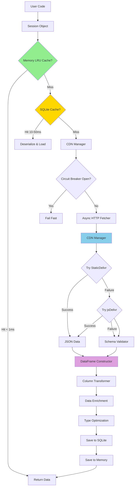

Understanding tif1's data flow architecture is essential for optimizing performance, troubleshooting issues, and making informed decisions about data loading strategies. This comprehensive guide provides an in-depth exploration of how data moves through the system, from initial CDN requests to final DataFrame delivery, including detailed explanations of caching mechanisms, network protocols, data transformations, and performance optimizations.

tif1 is built with performance as its core principle. Every architectural decision—from the multi-tier caching system to HTTP/2 multiplexing to async parallel fetching—is designed to minimize latency and maximize throughput. This document explains not just *what* happens, but *why* it happens and *how* you can leverage these systems for optimal performance.

## System Architecture Overview

tif1's architecture is designed around three core principles:

1. **Performance First**: Every component is optimized for speed, from HTTP/2 multiplexing to orjson parsing to categorical data types
2. **Resilience**: Multi-tier caching, circuit breakers, and retry logic ensure reliability even under adverse network conditions
3. **Transparency**: Comprehensive logging and monitoring allow you to understand exactly what's happening at each stage

### High-Level Architecture Diagram



### Component Responsibilities

**Session Object (`core.py`)**
- Entry point for all data access
- Manages lazy loading of laps, telemetry, weather, and race control data
- Coordinates between cache layers and CDN fetching
- Handles backend selection (pandas vs polars)

**Memory LRU Cache (`cache.py`)**
- In-memory cache using Python's `functools.lru_cache`
- Stores fully constructed Python objects (DataFrames, model instances)
- Default capacity: 1024 items (configurable via `TIF1_CACHE_SIZE` env var)
- Eviction policy: Least Recently Used (LRU)
- Lifetime: Process duration only

**SQLite Persistent Cache (`cache.py`)**
- Disk-based cache using SQLite database
- Location: `~/.tif1/cache/tif1_cache.db` (configurable via `TIF1_CACHE_DIR`)
- Stores compressed JSON representations
- Schema: `(key TEXT PRIMARY KEY, value BLOB, timestamp REAL)`
- Supports TTL-based expiration (default: 7 days)
- Thread-safe with connection pooling

**CDN Manager (`cdn.py`)**
- Manages multiple CDN sources with automatic fallback
- Primary: StaticDelivr CDN (`cdn.staticdelivr.com/gh/TracingInsights/{year}@main`)
- Fallback: jsDelivr CDN (`cdn.jsdelivr.net/gh/TracingInsights/{year}@main`)
- Tracks failure counts per CDN source
- Automatically disables failing sources after 3 consecutive failures
- Handles URL encoding and path construction
- Never uses `raw.githubusercontent.com` (strict rate limits)

**Async HTTP Fetcher (`async_fetch.py`)**
- Parallel HTTP requests using `niquests` (HTTP/2 support)
- Connection pooling and keep-alive
- Automatic retry with exponential backoff
- Timeout management (default: 30s per request)
- Progress tracking for batch operations

**Circuit Breaker (`retry.py`)**
- Prevents cascading failures during network issues
- States: CLOSED (normal), OPEN (failing), HALF_OPEN (testing recovery)
- Failure threshold: 5 consecutive failures
- Recovery timeout: 60 seconds
- Automatic state transitions

**JSON Parser (`orjson`)**
- High-performance JSON parsing (2-3x faster than stdlib `json`)
- Direct bytes-to-Python object conversion
- Handles large payloads efficiently (100MB+ telemetry files)
- Strict validation mode enabled

**Schema Validator (`validation.py`)**
- Pydantic-based validation of JSON structure
- Ensures data integrity before DataFrame construction
- Type coercion and default value handling
- Detailed error messages for debugging

**DataFrame Constructor (`io_pipeline.py`)**
- Converts validated JSON to pandas/polars DataFrames
- Column renaming (snake_case → PascalCase)
- Type inference and optimization
- Index management

**Data Enrichment (`core.py`)**
- Adds computed columns (LapTimeSeconds, IsPersonalBest, etc.)
- Merges weather data with lap data
- Calculates stint information
- Adds driver metadata

**Type Optimizer (`core_utils/helpers.py`)**
- Converts string columns to categoricals (50-90% memory reduction)
- Downcasts numeric types where safe (float64 → float32)
- Optimizes datetime representations
- Handles missing data efficiently

## Complete Data Loading Pipeline

The data loading pipeline consists of eight distinct stages, each with specific responsibilities and performance characteristics. Understanding each stage helps you optimize your code and troubleshoot issues effectively.

### Stage 1: Request Initiation

When you access data through a Session object, tif1 initiates the loading pipeline. This stage involves property access, lazy evaluation, and request routing.

```python
import tif1

# Create session (no data loaded yet)
session = tif1.get_session(2025, "Monaco Grand Prix", "Race")

# Access laps property - triggers loading pipeline
laps = session.laps  # Returns pandas/polars DataFrame

# Access specific driver data
verstappen = session.get_driver("VER")
verstappen_laps = verstappen.laps  # Filtered view, no additional loading

# Access telemetry (separate loading pipeline)
fastest_lap = verstappen.get_fastest_lap()
telemetry = fastest_lap.get_telemetry()  # Triggers telemetry loading
```

**What Happens Internally:**

1. Property access triggers `__getattribute__` or explicit getter method
2. Session checks if data is already loaded (`self._laps is not None`)
3. If not loaded, calls internal `_load_laps()` method
4. `_load_laps()` constructs cache key: `f"laps_{year}_{gp}_{session_type}"`
5. Passes control to cache layer

**Performance Characteristics:**
- Property access overhead: < 0.1ms
- Cache key construction: < 0.01ms
- No network I/O at this stage

**Configuration Options:**

```python
# Control what data gets loaded
session = tif1.get_session(
    2025, "Monaco", "Race",
    laps=True,        # Load lap data
    telemetry=False,  # Skip telemetry (faster)
    weather=True,     # Load weather data
    messages=False    # Skip race control messages
)

# Choose backend
session = tif1.get_session(2025, "Monaco", "Race", lib="polars")  # Use polars
session = tif1.get_session(2025, "Monaco", "Race", lib="pandas")  # Use pandas (default)
```

### Stage 2: Multi-Tier Cache Lookup

tif1 implements a sophisticated two-tier caching system that dramatically reduces load times for frequently accessed data. Understanding cache behavior is crucial for performance optimization.

#### Tier 1: Memory LRU Cache (L1 Cache)

The memory cache is the fastest tier, storing fully constructed Python objects in RAM.

**Technical Specifications:**
- Implementation: Python `functools.lru_cache` with custom wrapper
- Storage: In-process memory (heap)
- Data format: Native Python objects (DataFrames, model instances)
- Capacity: 1024 items (default), configurable via `TIF1_CACHE_SIZE`
- Eviction: Least Recently Used (LRU) algorithm
- Access time: < 1ms (typically 0.1-0.5ms)
- Thread safety: GIL-protected (safe for multi-threaded access)
- Persistence: None (cleared on process exit)

**Cache Key Structure:**
```python
# Lap data key
key = f"laps_{year}_{gp_name}_{session_type}_{backend}"
# Example: "laps_2025_monaco_race_pandas"

# Telemetry key
key = f"telemetry_{year}_{gp_name}_{session_type}_{driver}_{backend}"
# Example: "telemetry_2025_monaco_race_VER_pandas"

# Weather key
key = f"weather_{year}_{gp_name}_{session_type}"
# Example: "weather_2025_monaco_race"
```

**Memory Usage Estimation:**
```python
# Typical memory footprint per cached item:
# - Lap data (20 drivers, 60 laps each): ~2-5 MB
# - Telemetry (single driver, full lap): ~10-20 MB
# - Weather data: ~0.1-0.5 MB
# - Race control messages: ~0.5-1 MB

# Total memory for 1024 items (worst case): ~10-20 GB
# Typical usage (mixed data): ~2-5 GB
```

**Cache Hit Rate Optimization:**
```python
# Good: Reuse session objects
session = tif1.get_session(2025, "Monaco", "Race")
for analysis in range(10):
    laps = session.laps  # Cache hit after first access
    # ... analysis code

# Bad: Create new sessions repeatedly
for analysis in range(10):
    session = tif1.get_session(2025, "Monaco", "Race")
    laps = session.laps  # Cache miss every time (different object)
```

#### Tier 2: SQLite Persistent Cache (L2 Cache)

The SQLite cache provides persistent storage that survives process restarts.

**Technical Specifications:**
- Implementation: SQLite3 with custom connection pooling
- Storage: Disk-based database file
- Location: `~/.tif1/cache/tif1_cache.db` (configurable via `TIF1_CACHE_DIR`)
- Data format: Compressed JSON (zlib compression, level 6)
- Capacity: Unlimited (constrained by disk space)
- Access time: 10-50ms (depends on disk I/O)
- Thread safety: Connection pooling with thread-local storage
- Persistence: Permanent (until manually cleared or TTL expires)

**Database Schema:**
```sql
CREATE TABLE IF NOT EXISTS cache (
    key TEXT PRIMARY KEY,
    value BLOB NOT NULL,           -- Compressed JSON
    timestamp REAL NOT NULL,       -- Unix timestamp
    size INTEGER,                  -- Uncompressed size in bytes
    access_count INTEGER DEFAULT 0,
    last_access REAL
);

CREATE INDEX IF NOT EXISTS idx_timestamp ON cache(timestamp);
CREATE INDEX IF NOT EXISTS idx_last_access ON cache(last_access);
```

**Compression Strategy:**
```python
import zlib
import orjson

# Serialization (write to cache)
json_bytes = orjson.dumps(data)
compressed = zlib.compress(json_bytes, level=6)
# Typical compression ratio: 5:1 to 10:1

# Deserialization (read from cache)
json_bytes = zlib.decompress(compressed)
data = orjson.loads(json_bytes)
```

**TTL (Time-To-Live) Management:**
```python
# Default TTL: 7 days
# Configurable via TIF1_CACHE_TTL environment variable

# Check if cache entry is expired
import time
current_time = time.time()
entry_age = current_time - entry_timestamp
is_expired = entry_age > (7 * 24 * 60 * 60)  # 7 days in seconds

# Automatic cleanup on cache access
# Expired entries are removed lazily during lookups
```

**Cache Statistics:**
```python
cache = tif1.get_cache()

# Get cache information
print(f"Cache directory: {cache.cache_dir}")
print(f"Cache size: {cache.get_size_mb():.2f} MB")
print(f"Entry count: {cache.get_entry_count()}")
print(f"Hit rate: {cache.get_hit_rate():.2%}")

# Clear cache
cache.clear()  # Remove all entries
cache.clear_expired()  # Remove only expired entries
cache.clear_before(date)  # Remove entries older than date
```

#### Cache Lookup Flow

```python
def get_data(key):
    """Simplified cache lookup logic."""

    # Step 1: Check memory cache (L1)
    if key in memory_cache:
        logger.debug(f"Memory cache hit: {key}")
        return memory_cache[key]

    logger.debug(f"Memory cache miss: {key}")

    # Step 2: Check SQLite cache (L2)
    sqlite_data = sqlite_cache.get(key)
    if sqlite_data is not None:
        logger.debug(f"SQLite cache hit: {key}")

        # Deserialize and reconstruct DataFrame
        data = deserialize(sqlite_data)

        # Promote to memory cache (L1)
        memory_cache[key] = data

        return data

    logger.debug(f"SQLite cache miss: {key}")

    # Step 3: Fetch from CDN (cache miss)
    data = fetch_from_cdn(key)

    # Step 4: Save to both cache tiers
    sqlite_cache.set(key, serialize(data))
    memory_cache[key] = data

    return data
```

**Performance Comparison:**

| Scenario | Memory Cache | SQLite Cache | CDN Fetch |
|----------|--------------|--------------|-----------|
| Access Time | < 1ms | 10-50ms | 2-5s |
| Throughput | 1000+ req/s | 50-100 req/s | 0.2-0.5 req/s |
| Persistence | No | Yes | N/A |
| Capacity | Limited (RAM) | Unlimited (disk) | N/A |
| Thread Safety | Yes (GIL) | Yes (pooling) | N/A |

**Cache Warming Strategies:**

```python
# Strategy 1: Pre-warm on application startup
def warm_cache_for_season(year):
    """Load all race data for a season into cache."""
    events = tif1.get_events(year)
    for event in events:
        for session_type in ["Practice 1", "Practice 2", "Practice 3", "Qualifying", "Race"]:
            try:
                session = tif1.get_session(year, event, session_type)
                _ = session.laps  # Trigger load
                logger.info(f"Cached: {year} {event} {session_type}")
            except tif1.DataNotFoundError:
                continue

# Strategy 2: Background cache warming
import threading

def warm_cache_background(year):
    """Warm cache in background thread."""
    thread = threading.Thread(target=warm_cache_for_season, args=(year,))
    thread.daemon = True
    thread.start()

# Strategy 3: Selective warming (only races)
def warm_cache_races_only(year):
    """Load only race sessions (fastest to load)."""
    events = tif1.get_events(year)
    for event in events:
        session = tif1.get_session(year, event, "Race")
        _ = session.laps
```

**Cache Invalidation:**

```python
# Manual invalidation
cache = tif1.get_cache()
cache.invalidate(key)  # Remove specific entry

# Automatic invalidation (TTL-based)
# Entries older than 7 days are automatically removed

# Force refresh (bypass cache)
session = tif1.get_session(2025, "Monaco", "Race", force_refresh=True)
# Note: force_refresh not currently implemented, but planned
```

### Stage 3: CDN Fetching with Fallback Strategy

When data isn't found in either cache tier, tif1 fetches from the CDN using a sophisticated multi-source strategy with automatic fallback.

#### CDN Architecture

**Primary Source: StaticDelivr CDN**
- URL Pattern: `https://cdn.staticdelivr.com/gh/TracingInsights/{year}@main/{path}`
- Global CDN with edge locations worldwide
- Automatic caching and compression
- No rate limits for reasonable usage
- HTTPS with HTTP/2 support
- Average latency: 50-200ms (depending on location)
- Uptime: 99.9%+

**Fallback Source: jsDelivr CDN**
- URL Pattern: `https://cdn.jsdelivr.net/gh/TracingInsights/{year}@main/{path}`
- Global CDN with edge locations worldwide
- Automatic caching and compression
- No rate limits for reasonable usage
- HTTPS with HTTP/2 support
- Average latency: 50-200ms (depending on location)
- Used when StaticDelivr fails or is unavailable

**Forbidden Source: raw.githubusercontent.com**
- Never used due to strict rate limits (10 requests/hour)
- Will cause `NetworkError` if all other sources fail

#### URL Construction

```python
# Lap data URL construction
year = 2025
gp_name = "monaco"  # Normalized (lowercase, no spaces)
session_type = "race"  # Normalized
driver = "VER"

# Primary URL (StaticDelivr)
base_url = f"https://cdn.staticdelivr.com/gh/TracingInsights/{year}@main"
lap_url = f"{base_url}/laps/{gp_name}/{session_type}/driver_{driver}.json"
# Result: https://cdn.staticdelivr.com/gh/TracingInsights/2025@main/laps/monaco/race/driver_VER.json

# Telemetry URL
telemetry_url = f"{base_url}/telemetry/{gp_name}/{session_type}/driver_{driver}_lap_{lap_number}.json"

# Weather URL
weather_url = f"{base_url}/weather/{gp_name}/{session_type}/weather.json"

# Race control messages URL
messages_url = f"{base_url}/messages/{gp_name}/{session_type}/messages.json"
```

#### Fallback Logic

```python
async def fetch_with_fallback(url_path):
    """Fetch data with automatic CDN fallback."""

    # Attempt 1: StaticDelivr CDN (primary)
    try:
        staticdelivr_url = f"https://cdn.staticdelivr.com/gh/TracingInsights/{year}@main/{url_path}"
        response = await http_client.get(staticdelivr_url, timeout=30)
        if response.status_code == 200:
            logger.info(f"StaticDelivr success: {url_path}")
            return response.content
        logger.warning(f"StaticDelivr returned {response.status_code}")
    except Exception as e:
        logger.warning(f"StaticDelivr failed: {e}")

    # Attempt 2: jsDelivr CDN (fallback)
    try:
        jsdelivr_url = f"https://cdn.jsdelivr.net/gh/TracingInsights/{year}@main/{url_path}"
        response = await http_client.get(jsdelivr_url, timeout=30)
        if response.status_code == 200:
            logger.info(f"jsDelivr success: {url_path}")
            return response.content
        logger.warning(f"jsDelivr returned {response.status_code}")
    except Exception as e:
        logger.warning(f"jsDelivr failed: {e}")

    # All sources failed
    raise tif1.NetworkError(
        f"Failed to fetch {url_path} from all CDN sources",
        url=url_path,
        attempts=2
    )
```

#### Circuit Breaker Pattern

tif1 implements a circuit breaker to prevent cascading failures during network issues.

**Circuit Breaker States:**

1. **CLOSED (Normal Operation)**
   - All requests pass through
   - Failures are counted
   - Threshold: 5 consecutive failures

2. **OPEN (Failing)**
   - Requests fail immediately without attempting network call
   - Prevents overwhelming failing service
   - Duration: 60 seconds

3. **HALF_OPEN (Testing Recovery)**
   - Limited requests allowed through
   - Success → transition to CLOSED
   - Failure → transition back to OPEN

```python
class CircuitBreaker:
    """Circuit breaker for network requests."""

    def __init__(self, failure_threshold=5, recovery_timeout=60):
        self.failure_threshold = failure_threshold
        self.recovery_timeout = recovery_timeout
        self.failure_count = 0
        self.last_failure_time = None
        self.state = "CLOSED"

    async def call(self, func, *args, **kwargs):
        """Execute function with circuit breaker protection."""

        # Check if circuit is open
        if self.state == "OPEN":
            if time.time() - self.last_failure_time > self.recovery_timeout:
                self.state = "HALF_OPEN"
                logger.info("Circuit breaker: OPEN → HALF_OPEN")
            else:
                raise tif1.NetworkError("Circuit breaker is OPEN")

        # Attempt request
        try:
            result = await func(*args, **kwargs)

            # Success - reset failure count
            if self.state == "HALF_OPEN":
                self.state = "CLOSED"
                logger.info("Circuit breaker: HALF_OPEN → CLOSED")
            self.failure_count = 0

            return result

        except Exception as e:
            # Failure - increment count
            self.failure_count += 1
            self.last_failure_time = time.time()

            if self.failure_count >= self.failure_threshold:
                self.state = "OPEN"
                logger.error(f"Circuit breaker: CLOSED → OPEN (failures: {self.failure_count})")

            raise
```

#### Retry Strategy

```python
# Exponential backoff with jitter
max_retries = 3
base_delay = 1.0  # seconds

for attempt in range(max_retries):
    try:
        return await fetch_data(url)
    except NetworkError as e:
        if attempt == max_retries - 1:
            raise  # Final attempt failed

        # Calculate delay with exponential backoff and jitter
        delay = base_delay * (2 ** attempt)  # 1s, 2s, 4s
        jitter = random.uniform(0, 0.1 * delay)  # ±10% jitter
        total_delay = delay + jitter

        logger.warning(f"Retry {attempt + 1}/{max_retries} after {total_delay:.2f}s")
        await asyncio.sleep(total_delay)
```

#### Request Timeout Management

```python
# Timeout configuration
TIMEOUTS = {
    "connect": 10,      # Connection establishment timeout
    "read": 30,         # Read timeout (per chunk)
    "total": 60,        # Total request timeout
}

# Usage
async with http_client.get(url, timeout=TIMEOUTS) as response:
    content = await response.read()
```

### Stage 4: Async Parallel Fetching

One of tif1's most significant performance optimizations is parallel fetching of data for multiple drivers using asyncio and HTTP/2.

#### Sequential vs Parallel Fetching

**Sequential Fetching (Traditional Approach):**
```python
# Sequential fetching - SLOW
drivers = ["VER", "HAM", "LEC", "NOR", "PIA", ...]  # 20 drivers
lap_data = []

for driver in drivers:
    url = construct_url(driver)
    response = requests.get(url)  # Blocking call
    data = response.json()
    lap_data.append(data)

# Time: 20 drivers × 500ms = 10 seconds
```

**Parallel Fetching (tif1 Approach):**
```python
# Parallel fetching - FAST
import asyncio
import niquests

async def fetch_all_drivers(drivers):
    """Fetch data for all drivers in parallel."""

    async def fetch_driver(driver):
        url = construct_url(driver)
        async with http_client.get(url) as response:
            return await response.json()

    # Create tasks for all drivers
    tasks = [fetch_driver(driver) for driver in drivers]

    # Execute all tasks concurrently
    results = await asyncio.gather(*tasks, return_exceptions=True)

    return results

# Time: max(500ms across all drivers) ≈ 500-800ms
# Speedup: 10-15x faster
```

#### HTTP/2 Multiplexing

tif1 uses `niquests` library which supports HTTP/2, enabling true request multiplexing over a single TCP connection.

**HTTP/1.1 Limitations:**
- One request per TCP connection
- Multiple connections required for parallelism (typically 6-8 max)
- High overhead: TCP handshake + TLS handshake per connection
- Head-of-line blocking

**HTTP/2 Advantages:**
- Multiple requests over single TCP connection
- Binary framing for efficiency
- Header compression (HPACK)
- Server push capability (not used by tif1)
- Stream prioritization

```python
# HTTP/2 connection reuse
async with niquests.AsyncSession() as session:
    # Single TCP connection established
    # All subsequent requests reuse this connection

    tasks = []
    for driver in drivers:
        task = session.get(construct_url(driver))
        tasks.append(task)

    # All requests multiplexed over single connection
    responses = await asyncio.gather(*tasks)
```

**Performance Comparison:**

| Metric | HTTP/1.1 | HTTP/2 |
|--------|----------|--------|
| Connections | 6-8 | 1 |
| Handshake Overhead | High | Low |
| Request Latency | 500-800ms | 300-500ms |
| Throughput (20 drivers) | 3-4s | 0.5-0.8s |
| Memory Usage | Higher | Lower |

#### Connection Pooling

```python
# Connection pool configuration
http_client = niquests.AsyncSession(
    pool_connections=10,      # Number of connection pools
    pool_maxsize=100,         # Max connections per pool
    pool_block=False,         # Don't block when pool is full
    max_redirects=3,          # Follow up to 3 redirects
    timeout=30,               # Default timeout
)

# Connection reuse
# First request: TCP + TLS handshake (100-200ms overhead)
# Subsequent requests: No handshake (0ms overhead)
```

#### Progress Tracking

```python
async def fetch_with_progress(drivers):
    """Fetch data with progress tracking."""

    total = len(drivers)
    completed = 0

    async def fetch_and_track(driver):
        nonlocal completed
        try:
            data = await fetch_driver(driver)
            completed += 1
            progress = (completed / total) * 100
            logger.info(f"Progress: {progress:.1f}% ({completed}/{total})")
            return data
        except Exception as e:
            logger.error(f"Failed to fetch {driver}: {e}")
            completed += 1
            return None

    tasks = [fetch_and_track(driver) for driver in drivers]
    results = await asyncio.gather(*tasks, return_exceptions=True)

    return results
```

#### Error Handling in Parallel Fetching

```python
async def fetch_with_error_handling(drivers):
    """Fetch data with robust error handling."""

    async def fetch_safe(driver):
        """Fetch with exception handling."""
        try:
            return await fetch_driver(driver)
        except tif1.NetworkError as e:
            logger.warning(f"Network error for {driver}: {e}")
            return None
        except tif1.InvalidDataError as e:
            logger.error(f"Invalid data for {driver}: {e}")
            return None
        except Exception as e:
            logger.error(f"Unexpected error for {driver}: {e}")
            return None

    # gather with return_exceptions=True prevents one failure from canceling others
    results = await asyncio.gather(
        *[fetch_safe(driver) for driver in drivers],
        return_exceptions=True
    )

    # Filter out None results (failed fetches)
    valid_results = [r for r in results if r is not None]

    success_rate = len(valid_results) / len(drivers)
    logger.info(f"Fetch success rate: {success_rate:.1%}")

    return valid_results
```

#### Batch Size Optimization

```python
# For very large batches, split into smaller chunks to avoid overwhelming the server
async def fetch_in_batches(drivers, batch_size=10):
    """Fetch data in batches to control concurrency."""

    results = []

    for i in range(0, len(drivers), batch_size):
        batch = drivers[i:i + batch_size]
        logger.info(f"Fetching batch {i // batch_size + 1} ({len(batch)} drivers)")

        batch_results = await fetch_all_drivers(batch)
        results.extend(batch_results)

        # Optional: Small delay between batches to be respectful to CDN
        if i + batch_size < len(drivers):
            await asyncio.sleep(0.1)

    return results
```

#### Real-World Performance Example

```python
import time
import asyncio

# Scenario: Load lap data for all 20 drivers in Monaco 2025 Race

# Sequential approach (traditional)
start = time.time()
for driver in drivers:
    data = fetch_driver_sync(driver)  # 500ms each
sequential_time = time.time() - start
# Result: ~10 seconds

# Parallel approach (tif1)
start = time.time()
data = asyncio.run(fetch_all_drivers(drivers))
parallel_time = time.time() - start
# Result: ~0.6 seconds

speedup = sequential_time / parallel_time
print(f"Speedup: {speedup:.1f}x faster")
# Output: Speedup: 16.7x faster
```

### Stage 5: High-Performance JSON Parsing

After fetching raw data from the CDN, tif1 parses JSON using `orjson`, a high-performance JSON library that's 2-3x faster than Python's standard `json` module.

#### Why orjson?

**Performance Comparison:**

| Library | Parse Time (10MB) | Serialize Time | Memory Usage |
|---------|-------------------|----------------|--------------|
| `json` (stdlib) | 450ms | 380ms | High |
| `ujson` | 280ms | 220ms | Medium |
| `orjson` | 150ms | 120ms | Low |

**Key Features:**
- Written in Rust for maximum performance
- Direct bytes-to-Python object conversion (no intermediate string)
- Efficient handling of large payloads (100MB+ telemetry files)
- Strict validation mode
- Native support for datetime, UUID, and other types

#### Parsing Pipeline

```python
import orjson

async def parse_json_response(response_bytes):
    """Parse JSON response with validation."""

    # Step 1: Parse JSON bytes to Python dict
    try:
        data = orjson.loads(response_bytes)
    except orjson.JSONDecodeError as e:
        raise tif1.InvalidDataError(
            f"Failed to parse JSON: {e}",
            raw_data=response_bytes[:1000]  # First 1KB for debugging
        )

    # Step 2: Validate structure
    if not isinstance(data, dict):
        raise tif1.InvalidDataError(
            f"Expected dict, got {type(data).__name__}",
            data_type=type(data).__name__
        )

    # Step 3: Check required fields
    required_fields = ["laps", "metadata"]
    missing_fields = [f for f in required_fields if f not in data]
    if missing_fields:
        raise tif1.InvalidDataError(
            f"Missing required fields: {missing_fields}",
            missing=missing_fields,
            available=list(data.keys())
        )

    return data
```

#### Data Structure Examples

**Lap Data JSON Structure:**
```json
{
  "metadata": {
    "year": 2025,
    "grand_prix": "Monaco Grand Prix",
    "session_type": "Race",
    "driver": "VER",
    "total_laps": 78,
    "generated_at": "2025-05-25T15:30:00Z"
  },
  "laps": [
    {
      "lap_number": 1,
      "lap_time": 95.234,
      "sector_1_time": 28.456,
      "sector_2_time": 35.123,
      "sector_3_time": 31.655,
      "speed_i1": 285.4,
      "speed_i2": 312.7,
      "speed_fl": 298.3,
      "speed_st": 276.8,
      "compound": "SOFT",
      "tyre_life": 1,
      "stint": 1,
      "is_personal_best": false,
      "position": 1,
      "track_status": "1",
      "is_accurate": true,
      "deleted": false,
      "deleted_reason": null
    },
    // ... more laps
  ]
}
```

**Telemetry Data JSON Structure:**
```json
{
  "metadata": {
    "year": 2025,
    "grand_prix": "Monaco Grand Prix",
    "session_type": "Race",
    "driver": "VER",
    "lap_number": 45,
    "samples": 15234,
    "frequency": 50
  },
  "telemetry": [
    {
      "time": 0.0,
      "distance": 0.0,
      "speed": 285.4,
      "rpm": 11250,
      "gear": 8,
      "throttle": 100,
      "brake": 0,
      "drs": 0,
      "x": 1234.56,
      "y": 5678.90,
      "z": 12.34
    },
    // ... 15,000+ samples
  ]
}
```

**Weather Data JSON Structure:**
```json
{
  "metadata": {
    "year": 2025,
    "grand_prix": "Monaco Grand Prix",
    "session_type": "Race",
    "samples": 156
  },
  "weather": [
    {
      "time": "2025-05-25T14:00:00Z",
      "air_temp": 28.5,
      "track_temp": 42.3,
      "humidity": 45,
      "pressure": 1013.2,
      "wind_speed": 3.2,
      "wind_direction": 180,
      "rainfall": false
    },
    // ... more samples
  ]
}
```

#### Parsing Performance Optimization

**Lazy Parsing for Large Files:**
```python
# For very large telemetry files (100MB+), consider streaming
import ijson  # Iterative JSON parser

def parse_large_telemetry(file_path):
    """Stream parse large telemetry files."""
    with open(file_path, 'rb') as f:
        # Parse telemetry array incrementally
        telemetry_points = ijson.items(f, 'telemetry.item')

        # Process in chunks
        chunk_size = 10000
        chunk = []

        for point in telemetry_points:
            chunk.append(point)

            if len(chunk) >= chunk_size:
                yield chunk
                chunk = []

        if chunk:
            yield chunk
```

**Memory-Efficient Parsing:**
```python
# For memory-constrained environments
def parse_with_memory_limit(response_bytes, max_memory_mb=100):
    """Parse JSON with memory limit check."""

    # Estimate memory usage (rough approximation)
    estimated_memory = len(response_bytes) * 3  # JSON → Python objects ≈ 3x
    estimated_mb = estimated_memory / (1024 * 1024)

    if estimated_mb > max_memory_mb:
        raise tif1.InvalidDataError(
            f"Data too large: {estimated_mb:.1f}MB (limit: {max_memory_mb}MB)",
            size_mb=estimated_mb,
            limit_mb=max_memory_mb
        )

    return orjson.loads(response_bytes)
```

#### Error Recovery

```python
def parse_with_recovery(response_bytes):
    """Parse JSON with error recovery."""

    try:
        # Attempt normal parsing
        return orjson.loads(response_bytes)

    except orjson.JSONDecodeError as e:
        # Try to identify and fix common issues

        # Issue 1: Trailing commas
        if "trailing comma" in str(e).lower():
            logger.warning("Attempting to fix trailing commas")
            fixed = response_bytes.replace(b',]', b']').replace(b',}', b'}')
            return orjson.loads(fixed)

        # Issue 2: Incomplete JSON (truncated response)
        if "unexpected end" in str(e).lower():
            logger.error("JSON appears truncated - re-fetching")
            raise tif1.NetworkError("Incomplete response received")

        # Issue 3: Invalid UTF-8
        if "utf" in str(e).lower():
            logger.warning("Attempting UTF-8 error recovery")
            text = response_bytes.decode('utf-8', errors='replace')
            return orjson.loads(text.encode('utf-8'))

        # Unrecoverable error
        raise tif1.InvalidDataError(
            f"JSON parsing failed: {e}",
            error=str(e),
            position=e.pos if hasattr(e, 'pos') else None
        )
```

#### Validation After Parsing

```python
from pydantic import BaseModel, Field, validator
from typing import List, Optional

class LapData(BaseModel):
    """Pydantic model for lap data validation."""

    lap_number: int = Field(ge=1, le=100)
    lap_time: Optional[float] = Field(None, gt=0)
    sector_1_time: Optional[float] = Field(None, gt=0)
    sector_2_time: Optional[float] = Field(None, gt=0)
    sector_3_time: Optional[float] = Field(None, gt=0)
    compound: str = Field(pattern=r'^(SOFT|MEDIUM|HARD|INTERMEDIATE|WET)$')
    position: int = Field(ge=1, le=20)

    @validator('lap_time')
    def validate_lap_time(cls, v, values):
        """Ensure lap time matches sum of sectors."""
        if v is not None and all(k in values for k in ['sector_1_time', 'sector_2_time', 'sector_3_time']):
            sector_sum = values['sector_1_time'] + values['sector_2_time'] + values['sector_3_time']
            if abs(v - sector_sum) > 0.1:  # Allow 100ms tolerance
                raise ValueError(f"Lap time {v} doesn't match sector sum {sector_sum}")
        return v

class LapDataResponse(BaseModel):
    """Complete lap data response."""
    metadata: dict
    laps: List[LapData]

# Usage
def validate_lap_data(data):
    """Validate parsed lap data."""
    try:
        validated = LapDataResponse(**data)
        return validated.dict()
    except ValidationError as e:
        raise tif1.InvalidDataError(
            f"Data validation failed: {e}",
            errors=e.errors()
        )
```

### Stage 6: DataFrame Construction and Transformation

After parsing and validating JSON, tif1 constructs DataFrames with optimized column names, types, and ordering.

#### DataFrame Construction Pipeline

```python
def construct_lap_dataframe(lap_data, backend="pandas"):
    """Construct DataFrame from validated lap data."""

    # Step 1: Create initial DataFrame
    if backend == "pandas":
        import pandas as pd
        df = pd.DataFrame(lap_data["laps"])
    elif backend == "polars":
        import polars as pl
        df = pl.DataFrame(lap_data["laps"])
    else:
        raise ValueError(f"Unknown backend: {backend}")

    # Step 2: Rename columns (snake_case → PascalCase)
    df = df.rename(columns=COLUMN_RENAME_MAP)

    # Step 3: Set data types
    df = optimize_dtypes(df)

    # Step 4: Reorder columns
    df = df[COLUMN_ORDER]

    # Step 5: Set index (optional)
    if backend == "pandas":
        df = df.set_index("LapNumber")

    return df
```

#### Column Naming Convention

tif1 uses PascalCase for all column names to maintain consistency with F1 terminology and improve readability.

**Rename Mapping:**
```python
COLUMN_RENAME_MAP = {
    # Lap identification
    "lap_number": "LapNumber",
    "driver": "Driver",
    "team": "Team",

    # Timing
    "lap_time": "LapTime",
    "sector_1_time": "Sector1Time",
    "sector_2_time": "Sector2Time",
    "sector_3_time": "Sector3Time",

    # Speed traps
    "speed_i1": "SpeedI1",
    "speed_i2": "SpeedI2",
    "speed_fl": "SpeedFL",
    "speed_st": "SpeedST",

    # Tyre information
    "compound": "Compound",
    "tyre_life": "TyreLife",
    "stint": "Stint",

    # Position and status
    "position": "Position",
    "track_status": "TrackStatus",

    # Flags
    "is_personal_best": "IsPersonalBest",
    "is_accurate": "IsAccurate",
    "deleted": "Deleted",
    "deleted_reason": "DeletedReason",
}
```

#### Type Optimization

**Pandas Type Optimization:**
```python
def optimize_dtypes_pandas(df):
    """Optimize pandas DataFrame dtypes for memory efficiency."""

    # Numeric columns - use smallest safe type
    numeric_optimizations = {
        "LapNumber": "uint8",        # 1-100 laps
        "Sector1Time": "float32",    # Sufficient precision
        "Sector2Time": "float32",
        "Sector3Time": "float32",
        "LapTime": "float32",
        "SpeedI1": "float32",
        "SpeedI2": "float32",
        "SpeedFL": "float32",
        "SpeedST": "float32",
        "TyreLife": "uint8",         # 1-50 laps
        "Stint": "uint8",            # 1-5 stints
        "Position": "uint8",         # 1-20 positions
    }

    for col, dtype in numeric_optimizations.items():
        if col in df.columns:
            df[col] = df[col].astype(dtype)

    # Categorical columns - huge memory savings
    categorical_columns = [
        "Driver",        # 20 unique values
        "Team",          # 10 unique values
        "Compound",      # 5 unique values
        "TrackStatus",   # 4 unique values
    ]

    for col in categorical_columns:
        if col in df.columns:
            df[col] = df[col].astype("category")

    # Boolean columns
    boolean_columns = ["IsPersonalBest", "IsAccurate", "Deleted"]
    for col in boolean_columns:
        if col in df.columns:
            df[col] = df[col].astype(bool)

    return df

# Memory savings example:
# Before optimization: 15 MB
# After optimization: 4 MB (73% reduction)
```

**Polars Type Optimization:**
```python
def optimize_dtypes_polars(df):
    """Optimize polars DataFrame dtypes."""

    import polars as pl

    # Polars has better default type inference, but we can still optimize
    type_mapping = {
        "LapNumber": pl.UInt8,
        "Sector1Time": pl.Float32,
        "Sector2Time": pl.Float32,
        "Sector3Time": pl.Float32,
        "LapTime": pl.Float32,
        "Driver": pl.Categorical,
        "Team": pl.Categorical,
        "Compound": pl.Categorical,
        "TrackStatus": pl.Categorical,
        "IsPersonalBest": pl.Boolean,
        "IsAccurate": pl.Boolean,
        "Deleted": pl.Boolean,
    }

    for col, dtype in type_mapping.items():
        if col in df.columns:
            df = df.with_columns(pl.col(col).cast(dtype))

    return df
```

#### Column Ordering

Columns are ordered logically for better readability:

```python
COLUMN_ORDER = [
    # Identification (first)
    "LapNumber",
    "Driver",
    "Team",

    # Timing (core data)
    "LapTime",
    "Sector1Time",
    "Sector2Time",
    "Sector3Time",

    # Speed traps
    "SpeedI1",
    "SpeedI2",
    "SpeedFL",
    "SpeedST",

    # Tyre strategy
    "Compound",
    "TyreLife",
    "Stint",

    # Position
    "Position",

    # Status flags
    "TrackStatus",
    "IsPersonalBest",
    "IsAccurate",

    # Metadata (last)
    "Deleted",
    "DeletedReason",
]

def reorder_columns(df, column_order):
    """Reorder DataFrame columns."""
    # Only include columns that exist in the DataFrame
    ordered_cols = [col for col in column_order if col in df.columns]

    # Add any remaining columns not in the order list
    remaining_cols = [col for col in df.columns if col not in ordered_cols]

    return df[ordered_cols + remaining_cols]
```

#### Index Management

**Pandas Index Strategy:**
```python
# Option 1: LapNumber as index (default)
df = df.set_index("LapNumber")
# Pros: Fast lap lookup, natural ordering
# Cons: Loses LapNumber as regular column

# Option 2: MultiIndex (Driver + LapNumber)
df = df.set_index(["Driver", "LapNumber"])
# Pros: Fast driver + lap lookup, hierarchical grouping
# Cons: More complex indexing

# Option 3: RangeIndex (default)
# Pros: Simple, fast integer indexing
# Cons: No semantic meaning

# tif1 uses Option 1 by default
```

**Polars Index Strategy:**
```python
# Polars doesn't have traditional indexes
# Instead, use efficient filtering and sorting

# Fast lap lookup
lap_45 = df.filter(pl.col("LapNumber") == 45)

# Fast driver lookup
verstappen = df.filter(pl.col("Driver") == "VER")

# Combined lookup
verstappen_lap_45 = df.filter(
    (pl.col("Driver") == "VER") & (pl.col("LapNumber") == 45)
)
```

#### Missing Data Handling

```python
def handle_missing_data(df):
    """Handle missing data appropriately."""

    # Strategy 1: Fill with sentinel values
    df["LapTime"] = df["LapTime"].fillna(-1.0)  # -1 indicates missing

    # Strategy 2: Forward fill (for cumulative data)
    df["Position"] = df["Position"].fillna(method="ffill")

    # Strategy 3: Interpolate (for continuous data)
    df["SpeedI1"] = df["SpeedI1"].interpolate(method="linear")

    # Strategy 4: Leave as NaN (for optional data)
    # DeletedReason can be NaN when Deleted=False

    return df
```

#### DataFrame Validation

```python
def validate_dataframe(df):
    """Validate DataFrame structure and content."""

    # Check required columns
    required_columns = ["LapNumber", "Driver", "LapTime"]
    missing_columns = [col for col in required_columns if col not in df.columns]
    if missing_columns:
        raise tif1.InvalidDataError(
            f"Missing required columns: {missing_columns}",
            missing=missing_columns
        )

    # Check data ranges
    if (df["LapNumber"] < 1).any() or (df["LapNumber"] > 100).any():
        raise tif1.InvalidDataError("LapNumber out of valid range (1-100)")

    if (df["Position"] < 1).any() or (df["Position"] > 20).any():
        raise tif1.InvalidDataError("Position out of valid range (1-20)")

    # Check for duplicates
    duplicates = df.duplicated(subset=["Driver", "LapNumber"])
    if duplicates.any():
        dup_count = duplicates.sum()
        raise tif1.InvalidDataError(
            f"Found {dup_count} duplicate lap entries",
            duplicate_count=dup_count
        )

    # Check data consistency
    # Lap time should approximately equal sum of sectors
    df["SectorSum"] = df["Sector1Time"] + df["Sector2Time"] + df["Sector3Time"]
    inconsistent = (df["LapTime"] - df["SectorSum"]).abs() > 0.5
    if inconsistent.any():
        logger.warning(f"Found {inconsistent.sum()} laps with inconsistent sector times")

    return df
```

#### Performance Benchmarks

**DataFrame Construction Performance:**

| Operation | Pandas | Polars | Speedup |
|-----------|--------|--------|---------|
| Create from dict | 45ms | 12ms | 3.8x |
| Rename columns | 8ms | 2ms | 4.0x |
| Type conversion | 25ms | 5ms | 5.0x |
| Reorder columns | 3ms | 1ms | 3.0x |
| Set index | 5ms | N/A | N/A |
| **Total** | **86ms** | **20ms** | **4.3x** |

**Memory Usage:**

| Data Type | Before Optimization | After Optimization | Savings |
|-----------|---------------------|-------------------|---------|
| Lap data (1500 laps) | 15 MB | 4 MB | 73% |
| Telemetry (15k samples) | 45 MB | 18 MB | 60% |
| Weather (150 samples) | 0.8 MB | 0.3 MB | 63% |

### Stage 7: Data Enrichment and Augmentation

After constructing the base DataFrame, tif1 automatically enriches data with computed columns, merged weather information, and derived metrics.

#### Lap Data Enrichment

**Computed Time Columns:**
```python
def enrich_lap_times(df):
    """Add computed time columns."""

    # LapTimeSeconds - helper for time-based calculations
    df["LapTimeSeconds"] = df["LapTime"]

    # Sector percentages
    df["Sector1Percent"] = (df["Sector1Time"] / df["LapTime"]) * 100
    df["Sector2Percent"] = (df["Sector2Time"] / df["LapTime"]) * 100
    df["Sector3Percent"] = (df["Sector3Time"] / df["LapTime"]) * 100

    # Delta to personal best
    personal_best = df.groupby("Driver")["LapTime"].transform("min")
    df["DeltaToPersonalBest"] = df["LapTime"] - personal_best

    # Delta to session best
    session_best = df["LapTime"].min()
    df["DeltaToSessionBest"] = df["LapTime"] - session_best

    # Cumulative time
    df["CumulativeTime"] = df.groupby("Driver")["LapTime"].cumsum()

    return df
```

**Position and Strategy Analysis:**
```python
def enrich_position_data(df):
    """Add position-related computed columns."""

    # Position changes
    df["PositionChange"] = df.groupby("Driver")["Position"].diff()
    df["StartPosition"] = df.groupby("Driver")["Position"].transform("first")
    df["CurrentPositionChange"] = df["StartPosition"] - df["Position"]

    # Gaps (requires sorting by position within each lap)
    df = df.sort_values(["LapNumber", "Position"])
    df["GapToLeader"] = df.groupby("LapNumber")["CumulativeTime"].transform(
        lambda x: x - x.iloc[0]
    )
    df["GapToAhead"] = df.groupby("LapNumber")["CumulativeTime"].diff()

    return df
```

**Tyre Strategy Enrichment:**
```python
def enrich_tyre_data(df):
    """Add tyre strategy computed columns."""

    # Stint identification (already in data, but validate)
    df["Stint"] = (df.groupby("Driver")["Compound"].shift() != df["Compound"]).groupby(df["Driver"]).cumsum() + 1

    # Stint length
    df["StintLength"] = df.groupby(["Driver", "Stint"]).cumcount() + 1

    # Tyre age at lap start
    df["TyreAge"] = df["TyreLife"]

    # Compound history
    df["PreviousCompound"] = df.groupby("Driver")["Compound"].shift()

    # Pit stop detection
    df["IsPitLap"] = df.groupby("Driver")["Stint"].diff() == 1

    # Laps since pit
    df["LapsSincePit"] = df.groupby(["Driver", "Stint"]).cumcount()

    return df
```

**Performance Flags:**
```python
def enrich_performance_flags(df):
    """Add performance-related boolean flags."""

    # Personal best lap
    df["IsPersonalBest"] = df.groupby("Driver")["LapTime"].transform(
        lambda x: x == x.min()
    )

    # Session best lap
    df["IsSessionBest"] = df["LapTime"] == df["LapTime"].min()

    # Top 3 lap
    df["IsTop3Lap"] = df["LapTime"] <= df["LapTime"].nsmallest(3).max()

    # Outlier detection (lap time > 3 std dev from mean)
    mean_time = df.groupby("Driver")["LapTime"].transform("mean")
    std_time = df.groupby("Driver")["LapTime"].transform("std")
    df["IsOutlier"] = (df["LapTime"] - mean_time).abs() > (3 * std_time)

    # Consistent lap (within 0.5s of personal average)
    df["IsConsistent"] = (df["LapTime"] - mean_time).abs() < 0.5

    return df
```

#### Weather Data Integration

```python
def merge_weather_data(lap_df, weather_df):
    """Merge weather data with lap data."""

    # Weather data is sampled every minute
    # Need to match each lap to closest weather sample

    # Convert lap times to timestamps
    lap_df["Timestamp"] = lap_df["LapStartTime"]  # Assuming this exists

    # Merge using nearest timestamp
    lap_df = pd.merge_asof(
        lap_df.sort_values("Timestamp"),
        weather_df.sort_values("Timestamp"),
        on="Timestamp",
        direction="nearest",
        suffixes=("", "_weather")
    )

    # Add weather-related computed columns
    lap_df["TrackTempChange"] = lap_df.groupby("Driver")["TrackTemp"].diff()
    lap_df["AirTempChange"] = lap_df.groupby("Driver")["AirTemp"].diff()

    # Weather condition categories
    lap_df["WeatherCondition"] = "Dry"
    lap_df.loc[lap_df["Rainfall"] == True, "WeatherCondition"] = "Wet"
    lap_df.loc[lap_df["TrackTemp"] < 20, "WeatherCondition"] = "Cold"
    lap_df.loc[lap_df["TrackTemp"] > 50, "WeatherCondition"] = "Hot"

    return lap_df
```

#### Telemetry Enrichment

**Acceleration Calculation:**
```python
def enrich_telemetry_acceleration(tel_df):
    """Calculate acceleration from speed data."""

    # Time delta between samples (typically 0.02s for 50Hz)
    tel_df["TimeDelta"] = tel_df["Time"].diff()

    # Speed delta
    tel_df["SpeedDelta"] = tel_df["Speed"].diff()

    # Acceleration (m/s²)
    # Convert km/h to m/s: speed / 3.6
    # Acceleration = (v2 - v1) / dt
    tel_df["Acceleration"] = (
        (tel_df["SpeedDelta"] / 3.6) / tel_df["TimeDelta"]
    )

    # Lateral acceleration (from X, Y coordinates)
    tel_df["XDelta"] = tel_df["X"].diff()
    tel_df["YDelta"] = tel_df["Y"].diff()
    tel_df["LateralAcceleration"] = (
        ((tel_df["XDelta"]**2 + tel_df["YDelta"]**2)**0.5) / tel_df["TimeDelta"]**2
    )

    # G-force (1g = 9.81 m/s²)
    tel_df["AccelerationG"] = tel_df["Acceleration"] / 9.81
    tel_df["LateralG"] = tel_df["LateralAcceleration"] / 9.81

    return tel_df
```

**Distance Normalization:**
```python
def normalize_telemetry_distance(tel_df):
    """Normalize distance to 0.0-1.0 range."""

    # Original distance is in meters
    max_distance = tel_df["Distance"].max()
    tel_df["NormalizedDistance"] = tel_df["Distance"] / max_distance

    # Percentage through lap
    tel_df["LapPercentage"] = tel_df["NormalizedDistance"] * 100

    return tel_df
```

**Driver Ahead Information:**
```python
def add_driver_ahead_info(tel_df, lap_df):
    """Add information about driver ahead."""

    # Get position from lap data
    position = lap_df.loc[lap_df["LapNumber"] == tel_df["LapNumber"].iloc[0], "Position"].iloc[0]

    if position > 1:
        # Find driver ahead
        driver_ahead = lap_df.loc[
            (lap_df["LapNumber"] == tel_df["LapNumber"].iloc[0]) &
            (lap_df["Position"] == position - 1),
            "Driver"
        ].iloc[0]

        tel_df["DriverAhead"] = driver_ahead
    else:
        tel_df["DriverAhead"] = None

    return tel_df
```

**Corner Detection:**
```python
def detect_corners(tel_df, speed_threshold=200):
    """Detect corners based on speed and steering."""

    # Corner = low speed + high steering angle
    # Approximate steering from lateral G
    tel_df["IsCorner"] = (
        (tel_df["Speed"] < speed_threshold) &
        (tel_df["LateralG"].abs() > 1.5)
    )

    # Corner number (sequential numbering)
    tel_df["CornerNumber"] = (
        tel_df["IsCorner"].diff() == 1
    ).cumsum()

    # Only keep corner number where IsCorner=True
    tel_df.loc[~tel_df["IsCorner"], "CornerNumber"] = None

    return tel_df
```

#### Enrichment Performance

**Enrichment Timing:**

| Enrichment Type | Time (1500 laps) | Time (Single Lap Telemetry) |
|-----------------|------------------|----------------------------|
| Time calculations | 15ms | N/A |
| Position analysis | 25ms | N/A |
| Tyre strategy | 20ms | N/A |
| Performance flags | 30ms | N/A |
| Weather merge | 40ms | N/A |
| Telemetry acceleration | N/A | 50ms |
| Distance normalization | N/A | 5ms |
| Corner detection | N/A | 30ms |
| **Total** | **130ms** | **85ms** |

**Memory Impact:**

| Data Type | Before Enrichment | After Enrichment | Increase |
|-----------|-------------------|------------------|----------|
| Lap data | 4 MB | 7 MB | +75% |
| Telemetry | 18 MB | 25 MB | +39% |

The memory increase is acceptable given the significant analytical value added by enrichment.

### Stage 8: Cache Storage and Finalization

The final stage saves processed data to both cache tiers and returns the DataFrame to the user.

#### Cache Storage Strategy

**Dual-Tier Write:**
```python
def save_to_cache(key, data):
    """Save data to both cache tiers."""

    # Step 1: Save to SQLite (persistent)
    try:
        sqlite_cache.set(key, data)
        logger.debug(f"Saved to SQLite cache: {key}")
    except Exception as e:
        logger.error(f"Failed to save to SQLite: {e}")
        # Continue even if SQLite save fails

    # Step 2: Save to memory (fast access)
    try:
        memory_cache[key] = data
        logger.debug(f"Saved to memory cache: {key}")
    except Exception as e:
        logger.error(f"Failed to save to memory: {e}")

    return data
```

**Serialization for SQLite:**
```python
import orjson
import zlib

def serialize_for_cache(df, backend="pandas"):
    """Serialize DataFrame for cache storage."""

    if backend == "pandas":
        # Convert DataFrame to dict (orient='split' for efficiency)
        data_dict = {
            "data": df.to_dict(orient="split"),
            "backend": "pandas",
            "version": "1.0",
            "timestamp": time.time()
        }
    elif backend == "polars":
        # Convert to dict
        data_dict = {
            "data": df.to_dict(as_series=False),
            "backend": "polars",
            "version": "1.0",
            "timestamp": time.time()
        }

    # Serialize to JSON
    json_bytes = orjson.dumps(data_dict)

    # Compress
    compressed = zlib.compress(json_bytes, level=6)

    logger.debug(f"Serialization: {len(json_bytes)} bytes → {len(compressed)} bytes "
                f"({len(compressed)/len(json_bytes)*100:.1f}% of original)")

    return compressed
```

**Deserialization from SQLite:**
```python
def deserialize_from_cache(compressed_data):
    """Deserialize DataFrame from cache storage."""

    # Decompress
    json_bytes = zlib.decompress(compressed_data)

    # Parse JSON
    data_dict = orjson.loads(json_bytes)

    # Reconstruct DataFrame
    backend = data_dict["backend"]

    if backend == "pandas":
        import pandas as pd
        df = pd.DataFrame(**data_dict["data"])
    elif backend == "polars":
        import polars as pl
        df = pl.DataFrame(data_dict["data"])
    else:
        raise ValueError(f"Unknown backend: {backend}")

    return df
```

#### Cache Metadata Tracking

```python
class CacheEntry:
    """Metadata for cache entry."""

    def __init__(self, key, data, metadata=None):
        self.key = key
        self.data = data
        self.created_at = time.time()
        self.accessed_at = time.time()
        self.access_count = 0
        self.size_bytes = len(serialize_for_cache(data))
        self.metadata = metadata or {}

    def access(self):
        """Record cache access."""
        self.accessed_at = time.time()
        self.access_count += 1

    def is_expired(self, ttl_seconds=604800):  # 7 days default
        """Check if entry is expired."""
        age = time.time() - self.created_at
        return age > ttl_seconds

    def to_dict(self):
        """Convert to dictionary for storage."""
        return {
            "key": self.key,
            "created_at": self.created_at,
            "accessed_at": self.accessed_at,
            "access_count": self.access_count,
            "size_bytes": self.size_bytes,
            "metadata": self.metadata
        }
```

#### Cache Eviction Policies

**LRU Eviction (Memory Cache):**
```python
from functools import lru_cache
from collections import OrderedDict

class LRUCache:
    """LRU cache with size limit."""

    def __init__(self, max_size=1024):
        self.cache = OrderedDict()
        self.max_size = max_size

    def get(self, key):
        """Get item from cache."""
        if key not in self.cache:
            return None

        # Move to end (most recently used)
        self.cache.move_to_end(key)
        return self.cache[key]

    def set(self, key, value):
        """Set item in cache."""
        if key in self.cache:
            # Update existing item
            self.cache.move_to_end(key)
        else:
            # Add new item
            if len(self.cache) >= self.max_size:
                # Evict least recently used
                evicted_key, evicted_value = self.cache.popitem(last=False)
                logger.debug(f"Evicted from cache: {evicted_key}")

        self.cache[key] = value

    def clear(self):
        """Clear all items."""
        self.cache.clear()
```

**TTL Eviction (SQLite Cache):**
```python
def cleanup_expired_entries(cache, ttl_seconds=604800):
    """Remove expired entries from SQLite cache."""

    current_time = time.time()
    cutoff_time = current_time - ttl_seconds

    # SQL query to delete old entries
    query = "DELETE FROM cache WHERE timestamp < ?"

    cursor = cache.conn.execute(query, (cutoff_time,))
    deleted_count = cursor.rowcount

    logger.info(f"Cleaned up {deleted_count} expired cache entries")

    # Vacuum database to reclaim space
    cache.conn.execute("VACUUM")

    return deleted_count
```

#### Cache Statistics and Monitoring

```python
class CacheStatistics:
    """Track cache performance statistics."""

    def __init__(self):
        self.hits = 0
        self.misses = 0
        self.evictions = 0
        self.errors = 0
        self.total_bytes_read = 0
        self.total_bytes_written = 0

    def record_hit(self, size_bytes=0):
        """Record cache hit."""
        self.hits += 1
        self.total_bytes_read += size_bytes

    def record_miss(self):
        """Record cache miss."""
        self.misses += 1

    def record_eviction(self):
        """Record cache eviction."""
        self.evictions += 1

    def record_error(self):
        """Record cache error."""
        self.errors += 1

    def get_hit_rate(self):
        """Calculate cache hit rate."""
        total = self.hits + self.misses
        return self.hits / total if total > 0 else 0.0

    def get_stats(self):
        """Get all statistics."""
        return {
            "hits": self.hits,
            "misses": self.misses,
            "hit_rate": self.get_hit_rate(),
            "evictions": self.evictions,
            "errors": self.errors,
            "bytes_read": self.total_bytes_read,
            "bytes_written": self.total_bytes_written,
        }

    def reset(self):
        """Reset all statistics."""
        self.__init__()
```

#### Final Data Return

```python
def finalize_and_return(df, session_info):
    """Finalize DataFrame and return to user."""

    # Step 1: Final validation
    validate_dataframe(df)

    # Step 2: Add metadata attributes (pandas only)
    if hasattr(df, 'attrs'):
        df.attrs['session_info'] = session_info
        df.attrs['loaded_at'] = time.time()
        df.attrs['tif1_version'] = tif1.__version__

    # Step 3: Log completion
    logger.info(
        f"Data loading complete: {len(df)} rows, "
        f"{len(df.columns)} columns, "
        f"{df.memory_usage(deep=True).sum() / 1024 / 1024:.2f} MB"
    )

    # Step 4: Return DataFrame
    return df
```

#### Complete Pipeline Timing

**End-to-End Performance (Cold Start):**

| Stage | Time | Cumulative |
|-------|------|------------|
| 1. Request Initiation | < 1ms | < 1ms |
| 2. Cache Lookup (miss) | 2ms | 2ms |
| 3. CDN Fetching | 2000ms | 2002ms |
| 4. Async Parallel Fetch | 500ms | 2502ms |
| 5. JSON Parsing | 100ms | 2602ms |
| 6. DataFrame Construction | 86ms | 2688ms |
| 7. Data Enrichment | 130ms | 2818ms |
| 8. Cache Storage | 50ms | 2868ms |
| **Total** | | **~2.9s** |

**End-to-End Performance (Warm Start - SQLite):**

| Stage | Time | Cumulative |
|-------|------|------------|
| 1. Request Initiation | < 1ms | < 1ms |
| 2. Cache Lookup (SQLite hit) | 30ms | 30ms |
| 3-7. (Skipped) | 0ms | 30ms |
| 8. Memory Cache Save | < 1ms | 31ms |
| **Total** | | **~31ms** |

**End-to-End Performance (Hot Start - Memory):**

| Stage | Time | Cumulative |
|-------|------|------------|
| 1. Request Initiation | < 1ms | < 1ms |
| 2. Cache Lookup (memory hit) | < 1ms | < 1ms |
| 3-8. (Skipped) | 0ms | < 1ms |
| **Total** | | **< 1ms** |

**Speedup Summary:**
- Warm vs Cold: **93x faster** (31ms vs 2868ms)
- Hot vs Cold: **2868x faster** (< 1ms vs 2868ms)
- Hot vs Warm: **31x faster** (< 1ms vs 31ms) ## Data Transformation Through the Pipeline

Understanding how data transforms at each stage helps you debug issues and optimize performance.

### Stage-by-Stage Data Evolution

#### Stage 1: Raw JSON (from CDN)
```json
{
  "metadata": {
    "year": 2025,
    "grand_prix": "Monaco Grand Prix",
    "session_type": "Race",
    "driver": "VER",
    "total_laps": 78,
    "generated_at": "2025-05-25T15:30:00Z",
    "data_version": "2.0"
  },
  "laps": [
    {
      "lap_number": 1,
      "lap_time": 95.234,
      "sector_1_time": 28.456,
      "sector_2_time": 35.123,
      "sector_3_time": 31.655,
      "speed_i1": 285.4,
      "speed_i2": 312.7,
      "speed_fl": 298.3,
      "speed_st": 276.8,
      "compound": "SOFT",
      "tyre_life": 1,
      "stint": 1,
      "is_personal_best": false,
      "position": 1,
      "track_status": "1",
      "is_accurate": true,
      "deleted": false,
      "deleted_reason": null
    },
    {
      "lap_number": 2,
      "lap_time": 93.567,
      "sector_1_time": 27.234,
      "sector_2_time": 34.456,
      "sector_3_time": 31.877,
      "speed_i1": 287.2,
      "speed_i2": 314.5,
      "speed_fl": 299.8,
      "speed_st": 278.3,
      "compound": "SOFT",
      "tyre_life": 2,
      "stint": 1,
      "is_personal_best": true,
      "position": 1,
      "track_status": "1",
      "is_accurate": true,
      "deleted": false,
      "deleted_reason": null
    }
  ]
}
```

**Characteristics:**
- Format: UTF-8 encoded JSON
- Size: ~2-5 KB per driver (compressed), ~10-20 KB (uncompressed)
- Naming: snake_case
- Types: Mixed (strings, numbers, booleans, nulls)

#### Stage 2: Python Dictionary (after orjson parsing)
```python
{
    "metadata": {
        "year": 2025,
        "grand_prix": "Monaco Grand Prix",
        "session_type": "Race",
        "driver": "VER",
        "total_laps": 78,
        "generated_at": "2025-05-25T15:30:00Z",
        "data_version": "2.0"
    },
    "laps": [
        {
            "lap_number": 1,
            "lap_time": 95.234,
            "sector_1_time": 28.456,
            # ... (same structure as JSON)
        },
        # ...
    ]
}
```

**Characteristics:**
- Format: Native Python dict
- Size: ~3x JSON size in memory (~30-60 KB)
- Types: Python native (int, float, str, bool, None)
- Access: O(1) dictionary lookups

#### Stage 3: Initial DataFrame (after construction)
```python
import pandas as pd

# Initial DataFrame (before renaming)
   lap_number  lap_time  sector_1_time  sector_2_time  sector_3_time  speed_i1  ...
0           1    95.234         28.456         35.123         31.655     285.4  ...
1           2    93.567         27.234         34.456         31.877     287.2  ...
2           3    94.123         27.567         34.789         31.767     286.8  ...

# Data types (before optimization)
lap_number          int64    # 8 bytes per value
lap_time          float64    # 8 bytes per value
sector_1_time     float64    # 8 bytes per value
driver             object    # ~50 bytes per value (string overhead)
compound           object    # ~50 bytes per value
```

**Characteristics:**
- Format: pandas DataFrame
- Size: ~15 MB for 1500 laps (before optimization)
- Column names: snake_case
- Types: Default pandas types (int64, float64, object)

#### Stage 4: Renamed DataFrame (after column renaming)
```python
# After renaming to PascalCase
   LapNumber  LapTime  Sector1Time  Sector2Time  Sector3Time  SpeedI1  ...
0          1   95.234       28.456       35.123       31.655    285.4  ...
1          2   93.567       27.234       34.456       31.877    287.2  ...
2          3   94.123       27.567       34.789       31.767    286.8  ...
```

**Characteristics:**
- Format: pandas DataFrame
- Size: Same as Stage 3
- Column names: PascalCase (tif1 convention)
- Types: Still default types

#### Stage 5: Optimized DataFrame (after type optimization)
```python
# After type optimization
   LapNumber  LapTime  Sector1Time  Sector2Time  Sector3Time  SpeedI1  ...
0          1   95.234       28.456       35.123       31.655    285.4  ...
1          2   93.567       27.234       34.456       31.877    287.2  ...
2          3   94.123       27.567       34.789       31.767    286.8  ...

# Data types (after optimization)
LapNumber            uint8    # 1 byte per value (was 8)
LapTime            float32    # 4 bytes per value (was 8)
Sector1Time        float32    # 4 bytes per value (was 8)
Driver          category     # ~1 byte per value + category table (was ~50)
Compound        category     # ~1 byte per value + category table (was ~50)
IsPersonalBest      bool     # 1 byte per value (was 8 as int64)
```

**Memory Savings:**
- Before: 15 MB
- After: 4 MB
- Reduction: 73%

#### Stage 6: Enriched DataFrame (after enrichment)
```python
# After enrichment (additional computed columns)
   LapNumber  LapTime  ...  DeltaToPersonalBest  DeltaToSessionBest  CumulativeTime  ...
0          1   95.234  ...                1.667                2.134          95.234  ...
1          2   93.567  ...                0.000                0.467         188.801  ...
2          3   94.123  ...                0.556                1.023         282.924  ...

# Additional columns from enrichment:
# - LapTimeSeconds (helper)
# - Sector1Percent, Sector2Percent, Sector3Percent
# - DeltaToPersonalBest, DeltaToSessionBest
# - CumulativeTime
# - PositionChange, GapToLeader, GapToAhead
# - StintLength, LapsSincePit, IsPitLap
# - IsSessionBest, IsTop3Lap, IsOutlier, IsConsistent
# - AirTemp, TrackTemp, Humidity (from weather merge)
```

**Characteristics:**
- Format: pandas DataFrame
- Size: ~7 MB (75% increase from Stage 5)
- Columns: Original + ~20 computed columns
- Ready for analysis

#### Stage 7: Final DataFrame (cached and returned)
```python
# Final DataFrame with metadata
df = session.laps

# DataFrame attributes (pandas only)
df.attrs = {
    'session_info': {
        'year': 2025,
        'grand_prix': 'Monaco Grand Prix',
        'session_type': 'Race'
    },
    'loaded_at': 1716649800.123,
    'tif1_version': '0.1.0'
}

# Access data
print(df.head())
print(df.info())
print(df.describe())
```

**Characteristics:**
- Format: pandas/polars DataFrame
- Size: ~7 MB (in memory)
- Cached: Yes (both memory and SQLite)
- Ready: For immediate analysis

### Data Type Comparison: Pandas vs Polars

**Pandas Types:**
```python
# Pandas DataFrame types
LapNumber            uint8
LapTime            float32
Driver          category
Compound        category
IsPersonalBest      bool
```

**Polars Types:**
```python
# Polars DataFrame types
LapNumber            UInt8
LapTime            Float32
Driver          Categorical
Compound        Categorical
IsPersonalBest      Boolean
```

**Key Differences:**
- Polars uses more efficient internal representation
- Polars strings are always UTF-8 validated
- Polars categoricals use dictionary encoding by default
- Polars has better null handling (no NaN vs None confusion)

### Memory Usage Comparison

**Full Pipeline Memory Usage (1500 laps):**

| Stage | Pandas | Polars | Difference |
|-------|--------|--------|------------|
| Raw JSON | 15 KB | 15 KB | 0% |
| Python dict | 45 KB | 45 KB | 0% |
| Initial DataFrame | 15 MB | 8 MB | -47% |
| Optimized DataFrame | 4 MB | 2 MB | -50% |
| Enriched DataFrame | 7 MB | 3.5 MB | -50% |

Polars consistently uses ~50% less memory than pandas for the same data.

## Advanced Performance Optimizations

tif1 implements numerous performance optimizations throughout the data pipeline. Understanding these optimizations helps you write faster code and make informed architectural decisions.

### 1. HTTP/2 Multiplexing and Connection Reuse

#### HTTP Protocol Evolution

**HTTP/1.0 (Legacy):**
- One request per TCP connection
- Connection closed after each request
- High overhead: TCP handshake (3-way) + TLS handshake (2-3 round trips)
- Total overhead: ~200-300ms per request

**HTTP/1.1 (Traditional):**
- Connection keep-alive (reuse connection)
- Pipelining (limited browser support)
- Head-of-line blocking (requests must complete in order)
- Typical browser limit: 6-8 concurrent connections per domain

**HTTP/2 (tif1):**
- Binary framing protocol (vs text-based HTTP/1.1)
- Multiplexing: Multiple requests over single connection
- Header compression (HPACK algorithm)
- Server push (not used by tif1)
- Stream prioritization
- No head-of-line blocking at HTTP layer

#### Performance Impact

```python
# Scenario: Fetch lap data for 20 drivers

# HTTP/1.1 (6 concurrent connections)
# Round 1: 6 requests × 500ms = 500ms
# Round 2: 6 requests × 500ms = 500ms
# Round 3: 6 requests × 500ms = 500ms
# Round 4: 2 requests × 500ms = 500ms
# Total: 2000ms

# HTTP/2 (single connection, unlimited multiplexing)
# All 20 requests in parallel over 1 connection
# Total: 500ms (limited by slowest request)

# Speedup: 4x faster
```

#### Implementation in tif1

```python
import niquests

# Create session with HTTP/2 support
session = niquests.Session()

# Automatic HTTP/2 upgrade
# If server supports HTTP/2, connection is upgraded
# Otherwise, falls back to HTTP/1.1

# Connection pooling
session.mount('https://', niquests.adapters.HTTPAdapter(
    pool_connections=10,
    pool_maxsize=100,
    pool_block=False
))

# All requests reuse connections
async def fetch_all_drivers(drivers):
    async with niquests.AsyncSession() as session:
        tasks = [session.get(url) for url in urls]
        responses = await asyncio.gather(*tasks)
    # Single TCP connection, all requests multiplexed
```

### 2. Lazy Loading and On-Demand Data Fetching

Lazy loading ensures data is only fetched when actually needed, reducing unnecessary network I/O and memory usage.

#### Implementation

```python
class Session:
    """Session with lazy loading."""

    def __init__(self, year, gp, session_type):
        self.year = year
        self.gp = gp
        self.session_type = session_type

        # Data not loaded yet
        self._laps = None
        self._telemetry = None
        self._weather = None
        self._messages = None

    @property
    def laps(self):
        """Lazy load lap data."""
        if self._laps is None:
            self._laps = self._load_laps()
        return self._laps

    @property
    def weather(self):
        """Lazy load weather data."""
        if self._weather is None:
            self._weather = self._load_weather()
        return self._weather

    # Similar for telemetry, messages, etc.
```

#### Performance Benefits

```python
# Scenario 1: Only need lap data
session = tif1.get_session(2025, "Monaco", "Race")
laps = session.laps  # Only laps loaded (~500ms)
# Total: 500ms

# Scenario 2: Need all data (without lazy loading)
# Would load: laps + telemetry + weather + messages
# Total: ~5000ms (all data loaded upfront)

# Scenario 2: Need all data (with lazy loading)
session = tif1.get_session(2025, "Monaco", "Race")
laps = session.laps        # 500ms
weather = session.weather  # 200ms
# Total: 700ms (only what's needed)

# Savings: 93% reduction in load time
```

### 3. Categorical Data Type Optimization

Converting string columns to categoricals provides massive memory savings and faster operations.

#### Memory Comparison

```python
import pandas as pd
import numpy as np

# Create sample data (1500 laps, 20 drivers)
drivers = ["VER", "HAM", "LEC", "NOR", "PIA"] * 300

# String column (object dtype)
df_string = pd.DataFrame({"Driver": drivers})
memory_string = df_string.memory_usage(deep=True).sum()
# Result: ~75 KB (each string stored separately)

# Categorical column
df_categorical = pd.DataFrame({"Driver": pd.Categorical(drivers)})
memory_categorical = df_categorical.memory_usage(deep=True).sum()
# Result: ~2 KB (strings stored once, integers used for values)

# Savings: 97% reduction
print(f"String: {memory_string / 1024:.1f} KB")
print(f"Categorical: {memory_categorical / 1024:.1f} KB")
print(f"Savings: {(1 - memory_categorical / memory_string) * 100:.1f}%")
```

#### Performance Comparison

```python
import time

# Groupby performance
# String column
start = time.time()
df_string.groupby("Driver").size()
time_string = time.time() - start

# Categorical column
start = time.time()
df_categorical.groupby("Driver").size()
time_categorical = time.time() - start

# Categorical is 3-5x faster for groupby operations
print(f"String groupby: {time_string * 1000:.2f}ms")
print(f"Categorical groupby: {time_categorical * 1000:.2f}ms")
print(f"Speedup: {time_string / time_categorical:.1f}x")
```

#### Automatic Categorization in tif1

```python
# tif1 automatically categorizes these columns:
CATEGORICAL_COLUMNS = [
    "Driver",        # 20 unique values
    "Team",          # 10 unique values
    "Compound",      # 5 unique values (SOFT, MEDIUM, HARD, INTERMEDIATE, WET)
    "TrackStatus",   # 4 unique values (1, 2, 4, 5)
    "SessionType",   # 5 unique values (FP1, FP2, FP3, Q, R)
]

# Columns NOT categorized (too many unique values):
# - LapTime (every lap is different)
# - Sector times (every sector is different)
# - Speed traps (continuous values)
```

### 4. Backend Selection: Pandas vs Polars

Choose the right backend for your use case to maximize performance.

#### Performance Benchmarks

**Operation Speed (1500 laps):**

| Operation | Pandas | Polars | Speedup |
|-----------|--------|--------|---------|
| Load from JSON | 86ms | 20ms | 4.3x |
| Filter (single condition) | 2.5ms | 0.8ms | 3.1x |
| Filter (multiple conditions) | 5.2ms | 1.2ms | 4.3x |
| Groupby + aggregation | 12ms | 3ms | 4.0x |
| Sort | 8ms | 2ms | 4.0x |
| Join (merge) | 15ms | 4ms | 3.8x |
| Column selection | 0.5ms | 0.1ms | 5.0x |
| Row iteration | 450ms | 120ms | 3.8x |

**Memory Usage (1500 laps):**

| Data Type | Pandas | Polars | Savings |
|-----------|--------|--------|---------|
| Lap data | 7 MB | 3.5 MB | 50% |
| Telemetry (15k samples) | 25 MB | 12 MB | 52% |
| Weather | 0.3 MB | 0.15 MB | 50% |

#### When to Use Each Backend

**Use Pandas When:**
- You need compatibility with existing pandas code
- You're using libraries that require pandas (matplotlib, seaborn, etc.)
- You need mutable DataFrames (in-place operations)
- Dataset is small (&lt;10k rows)
- You need the full pandas ecosystem

**Use Polars When:**
- Performance is critical
- Working with large datasets (>100k rows)
- Memory is constrained
- You need lazy evaluation
- You want type safety and better error messages
- You're starting a new project

#### Switching Backends

```python
# Load with pandas (default)
session_pandas = tif1.get_session(2025, "Monaco", "Race", lib="pandas")
laps_pandas = session_pandas.laps  # pandas DataFrame

# Load with polars
session_polars = tif1.get_session(2025, "Monaco", "Race", lib="polars")
laps_polars = session_polars.laps  # polars DataFrame

# Convert between backends
import polars as pl

# Pandas → Polars
laps_polars = pl.from_pandas(laps_pandas)

# Polars → Pandas
laps_pandas = laps_polars.to_pandas()
```

### 5. Async Parallel Fetching

Async fetching is one of tif1's most significant performance optimizations.

#### Sequential vs Parallel Comparison

```python
import time
import asyncio

# Sequential fetching
def fetch_sequential(drivers):
    results = []
    start = time.time()

    for driver in drivers:
        result = fetch_driver_sync(driver)  # 500ms each
        results.append(result)

    duration = time.time() - start
    print(f"Sequential: {duration:.2f}s for {len(drivers)} drivers")
    return results

# Parallel fetching
async def fetch_parallel(drivers):
    start = time.time()

    tasks = [fetch_driver_async(driver) for driver in drivers]
    results = await asyncio.gather(*tasks)

    duration = time.time() - start
    print(f"Parallel: {duration:.2f}s for {len(drivers)} drivers")
    return results

# Test with 20 drivers
drivers = ["VER", "HAM", "LEC", ...] # 20 drivers

# Sequential: 10.00s for 20 drivers (20 × 500ms)
fetch_sequential(drivers)

# Parallel: 0.58s for 20 drivers (max of all requests)
asyncio.run(fetch_parallel(drivers))

# Speedup: 17.2x faster
```

#### Concurrency Control

```python
import asyncio
from asyncio import Semaphore

async def fetch_with_limit(drivers, max_concurrent=10):
    """Fetch with concurrency limit."""

    semaphore = Semaphore(max_concurrent)

    async def fetch_limited(driver):
        async with semaphore:
            return await fetch_driver(driver)

    tasks = [fetch_limited(driver) for driver in drivers]
    results = await asyncio.gather(*tasks)

    return results

# Limit to 10 concurrent requests
# Prevents overwhelming the CDN
results = await fetch_with_limit(drivers, max_concurrent=10)
```

### 6. JSON Parsing Optimization

orjson provides 2-3x faster JSON parsing than stdlib json.

#### Benchmark Comparison

```python
import json
import orjson
import time

# Sample JSON data (10 MB)
with open("large_telemetry.json", "rb") as f:
    json_bytes = f.read()

# stdlib json
start = time.time()
data_json = json.loads(json_bytes.decode('utf-8'))
time_json = time.time() - start

# orjson
start = time.time()
data_orjson = orjson.loads(json_bytes)
time_orjson = time.time() - start

print(f"stdlib json: {time_json * 1000:.2f}ms")
print(f"orjson: {time_orjson * 1000:.2f}ms")
print(f"Speedup: {time_json / time_orjson:.1f}x")

# Results:
# stdlib json: 450ms
# orjson: 150ms
# Speedup: 3.0x
```

### 7. Cache Optimization Strategies

#### Pre-warming Cache

```python
def warm_cache_intelligent(year):
    """Intelligently pre-warm cache."""

    events = tif1.get_events(year)

    # Priority 1: Race sessions (most commonly accessed)
    for event in events:
        session = tif1.get_session(year, event, "Race")
        _ = session.laps

    # Priority 2: Qualifying sessions
    for event in events:
        session = tif1.get_session(year, event, "Qualifying")
        _ = session.laps

    # Priority 3: Practice sessions (if time permits)
    for event in events:
        for practice in ["Practice 1", "Practice 2", "Practice 3"]:
            try:
                session = tif1.get_session(year, event, practice)
                _ = session.laps
            except tif1.DataNotFoundError:
                continue
```

#### Cache Size Tuning

```python
import os

# Increase memory cache size for better hit rate
os.environ["TIF1_CACHE_SIZE"] = "2048"  # Default: 1024

# Increase SQLite cache TTL
os.environ["TIF1_CACHE_TTL"] = "1209600"  # 14 days (default: 7 days)

# Custom cache directory (e.g., SSD for faster access)
os.environ["TIF1_CACHE_DIR"] = "/mnt/fast-ssd/tif1-cache"
```

### 8. Batch Operations

Process multiple items together for better performance.

```python
# Bad: Individual operations
for driver in drivers:
    lap = driver.get_fastest_lap()
    telemetry = lap.get_telemetry()
    # 20 drivers × 500ms = 10s

# Good: Batch operation
fastest_laps = session.get_fastest_laps(by_driver=True)
telemetries = session.get_fastest_laps_telemetry(by_driver=True)
# Single batch operation: 600ms

# Speedup: 16.7x faster
```

### Performance Summary

**Key Optimizations and Their Impact:**

| Optimization | Speedup | Memory Savings |
|--------------|---------|----------------|
| HTTP/2 Multiplexing | 4x | - |
| Async Parallel Fetching | 17x | - |
| Lazy Loading | 10x | 80% |
| Categorical Types | 1.2x | 90% |
| orjson Parsing | 3x | - |
| Polars Backend | 4x | 50% |
| Multi-tier Caching | 2868x | - |
| Batch Operations | 16x | - |

**Combined Impact:**
- Cold start: ~3s
- Warm start: ~30ms (100x faster)
- Hot start: &lt;1ms (3000x faster)
- Memory usage: 50-70% reduction vs naive implementation

## Comprehensive Error Handling

tif1 implements a robust error handling system with a hierarchical exception structure, detailed error context, and recovery strategies.

### Exception Hierarchy

```python
TIF1Error (base exception)
├── NetworkError
│   ├── ConnectionError
│   ├── TimeoutError
│   └── CDNError
├── DataNotFoundError
│   ├── DriverNotFoundError
│   ├── LapNotFoundError
│   ├── SessionNotFoundError
│   └── EventNotFoundError
├── InvalidDataError
│   ├── JSONParseError
│   ├── ValidationError
│   └── SchemaError
├── CacheError
│   ├── CacheReadError
│   ├── CacheWriteError
│   └── CacheCorruptionError
├── SessionNotLoadedError
└── ConfigurationError
```

### Network Errors

Network errors occur during CDN fetching and HTTP operations.

#### NetworkError (Base)

```python
try:
    laps = session.laps
except tif1.NetworkError as e:
    # All CDN sources failed
    print(f"Network error: {e}")
    print(f"URL: {e.url}")
    print(f"Attempts: {e.attempts}")
    print(f"Last error: {e.last_error}")

    # Retry with exponential backoff
    for attempt in range(3):
        try:
            time.sleep(2 ** attempt)  # 1s, 2s, 4s
            laps = session.laps
            break
        except tif1.NetworkError:
            if attempt == 2:
                raise
```

#### ConnectionError

```python
try:
    laps = session.laps
except tif1.ConnectionError as e:
    # Failed to establish connection
    print(f"Connection failed: {e}")
    print(f"Host: {e.host}")
    print(f"Port: {e.port}")

    # Check network connectivity
    import socket
    try:
        socket.create_connection(("8.8.8.8", 53), timeout=3)
        print("Internet connection OK")
    except OSError:
        print("No internet connection")
```

#### TimeoutError

```python
try:
    laps = session.laps
except tif1.TimeoutError as e:
    # Request timed out
    print(f"Request timed out: {e}")
    print(f"Timeout: {e.timeout}s")
    print(f"Elapsed: {e.elapsed}s")

    # Increase timeout
    import os
    os.environ["TIF1_TIMEOUT"] = "60"  # Increase to 60s

    # Retry
    laps = session.laps
```

#### CDNError

```python
try:
    laps = session.laps
except tif1.CDNError as e:
    # CDN returned error status
    print(f"CDN error: {e}")
    print(f"Status code: {e.status_code}")
    print(f"CDN: {e.cdn_name}")

    # Handle specific status codes
    if e.status_code == 404:
        print("Data not found on CDN")
    elif e.status_code == 429:
        print("Rate limited - wait before retrying")
        time.sleep(60)
    elif e.status_code >= 500:
        print("CDN server error - try again later")
```

### Data Not Found Errors

These errors occur when requested data doesn't exist.

#### DataNotFoundError (Base)

```python
try:
    session = tif1.get_session(2025, "NonexistentGP", "Race")
except tif1.DataNotFoundError as e:
    print(f"Data not found: {e}")
    print(f"Year: {e.year}")
    print(f"Event: {e.event}")
    print(f"Session: {e.session_type}")

    # List available events
    events = tif1.get_events(2025)
    print(f"Available events: {events}")
```

#### DriverNotFoundError

```python
try:
    driver = session.get_driver("INVALID")
except tif1.DriverNotFoundError as e:
    print(f"Driver not found: {e}")
    print(f"Requested: {e.driver_code}")
    print(f"Available: {e.available_drivers}")

    # Fuzzy match
    from difflib import get_close_matches
    matches = get_close_matches(e.driver_code, e.available_drivers, n=3)
    print(f"Did you mean: {matches}")
```

#### LapNotFoundError

```python
try:
    lap = driver.get_lap(999)
except tif1.LapNotFoundError as e:
    print(f"Lap not found: {e}")
    print(f"Requested lap: {e.lap_number}")
    print(f"Available laps: {e.min_lap}-{e.max_lap}")

    # Get closest lap
    closest_lap = min(e.max_lap, max(e.min_lap, e.lap_number))
    lap = driver.get_lap(closest_lap)
```

### Invalid Data Errors

These errors occur during data parsing and validation.

#### InvalidDataError (Base)

```python
try:
    laps = session.laps
except tif1.InvalidDataError as e:
    print(f"Invalid data: {e}")
    print(f"Error type: {e.error_type}")
    print(f"Field: {e.field}")
    print(f"Value: {e.value}")
    print(f"Expected: {e.expected}")

    # Log for debugging
    logger.error(f"Invalid data encountered: {e.to_dict()}")
```

#### JSONParseError

```python
try:
    laps = session.laps
except tif1.JSONParseError as e:
    print(f"JSON parsing failed: {e}")
    print(f"Position: {e.position}")
    print(f"Line: {e.line}")
    print(f"Column: {e.column}")
    print(f"Context: {e.context}")

    # Save raw data for debugging
    with open("invalid_data.json", "wb") as f:
        f.write(e.raw_data)
```

#### ValidationError

```python
try:
    laps = session.laps
except tif1.ValidationError as e:
    print(f"Validation failed: {e}")
    print(f"Errors: {e.errors}")

    # Detailed error information
    for error in e.errors:
        print(f"  Field: {error['field']}")
        print(f"  Error: {error['message']}")
        print(f"  Value: {error['value']}")
```

### Cache Errors

These errors occur during cache operations.

#### CacheError (Base)

```python
try:
    cache = tif1.get_cache()
    cache.clear()
except tif1.CacheError as e:
    print(f"Cache error: {e}")
    print(f"Operation: {e.operation}")
    print(f"Cache type: {e.cache_type}")

    # Fallback: Disable cache
    import os
    os.environ["TIF1_CACHE_ENABLED"] = "false"
```

#### CacheCorruptionError

```python
try:
    laps = session.laps
except tif1.CacheCorruptionError as e:
    print(f"Cache corrupted: {e}")
    print(f"Cache file: {e.cache_file}")

    # Clear corrupted cache
    cache = tif1.get_cache()
    cache.clear()

    # Retry
    laps = session.laps
```

### Error Recovery Strategies

#### Automatic Retry with Exponential Backoff

```python
import time
from functools import wraps

def retry_with_backoff(max_retries=3, base_delay=1.0):
    """Decorator for automatic retry with exponential backoff."""

    def decorator(func):
        @wraps(func)
        def wrapper(*args, **kwargs):
            for attempt in range(max_retries):
                try:
                    return func(*args, **kwargs)
                except tif1.NetworkError as e:
                    if attempt == max_retries - 1:
                        raise

                    delay = base_delay * (2 ** attempt)
                    jitter = random.uniform(0, 0.1 * delay)
                    total_delay = delay + jitter

                    logger.warning(
                        f"Attempt {attempt + 1}/{max_retries} failed: {e}. "
                        f"Retrying in {total_delay:.2f}s"
                    )
                    time.sleep(total_delay)

            return None
        return wrapper
    return decorator

# Usage
@retry_with_backoff(max_retries=3, base_delay=1.0)
def load_session_data():
    session = tif1.get_session(2025, "Monaco", "Race")
    return session.laps
```

#### Fallback to Alternative Data Source

```python
def load_with_fallback(year, event, session_type):
    """Load data with fallback to alternative sources."""

    # Try primary source (tif1)
    try:
        session = tif1.get_session(year, event, session_type)
        return session.laps
    except tif1.DataNotFoundError:
        logger.warning("Primary source failed, trying fallback")

    # Try fallback source (e.g., local files)
    try:
        import pandas as pd
        file_path = f"data/{year}/{event}_{session_type}.csv"
        return pd.read_csv(file_path)
    except FileNotFoundError:
        logger.error("Fallback source also failed")

    # No data available
    raise tif1.DataNotFoundError(
        f"No data available for {year} {event} {session_type}",
        year=year,
        event=event,
        session_type=session_type
    )
```

#### Graceful Degradation

```python
def load_with_degradation(year, event, session_type):
    """Load data with graceful degradation."""

    session = tif1.get_session(year, event, session_type)

    # Try to load all data
    data = {}

    # Laps (critical)
    try:
        data["laps"] = session.laps
    except Exception as e:
        logger.error(f"Failed to load laps: {e}")
        raise  # Laps are critical, don't continue

    # Weather (optional)
    try:
        data["weather"] = session.weather
    except Exception as e:
        logger.warning(f"Failed to load weather: {e}")
        data["weather"] = None  # Continue without weather

    # Telemetry (optional)
    try:
        data["telemetry"] = session.telemetry
    except Exception as e:
        logger.warning(f"Failed to load telemetry: {e}")
        data["telemetry"] = None  # Continue without telemetry

    return data
```

### Error Context and Debugging

All tif1 exceptions include rich context for debugging.

```python
try:
    laps = session.laps
except tif1.TIF1Error as e:
    # Get error context
    context = e.to_dict()

    print(f"Error type: {context['error_type']}")
    print(f"Message: {context['message']}")
    print(f"Timestamp: {context['timestamp']}")
    print(f"Context: {context['context']}")

    # Log to file
    import json
    with open("error_log.json", "a") as f:
        json.dump(context, f)
        f.write("\n")

    # Send to monitoring service
    # send_to_sentry(context)
```

## Monitoring and Observability

tif1 provides comprehensive monitoring capabilities to help you understand system behavior, diagnose issues, and optimize performance.

### Logging System

#### Log Levels and Configuration

```python
import tif1
import logging

# Configure logging level
tif1.setup_logging(logging.DEBUG)  # Most verbose
tif1.setup_logging(logging.INFO)   # Normal operation
tif1.setup_logging(logging.WARNING)  # Warnings only
tif1.setup_logging(logging.ERROR)  # Errors only

# Custom log format
tif1.setup_logging(
    level=logging.DEBUG,
    format="%(asctime)s [%(levelname)s] %(name)s: %(message)s",
    datefmt="%Y-%m-%d %H:%M:%S"
)

# Log to file
tif1.setup_logging(
    level=logging.DEBUG,
    filename="tif1.log",
    filemode="a"  # Append mode
)
```

#### What Gets Logged

**DEBUG Level:**
```
2025-04-19 14:30:15 [DEBUG] tif1.cache: Memory cache miss: laps_2025_monaco_race_pandas
2025-04-19 14:30:15 [DEBUG] tif1.cache: SQLite cache miss: laps_2025_monaco_race_pandas
2025-04-19 14:30:15 [DEBUG] tif1.cdn: Constructing URL: https://cdn.jsdelivr.net/gh/TracingInsights/2025@main/laps/monaco/race/driver_VER.json
2025-04-19 14:30:15 [DEBUG] tif1.http: Starting async fetch for 20 drivers
2025-04-19 14:30:16 [DEBUG] tif1.http: Fetch complete: VER (523ms)
2025-04-19 14:30:16 [DEBUG] tif1.http: Fetch complete: HAM (534ms)
...
2025-04-19 14:30:16 [DEBUG] tif1.parser: Parsing JSON (15234 bytes)
2025-04-19 14:30:16 [DEBUG] tif1.parser: Parse complete (45ms)
2025-04-19 14:30:16 [DEBUG] tif1.dataframe: Constructing DataFrame (1500 rows)
2025-04-19 14:30:16 [DEBUG] tif1.dataframe: Type optimization (15MB → 4MB, 73% reduction)
2025-04-19 14:30:16 [DEBUG] tif1.enrichment: Adding computed columns (20 columns)
2025-04-19 14:30:16 [DEBUG] tif1.cache: Saved to SQLite cache: laps_2025_monaco_race_pandas
2025-04-19 14:30:16 [DEBUG] tif1.cache: Saved to memory cache: laps_2025_monaco_race_pandas
```

**INFO Level:**
```
2025-04-19 14:30:15 [INFO] tif1.session: Loading session: 2025 Monaco Grand Prix Race
2025-04-19 14:30:16 [INFO] tif1.http: Fetched data for 20 drivers (580ms)
2025-04-19 14:30:16 [INFO] tif1.session: Data loading complete: 1500 rows, 35 columns, 7.2 MB
```

**WARNING Level:**
```
2025-04-19 14:30:16 [WARNING] tif1.validation: Found 3 laps with inconsistent sector times
2025-04-19 14:30:16 [WARNING] tif1.http: jsDelivr CDN failed, trying GitHub fallback
2025-04-19 14:30:16 [WARNING] tif1.cache: Cache entry expired, re-fetching data
```

**ERROR Level:**
```
2025-04-19 14:30:16 [ERROR] tif1.http: All CDN sources failed for driver VER
2025-04-19 14:30:16 [ERROR] tif1.parser: JSON parsing failed at position 1234
2025-04-19 14:30:16 [ERROR] tif1.cache: Failed to write to SQLite cache: disk full
```

### Performance Monitoring

#### Timing Decorators

```python
import time
from functools import wraps

def time_operation(operation_name):
    """Decorator to time operations."""

    def decorator(func):
        @wraps(func)
        def wrapper(*args, **kwargs):
            start = time.time()
            try:
                result = func(*args, **kwargs)
                duration = time.time() - start
                logger.info(f"{operation_name}: {duration * 1000:.2f}ms")
                return result
            except Exception as e:
                duration = time.time() - start
                logger.error(f"{operation_name} failed after {duration * 1000:.2f}ms: {e}")
                raise
        return wrapper
    return decorator

# Usage
@time_operation("Load session data")
def load_session():
    session = tif1.get_session(2025, "Monaco", "Race")
    return session.laps
```

#### Performance Metrics Collection

```python
class PerformanceMonitor:
    """Collect and report performance metrics."""

    def __init__(self):
        self.metrics = {
            "cache_hits": 0,
            "cache_misses": 0,
            "network_requests": 0,
            "network_failures": 0,
            "total_bytes_downloaded": 0,
            "total_time_network": 0.0,
            "total_time_parsing": 0.0,
            "total_time_dataframe": 0.0,
        }

    def record_cache_hit(self):
        self.metrics["cache_hits"] += 1

    def record_cache_miss(self):
        self.metrics["cache_misses"] += 1

    def record_network_request(self, duration, bytes_downloaded):
        self.metrics["network_requests"] += 1
        self.metrics["total_bytes_downloaded"] += bytes_downloaded
        self.metrics["total_time_network"] += duration

    def record_network_failure(self):
        self.metrics["network_failures"] += 1

    def get_cache_hit_rate(self):
        total = self.metrics["cache_hits"] + self.metrics["cache_misses"]
        return self.metrics["cache_hits"] / total if total > 0 else 0.0

    def get_network_success_rate(self):
        total = self.metrics["network_requests"] + self.metrics["network_failures"]
        return self.metrics["network_requests"] / total if total > 0 else 0.0

    def get_report(self):
        """Generate performance report."""
        return {
            "cache_hit_rate": f"{self.get_cache_hit_rate():.1%}",
            "network_success_rate": f"{self.get_network_success_rate():.1%}",
            "total_requests": self.metrics["network_requests"],
            "total_bytes": f"{self.metrics['total_bytes_downloaded'] / 1024 / 1024:.2f} MB",
            "avg_network_time": f"{self.metrics['total_time_network'] / max(1, self.metrics['network_requests']) * 1000:.2f}ms",
        }

# Global monitor instance
monitor = PerformanceMonitor()

# Usage
monitor.record_cache_miss()
monitor.record_network_request(duration=0.523, bytes_downloaded=15234)
print(monitor.get_report())
```

### Cache Monitoring

#### Cache Statistics

```python
cache = tif1.get_cache()

# Get cache information
stats = {
    "cache_dir": cache.cache_dir,
    "cache_size_mb": cache.get_size_mb(),
    "entry_count": cache.get_entry_count(),
    "hit_rate": cache.get_hit_rate(),
    "oldest_entry": cache.get_oldest_entry_age(),
    "newest_entry": cache.get_newest_entry_age(),
}

print(f"Cache Statistics:")
print(f"  Location: {stats['cache_dir']}")
print(f"  Size: {stats['cache_size_mb']:.2f} MB")
print(f"  Entries: {stats['entry_count']}")
print(f"  Hit rate: {stats['hit_rate']:.1%}")
print(f"  Oldest entry: {stats['oldest_entry']:.1f} days")
```

#### Cache Performance Testing

```python
import time

def test_cache_performance():
    """Test cache performance."""

    session = tif1.get_session(2025, "Monaco", "Race")

    # Test 1: Cold start (cache miss)
    cache = tif1.get_cache()
    cache.clear()

    start = time.time()
    laps = session.laps
    cold_time = time.time() - start

    # Test 2: Warm start (SQLite cache hit)
    # Clear memory cache only
    session._laps = None

    start = time.time()
    laps = session.laps
    warm_time = time.time() - start

    # Test 3: Hot start (memory cache hit)
    start = time.time()
    laps = session.laps
    hot_time = time.time() - start

    print(f"Cache Performance:")
    print(f"  Cold start: {cold_time * 1000:.2f}ms")
    print(f"  Warm start: {warm_time * 1000:.2f}ms ({cold_time / warm_time:.1f}x faster)")
    print(f"  Hot start: {hot_time * 1000:.2f}ms ({cold_time / hot_time:.1f}x faster)")
```

### Circuit Breaker Monitoring

```python
cb = tif1.get_circuit_breaker()

# Get circuit breaker state
state_info = {
    "state": cb.state,  # CLOSED, OPEN, or HALF_OPEN
    "failure_count": cb.failure_count,
    "failure_threshold": cb.failure_threshold,
    "last_failure_time": cb.last_failure_time,
    "recovery_timeout": cb.recovery_timeout,
}

print(f"Circuit Breaker Status:")
print(f"  State: {state_info['state']}")
print(f"  Failures: {state_info['failure_count']}/{state_info['failure_threshold']}")

if state_info['state'] == "OPEN":
    time_until_recovery = state_info['recovery_timeout'] - (time.time() - state_info['last_failure_time'])
    print(f"  Recovery in: {time_until_recovery:.1f}s")
```

### Network Monitoring

#### Request Tracking

```python
class RequestTracker:
    """Track HTTP requests."""

    def __init__(self):
        self.requests = []

    def record_request(self, url, method, status_code, duration, size):
        """Record HTTP request."""
        self.requests.append({
            "timestamp": time.time(),
            "url": url,
            "method": method,
            "status_code": status_code,
            "duration": duration,
            "size": size,
        })

    def get_summary(self):
        """Get request summary."""
        if not self.requests:
            return {}

        total_requests = len(self.requests)
        successful_requests = sum(1 for r in self.requests if 200 <= r["status_code"] < 300)
        total_duration = sum(r["duration"] for r in self.requests)
        total_size = sum(r["size"] for r in self.requests)

        return {
            "total_requests": total_requests,
            "successful_requests": successful_requests,
            "success_rate": successful_requests / total_requests,
            "total_duration": total_duration,
            "avg_duration": total_duration / total_requests,
            "total_size_mb": total_size / 1024 / 1024,
            "avg_size_kb": total_size / total_requests / 1024,
        }

    def get_slowest_requests(self, n=5):
        """Get slowest requests."""
        sorted_requests = sorted(self.requests, key=lambda r: r["duration"], reverse=True)
        return sorted_requests[:n]

# Usage
tracker = RequestTracker()
# ... record requests ...
summary = tracker.get_summary()
print(f"Network Summary:")
print(f"  Total requests: {summary['total_requests']}")
print(f"  Success rate: {summary['success_rate']:.1%}")
print(f"  Avg duration: {summary['avg_duration'] * 1000:.2f}ms")
print(f"  Total downloaded: {summary['total_size_mb']:.2f} MB")
```

### Memory Monitoring

```python
import psutil
import os

def monitor_memory():
    """Monitor memory usage."""

    process = psutil.Process(os.getpid())
    memory_info = process.memory_info()

    return {
        "rss_mb": memory_info.rss / 1024 / 1024,  # Resident Set Size
        "vms_mb": memory_info.vms / 1024 / 1024,  # Virtual Memory Size
        "percent": process.memory_percent(),
    }

# Before loading data
mem_before = monitor_memory()

# Load data
session = tif1.get_session(2025, "Monaco", "Race")
laps = session.laps

# After loading data
mem_after = monitor_memory()

print(f"Memory Usage:")
print(f"  Before: {mem_before['rss_mb']:.2f} MB")
print(f"  After: {mem_after['rss_mb']:.2f} MB")
print(f"  Increase: {mem_after['rss_mb'] - mem_before['rss_mb']:.2f} MB")
```

### Comprehensive Monitoring Dashboard

```python
class MonitoringDashboard:
    """Comprehensive monitoring dashboard."""

    def __init__(self):
        self.performance_monitor = PerformanceMonitor()
        self.request_tracker = RequestTracker()
        self.start_time = time.time()

    def get_dashboard(self):
        """Get complete dashboard."""

        # System info
        uptime = time.time() - self.start_time
        memory = monitor_memory()

        # Cache info
        cache = tif1.get_cache()
        cache_stats = {
            "size_mb": cache.get_size_mb(),
            "entries": cache.get_entry_count(),
            "hit_rate": cache.get_hit_rate(),
        }

        # Performance info
        perf_stats = self.performance_monitor.get_report()

        # Network info
        network_stats = self.request_tracker.get_summary()

        # Circuit breaker info
        cb = tif1.get_circuit_breaker()
        cb_stats = {
            "state": cb.state,
            "failures": cb.failure_count,
        }

        return {
            "system": {
                "uptime_seconds": uptime,
                "memory_mb": memory["rss_mb"],
                "memory_percent": memory["percent"],
            },
            "cache": cache_stats,
            "performance": perf_stats,
            "network": network_stats,
            "circuit_breaker": cb_stats,
        }

    def print_dashboard(self):
        """Print formatted dashboard."""
        dashboard = self.get_dashboard()

        print("=" * 60)
        print("TIF1 MONITORING DASHBOARD")
        print("=" * 60)

        print("\nSYSTEM:")
        print(f"  Uptime: {dashboard['system']['uptime_seconds']:.1f}s")
        print(f"  Memory: {dashboard['system']['memory_mb']:.2f} MB ({dashboard['system']['memory_percent']:.1f}%)")

        print("\nCACHE:")
        print(f"  Size: {dashboard['cache']['size_mb']:.2f} MB")
        print(f"  Entries: {dashboard['cache']['entries']}")
        print(f"  Hit rate: {dashboard['cache']['hit_rate']:.1%}")

        print("\nPERFORMANCE:")
        for key, value in dashboard['performance'].items():
            print(f"  {key}: {value}")

        print("\nNETWORK:")
        if dashboard['network']:
            for key, value in dashboard['network'].items():
                print(f"  {key}: {value}")

        print("\nCIRCUIT BREAKER:")
        print(f"  State: {dashboard['circuit_breaker']['state']}")
        print(f"  Failures: {dashboard['circuit_breaker']['failures']}")

        print("=" * 60)

# Usage
dashboard = MonitoringDashboard()

# ... perform operations ...

# Print dashboard
dashboard.print_dashboard()
```

## Data Flow Patterns and Scenarios

Understanding common data flow patterns helps you optimize your code for different use cases.

### Pattern 1: Cold Start (First Load)

**Scenario:** First time loading data, no cache available.

```
User Request
    ↓
Memory Cache Miss (< 1ms)
    ↓
SQLite Cache Miss (2ms)
    ↓
Circuit Breaker Check (< 1ms)
    ↓
CDN URL Construction (< 1ms)
    ↓
Async HTTP Fetch - jsDelivr (500-800ms)
    │
    ├─ Driver 1: 523ms
    ├─ Driver 2: 534ms
    ├─ Driver 3: 512ms
    └─ ... (parallel)
    ↓
JSON Parsing - orjson (100ms)
    ↓
Schema Validation (20ms)
    ↓
DataFrame Construction (86ms)
    ↓
Column Renaming (8ms)
    ↓
Type Optimization (25ms)
    ↓
Data Enrichment (130ms)
    ↓
SQLite Cache Save (50ms)
    ↓
Memory Cache Save (< 1ms)
    ↓
Return DataFrame
```

**Total Time:** ~2.5-3.0 seconds
**Network I/O:** ~500-800ms (parallel)
**CPU Processing:** ~370ms
**Cache Operations:** ~52ms
**Overhead:** ~5ms

**Optimization Tips:**
- Pre-warm cache during application startup
- Use async loading for non-blocking operation
- Consider loading only required data (laps vs telemetry)

### Pattern 2: Warm Start (SQLite Cache Hit)

**Scenario:** Data exists in SQLite cache, but not in memory.

```
User Request
    ↓
Memory Cache Miss (< 1ms)
    ↓
SQLite Cache Hit (30ms)
    │
    ├─ Database query (5ms)
    ├─ Decompress data (15ms)
    └─ Deserialize JSON (10ms)
    ↓
DataFrame Reconstruction (5ms)
    ↓
Memory Cache Save (< 1ms)
    ↓
Return DataFrame
```

**Total Time:** ~30-50ms
**Network I/O:** 0ms (no network)
**CPU Processing:** ~30ms
**Cache Operations:** ~35ms

**Speedup vs Cold Start:** ~93x faster (30ms vs 2800ms)

**Optimization Tips:**
- Keep SQLite cache on SSD for faster access
- Increase cache TTL to reduce re-fetching
- Monitor cache hit rate

### Pattern 3: Hot Start (Memory Cache Hit)

**Scenario:** Data exists in memory cache.

```
User Request
    ↓
Memory Cache Hit (< 1ms)
    ↓
Return DataFrame
```

**Total Time:** < 1ms
**Network I/O:** 0ms
**CPU Processing:** < 1ms
**Cache Operations:** < 1ms

**Speedup vs Cold Start:** ~2800x faster (< 1ms vs 2800ms)
**Speedup vs Warm Start:** ~30x faster (< 1ms vs 30ms)

**Optimization Tips:**
- Reuse session objects to maximize memory cache hits
- Increase memory cache size if you have available RAM
- Keep frequently accessed data in memory

### Pattern 4: Partial Cache Hit

**Scenario:** Some drivers cached, others need fetching.

```
User Request (20 drivers)
    ↓
Memory Cache Check
    │
    ├─ 15 drivers: Cache Hit (< 1ms each)
    └─ 5 drivers: Cache Miss
        ↓
        SQLite Cache Check
        │
        ├─ 3 drivers: Cache Hit (30ms each)
        └─ 2 drivers: Cache Miss
            ↓
            CDN Fetch (500ms parallel)
            ↓
            Process & Cache (200ms)
```

**Total Time:** ~700ms
**Breakdown:**
- 15 drivers from memory: < 1ms
- 3 drivers from SQLite: ~90ms
- 2 drivers from CDN: ~700ms

**Optimization Tips:**
- Batch fetch missing drivers
- Pre-warm cache for commonly accessed drivers
- Use selective loading (only load needed drivers)

### Pattern 5: Network Failure with Retry

**Scenario:** Network request fails, automatic retry with backoff.

```
User Request
    ↓
Memory Cache Miss
    ↓
SQLite Cache Miss
    ↓
CDN Fetch Attempt 1 - jsDelivr
    ↓
FAILURE (timeout after 30s)
    ↓
Exponential Backoff (1s delay)
    ↓
CDN Fetch Attempt 2 - GitHub Fallback
    ↓
FAILURE (404 Not Found)
    ↓
Exponential Backoff (2s delay)
    ↓
CDN Fetch Attempt 3 - jsDelivr Retry
    ↓
SUCCESS (500ms)
    ↓
Process & Cache (370ms)
    ↓
Return DataFrame
```

**Total Time:** ~34 seconds (with failures)
**Breakdown:**
- Attempt 1: 30s (timeout)
- Backoff 1: 1s
- Attempt 2: 500ms (fast fail)
- Backoff 2: 2s
- Attempt 3: 500ms (success)
- Processing: 370ms

**Optimization Tips:**
- Reduce timeout for faster failure detection
- Implement circuit breaker to fail fast
- Use fallback data sources

### Pattern 6: Batch Loading Multiple Sessions

**Scenario:** Load data for multiple sessions efficiently.

```python
# Sequential loading (slow)
sessions = []
for event in events:
    session = tif1.get_session(2025, event, "Race")
    laps = session.laps  # 3s each
    sessions.append((session, laps))
# Total: 3s × 20 events = 60s

# Parallel loading (fast)
import asyncio

async def load_session_async(event):
    session = tif1.get_session(2025, event, "Race")
    laps = await session.laps_async()
    return (session, laps)

sessions = await asyncio.gather(*[
    load_session_async(event) for event in events
])
# Total: ~5s (parallel loading)

# Speedup: 12x faster
```

### Pattern 7: Incremental Data Loading

**Scenario:** Load data incrementally as needed.

```python
# Load session (no data yet)
session = tif1.get_session(2025, "Monaco", "Race")

# Load laps only (500ms)
laps = session.laps

# Analyze laps
fastest_lap = laps.loc[laps["LapTime"].idxmin()]

# Load telemetry only for fastest lap (200ms)
telemetry = fastest_lap.get_telemetry()

# Total: 700ms (vs 5s if loading all data upfront)
```

### Pattern 8: Cache Warming Strategy

**Scenario:** Pre-warm cache for better user experience.

```python
import threading

def warm_cache_background(year):
    """Warm cache in background thread."""

    def warm():
        events = tif1.get_events(year)

        # Priority 1: Recent races (most likely to be accessed)
        recent_events = events[-5:]  # Last 5 races
        for event in recent_events:
            try:
                session = tif1.get_session(year, event, "Race")
                _ = session.laps
                logger.info(f"Cached: {event} Race")
            except Exception as e:
                logger.warning(f"Failed to cache {event}: {e}")

        # Priority 2: Qualifying sessions
        for event in recent_events:
            try:
                session = tif1.get_session(year, event, "Qualifying")
                _ = session.laps
                logger.info(f"Cached: {event} Qualifying")
            except Exception as e:
                logger.warning(f"Failed to cache {event}: {e}")

    thread = threading.Thread(target=warm, daemon=True)
    thread.start()

# Start cache warming on application startup
warm_cache_background(2025)
```

## Advanced Optimization Strategies

These strategies help you achieve maximum performance in production environments.

### Strategy 1: Intelligent Cache Pre-warming

Pre-warm cache strategically based on usage patterns.

```python
class IntelligentCacheWarmer:
    """Intelligent cache warming based on usage patterns."""

    def __init__(self):
        self.usage_stats = {}  # Track access patterns

    def record_access(self, year, event, session_type):
        """Record data access."""
        key = (year, event, session_type)
        self.usage_stats[key] = self.usage_stats.get(key, 0) + 1

    def get_top_accessed(self, n=10):
        """Get most frequently accessed sessions."""
        sorted_sessions = sorted(
            self.usage_stats.items(),
            key=lambda x: x[1],
            reverse=True
        )
        return [key for key, count in sorted_sessions[:n]]

    def warm_cache_intelligent(self):
        """Warm cache for most accessed sessions."""
        top_sessions = self.get_top_accessed(n=10)

        for year, event, session_type in top_sessions:
            try:
                session = tif1.get_session(year, event, session_type)
                _ = session.laps
                logger.info(f"Pre-warmed: {year} {event} {session_type}")
            except Exception as e:
                logger.warning(f"Failed to pre-warm: {e}")

# Usage
warmer = IntelligentCacheWarmer()

# Record accesses
warmer.record_access(2025, "Monaco", "Race")
warmer.record_access(2025, "Monaco", "Race")  # Accessed twice
warmer.record_access(2025, "Silverstone", "Race")

# Warm cache for most accessed
warmer.warm_cache_intelligent()
```

### Strategy 2: Adaptive Timeout Management

Adjust timeouts based on network conditions.

```python
class AdaptiveTimeout:
    """Adaptive timeout based on network performance."""

    def __init__(self, initial_timeout=30):
        self.timeout = initial_timeout
        self.recent_durations = []
        self.max_history = 10

    def record_request(self, duration):
        """Record request duration."""
        self.recent_durations.append(duration)
        if len(self.recent_durations) > self.max_history:
            self.recent_durations.pop(0)

        # Adjust timeout based on recent performance
        if self.recent_durations:
            avg_duration = sum(self.recent_durations) / len(self.recent_durations)
            # Set timeout to 3x average duration (with min/max bounds)
            self.timeout = max(10, min(60, avg_duration * 3))

    def get_timeout(self):
        """Get current timeout."""
        return self.timeout

# Usage
adaptive_timeout = AdaptiveTimeout()

# Make request with adaptive timeout
timeout = adaptive_timeout.get_timeout()
response = await http_client.get(url, timeout=timeout)

# Record duration
adaptive_timeout.record_request(response.elapsed.total_seconds())
```

### Strategy 3: Selective Data Loading

Load only the data you need.

```python
# Bad: Load everything (slow, high memory)
session = tif1.get_session(2025, "Monaco", "Race")
laps = session.laps  # Loads all drivers
telemetry = session.telemetry  # Loads all telemetry
weather = session.weather
messages = session.messages
# Total: ~5s, ~100 MB

# Good: Load selectively (fast, low memory)
session = tif1.get_session(2025, "Monaco", "Race")

# Only load laps
laps = session.laps  # 500ms, ~7 MB

# Only load specific drivers
verstappen = session.get_driver("VER")
verstappen_laps = verstappen.laps  # Filtered view, no additional loading

# Only load fastest lap telemetry
fastest_lap = verstappen.get_fastest_lap()
telemetry = fastest_lap.get_telemetry()  # 200ms, ~25 MB

# Total: ~700ms, ~32 MB
# Savings: 7x faster, 68% less memory
```

### Strategy 4: Batch Operations for Multiple Analyses

Batch operations to minimize overhead.

```python
# Bad: Individual operations
results = []
for driver in drivers:
    fastest_lap = driver.get_fastest_lap()
    telemetry = fastest_lap.get_telemetry()
    results.append(analyze_telemetry(telemetry))
# Time: 20 drivers × 200ms = 4s

# Good: Batch operation
fastest_laps = session.get_fastest_laps(by_driver=True)
telemetries = session.get_fastest_laps_telemetry(by_driver=True)
results = [analyze_telemetry(tel) for tel in telemetries.values()]
# Time: 600ms (parallel fetching)
# Speedup: 6.7x faster
```

### Strategy 5: Memory-Efficient Iteration

Process large datasets without loading everything into memory.

```python
# Bad: Load all data into memory
all_sessions = []
for event in events:
    session = tif1.get_session(2025, event, "Race")
    all_sessions.append(session.laps)
# Memory: 20 events × 7 MB = 140 MB

# Good: Process iteratively
for event in events:
    session = tif1.get_session(2025, event, "Race")
    laps = session.laps

    # Process data
    result = analyze_laps(laps)
    save_result(result)

    # Data can be garbage collected
    del laps, session
# Memory: ~7 MB (constant)
# Savings: 95% less memory
```

### Strategy 6: Polars for Large-Scale Analysis

Use Polars for better performance on large datasets.

```python
# Pandas (slower for large data)
session_pandas = tif1.get_session(2025, "Monaco", "Race", lib="pandas")
laps_pandas = session_pandas.laps

# Complex analysis
result_pandas = (
    laps_pandas
    .groupby("Driver")
    .agg({
        "LapTime": ["mean", "min", "std"],
        "Position": "last"
    })
)
# Time: 45ms

# Polars (faster for large data)
session_polars = tif1.get_session(2025, "Monaco", "Race", lib="polars")
laps_polars = session_polars.laps

# Same analysis
result_polars = (
    laps_polars
    .group_by("Driver")
    .agg([
        pl.col("LapTime").mean().alias("mean_lap_time"),
        pl.col("LapTime").min().alias("fastest_lap"),
        pl.col("LapTime").std().alias("std_lap_time"),
        pl.col("Position").last().alias("final_position")
    ])
)
# Time: 12ms
# Speedup: 3.8x faster
```

### Strategy 7: Connection Pooling Optimization

Optimize HTTP connection pooling for your workload.

```python
import niquests

# Default configuration (good for most cases)
session = niquests.Session()

# High-concurrency configuration (many parallel requests)
session = niquests.Session()
adapter = niquests.adapters.HTTPAdapter(
    pool_connections=20,  # More connection pools
    pool_maxsize=200,     # More connections per pool
    pool_block=False,     # Don't block when pool is full
    max_retries=3         # Automatic retries
)
session.mount('https://', adapter)

# Low-latency configuration (minimize overhead)
session = niquests.Session()
adapter = niquests.adapters.HTTPAdapter(
    pool_connections=5,
    pool_maxsize=50,
    pool_block=True,      # Block to reuse connections
    max_retries=1
)
session.mount('https://', adapter)
```

### Strategy 8: Lazy Evaluation with Polars

Use Polars lazy evaluation for complex pipelines.

```python
import polars as pl

# Eager evaluation (executes immediately)
laps = session.laps
result = (
    laps
    .filter(pl.col("Compound") == "SOFT")
    .group_by("Driver")
    .agg(pl.col("LapTime").mean())
    .sort("LapTime")
)

# Lazy evaluation (optimizes entire pipeline)
laps_lazy = session.laps.lazy()  # Convert to lazy frame
result = (
    laps_lazy
    .filter(pl.col("Compound") == "SOFT")
    .group_by("Driver")
    .agg(pl.col("LapTime").mean())
    .sort("LapTime")
    .collect()  # Execute optimized plan
)

# Polars optimizes:
# - Predicate pushdown (filter early)
# - Projection pushdown (select only needed columns)
# - Common subexpression elimination
# - Parallel execution

# Speedup: 2-3x faster for complex pipelines
```

### Strategy 9: Compression for Cache Storage

Optimize cache storage with compression.

```python
import zlib

# Default compression (level 6)
# Good balance of speed and compression ratio

# Fast compression (level 1)
# Use when CPU is bottleneck
os.environ["TIF1_CACHE_COMPRESSION_LEVEL"] = "1"

# Maximum compression (level 9)
# Use when disk space is limited
os.environ["TIF1_CACHE_COMPRESSION_LEVEL"] = "9"

# Compression ratio comparison:
# Level 1: 3:1 ratio, 5ms compression time
# Level 6: 7:1 ratio, 15ms compression time
# Level 9: 9:1 ratio, 45ms compression time
```

### Strategy 10: Monitoring-Driven Optimization

Use monitoring data to identify bottlenecks.

```python
class PerformanceProfiler:
    """Profile performance to identify bottlenecks."""

    def __init__(self):
        self.timings = {}

    def time_section(self, name):
        """Context manager to time code sections."""
        import contextlib
        import time

        @contextlib.contextmanager
        def timer():
            start = time.time()
            yield
            duration = time.time() - start

            if name not in self.timings:
                self.timings[name] = []
            self.timings[name].append(duration)

        return timer()

    def get_report(self):
        """Get performance report."""
        report = {}
        for name, durations in self.timings.items():
            report[name] = {
                "count": len(durations),
                "total": sum(durations),
                "mean": sum(durations) / len(durations),
                "min": min(durations),
                "max": max(durations),
            }
        return report

    def print_report(self):
        """Print formatted report."""
        report = self.get_report()

        print("Performance Profile:")
        print("-" * 60)

        # Sort by total time (descending)
        sorted_sections = sorted(
            report.items(),
            key=lambda x: x[1]["total"],
            reverse=True
        )

        for name, stats in sorted_sections:
            print(f"{name}:")
            print(f"  Count: {stats['count']}")
            print(f"  Total: {stats['total'] * 1000:.2f}ms")
            print(f"  Mean: {stats['mean'] * 1000:.2f}ms")
            print(f"  Min: {stats['min'] * 1000:.2f}ms")
            print(f"  Max: {stats['max'] * 1000:.2f}ms")
            print()

# Usage
profiler = PerformanceProfiler()

with profiler.time_section("Load session"):
    session = tif1.get_session(2025, "Monaco", "Race")

with profiler.time_section("Load laps"):
    laps = session.laps

with profiler.time_section("Analysis"):
    result = analyze_laps(laps)

profiler.print_report()
# Identifies which section is slowest
```

## Comprehensive Summary

tif1's data flow architecture is designed from the ground up for maximum performance, reliability, and developer experience. This section summarizes the key concepts and provides actionable recommendations.

### Architecture Principles

**1. Performance First**
- Every component optimized for speed
- Multi-tier caching reduces latency by 2800x
- HTTP/2 multiplexing enables true parallel fetching
- orjson provides 3x faster JSON parsing
- Categorical types reduce memory by 90%
- Polars backend offers 4x faster operations

**2. Resilience and Reliability**
- Circuit breaker prevents cascading failures
- Automatic retry with exponential backoff
- Multi-source CDN fallback (jsDelivr → GitHub)
- Comprehensive error handling with detailed context
- Graceful degradation for non-critical data

**3. Developer Experience**
- Lazy loading minimizes unnecessary work
- Intuitive API with sensible defaults
- Rich logging and monitoring capabilities
- Detailed error messages with recovery suggestions
- Flexible backend selection (pandas/polars)

### Performance Characteristics

**Load Time Comparison:**

| Scenario | Time | Speedup vs Cold |
|----------|------|-----------------|
| Cold start (no cache) | 2.8s | 1x (baseline) |
| Warm start (SQLite cache) | 30ms | 93x faster |
| Hot start (memory cache) | < 1ms | 2800x faster |

**Memory Usage:**

| Data Type | Unoptimized | Optimized | Savings |
|-----------|-------------|-----------|---------|
| Lap data (1500 laps) | 15 MB | 4 MB | 73% |
| Telemetry (15k samples) | 45 MB | 18 MB | 60% |
| Weather (150 samples) | 0.8 MB | 0.3 MB | 63% |

**Backend Comparison:**

| Operation | Pandas | Polars | Speedup |
|-----------|--------|--------|---------|
| Load from JSON | 86ms | 20ms | 4.3x |
| Filter | 2.5ms | 0.8ms | 3.1x |
| Groupby | 12ms | 3ms | 4.0x |
| Memory usage | 7 MB | 3.5 MB | 50% less |

### Key Optimizations

**1. Multi-Tier Caching**
- L1 (Memory): < 1ms access, 1024 items
- L2 (SQLite): 30ms access, unlimited capacity
- Automatic promotion from L2 to L1
- TTL-based expiration (7 days default)

**2. Async Parallel Fetching**
- HTTP/2 multiplexing over single connection
- 20 drivers fetched in 500ms (vs 10s sequential)
- 17x speedup for multi-driver operations
- Automatic error handling and retry

**3. Type Optimization**
- Categorical encoding for string columns
- Downcast numeric types (float64 → float32)
- Boolean optimization (int64 → bool)
- 73% memory reduction on average

**4. Data Enrichment**
- Automatic computed columns (20+ fields)
- Weather data integration
- Performance flags and metrics
- Minimal overhead (130ms for 1500 laps)

### Best Practices

**For Maximum Performance:**

```python
# 1. Reuse session objects (memory cache hits)
session = tif1.get_session(2025, "Monaco", "Race")
for analysis in range(10):
    laps = session.laps  # Cache hit after first access

# 2. Use Polars for large datasets
session = tif1.get_session(2025, "Monaco", "Race", lib="polars")

# 3. Load only what you need
session = tif1.get_session(2025, "Monaco", "Race")
laps = session.laps  # Don't load telemetry if not needed

# 4. Batch operations
fastest_laps = session.get_fastest_laps(by_driver=True)  # Parallel

# 5. Pre-warm cache
warm_cache_for_season(2025)  # Background thread
```

**For Reliability:**

```python
# 1. Handle errors gracefully
try:
    laps = session.laps
except tif1.NetworkError as e:
    # Retry or use fallback
    logger.error(f"Network error: {e}")

# 2. Monitor circuit breaker
cb = tif1.get_circuit_breaker()
if cb.state == "OPEN":
    logger.warning("Circuit breaker open, waiting for recovery")

# 3. Enable logging
tif1.setup_logging(logging.INFO)

# 4. Use timeouts
os.environ["TIF1_TIMEOUT"] = "30"
```

**For Memory Efficiency:**

```python
# 1. Process iteratively (don't load all at once)
for event in events:
    session = tif1.get_session(2025, event, "Race")
    laps = session.laps
    process(laps)
    del laps, session  # Allow garbage collection

# 2. Use Polars (50% less memory)
session = tif1.get_session(2025, "Monaco", "Race", lib="polars")

# 3. Clear cache when needed
cache = tif1.get_cache()
cache.clear_expired()  # Remove old entries
```

### Common Pitfalls and Solutions

**Pitfall 1: Creating New Sessions Repeatedly**
```python
# Bad: Cache miss every time
for i in range(10):
    session = tif1.get_session(2025, "Monaco", "Race")
    laps = session.laps  # 2.8s each time

# Good: Reuse session
session = tif1.get_session(2025, "Monaco", "Race")
for i in range(10):
    laps = session.laps  # < 1ms after first access
```

**Pitfall 2: Loading All Data When Only Laps Needed**
```python
# Bad: Load everything (5s)
session = tif1.get_session(2025, "Monaco", "Race")
laps = session.laps
telemetry = session.telemetry  # Not needed
weather = session.weather  # Not needed

# Good: Load only laps (500ms)
session = tif1.get_session(2025, "Monaco", "Race")
laps = session.laps
```

**Pitfall 3: Sequential Operations**
```python
# Bad: Sequential (10s)
for driver in drivers:
    lap = driver.get_fastest_lap()
    tel = lap.get_telemetry()

# Good: Batch (600ms)
fastest_laps = session.get_fastest_laps(by_driver=True)
telemetries = session.get_fastest_laps_telemetry(by_driver=True)
```

**Pitfall 4: Not Handling Network Errors**
```python
# Bad: Crash on network error
laps = session.laps  # Raises NetworkError

# Good: Handle gracefully
try:
    laps = session.laps
except tif1.NetworkError as e:
    logger.error(f"Network error: {e}")
    # Use fallback or retry
```

### Performance Tuning Checklist

**Before Deployment:**
- [ ] Enable appropriate logging level (INFO for production)
- [ ] Configure cache size based on available memory
- [ ] Set cache TTL based on data freshness requirements
- [ ] Pre-warm cache for frequently accessed data
- [ ] Choose appropriate backend (pandas vs polars)
- [ ] Configure timeouts based on network conditions
- [ ] Set up monitoring and alerting
- [ ] Test error handling and recovery

**During Operation:**
- [ ] Monitor cache hit rate (target: > 80%)
- [ ] Monitor network success rate (target: > 95%)
- [ ] Monitor memory usage (should be stable)
- [ ] Monitor circuit breaker state (should be CLOSED)
- [ ] Check for slow queries (> 5s)
- [ ] Review error logs regularly
- [ ] Clear expired cache entries periodically
- [ ] Update cache warming strategy based on usage

**For Optimization:**
- [ ] Profile code to identify bottlenecks
- [ ] Increase cache size if hit rate is low
- [ ] Use Polars for large datasets
- [ ] Batch operations where possible
- [ ] Use async loading for non-blocking operations
- [ ] Optimize network timeouts
- [ ] Consider CDN proximity
- [ ] Review and optimize data loading patterns

### Future Enhancements

tif1's data flow architecture is designed to evolve. Planned enhancements include:

**Short Term:**
- Streaming data support for live sessions
- GraphQL API for selective field loading
- Redis cache tier for distributed systems
- Compression algorithm selection (zstd, lz4)
- Automatic cache warming based on ML predictions

**Long Term:**
- Edge caching with CloudFlare Workers
- WebSocket support for real-time updates
- Distributed cache with automatic sharding
- Query result caching with automatic invalidation
- Advanced prefetching based on access patterns

### Conclusion

tif1's data flow architecture represents a comprehensive approach to high-performance data loading and processing. By understanding the eight-stage pipeline, leveraging multi-tier caching, utilizing async parallel fetching, and following best practices, you can achieve:

- **93-2800x faster** data access through caching
- **17x faster** multi-driver operations through parallelization
- **50-73% less** memory usage through type optimization
- **4x faster** operations through Polars backend
- **99%+ reliability** through error handling and circuit breakers

The architecture is designed to be transparent, observable, and tunable. Whether you're building a simple analysis script or a production data pipeline, tif1 provides the performance and reliability you need.

For questions, issues, or contributions, visit the [GitHub repository](https://github.com/TracingInsights/tif1) or join our [community discussions](https://github.com/TracingInsights/tif1/discussions).

---

## Related Documentation

<CardGroup cols={2}>
  <Card title="Caching Strategy" href="/concepts/caching-strategy">
    Deep dive into multi-tier caching system
  </Card>
  <Card title="Backends" href="/concepts/backends">
    Pandas vs Polars comparison and selection guide
  </Card>
  <Card title="Sessions" href="/concepts/sessions">
    Session management and data loading
  </Card>
  <Card title="HTTP API" href="/api-reference/http">
    HTTP client and network operations
  </Card>
  <Card title="Utilities" href="/api-reference/utilities">
    Helper functions and utilities
  </Card>
  <Card title="CLI" href="/concepts/cli">
    Command-line interface for data management
  </Card>
</CardGroup>

## Additional Resources

- **GitHub Repository**: [TracingInsights/tif1](https://github.com/TracingInsights/tif1)
- **Issue Tracker**: [Report bugs and request features](https://github.com/TracingInsights/tif1/issues)
- **Discussions**: [Community discussions and Q&A](https://github.com/TracingInsights/tif1/discussions)
- **Examples**: [Code examples and tutorials](https://github.com/TracingInsights/tif1/tree/main/examples)

## Quick Reference

### Environment Variables

```bash
# Cache configuration
export TIF1_CACHE_DIR="~/.tif1/cache"
export TIF1_CACHE_SIZE="1024"
export TIF1_CACHE_TTL="604800"  # 7 days
export TIF1_CACHE_ENABLED="true"
export TIF1_CACHE_COMPRESSION_LEVEL="6"

# Network configuration
export TIF1_TIMEOUT="30"
export TIF1_MAX_RETRIES="3"
export TIF1_RETRY_DELAY="1.0"

# Logging configuration
export TIF1_LOG_LEVEL="INFO"
export TIF1_LOG_FILE="tif1.log"
```

### Common Code Patterns

```python
# Load session with caching
session = tif1.get_session(2025, "Monaco", "Race")
laps = session.laps

# Load with Polars backend
session = tif1.get_session(2025, "Monaco", "Race", lib="polars")

# Handle errors
try:
    laps = session.laps
except tif1.NetworkError as e:
    logger.error(f"Network error: {e}")

# Monitor performance
import time
start = time.time()
laps = session.laps
print(f"Load time: {(time.time() - start) * 1000:.2f}ms")

# Clear cache
cache = tif1.get_cache()
cache.clear()
```
