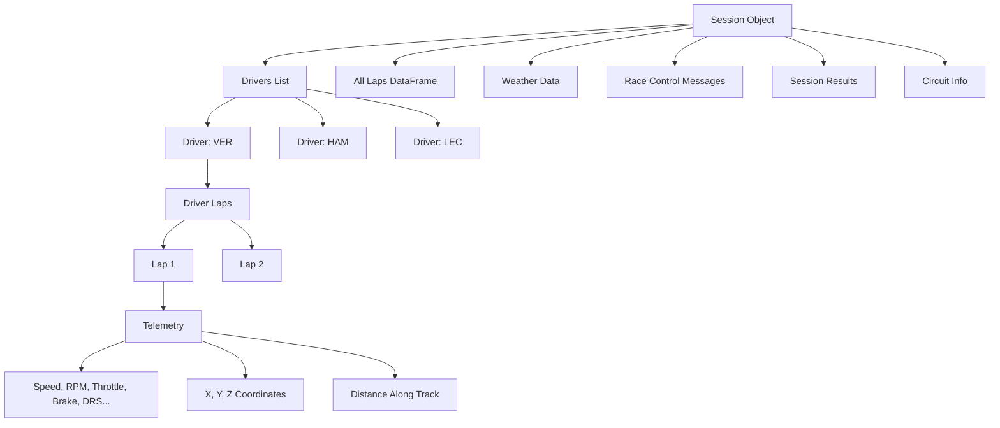
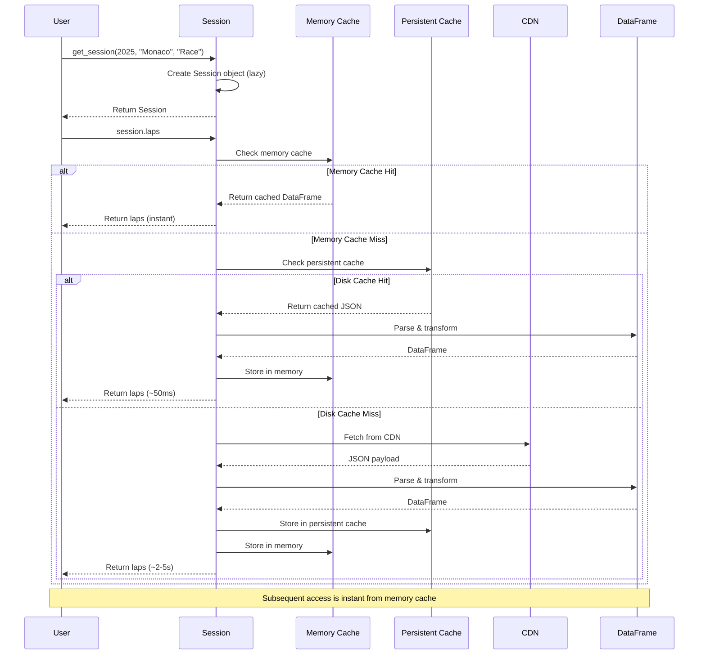

## What is a Session?

A **Session** is the fundamental data container in tif1, representing a single Formula 1 track session. Each session corresponds to one specific on-track activity during a Grand Prix weekend, such as Practice 1, Qualifying, Sprint, or the Race itself.

The Session object serves as your primary interface for accessing all F1 data associated with that particular session. It provides a unified, high-performance API for retrieving:

- **Driver information** - Complete roster of participating drivers with team affiliations, driver numbers, names, and metadata
- **Lap data** - Comprehensive lap-by-lap information for all drivers including lap times, sectors, tire compounds, track status, and more
- **Telemetry data** - High-frequency sensor data capturing speed, throttle, brake, RPM, gear, DRS, and 3D position coordinates
- **Weather conditions** - Time-series weather data including air temperature, track temperature, humidity, wind, and rainfall
- **Race control messages** - Official FIA communications including flags, penalties, safety car periods, and track status changes
- **Session results** - Final classification, grid positions, and driver standings
- **Circuit information** - Track layout data including corner positions, angles, and circuit rotation

The Session object is designed with **lazy loading** and **intelligent caching** to maximize performance. Data is only fetched from the CDN when you explicitly access it, and subsequent accesses are served instantly from cache. This architecture allows you to work with massive datasets efficiently while maintaining a simple, intuitive API.

## Session Data Hierarchy

Understanding the hierarchical structure of Session data helps you navigate and access the information you need efficiently.



### Data Organization

The Session object organizes data in a logical hierarchy:

1. **Session Level** - Top-level metadata, configuration, and session-wide data (weather, race control messages)
2. **Driver Level** - Individual driver information, complete lap history for each driver
3. **Lap Level** - Single lap data including lap time, sectors, tire compound, track status
4. **Telemetry Level** - High-frequency sensor data for a specific lap (typically 100-300 Hz sampling rate)

## Creating a Session

The primary way to create a Session object is through the `get_session()` function. This function accepts flexible parameters to identify the exact session you want to analyze.

### Basic Session Creation

```python
import tif1

# Create a session using event name and session type
session = tif1.get_session(2025, "Abu Dhabi Grand Prix", "Practice 1")

# You can also use round numbers instead of event names
session = tif1.get_session(2025, 1, "Race")  # Round 1 = First race of the season

# Session names are flexible - these all work:
session = tif1.get_session(2025, "Monaco", "FP1")  # Free Practice 1
session = tif1.get_session(2025, "Monaco", "Practice 1")
session = tif1.get_session(2025, "Monaco", "Qualifying")
session = tif1.get_session(2025, "Monaco", "Q")
session = tif1.get_session(2025, "Monaco", "Race")
session = tif1.get_session(2025, "Monaco", "R")
session = tif1.get_session(2025, "Monaco", "Sprint")
session = tif1.get_session(2025, "Monaco", "Sprint Qualifying")
```

### Performance Optimization with Polars

For maximum performance, tif1 supports **Polars** as an alternative DataFrame backend. Polars provides 2-3x faster data processing compared to pandas, especially for large datasets.

```python
# Use Polars for 2-3x faster processing
session = tif1.get_session(
    2025,
    "Abu Dhabi Grand Prix",
    "Practice 1",
    lib="polars"
)

# All DataFrame operations will now use Polars
laps = session.laps  # Returns a Polars DataFrame
fastest = session.get_fastest_laps()  # Also Polars
```

<Note>
Polars must be installed separately: `pip install polars>=1.40.1`. If Polars is not available, tif1 automatically falls back to pandas with a warning.
</Note>

### Cache Control

By default, tif1 caches all fetched data to disk for instant subsequent access. You can control caching behavior per session:

```python
# Disable caching for this session (always fetch fresh data)
session = tif1.get_session(
    2025,
    "Monaco Grand Prix",
    "Race",
    enable_cache=False
)

# Enable caching (default behavior)
session = tif1.get_session(
    2025,
    "Monaco Grand Prix",
    "Race",
    enable_cache=True
)
```

<Tip>
Disabling cache is useful when:
- You're testing data pipeline changes
- You suspect cached data is stale or corrupted
- You want to force a fresh fetch from the CDN
- You're working with live/recent sessions that may have updated data
</Tip>

### Global Configuration

You can set default values for `lib` and `enable_cache` globally using the config system:

```python
import tif1

# Set global defaults
tif1.config.set("lib", "polars")
tif1.config.set("enable_cache", True)

# All subsequent sessions will use these defaults
session = tif1.get_session(2025, "Silverstone", "Race")  # Uses polars + cache
```

## Session Properties

Session properties provide read-only access to various data types. All properties use lazy loading - data is only fetched when you first access the property.

### drivers

Returns a list of driver numbers as strings. This property provides FastF1 API compatibility.

```python
drivers = session.drivers
# ['1', '11', '16', '55', '63', '4', '14', '18', '10', '31', ...]

# Iterate over all drivers
for driver_number in session.drivers:
    print(f"Driver #{driver_number}")
```

**Returns:** `list[str]` - List of driver numbers as strings

### driver_list

Alias for `drivers` property. Returns the same list of driver numbers.

```python
driver_list = session.driver_list
# ['1', '11', '16', '55', '63', '4', '14', '18', '10', '31', ...]
```

**Returns:** `list[str]` - List of driver numbers as strings

### drivers_df

Returns comprehensive driver information as a DataFrame. This is the most detailed driver data available, including names, teams, colors, and headshot URLs.

```python
drivers_df = session.drivers_df

# Available columns:
# - Driver: 3-letter driver code (e.g., 'VER', 'HAM', 'LEC')
# - Team: Full team name (e.g., 'Red Bull Racing')
# - DriverNumber: Driver's racing number as string
# - FirstName: Driver's first name
# - LastName: Driver's last name
# - TeamColor: Hex color code for team (e.g., '#3671C6')
# - HeadshotUrl: URL to driver's official headshot image

# Example usage
print(drivers_df[["Driver", "Team", "DriverNumber"]])
#    Driver                Team DriverNumber
# 0     VER  Red Bull Racing            1
# 1     PER  Red Bull Racing           11
# 2     HAM         Mercedes           44
# 3     RUS         Mercedes           63
# ...

# Filter by team
red_bull_drivers = drivers_df[drivers_df["Team"] == "Red Bull Racing"]

# Get specific driver info
verstappen = drivers_df[drivers_df["Driver"] == "VER"].iloc[0]
print(f"{verstappen['FirstName']} {verstappen['LastName']}")  # Max Verstappen
```

**Returns:** `pandas.DataFrame` - DataFrame with 7 columns (Driver, Team, DriverNumber, FirstName, LastName, TeamColor, HeadshotUrl)

### laps

Returns all laps for all drivers in the session. This is one of the most important properties, containing comprehensive lap-by-lap data.

**Key Features:**
- Automatically includes weather data merged with each lap
- Contains sector times, lap times, tire compounds, track status
- Includes position data, pit stop information, and more
- Returns pandas or Polars DataFrame depending on session configuration

```python
laps = session.laps  # pandas or polars DataFrame

# Available columns (varies by session type):
# - Time: Lap completion time (timedelta)
# - Driver: 3-letter driver code
# - DriverNumber: Driver's racing number
# - LapTime: Lap time (timedelta)
# - LapNumber: Sequential lap number
# - Stint: Stint number
# - PitOutTime: Time exiting pit lane
# - PitInTime: Time entering pit lane
# - Sector1Time: Sector 1 time
# - Sector2Time: Sector 2 time
# - Sector3Time: Sector 3 time
# - Sector1SessionTime: Session time at sector 1
# - Sector2SessionTime: Session time at sector 2
# - Sector3SessionTime: Session time at sector 3
# - SpeedI1: Speed at intermediate 1 (km/h)
# - SpeedI2: Speed at intermediate 2 (km/h)
# - SpeedFL: Speed at finish line (km/h)
# - SpeedST: Speed at speed trap (km/h)
# - IsPersonalBest: Boolean indicating personal best lap
# - Compound: Tire compound (SOFT, MEDIUM, HARD, INTERMEDIATE, WET)
# - TyreLife: Age of tires in laps
# - FreshTyre: Boolean indicating new tires
# - LapStartTime: Session time when lap started
# - Team: Team name
# - LapStartDate: Absolute timestamp of lap start
# - TrackStatus: Track status code
# - Position: Driver's position
# - Deleted: Boolean indicating if lap was deleted
# - DeletedReason: Reason for lap deletion
# - FastF1Generated: Boolean indicating if lap was interpolated
# - IsAccurate: Boolean indicating data accuracy
# - AirTemp: Air temperature (°C) - from weather data
# - Humidity: Relative humidity (%) - from weather data
# - Pressure: Atmospheric pressure (mbar) - from weather data
# - Rainfall: Boolean indicating rain - from weather data
# - TrackTemp: Track surface temperature (°C) - from weather data
# - WindDirection: Wind direction (degrees) - from weather data
# - WindSpeed: Wind speed (m/s) - from weather data

# Example: Get all laps for a specific driver
ver_laps = laps[laps["Driver"] == "VER"]

# Example: Filter by compound
soft_tire_laps = laps[laps["Compound"] == "SOFT"]

# Example: Get fastest lap per driver
fastest_laps = laps.loc[laps.groupby("Driver")["LapTime"].idxmin()]

# Example: Analyze sector times
print(laps[["Driver", "LapNumber", "Sector1Time", "Sector2Time", "Sector3Time"]].head())
```

**Returns:** `DataFrame` (pandas or Polars) - All laps with weather data merged

<Warning>
The `laps` property triggers a network fetch on first access if data is not cached. For sessions with many laps (e.g., race sessions), this may take a few seconds.
</Warning>

### weather

Returns time-series weather data recorded throughout the session. Weather data is sampled at regular intervals (typically every 1-2 minutes).

```python
weather = session.weather

# Available columns:
# - Time: Time offset from session start (timedelta)
# - AirTemp: Air temperature in Celsius
# - Humidity: Relative humidity (0-100%)
# - Pressure: Atmospheric pressure in millibars
# - Rainfall: Boolean indicating if it's raining
# - TrackTemp: Track surface temperature in Celsius
# - WindDirection: Wind direction in degrees (0-360)
# - WindSpeed: Wind speed in meters per second

# Example: Check if it rained during the session
if weather["Rainfall"].any():
    print("Rain detected during session!")

# Example: Plot temperature evolution
import matplotlib.pyplot as plt
plt.plot(weather["Time"], weather["TrackTemp"], label="Track Temp")
plt.plot(weather["Time"], weather["AirTemp"], label="Air Temp")
plt.legend()
plt.show()

# Example: Find maximum wind speed
max_wind = weather["WindSpeed"].max()
print(f"Maximum wind speed: {max_wind:.1f} m/s")
```

**Returns:** `DataFrame` (pandas or Polars) - Weather data time series

<Note>
Weather data is automatically merged into the `laps` DataFrame, so each lap has associated weather conditions. You typically don't need to access `session.weather` directly unless you want to analyze weather trends independently.
</Note>

### weather_data

Alias for the `weather` property. Provides FastF1 API compatibility.

```python
weather_data = session.weather_data  # Same as session.weather
```

**Returns:** `DataFrame` (pandas or Polars) - Weather data time series

### race_control_messages

Returns official FIA race control messages issued during the session. These messages include flags, penalties, investigations, safety car periods, and other official communications.

```python
messages = session.race_control_messages

# Available columns:
# - Time: Message timestamp (datetime)
# - Category: Message category (e.g., 'Flag', 'SafetyCar', 'Drs')
# - Message: Full message text
# - Status: Status indicator
# - Flag: Flag type (e.g., 'YELLOW', 'GREEN', 'RED')
# - Scope: Scope of message (e.g., 'Track', 'Sector', 'Driver')
# - Sector: Affected sector number (if applicable)
# - RacingNumber: Affected driver number (if applicable)
# - Lap: Lap number when message was issued

# Example: Find all yellow flag incidents
yellow_flags = messages[messages["Flag"] == "YELLOW"]
print(yellow_flags[["Time", "Message", "Sector"]])

# Example: Find all driver-specific penalties
penalties = messages[messages["Category"] == "Flag"]
driver_penalties = penalties[penalties["RacingNumber"].notna()]
print(driver_penalties[["Time", "RacingNumber", "Message"]])

# Example: Track safety car periods
safety_car = messages[messages["Category"] == "SafetyCar"]
print(safety_car[["Time", "Message"]])
```

**Returns:** `DataFrame` (pandas or Polars) - Race control messages

### results

Returns session results with final classification and driver information. This property provides a FastF1-compatible `SessionResults` object.

```python
results = session.results

# Available columns:
# - DriverNumber: Driver's racing number
# - Abbreviation: 3-letter driver code
# - TeamName: Full team name
# - TeamColor: Hex color code
# - FirstName: Driver's first name
# - LastName: Driver's last name
# - FullName: Full name (FirstName + LastName)
# - HeadshotUrl: URL to driver headshot
# - Position: Final position (if available)
# - ClassifiedPosition: Official classified position
# - GridPosition: Starting grid position
# - Status: Finish status (e.g., 'Finished', 'Retired')
# - Points: Championship points earned
# - Laps: Number of laps completed

# Example: Get podium finishers
podium = results[results["Position"] <= 3]
print(podium[["Position", "Abbreviation", "TeamName"]])

# Example: Find DNFs
dnfs = results[results["Status"] != "Finished"]
print(dnfs[["Abbreviation", "Status"]])
```

**Returns:** `SessionResults` (pandas DataFrame subclass) - Session results

### car_data

Returns complete telemetry data for all drivers across all laps. This is a massive dataset containing high-frequency sensor data.

```python
car_data = session.car_data

# Available columns:
# - Time / SessionTime: Timestamp
# - Driver: 3-letter driver code
# - Speed: Speed in km/h
# - RPM: Engine RPM
# - nGear: Current gear (1-8)
# - Throttle: Throttle position (0-100%)
# - Brake: Brake pressure (boolean or 0-100)
# - DRS: DRS status (0-14, where >10 indicates active)
# - X: X coordinate on track (meters)
# - Y: Y coordinate on track (meters)
# - Z: Z coordinate (elevation, meters)
# - Distance: Distance along track (meters)
# - DriverAhead: Driver code of car ahead
# - DistanceToDriverAhead: Gap to car ahead (meters)

# Example: Analyze speed distribution
import matplotlib.pyplot as plt
plt.hist(car_data["Speed"], bins=50)
plt.xlabel("Speed (km/h)")
plt.ylabel("Frequency")
plt.show()

# Example: Find maximum speed
max_speed = car_data["Speed"].max()
fastest_driver = car_data[car_data["Speed"] == max_speed]["Driver"].iloc[0]
print(f"Maximum speed: {max_speed:.1f} km/h by {fastest_driver}")
```

**Returns:** `DataFrame` (pandas or Polars) - Complete telemetry for all drivers

<Warning>
`car_data` can be extremely large (millions of rows for a full race). Accessing this property will fetch telemetry for ALL laps of ALL drivers, which may take significant time and memory. Consider using driver-specific or lap-specific telemetry access methods instead.
</Warning>

### pos_data

Alias for `car_data`. Returns the same complete telemetry dataset.

```python
pos_data = session.pos_data  # Same as session.car_data
```

**Returns:** `DataFrame` (pandas or Polars) - Complete telemetry for all drivers

### session_info

Returns basic session metadata as a dictionary.

```python
info = session.session_info
# {
#     'Year': 2025,
#     'EventName': 'Monaco Grand Prix',
#     'SessionName': 'Race'
# }

print(f"Analyzing {info['EventName']} {info['SessionName']} from {info['Year']}")
```

**Returns:** `dict[str, Any]` - Session metadata

### name

Returns the human-readable session name (URL-decoded).

```python
name = session.name
# 'Practice 1' or 'Qualifying' or 'Race'
```

**Returns:** `str` - Session name

### date

Returns the session date as a pandas Timestamp.

```python
date = session.date
# Timestamp('2025-05-25 13:00:00')

print(f"Session held on: {date.strftime('%Y-%m-%d')}")
```

**Returns:** `pandas.Timestamp` or `pd.NaT` - Session date

### event

Returns the Event object for this session's Grand Prix. The Event object contains schedule information for all sessions in the weekend.

```python
event = session.event

# Access other sessions from the same weekend
print(event.Session1)  # 'Practice 1'
print(event.Session1Date)  # Timestamp
print(event.Session2)  # 'Practice 2'
# ... etc
```

**Returns:** `Event` - Event object for the Grand Prix weekend

## Session Methods

Session methods provide powerful functionality for data analysis, filtering, and retrieval.

### load()

Explicitly load session data with fine-grained control over what gets fetched. This method is useful when you want to pre-fetch data or control exactly what data is loaded.

**Signature:**
```python
def load(
    self,
    laps: bool = True,
    telemetry: bool = True,
    weather: bool = True,
    messages: bool = True
) -> Session
```

**Parameters:**
- `laps` (bool): If True, fetch laps data. Default: True
- `telemetry` (bool): If True, fetch telemetry for all laps. Automatically sets laps=True. Default: True
- `weather` (bool): If True, fetch weather data. Default: True
- `messages` (bool): If True, fetch race control messages. Default: True

**Returns:** `Session` - Returns self for method chaining

**Examples:**

```python
# Load everything (default behavior)
session = tif1.get_session(2025, "Silverstone", "Race")
session.load()  # Fetches laps, telemetry, weather, and messages

# Load only laps and weather (skip telemetry and messages)
session.load(laps=True, telemetry=False, weather=True, messages=False)

# Load only laps (minimal data)
session.load(laps=True, telemetry=False, weather=False, messages=False)

# Method chaining
session = tif1.get_session(2025, "Monaco", "Qualifying").load()
fastest = session.get_fastest_laps()
```

<Note>
If you request `telemetry=True` but `laps=False`, the method automatically sets `laps=True` because telemetry requires lap data to function properly.
</Note>

<Warning>
Loading telemetry for all laps (`telemetry=True`) can be time-consuming and memory-intensive for race sessions with 20 drivers and 50+ laps each. Consider loading telemetry selectively using driver-specific or lap-specific methods instead.
</Warning>

### get_driver()

Get a Driver object for a specific driver. The Driver object provides convenient access to that driver's laps and telemetry.

**Signature:**
```python
def get_driver(self, driver_code: str) -> Driver
```

**Parameters:**
- `driver_code` (str): 3-letter driver code (e.g., 'VER', 'HAM', 'LEC')

**Returns:** `Driver` - Driver object with laps and telemetry access

**Examples:**

```python
# Get a specific driver
ver = session.get_driver("VER")

# Access driver's laps
ver_laps = ver.laps
print(f"Verstappen completed {len(ver_laps)} laps")

# Get driver's fastest lap
fastest_lap = ver.laps.loc[ver.laps["LapTime"].idxmin()]
print(f"Fastest lap: {fastest_lap['LapTime']}")

# Access telemetry for a specific lap
lap_5_tel = ver.laps.iloc[4].telemetry  # 5th lap (0-indexed)
print(lap_5_tel[["Distance", "Speed", "Throttle"]].head())

# Compare multiple drivers
ham = session.get_driver("HAM")
lec = session.get_driver("LEC")

ver_fastest = ver.laps["LapTime"].min()
ham_fastest = ham.laps["LapTime"].min()
lec_fastest = lec.laps["LapTime"].min()

print(f"VER: {ver_fastest}, HAM: {ham_fastest}, LEC: {lec_fastest}")
```

<Tip>
The `get_driver()` method uses intelligent prefetching. On the first call, it fetches both the driver list and the requested driver's lap data in parallel, significantly improving performance.
</Tip>

### get_fastest_laps()

Get the fastest lap(s) from the session. This method can return either the fastest lap per driver or the single overall fastest lap.

**Signature:**
```python
def get_fastest_laps(
    self,
    by_driver: bool = True,
    drivers: list[str] | None = None
) -> DataFrame
```

**Parameters:**
- `by_driver` (bool): If True, return fastest lap per driver. If False, return single overall fastest lap. Default: True
- `drivers` (list[str] | None): Optional list of driver codes to filter. If None, includes all drivers. Default: None

**Returns:** `DataFrame` - Fastest lap(s) with all lap data columns

**Examples:**

```python
# Get fastest lap for each driver
fastest_by_driver = session.get_fastest_laps(by_driver=True)
print(fastest_by_driver[["Driver", "LapTime", "Compound"]])
#    Driver    LapTime Compound
# 0     VER  0:01:32.1     SOFT
# 1     HAM  0:01:32.3     SOFT
# 2     LEC  0:01:32.5     SOFT
# ...

# Get the single overall fastest lap
overall_fastest = session.get_fastest_laps(by_driver=False)
print(f"Fastest lap by {overall_fastest['Driver'].iloc[0]}: {overall_fastest['LapTime'].iloc[0]}")

# Get fastest laps for specific drivers only
top3_fastest = session.get_fastest_laps(by_driver=True, drivers=["VER", "HAM", "LEC"])

# Analyze fastest lap compounds
fastest_by_driver = session.get_fastest_laps()
compound_counts = fastest_by_driver["Compound"].value_counts()
print(f"Fastest laps by compound:\n{compound_counts}")

# Find who set fastest lap on which compound
for _, lap in fastest_by_driver.iterrows():
    print(f"{lap['Driver']}: {lap['LapTime']} on {lap['Compound']}")
```

<Note>
This method only considers valid laps (not deleted laps). Deleted laps are automatically filtered out.
</Note>

### get_fastest_lap_tel()

Get telemetry for the overall fastest lap in the session. This is a convenience method that combines finding the fastest lap and fetching its telemetry.

**Signature:**
```python
def get_fastest_lap_tel(self) -> DataFrame
```

**Returns:** `DataFrame` - Telemetry data for the fastest lap

**Examples:**

```python
# Get telemetry for the fastest lap
fastest_tel = session.get_fastest_lap_tel()

# Analyze speed profile
import matplotlib.pyplot as plt
plt.plot(fastest_tel["Distance"], fastest_tel["Speed"])
plt.xlabel("Distance (m)")
plt.ylabel("Speed (km/h)")
plt.title("Fastest Lap Speed Profile")
plt.show()

# Find maximum speed on fastest lap
max_speed = fastest_tel["Speed"].max()
print(f"Maximum speed on fastest lap: {max_speed:.1f} km/h")

# Analyze throttle application
full_throttle_pct = (fastest_tel["Throttle"] == 100).sum() / len(fastest_tel) * 100
print(f"Full throttle: {full_throttle_pct:.1f}% of lap")

# Find braking zones
braking = fastest_tel[fastest_tel["Brake"] > 0]
print(f"Braking points: {len(braking)} samples")
```

<Tip>
This method uses ultra-cold start optimization. If you call it on a brand-new session (before accessing any other data), it will use a highly optimized fetch path that bypasses normal caching and validation for maximum speed.
</Tip>

### get_fastest_laps_tels()

Fetch telemetry for multiple drivers' fastest laps in parallel. This is significantly faster than fetching telemetry sequentially.

**Signature:**
```python
def get_fastest_laps_tels(
    self,
    by_driver: bool = True,
    drivers: list[str] | None = None
) -> dict[str, DataFrame]
```

**Parameters:**
- `by_driver` (bool): If True, fetch telemetry for each driver's fastest lap. If False, fetch only the overall fastest lap. Default: True
- `drivers` (list[str] | None): Optional list of driver codes to filter. If None, includes all drivers. Default: None

**Returns:** `dict[str, DataFrame]` - Dictionary mapping driver codes to their fastest lap telemetry

**Examples:**

```python
# Get telemetry for all drivers' fastest laps (parallel fetching)
fastest_tels = session.get_fastest_laps_tels(by_driver=True)

# Access specific driver's telemetry
ver_tel = fastest_tels["VER"]
ham_tel = fastest_tels["HAM"]

# Compare speed profiles
import matplotlib.pyplot as plt
plt.plot(ver_tel["Distance"], ver_tel["Speed"], label="VER")
plt.plot(ham_tel["Distance"], ham_tel["Speed"], label="HAM")
plt.legend()
plt.xlabel("Distance (m)")
plt.ylabel("Speed (km/h)")
plt.show()

# Get telemetry for specific drivers only
top3_tels = session.get_fastest_laps_tels(by_driver=True, drivers=["VER", "HAM", "LEC"])

# Analyze all drivers' maximum speeds
for driver, tel in fastest_tels.items():
    max_speed = tel["Speed"].max()
    print(f"{driver}: {max_speed:.1f} km/h")

# Find who had the highest top speed
max_speeds = {driver: tel["Speed"].max() for driver, tel in fastest_tels.items()}
fastest_driver = max(max_speeds, key=max_speeds.get)
print(f"Highest top speed: {fastest_driver} at {max_speeds[fastest_driver]:.1f} km/h")
```

<Note>
This method uses asynchronous parallel fetching under the hood, making it much faster than calling `get_driver(driver).laps.fastest().telemetry` for each driver sequentially.
</Note>

### laps_async()

Asynchronously load all laps for maximum performance. This method is useful when you want to integrate tif1 into an async application or when you need the absolute fastest lap loading.

**Signature:**
```python
async def laps_async(self) -> DataFrame
```

**Returns:** `DataFrame` - All laps (same as `session.laps` property)

**Examples:**

```python
import asyncio
import tif1

async def analyze_session():
    session = tif1.get_session(2025, "Monaco", "Race")

    # Load laps asynchronously
    laps = await session.laps_async()

    # Analyze data
    fastest = laps.loc[laps.groupby("Driver")["LapTime"].idxmin()]
    return fastest

# Run the async function
fastest_laps = asyncio.run(analyze_session())
print(fastest_laps[["Driver", "LapTime"]])

# Use in an existing async context
async def main():
    session = tif1.get_session(2025, "Silverstone", "Qualifying")
    laps = await session.laps_async()
    print(f"Loaded {len(laps)} laps")

asyncio.run(main())
```

<Tip>
If you're not working in an async context, just use the `session.laps` property instead. The performance difference is minimal for most use cases.
</Tip>

### get_circuit_info()

Get circuit layout information including corner positions, angles, and track rotation.

**Signature:**
```python
def get_circuit_info(self) -> CircuitInfo
```

**Returns:** `CircuitInfo` - Dataclass with circuit information

**CircuitInfo Attributes:**
- `corners` (DataFrame): Corner data with columns X, Y, Number, Letter, Angle, Distance
- `marshal_lights` (DataFrame): Marshal light positions (always empty - not in source data)
- `marshal_sectors` (DataFrame): Marshal sector boundaries (always empty - not in source data)
- `rotation` (float): Circuit rotation in degrees

**Examples:**

```python
# Get circuit information
circuit_info = session.get_circuit_info()

# Access corner data
corners = circuit_info.corners
print(corners[["Number", "X", "Y", "Angle"]])
#    Number        X        Y    Angle
# 0       1   1234.5   5678.9    45.2
# 1       2   2345.6   6789.0    -30.1
# ...

# Get circuit rotation
rotation = circuit_info.rotation
print(f"Circuit rotation: {rotation}° degrees")

# Plot circuit layout
import matplotlib.pyplot as plt
plt.scatter(corners["X"], corners["Y"], c=corners["Number"], cmap="viridis")
plt.colorbar(label="Corner Number")
plt.xlabel("X (m)")
plt.ylabel("Y (m)")
plt.title("Circuit Layout")
plt.axis("equal")
plt.show()

# Find sharpest corner
sharpest = corners.loc[corners["Angle"].abs().idxmax()]
print(f"Sharpest corner: #{sharpest['Number']} at {sharpest['Angle']:.1f}°")
```

<Note>
Circuit information is cached after the first call, so subsequent calls are instant.
</Note>

### fetch_all_laps_telemetry()

Fetch telemetry for all laps of all drivers. This is equivalent to accessing `session.car_data` but provides explicit control.

**Signature:**
```python
def fetch_all_laps_telemetry(self) -> DataFrame
```

**Returns:** `DataFrame` - Complete telemetry for all drivers and laps

**Examples:**

```python
# Explicitly fetch all telemetry
all_telemetry = session.fetch_all_laps_telemetry()

# This is equivalent to:
all_telemetry = session.car_data

# Analyze telemetry statistics
print(f"Total telemetry samples: {len(all_telemetry)}")
print(f"Average speed: {all_telemetry['Speed'].mean():.1f} km/h")
print(f"Maximum RPM: {all_telemetry['RPM'].max():.0f}")
```

<Warning>
This method fetches telemetry for ALL laps, which can be very slow and memory-intensive. Use sparingly and consider driver-specific or lap-specific methods instead.
</Warning>

## Session Types and Formats

tif1 supports all official Formula 1 session types across different weekend formats.

### Standard Race Weekend

A typical F1 race weekend consists of:

1. **Practice 1 (FP1)** - Friday morning, 60 minutes
2. **Practice 2 (FP2)** - Friday afternoon, 60 minutes
3. **Practice 3 (FP3)** - Saturday morning, 60 minutes
4. **Qualifying (Q)** - Saturday afternoon, ~60 minutes (Q1, Q2, Q3)
5. **Race (R)** - Sunday, ~2 hours

```python
# Access all sessions from a standard weekend
fp1 = tif1.get_session(2025, "Silverstone", "Practice 1")
fp2 = tif1.get_session(2025, "Silverstone", "Practice 2")
fp3 = tif1.get_session(2025, "Silverstone", "Practice 3")
qualifying = tif1.get_session(2025, "Silverstone", "Qualifying")
race = tif1.get_session(2025, "Silverstone", "Race")
```

### Sprint Weekend

Sprint weekends have a modified format:

1. **Practice 1 (FP1)** - Friday, 60 minutes
2. **Sprint Qualifying (SQ)** - Friday, ~60 minutes (SQ1, SQ2, SQ3)
3. **Sprint (S)** - Saturday, ~30 minutes (~100km race)
4. **Qualifying (Q)** - Saturday, ~60 minutes (Q1, Q2, Q3)
5. **Race (R)** - Sunday, ~2 hours

```python
# Access sprint weekend sessions
fp1 = tif1.get_session(2025, "Austria", "Practice 1")
sprint_qualifying = tif1.get_session(2025, "Austria", "Sprint Qualifying")
sprint = tif1.get_session(2025, "Austria", "Sprint")
qualifying = tif1.get_session(2025, "Austria", "Qualifying")
race = tif1.get_session(2025, "Austria", "Race")
```

### Session Name Variations

tif1 accepts multiple variations of session names for convenience:

| Official Name | Accepted Variations |
|--------------|-------------------|
| Practice 1 | `"Practice 1"`, `"FP1"`, `"Free Practice 1"` |
| Practice 2 | `"Practice 2"`, `"FP2"`, `"Free Practice 2"` |
| Practice 3 | `"Practice 3"`, `"FP3"`, `"Free Practice 3"` |
| Qualifying | `"Qualifying"`, `"Q"`, `"Quali"` |
| Sprint Qualifying | `"Sprint Qualifying"`, `"SQ"`, `"Sprint Shootout"` |
| Sprint | `"Sprint"`, `"S"` |
| Race | `"Race"`, `"R"` |

```python
# All of these work:
session = tif1.get_session(2025, "Monaco", "Practice 1")
session = tif1.get_session(2025, "Monaco", "FP1")
session = tif1.get_session(2025, "Monaco", "Free Practice 1")

session = tif1.get_session(2025, "Monaco", "Qualifying")
session = tif1.get_session(2025, "Monaco", "Q")

session = tif1.get_session(2025, "Monaco", "Race")
session = tif1.get_session(2025, "Monaco", "R")
```

## Data Loading Architecture

Understanding how tif1 loads data helps you optimize performance and troubleshoot issues.

### Lazy Loading

Sessions use **lazy loading** for optimal performance. When you create a Session object, no data is fetched immediately. Data is only retrieved when you explicitly access it.

```python
# Create session - no network requests yet
session = tif1.get_session(2025, "Bahrain Grand Prix", "Race")
print("Session created")  # Instant

# Access laps - triggers network fetch (if not cached)
laps = session.laps  # Data fetched now
print("Laps loaded")

# Subsequent access is instant from memory cache
laps_again = session.laps  # Instant - no network request
```

**Benefits of Lazy Loading:**
- **Fast initialization** - Session objects are created instantly
- **Efficient memory usage** - Only requested data is loaded
- **Flexible workflows** - Load only what you need for your analysis
- **Reduced network traffic** - Avoid fetching unused data

### Caching Strategy

tif1 implements a **multi-tier caching system** for maximum performance:

#### 1. Memory Cache (L1)
- In-memory storage of fetched data within the Session object
- Fastest access (nanoseconds)
- Cleared when Session object is destroyed
- Automatic and transparent

#### 2. Persistent Cache (L2)
- SQLite-based disk cache in tif1's OS-dependent cache directory (configurable via `TIF1_CACHE_DIR`)
- Survives across Python sessions
- Shared between all tif1 sessions
- Configurable via `enable_cache` parameter

#### 3. CDN (L3)
- Three-source CDN chain (StaticDelivr, jsDelivr, Hugging Face buckets) serving TracingInsights data repositories
- Fetched only on cache miss
- Automatic retry with exponential backoff
- Multiple CDN sources for redundancy

```python
# First access - fetches from CDN, stores in cache
session1 = tif1.get_session(2025, "Monaco", "Race")
laps1 = session1.laps  # CDN fetch (~2-5 seconds)

# Second access - instant from persistent cache
session2 = tif1.get_session(2025, "Monaco", "Race")
laps2 = session2.laps  # Cache hit (~50ms)

# Disable caching to always fetch fresh data
session3 = tif1.get_session(2025, "Monaco", "Race", enable_cache=False)
laps3 = session3.laps  # Always fetches from CDN
```

### Session Loading Flow



### Ultra-Cold Start Optimization

For specific use cases, tif1 provides **ultra-cold start mode** - an aggressive optimization that bypasses normal caching and validation for maximum speed.

```python
# Enable ultra-cold start globally
tif1.config.set("ultra_cold_start", True)

# Now fastest lap telemetry fetches are optimized
session = tif1.get_session(2025, "Monaco", "Qualifying")
fastest_tel = session.get_fastest_lap_tel()  # Ultra-fast fetch

# Optionally enable background cache fill
tif1.config.set("ultra_cold_background_cache_fill", True)
# Data is fetched immediately, then cached in background
```

**When to Use Ultra-Cold Start:**
- Real-time applications requiring minimum latency
- One-off queries where caching isn't beneficial
- Benchmarking and performance testing
- Live timing applications

**Trade-offs:**
- Skips data validation (assumes CDN data is correct)
- Bypasses retry logic (single attempt only)
- No persistent caching (unless background fill is enabled)

### Parallel Fetching

tif1 automatically uses **parallel fetching** for operations that require multiple network requests:

```python
# Fetches telemetry for all drivers in parallel
fastest_tels = session.get_fastest_laps_tels()  # Parallel fetch

# Sequential equivalent (much slower - don't do this)
fastest_tels_slow = {}
for driver in session.drivers:
    drv = session.get_driver(driver)
    fastest_lap = drv.laps.loc[drv.laps["LapTime"].idxmin()]
    fastest_tels_slow[driver] = fastest_lap.telemetry
```

**Parallel Fetching Benefits:**
- 10-20x faster for multi-driver operations
- Efficient use of network bandwidth
- Automatic connection pooling
- Configurable concurrency limits

### Prefetching Strategies

tif1 implements intelligent **prefetching** to reduce latency:

#### Session Table Prefetching
```python
# On first driver access, prefetch common session tables
driver = session.get_driver("VER")  # Triggers prefetch of weather, rcm, drivers
```

#### Driver Lap Prefetching
```python
# When getting a driver, prefetch their lap data
driver = session.get_driver("VER")  # Fetches drivers.json + VER/laptimes.json in parallel
```

#### Background Telemetry Prefetching
```python
# Enable background telemetry prefetching
tif1.config.set("prefetch_telemetry_background", True)

# Accessing laps triggers background telemetry fetch
laps = session.laps  # Laps returned immediately, telemetry fetched in background
```

## Data Enrichment and Transformations

tif1 automatically enriches and transforms raw F1 data to make it more useful for analysis.

### Automatic Weather Merging

Weather data is automatically merged into every lap, eliminating the need for manual joins:

```python
laps = session.laps

# Weather columns are already present in laps DataFrame:
# - AirTemp: Air temperature (°C)
# - TrackTemp: Track surface temperature (°C)
# - Humidity: Relative humidity (%)
# - Pressure: Atmospheric pressure (mbar)
# - Rainfall: Boolean indicating rain
# - WindDirection: Wind direction (degrees)
# - WindSpeed: Wind speed (m/s)

# Analyze lap times by track temperature
import matplotlib.pyplot as plt
plt.scatter(laps["TrackTemp"], laps["LapTime"].dt.total_seconds())
plt.xlabel("Track Temperature (°C)")
plt.ylabel("Lap Time (seconds)")
plt.show()

# Find laps completed in rain
rain_laps = laps[laps["Rainfall"] == True]
print(f"{len(rain_laps)} laps completed in rain")
```

### Computed Columns

tif1 adds computed columns for convenience:

#### LapTimeSeconds
Numeric representation of lap time for easier calculations:

```python
laps = session.laps

# LapTime is a timedelta, LapTimeSeconds is float
print(laps[["LapTime", "LapTimeSeconds"]].head())
#       LapTime  LapTimeSeconds
# 0  0:01:32.123          92.123
# 1  0:01:33.456          93.456

# Easy arithmetic with LapTimeSeconds
average_lap_time = laps["LapTimeSeconds"].mean()
print(f"Average lap time: {average_lap_time:.3f} seconds")

# Calculate lap time delta from fastest
fastest_time = laps["LapTimeSeconds"].min()
laps["DeltaToFastest"] = laps["LapTimeSeconds"] - fastest_time
```

#### DriverAhead and DistanceToDriverAhead
Telemetry includes relative position data:

```python
# Get telemetry for a lap
lap = session.get_driver("VER").laps.iloc[10]
tel = lap.telemetry

# DriverAhead: 3-letter code of car ahead
# DistanceToDriverAhead: Gap in meters
print(tel[["Distance", "DriverAhead", "DistanceToDriverAhead"]].head())
#    Distance DriverAhead  DistanceToDriverAhead
# 0       0.0         HAM                  125.3
# 1      10.5         HAM                  126.1
# 2      21.0         HAM                  127.5

# Analyze gap evolution
import matplotlib.pyplot as plt
plt.plot(tel["Distance"], tel["DistanceToDriverAhead"])
plt.xlabel("Distance (m)")
plt.ylabel("Gap to Car Ahead (m)")
plt.show()
```

### Column Renaming and Standardization

tif1 renames columns from the raw CDN format to more intuitive names:

| Raw CDN Column | tif1 Column | Description |
|---------------|-------------|-------------|
| `drv` | `Driver` | 3-letter driver code |
| `ln` | `LapNumber` | Sequential lap number |
| `lt` | `LapTime` | Lap time (timedelta) |
| `s1` | `Sector1Time` | Sector 1 time |
| `s2` | `Sector2Time` | Sector 2 time |
| `s3` | `Sector3Time` | Sector 3 time |
| `cmp` | `Compound` | Tire compound |
| `tl` | `TyreLife` | Tire age in laps |
| `spd_i1` | `SpeedI1` | Speed at intermediate 1 |
| `spd_i2` | `SpeedI2` | Speed at intermediate 2 |
| `spd_fl` | `SpeedFL` | Speed at finish line |
| `spd_st` | `SpeedST` | Speed at speed trap |

### Type Conversions

tif1 automatically converts data types for optimal performance and usability:

```python
# Time columns → timedelta
laps["LapTime"]  # timedelta64[ns]
laps["Sector1Time"]  # timedelta64[ns]

# Timestamp columns → datetime
messages["Time"]  # datetime64[ns]

# Numeric columns → appropriate types
laps["LapNumber"]  # int64
laps["SpeedI1"]  # float64
laps["Position"]  # int64

# Boolean columns
laps["IsPersonalBest"]  # bool
laps["Deleted"]  # bool
weather["Rainfall"]  # bool

# Categorical columns (for memory efficiency)
laps["Compound"]  # object (SOFT, MEDIUM, HARD, etc.)
laps["Driver"]  # object (VER, HAM, LEC, etc.)
```

### Data Validation

tif1 validates data integrity and handles edge cases:

- **Missing data** - Replaced with appropriate null values (NaN, NaT, None)
- **Invalid lap times** - Filtered out or marked as deleted
- **Malformed telemetry** - Logged and skipped
- **Inconsistent driver codes** - Normalized to 3-letter format
- **Out-of-range values** - Clamped or marked as invalid

```python
# tif1 handles missing data gracefully
laps = session.laps

# Check for missing lap times
missing_times = laps["LapTime"].isna().sum()
print(f"{missing_times} laps with missing lap times")

# Check for deleted laps
deleted = laps[laps["Deleted"] == True]
print(f"{len(deleted)} deleted laps")

# Filter to valid laps only
valid_laps = laps[~laps["Deleted"] & laps["LapTime"].notna()]
```

## Performance Optimization Tips

Maximize tif1 performance with these best practices:

### 1. Use Polars for Large Datasets

Polars provides 2-3x faster data processing:

```python
# Use Polars globally
tif1.config.set("lib", "polars")

# Or per-session
session = tif1.get_session(2025, "Monaco", "Race", lib="polars")
```

### 2. Load Only What You Need

Use the `load()` method to control data fetching:

```python
# Load only laps (skip telemetry, weather, messages)
session.load(laps=True, telemetry=False, weather=False, messages=False)

# Load laps and weather only
session.load(laps=True, telemetry=False, weather=True, messages=False)
```

### 3. Use Driver-Specific Access

Avoid loading all laps when you only need one driver:

```python
# Efficient - loads only VER's data
ver = session.get_driver("VER")
ver_laps = ver.laps

# Inefficient - loads all drivers
all_laps = session.laps
ver_laps = all_laps[all_laps["Driver"] == "VER"]
```

### 4. Leverage Parallel Fetching

Use methods that fetch in parallel:

```python
# Parallel - fast
fastest_tels = session.get_fastest_laps_tels()

# Sequential - slow
fastest_tels = {}
for driver in session.drivers:
    drv = session.get_driver(driver)
    fastest_tels[driver] = drv.laps.fastest().telemetry
```

### 5. Enable Caching

Always use caching unless you have a specific reason not to:

```python
# Good - uses cache (default)
session = tif1.get_session(2025, "Monaco", "Race")

# Only disable when necessary
session = tif1.get_session(2025, "Monaco", "Race", enable_cache=False)
```

### 6. Reuse Session Objects

Create session objects once and reuse them:

```python
# Efficient
session = tif1.get_session(2025, "Monaco", "Race")
laps1 = session.laps  # Fetches data
laps2 = session.laps  # Instant from memory
laps3 = session.laps  # Instant from memory

# Inefficient
laps1 = tif1.get_session(2025, "Monaco", "Race").laps
laps2 = tif1.get_session(2025, "Monaco", "Race").laps  # Fetches again
laps3 = tif1.get_session(2025, "Monaco", "Race").laps  # Fetches again
```

### 7. Filter Early

Filter DataFrames as early as possible:

```python
# Efficient - filter before expensive operations
laps = session.laps
ver_laps = laps[laps["Driver"] == "VER"]
fastest = ver_laps.loc[ver_laps["LapTime"].idxmin()]

# Less efficient - filter after loading all telemetry
all_tel = session.car_data  # Loads everything
ver_tel = all_tel[all_tel["Driver"] == "VER"]
```

### 8. Use Ultra-Cold Start for One-Off Queries

For single-use queries, enable ultra-cold start:

```python
tif1.config.set("ultra_cold_start", True)
tif1.config.set("ultra_cold_skip_retries", True)

# Fastest possible fetch
session = tif1.get_session(2025, "Monaco", "Qualifying")
fastest_tel = session.get_fastest_lap_tel()
```

### 9. Avoid Repeated Telemetry Fetches

Cache telemetry results when analyzing multiple laps:

```python
# Efficient - fetch once, analyze multiple times
tel = lap.telemetry
max_speed = tel["Speed"].max()
avg_throttle = tel["Throttle"].mean()
braking_points = tel[tel["Brake"] > 0]

# Inefficient - fetches telemetry 3 times
max_speed = lap.telemetry["Speed"].max()
avg_throttle = lap.telemetry["Throttle"].mean()
braking_points = lap.telemetry[lap.telemetry["Brake"] > 0]
```

### 10. Monitor Cache Size

Periodically clear cache if disk space is a concern:

```python
# Clear all cached data
tif1.cache.clear()

# Clear specific session
tif1.cache.clear_session(2025, "Monaco Grand Prix", "Race")
```

## Common Patterns and Examples

### Pattern: Compare Fastest Laps

```python
import tif1
import matplotlib.pyplot as plt

session = tif1.get_session(2025, "Monaco", "Qualifying")

# Get fastest lap telemetry for top 3 drivers
fastest_tels = session.get_fastest_laps_tels(drivers=["VER", "HAM", "LEC"])

# Plot speed comparison
for driver, tel in fastest_tels.items():
    plt.plot(tel["Distance"], tel["Speed"], label=driver)

plt.xlabel("Distance (m)")
plt.ylabel("Speed (km/h)")
plt.legend()
plt.title("Fastest Lap Speed Comparison")
plt.show()
```

### Pattern: Analyze Tire Degradation

```python
import tif1

session = tif1.get_session(2025, "Monaco", "Race")
ver = session.get_driver("VER")
ver_laps = ver.laps

# Group by stint
for stint in ver_laps["Stint"].unique():
    stint_laps = ver_laps[ver_laps["Stint"] == stint]
    compound = stint_laps["Compound"].iloc[0]

    # Plot lap time vs tire age
    plt.plot(stint_laps["TyreLife"], stint_laps["LapTimeSeconds"],
             marker='o', label=f"Stint {stint} ({compound})")

plt.xlabel("Tire Age (laps)")
plt.ylabel("Lap Time (seconds)")
plt.legend()
plt.title("Tire Degradation - VER")
plt.show()
```

### Pattern: Weather Impact Analysis

```python
import tif1

session = tif1.get_session(2025, "Silverstone", "Race")
laps = session.laps

# Compare lap times in dry vs wet conditions
dry_laps = laps[laps["Rainfall"] == False]
wet_laps = laps[laps["Rainfall"] == True]

dry_avg = dry_laps["LapTimeSeconds"].mean()
wet_avg = wet_laps["LapTimeSeconds"].mean()

print(f"Average lap time (dry): {dry_avg:.3f}s")
print(f"Average lap time (wet): {wet_avg:.3f}s")
print(f"Difference: {wet_avg - dry_avg:.3f}s ({(wet_avg/dry_avg - 1)*100:.1f}% slower)")
```

### Pattern: Sector Analysis

```python
import tif1

session = tif1.get_session(2025, "Monaco", "Qualifying")
fastest_laps = session.get_fastest_laps()

# Find who was fastest in each sector
for sector in [1, 2, 3]:
    sector_col = f"Sector{sector}Time"
    fastest_sector = fastest_laps.loc[fastest_laps[sector_col].idxmin()]
    print(f"Sector {sector}: {fastest_sector['Driver']} - {fastest_sector[sector_col]}")

# Calculate theoretical best lap
theoretical_best = (
    fastest_laps["Sector1Time"].min() +
    fastest_laps["Sector2Time"].min() +
    fastest_laps["Sector3Time"].min()
)
print(f"Theoretical best lap: {theoretical_best}")
```

### Pattern: Overtaking Analysis

```python
import tif1

session = tif1.get_session(2025, "Monza", "Race")
laps = session.laps

# Track position changes
for driver in ["VER", "HAM", "LEC"]:
    driver_laps = laps[laps["Driver"] == driver].sort_values("LapNumber")
    plt.plot(driver_laps["LapNumber"], driver_laps["Position"],
             marker='o', label=driver)

plt.xlabel("Lap Number")
plt.ylabel("Position")
plt.legend()
plt.title("Position Changes Throughout Race")
plt.gca().invert_yaxis()  # Position 1 at top
plt.show()
```

### Pattern: Telemetry Heatmap

```python
import tif1
import numpy as np

session = tif1.get_session(2025, "Spa", "Qualifying")
fastest_tel = session.get_fastest_lap_tel()

# Create throttle/brake heatmap
fig, (ax1, ax2) = plt.subplots(2, 1, figsize=(12, 8), sharex=True)

# Throttle
ax1.fill_between(fastest_tel["Distance"], 0, fastest_tel["Throttle"],
                  color='green', alpha=0.6)
ax1.set_ylabel("Throttle (%)")
ax1.set_ylim(0, 100)

# Brake
ax2.fill_between(fastest_tel["Distance"], 0, fastest_tel["Brake"],
                  color='red', alpha=0.6)
ax2.set_ylabel("Brake")
ax2.set_xlabel("Distance (m)")

plt.suptitle("Throttle and Brake Application - Fastest Lap")
plt.show()
```

## Troubleshooting

### Issue: Slow Data Loading

**Symptoms:** First access to `session.laps` takes a long time

**Solutions:**
1. Check your internet connection
2. Verify CDN is accessible: `tif1.cdn.test_connection()`
3. Enable ultra-cold start for faster initial fetch
4. Use Polars backend for faster parsing

### Issue: Cache Not Working

**Symptoms:** Data is fetched from CDN every time

**Solutions:**
1. Verify caching is enabled: `session.enable_cache`
2. Check that the platform-specific cache directory exists
3. Verify disk space is available
4. Clear corrupted cache: `tif1.cache.clear()`

### Issue: Missing Data

**Symptoms:** Empty DataFrames or missing columns

**Solutions:**
1. Verify session exists: Check F1 calendar
2. Check for typos in event/session names
3. Some sessions may not have all data types (e.g., no telemetry for old seasons)
4. Use `session.drivers` to verify drivers are present

### Issue: Memory Usage

**Symptoms:** High memory consumption

**Solutions:**
1. Use Polars backend (more memory efficient)
2. Load only required data with `session.load()`
3. Access driver-specific data instead of all laps
4. Avoid loading `session.car_data` (very large)
5. Process data in chunks

### Issue: Telemetry Not Available

**Symptoms:** Empty telemetry DataFrames

**Solutions:**
1. Verify telemetry exists for that session/driver
2. Check for deleted laps (no telemetry for deleted laps)
3. Some drivers may not have telemetry for all laps
4. Check logs for telemetry fetch failures

---

## Related Pages

<CardGroup cols={2}>
  <Card title="Core API" href="/api-reference/core">
    Complete Session class API reference
  </Card>
  <Card title="Getting Started" href="/getting-started">
    Quick start guide and installation
  </Card>
  <Card title="Data Flow" href="/concepts/data-flow">
    Understanding tif1's data pipeline
  </Card>
  <Card title="Caching Strategy" href="/concepts/caching-strategy">
    Deep dive into caching architecture
  </Card>
  <Card title="Backends" href="/concepts/backends">
    Pandas vs Polars comparison
  </Card>
  <Card title="Race Analysis Tutorial" href="/tutorials/race-analysis">
    Step-by-step race analysis guide
  </Card>
</CardGroup>
