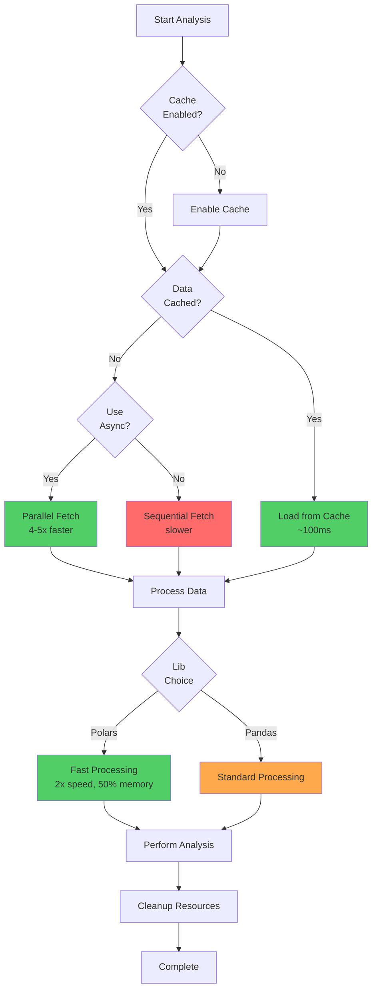

Follow these best practices to get the most out of tif1 in terms of performance, reliability, and code quality.

## Performance best practices

### Best Practices Workflow





### Use async loading for initial loads

When loading data for the first time (cold cache), use async methods for 4-5x speedup.

<CodeGroup>
```python Good - Async
import asyncio
import tif1

async def load_data():
    session = tif1.get_session(2025, "Monaco Grand Prix", "Race")
    laps = await session.laps_async()
    return laps

laps = asyncio.run(load_data())
```python

```python Avoid - Sync on Cold Cache
session = tif1.get_session(2025, "Monaco Grand Prix", "Race")
laps = session.laps  # Slower on first load
```yaml
</CodeGroup>

### Batch telemetry fetching

Never fetch telemetry in a loop. Use batch methods instead.

<CodeGroup>
```python Good - Batch Fetching
# 28x faster - fetches all in parallel
tels = session.get_fastest_laps_tels(by_driver=True)

for driver, tel in tels.items():
    analyze_telemetry(tel)
```yaml

```python Avoid - Sequential Loop
# Very slow - fetches one at a time
for driver in session.drivers:
    driver_obj = session.get_driver(driver)
    fastest = driver_obj.get_fastest_lap()
    tel = driver_obj.get_lap(fastest["LapNumber"].iloc[0]).telemetry
    analyze_telemetry(tel)
```python
</CodeGroup>

### Choose the right lib

Use polars for large datasets and performance-critical code.

```python
# For large datasets or batch processing
session = tif1.get_session(
    2025,
    "Abu Dhabi Grand Prix",
    "Race",
    lib="polars"  # 2x faster, 50% less memory
)
```python

### Keep caching enabled

Never disable caching unless absolutely necessary.

<CodeGroup>
```python Good - Cache Enabled (Default)
session = tif1.get_session(2025, "Monaco", "Race")
# Subsequent loads are instant
```python

```python Avoid - Cache Disabled
session = tif1.get_session(2025, "Monaco", "Race", enable_cache=False)
# Every load hits the network
```python
</CodeGroup>

---

## Code quality best practices

### Use Type Hints

tif1 provides comprehensive type hints. Use them for better IDE support.

```python
from tif1 import Session, DataFrame
import tif1

def analyze_session(session: Session) -> dict[str, float]:
    """Analyze session and return metrics."""
    laps: DataFrame = session.laps

    return {
        "total_laps": len(laps),
        "avg_lap_time": laps["LapTime"].mean(),
    }

session: Session = tif1.get_session(2025, "Monaco", "Race")
metrics = analyze_session(session)
```text ### Handle errors gracefully

Always handle tif1 exceptions appropriately.

```python
import tif1
from tif1 import DataNotFoundError, NetworkError, InvalidDataError

def safe_load_session(year: int, gp: str, session: str):
    """Load session with proper error handling."""
    try:
        return tif1.get_session(year, gp, session)
    except DataNotFoundError:
        print(f"Data not found for {year} {gp} {session}")
        return None
    except NetworkError as e:
        print(f"Network error: {e}")
        # Maybe retry or use cached data
        return None
    except InvalidDataError as e:
        print(f"Data corruption: {e}")
        # Clear cache and retry
        tif1.get_cache().clear()
        return None
```python

### Use context managers for resources

When working with exports or databases, use context managers.

```python
import sqlite3

session = tif1.get_session(2025, "Monaco", "Race")
laps = session.laps

# Good - automatic cleanup
with sqlite3.connect("f1_data.db") as conn:
    laps.to_sql("laps", conn, if_exists="replace")
```python

---

## Data analysis best practices

### Filter early, aggregate late

Filter data as early as possible to reduce memory usage.

<CodeGroup>
```python Good - Filter First
laps = session.laps

# Filter to relevant drivers first
top_3 = laps[laps["Driver"].isin(["VER", "HAM", "LEC"])]

# Then aggregate
avg_times = top_3.groupby("Driver")["LapTime"].mean()
```python

```python Avoid - Load Everything
laps = session.laps

# Aggregate everything
all_avg = laps.groupby("Driver")["LapTime"].mean()

# Then filter (wasted computation)
top_3_avg = all_avg[all_avg.index.isin(["VER", "HAM", "LEC"])]
```python
</CodeGroup>

### Clean data before analysis

Always filter out invalid laps before analysis.

```python
def clean_laps(laps):
    """Remove invalid laps for analysis."""
    # Remove deleted laps
    clean = laps[~laps["Deleted"]]

    # Remove pit laps
    clean = clean[clean["PitInTime"].isna()]

    # Remove outliers (> 7% slower than fastest)
    fastest = clean["LapTime"].min()
    clean = clean[clean["LapTime"] < fastest * 1.07]

    # Remove lap 1 (standing start)
    clean = clean[clean["LapNumber"] > 1]

    return clean

laps = session.laps
clean_laps = clean_laps(laps)
```python

### Use Vectorized Operations

Avoid loops when working with DataFrames.

<CodeGroup>
```python Good - Vectorized
# Calculate lap time delta to fastest
fastest_time = laps["LapTime"].min()
laps["DeltaToFastest"] = laps["LapTime"] - fastest_time
```python

```python Avoid - Loop
# Slow and inefficient
deltas = []
fastest_time = laps["LapTime"].min()
for _, lap in laps.iterrows():
    deltas.append(lap["LapTime"] - fastest_time)
laps["DeltaToFastest"] = deltas
```python
</CodeGroup>

---

## Reliability best practices

### Check data availability first

Before processing multiple sessions, check what's available.

```python
def process_season(year: int):
    """Process all races in a season."""
    events = tif1.get_events(year)

    for event in events:
        sessions = tif1.get_sessions(year, event)

        if "Race" not in sessions:
            print(f"No race data for {event}")
            continue

        try:
            session = tif1.get_session(year, event, "Race")
            process_race(session)
        except Exception as e:
            print(f"Failed to process {event}: {e}")
            continue
```python ### Use circuit breaker awareness

Check circuit breaker status for long-running jobs.

```python
import tif1

def batch_process():
    """Process multiple sessions with circuit breaker awareness."""
    cb = tif1.get_circuit_breaker()

    if cb.state == "open":
        print("Circuit breaker is open, waiting...")
        tif1.reset_circuit_breaker()

    # Continue processing
    for event in events:
        session = tif1.get_session(2025, event, "Race")
        process(session)
```python

### Enable debug logging for troubleshooting

When debugging, enable detailed logging.

```python
import tif1
import logging

# Enable debug logging
tif1.setup_logging(logging.DEBUG)

# Now all operations show detailed logs
session = tif1.get_session(2025, "Monaco", "Race")
```python

---

## Memory management best practices

### Process data in chunks

For large-scale analysis, process drivers one at a time.

```python
def analyze_all_drivers(session):
    """Analyze drivers without loading all data at once."""
    results = []

    for driver_code in session.drivers:
        driver = session.get_driver(driver_code)
        laps = driver.laps

        # Analyze
        result = {
            "driver": driver_code,
            "avg_time": laps["LapTime"].mean(),
            "fastest": laps["LapTime"].min(),
        }
        results.append(result)

        # Free memory
        del laps

    return results
```python

### Use Polars for large datasets

Polars uses significantly less memory than pandas.

```python
# For processing entire seasons
session = tif1.get_session(
    2024,
    "Abu Dhabi Grand Prix",
    "Race",
    lib="polars"  # 50% less memory
)
```python

### Clear cache periodically

For long-running applications, clear old cache entries.

```python
import tif1

# At application startup or periodically
cache = tif1.get_cache()

# Clear cache older than 30 days
# (Note: tif1 doesn't have built-in age-based clearing yet,
#  but you can manually delete the cache directory)
```python

---

## Testing best practices

### Mock network calls in tests

Don't hit the real CDN in unit tests.

```python
import pytest
from unittest.mock import patch
import tif1

def test_session_loading():
    """Test session loading with mocked network."""
    mock_data = {"drivers": [{"driver": "VER", "team": "Red Bull"}]}

    with patch.object(tif1.Session, "_fetch_from_cdn", return_value=mock_data):
        session = tif1.get_session(2025, "Monaco", "Race")
        drivers = session.drivers
        assert len(drivers) > 0
```python

### Use small datasets for tests

Test with minimal data to keep tests fast.

```python
def test_lap_filtering():
    """Test lap filtering logic."""
    # Use a small session (Practice 1) for faster tests
    session = tif1.get_session(2025, "Monaco", "Practice 1")
    laps = session.laps

    # Test filtering
    fast_laps = laps[laps["LapTime"] < 90]
    assert len(fast_laps) >= 0
```python

---

## Documentation best practices

### Document your analysis

Add docstrings and comments to your analysis code.

```python
def calculate_tire_degradation(laps, compound="SOFT"):
    """
    Calculate tire degradation rate for a specific compound.

    Args:
        laps: DataFrame with lap data
        compound: Tire compound to analyze (SOFT, MEDIUM, HARD)

    Returns:
        float: Degradation rate in seconds per lap

    Example:
        >>> laps = session.laps
        >>> deg = calculate_tire_degradation(laps, "SOFT")
        >>> print(f"Degradation: {deg:.3f}s/lap")
    """
    compound_laps = laps[laps["Compound"] == compound]

    # Linear regression on TyreLife vs LapTime
    from scipy import stats
    slope, _, _, _, _ = stats.linregress(
        compound_laps["TyreLife"],
        compound_laps["LapTime"]
    )

    return slope
```python ---

## Summary Checklist

<Steps>
  <Step title="Performance">
    - Use async loading for cold cache
    - Batch telemetry fetching
    - Choose appropriate lib (polars for large data)
    - Keep caching enabled
  </Step>
  <Step title="Code Quality">
    - Use type hints
    - Handle errors gracefully
    - Use context managers
    - Follow PEP 8
  </Step>
  <Step title="Data Analysis">
    - Filter early, aggregate late
    - Clean data before analysis
    - Use vectorized operations
    - Avoid loops
  </Step>
  <Step title="Reliability">
    - Check data availability
    - Monitor circuit breaker
    - Enable debug logging when needed
    - Handle network errors
  </Step>
  <Step title="Memory">
    - Process in chunks
    - Use polars for large datasets
    - Clear cache periodically
    - Delete unused DataFrames
  </Step>
</Steps>

---

## Related Pages

<CardGroup cols={2}>
  <Card title="Performance" href="/advanced/performance">
    Optimization guide
  </Card>
  <Card title="Error Handling" href="/guides/error-handling">
    Handle errors
  </Card>
  <Card title="Production Deployment" href="/guides/production-deployment">
    Deploy to production
  </Card>
  <Card title="Working with Large Datasets" href="/guides/working-with-large-datasets">
    Handle big data
  </Card>
</CardGroup>
