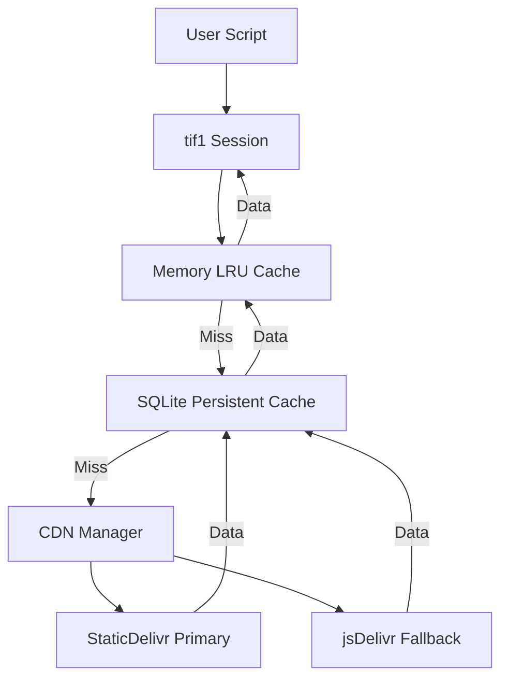

# Welcome to tif1

`tif1` is a high-performance Python library for Formula 1 data analysis. It provides access to timing, telemetry, and weather data from TracingInsights (2018-current).

`tif1` is a faster alternative to `fastf1` with the same API bindings. The speed increase comes from asynchronous data loading, HTTP/2 multiplexing, and optimized data backends.

## Why tif1?

<CardGroup cols={2}>
  <Card title="Fast" icon="bolt">
    Parallel loading is more than 3x faster than sequential fetching (benchmark-validated). It uses HTTP/2 multiplexing.
  </Card>
  <Card title="API Compatible" icon="code">
    The bindings match `fastf1`. Migration needs few code changes.
  </Card>
  <Card title="Flexible Backends" icon="database">
    Choose **Pandas** for compatibility, or **Polars** for about 2x faster processing.
  </Card>
  <Card title="Multi-tier Caching" icon="shield-check">
    Two cache tiers: an in-memory LRU cache and a SQLite cache for persistent storage.
  </Card>
</CardGroup>

## Why tif1 over fastf1?

`fastf1` is an established library at the center of the F1 data community. `tif1` started as a personal project with a different approach in a few areas:

1. **Fetch only the necessary data.** Do not use `session.load()` and do not download a full weekend. Pull one lap of telemetry for one driver in seconds. This costs less time, disk, and bandwidth.
2. **No API rate limits.** The upstream API behind fastf1 (jolpica-f1) caps unauthenticated use at **500 requests/hour** (4 req/s burst). The `tif1` CDN serves static files with no quotas, no keys, and no throttling.
3. **Charts included.** 22 optional one-call `plot_*()` functions turn raw data into finished charts: `tif1.plot_top_speeds(...)`, `tif1.plot_driver_laptimes(...)`, and more.
4. **Works from any IP address.** The `tif1` CDN works from home, cloud, CI, and notebook environments. It needs no VPN and no residential IP address.
5. **More data.** Mini-sector data, per-lap weather, and derived telemetry channels beyond the current `fastf1` scope.

<Card title="Full comparison" icon="scale" href="/why-tif1">
  Read the "Why tif1 instead of fastf1?" page. It includes the verified 500 requests/hour rate-limit sources.
</Card>

## Key Features

- **Fast**: Multi-CDN access (StaticDelivr, jsDelivr, and Hugging Face buckets) with automatic fallback and SQLite caching
- **Complete**: Lap times, sectors, telemetry, tire compounds, weather, and more
- **Historical**: Data from 2018-current
- **Reliable**: Automatic retry logic with circuit breaker and multi-CDN fallback
- **Async**: Parallel data fetching for better performance
- **HTTP/2**: Uses niquests for multiplexed, connection-efficient network requests
- **Flexible**: Supports both pandas and polars backends
- **Type-Safe**: Comprehensive type hints for IDE support
- **Jupyter-Ready**: Rich HTML display in notebooks
- **Native Charts**: 22 one-call chart functions in `tif1.charts` for track maps, telemetry comparisons, and performance analysis

## Performance Comparison

| Operation | fastf1 | tif1 (Async) | Speedup |
| :--- | :--- | :--- | :--- |
| Load 20 Drivers Laps | ~12.0s | ~2.5s | **4.8x** (author-measured; not reproduced by the benchmark suite) |
| Load 20 Drivers Telemetry | ~11.2s | ~0.4s | **28x** (author-measured; not reproduced by the benchmark suite) |
| Hot Cache Load | ~1.0s | ~0.05s | **20x** (author-measured; not reproduced by the benchmark suite) |

Benchmark-suite-validated results (2026-09-02, `uv run pytest tests/benchmarks/ -m benchmark`): parallel fetch is more than 3x faster than sequential fetch. The cache-hit read path is about 20x faster than the legacy path (109 ms to 5.3 ms median). The fastest-laps cold path is about 2.4x faster than the legacy path. Numbers vary by machine and network. Run the benchmark suite to reproduce them.

## Core Architecture

`tif1` uses a modern networking stack with multi-CDN support and a multi-tier cache. This design decreases the time spent waiting for data.

## Data Available

- Lap times and sectors (S1, S2, S3) with LapTime as Timedelta and LapTimeSeconds as numeric helper
- Tire compounds and stint information
- Telemetry: speed, throttle, brake, RPM, gear, DRS
- Position data (X, Y, Z coordinates)
- Acceleration data (X, Y, Z axes)
- Weather data automatically included in laps
- Driver metadata with team colors and headshots
- Race control messages

## Next Steps

<CardGroup cols={2}>
  <Card title="Why tif1?" icon="scale" href="/why-tif1">
    Why choose tif1 instead of fastf1?
  </Card>
  <Card title="Installation" icon="download" href="/installation">
    Install tif1 and verify the installation.
  </Card>
  <Card title="Quickstart" icon="rocket" href="/quickstart">
    Load a first session in less than 30 seconds.
  </Card>
  <Card title="Examples" icon="code" href="/examples">
    Common patterns and code examples.
  </Card>
  <Card title="Charts" icon="chart-column" href="/api-reference/charts">
    Visualize F1 data with 22 one-call chart functions.
  </Card>
  <Card title="Data Reference" icon="file-json" href="/reference/data-reference">
    Every field in the raw TracingInsights data files, with explanations.
  </Card>
  <Card title="Migration Guide" icon="arrow-right-arrow-left" href="/migration-from-fastf1">
    Coming from fastf1? See the differences.
  </Card>
  <Card title="API Reference" icon="book" href="/api-reference/overview">
    Explore the complete tif1 API.
  </Card>
  <Card title="Tutorials" icon="graduation-cap" href="/tutorials/race-pace-analysis">
    Learn with detailed analysis examples.
  </Card>
</CardGroup>

---

## Related Pages

<CardGroup cols={2}>
  <Card title="Installation" href="/installation">
    Install tif1
  </Card>
  <Card title="Why tif1?" href="/why-tif1">
    Why tif1 instead of fastf1?
  </Card>
  <Card title="Quickstart" href="/quickstart">
    Load a first session
  </Card>
  <Card title="API Reference" href="/api-reference/overview">
    Explore the API
  </Card>
  <Card title="Charts API" href="/api-reference/charts">
    Native chart functions
  </Card>
  <Card title="Tutorials" href="/tutorials/race-analysis">
    Learn with examples
  </Card>
</CardGroup>
